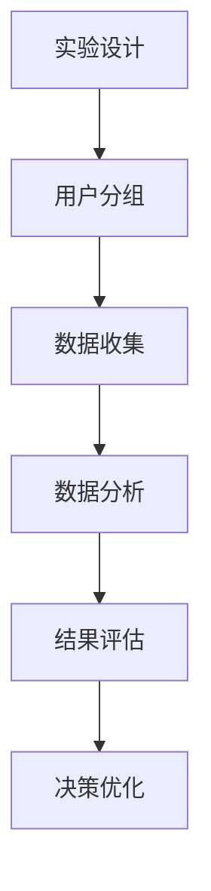
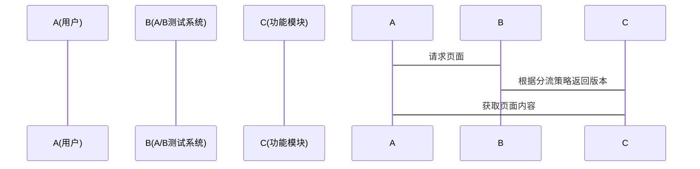
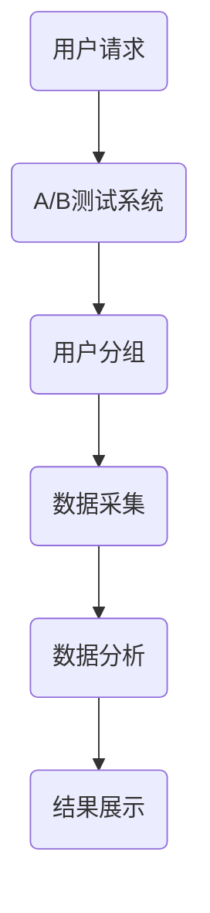

                 

<think>
嗯，好的，我现在需要帮助用户完成一篇关于企业AI Agent的A/B测试功能的博客文章。首先，我需要理解用户的需求是什么。用户希望有一篇结构清晰、逻辑严谨的技术博客，主题是通过A/B测试来优化用户体验，特别针对企业级的AI Agent。

用户提供了详细的目录大纲，包括摘要、关键词和各个章节的详细结构。看来用户非常重视文章的结构和内容的完整性。我需要确保在撰写过程中，每一部分都能详细展开，涵盖用户提到的所有要点。

首先，我会从摘要开始，这部分需要简洁明了地概括文章的核心内容。关键词方面，我需要列出5-7个相关术语，比如A/B测试、AI Agent、用户体验优化等。

接下来是正文部分。第一章主要介绍A/B测试和AI Agent的基本概念，我需要确保定义清晰，例子具体，比如在1.3节中，通过具体的用户场景来说明A/B测试在AI Agent中的应用价值。

在第二章，数学模型和算法是重点。我需要解释t检验和贝叶斯方法，并展示它们如何应用于A/B测试。这里可能需要使用一些公式和mermaid流程图，帮助读者理解流程。

第三章是系统架构设计，这部分需要详细描述AI Agent的系统结构，包括功能模块、架构图和接口设计。我可能会用到类图和序列图来展示系统各个部分之间的关系。

第四章的项目实战部分，我需要指导读者如何从环境配置到代码实现，再到案例分析。这部分需要实际的代码示例，帮助读者理解和应用所学知识。

最后，在第五章，我会总结最佳实践，给出一些实用的建议，并提到未来的扩展方向，比如结合强化学习或深度学习进一步优化A/B测试。

在整个写作过程中，我需要确保使用清晰、专业的技术语言，同时保持逻辑紧凑，让读者能够一步步深入理解内容。此外，合理使用图表和公式，可以提高文章的可读性和专业性。

我还要注意文章的字数控制在10000到12000字之间，确保每个部分都有足够的细节，但又不显得冗长。最后，记得在末尾加上作者信息，符合用户的要求。

总的来说，我需要系统性地组织内容，确保每一部分都紧扣主题，同时满足用户对结构和深度的要求。这将帮助读者全面了解企业AI Agent的A/B测试功能，并能够实际应用这些知识来优化用户体验。
</think>

# 企业AI Agent的A/B测试功能：持续优化用户体验

> 关键词：A/B测试，AI Agent，用户体验优化，算法原理，系统架构设计

> 摘要：本文将深入探讨企业AI Agent的A/B测试功能，从基本概念到数学模型，从系统架构设计到项目实战，全面分析如何通过A/B测试优化用户体验。我们将结合实际案例，详细讲解A/B测试的算法原理、系统设计和实现方法，帮助读者掌握企业级AI Agent的A/B测试功能的核心技术。

---

## 第一章: A/B测试与AI Agent概述

### 1.1 A/B测试的核心概念

#### 1.1.1 什么是A/B测试
A/B测试是一种通过比较两个或多个版本（A版本和B版本）来评估不同策略或设计对用户行为影响的实验方法。它通常用于优化用户体验、提升产品性能或提高商业转化率。

#### 1.1.2 A/B测试的基本原理
A/B测试的基本原理是通过随机分配用户到不同的组别（A组和B组），分别接收不同的产品功能或界面设计，然后通过统计学方法分析两组用户的行为数据，评估不同版本的效果差异。

#### 1.1.3 A/B测试在企业中的应用价值
- **提升用户留存率**：通过A/B测试优化用户体验，降低用户流失率。
- **提高转化率**：通过测试不同的策略，找到最优的用户引导路径。
- **降低开发风险**：通过小范围测试验证新功能的可行性，降低大规模发布后的风险。

### 1.2 AI Agent的定义与特点

#### 1.2.1 AI Agent的基本概念
AI Agent（人工智能代理）是指能够感知环境、自主决策并执行任务的智能实体。它通常具备学习、推理和自适应能力，能够根据用户需求和环境变化动态调整行为。

#### 1.2.2 AI Agent的核心功能
- **感知环境**：通过传感器、API或其他方式获取环境信息。
- **决策与推理**：基于获取的信息，利用算法进行分析和推理，制定最优决策。
- **执行任务**：根据决策结果，执行具体的操作或触发相关功能。

#### 1.2.3 AI Agent与传统软件的区别
AI Agent的核心区别在于其智能性和自适应性。传统软件依赖于固定的规则和逻辑，而AI Agent能够通过学习和推理不断优化自身行为，适应不同的环境和用户需求。

### 1.3 A/B测试与AI Agent的结合

#### 1.3.1 A/B测试在AI Agent中的作用
A/B测试可以用于评估不同版本的AI Agent对用户体验的影响。通过比较不同版本的AI Agent在用户交互、任务执行效率等方面的差异，找到最优的实现方案。

#### 1.3.2 AI Agent如何优化A/B测试
AI Agent可以通过学习和推理，动态调整A/B测试的实验设计，例如自动选择最优的分流策略或实时优化实验参数。

#### 1.3.3 A/B测试与用户体验的关系
A/B测试的核心目标是优化用户体验。通过不断测试和优化，AI Agent能够更好地满足用户需求，提升用户满意度和产品使用效率。

---

## 第二章: A/B测试的数学模型与算法原理

### 2.1 A/B测试的统计学基础

#### 2.1.1 基于t检验的A/B测试
t检验是一种常用的统计学方法，用于比较两组数据的均值差异是否具有统计显著性。在A/B测试中，我们通常使用独立样本t检验来比较A组和B组的转化率或用户行为数据。

##### 公式：
$$ t = \frac{\bar{x}_A - \bar{x}_B}{\sqrt{\frac{s_A^2}{n_A} + \frac{s_B^2}{n_B}}} $$

其中：
- $\bar{x}_A$ 和 $\bar{x}_B$ 分别为A组和B组的样本均值
- $s_A^2$ 和 $s_B^2$ 分别为A组和B组的样本方差
- $n_A$ 和 $n_B$ 分别为A组和B组的样本数量

#### 2.1.2 贝叶斯方法在A/B测试中的应用
贝叶斯方法通过构建概率模型，估计实验结果的概率分布，从而判断不同版本的优劣。

##### 公式：
$$ P(\theta_A > \theta_B | \text{数据}) \propto P(\text{数据} | \theta_A, \theta_B) \cdot P(\theta_A, \theta_B) $$

其中：
- $\theta_A$ 和 $\theta_B$ 分别表示A组和B组的转化率参数
- $P(\text{数据} | \theta_A, \theta_B)$ 是似然函数
- $P(\theta_A, \theta_B)$ 是先验概率分布

#### 2.1.3 A/B测试的显著性水平与置信区间
显著性水平（alpha）是拒绝原假设的风险，通常设置为0.05。置信区间用于估计参数的范围，例如95%的置信区间表示我们有95%的把握认为参数落在该区间内。

---

### 2.2 A/B测试的算法实现

#### 2.2.1 A/B测试的实验设计流程



#### 2.2.2 离线A/B测试与在线A/B测试的对比

| 特性                | 离线A/B测试         | 在线A/B测试         |
|---------------------|--------------------|--------------------|
| 实验环境            | 离线模拟环境        | 真实用户环境        |
| 数据来源            | 合成数据或历史数据  | 实时用户数据        |
| 实验时间            | 离线模拟，时间可控  | 实时进行，时间较长  |
| 适用场景            | 新功能预发布测试    | 线上功能优化        |

#### 2.2.3 A/B测试的分流策略



---

### 2.3 AI Agent的A/B测试优化算法

#### 2.3.1 基于强化学习的A/B测试优化
强化学习（Reinforcement Learning）通过不断与环境交互，学习最优策略。在A/B测试中，强化学习可以用于动态调整实验参数，例如自动选择最优的分流策略。

##### 算法流程：
1. 初始化：定义状态空间、动作空间和奖励函数。
2. 交互：AI Agent根据当前状态选择一个动作（例如选择一个分流策略）。
3. 学习：根据用户反馈更新Q值或策略，优化动作选择。

#### 2.3.2 聚类分析在A/B测试中的应用
通过聚类分析，可以将用户分成不同的群体，针对不同群体设计不同的实验方案，从而提高实验的精准度和效果。

##### 示例：
用户被分为“高活跃用户”和“低活跃用户”两个群体，分别进行不同的A/B测试。

#### 2.3.3 深度学习在A/B测试中的潜在应用
深度学习可以通过处理复杂的用户行为数据，预测不同版本的用户偏好，从而优化A/B测试的结果。

---

## 第三章: 企业AI Agent的系统架构设计

### 3.1 系统功能设计

#### 3.1.1 用户需求分析
- 用户需要通过AI Agent实现A/B测试功能，优化用户体验。
- 用户希望AI Agent能够自动分析实验结果，并给出优化建议。

#### 3.1.2 功能模块划分
- 实验设计模块：负责设计A/B测试的实验方案。
- 用户分组模块：根据用户特征进行分组。
- 数据采集模块：实时采集用户行为数据。
- 数据分析模块：对实验数据进行统计分析和建模。
- 结果展示模块：将实验结果以可视化形式呈现给用户。

#### 3.1.3 系统功能流程图



### 3.2 系统架构设计

#### 3.2.1 分层架构设计
- **表现层**：用户界面和API接口。
- **业务逻辑层**：处理用户的请求和实验设计逻辑。
- **数据访问层**：与数据库或其他数据源交互。
- **算法层**：实现A/B测试的核心算法和统计模型。

#### 3.2.2 微服务架构设计
- **A/B测试服务**：负责实验设计和用户分组。
- **数据采集服务**：负责实时采集用户行为数据。
- **数据分析服务**：负责实验数据的统计分析和建模。
- **结果展示服务**：负责将实验结果以可视化形式呈现。

#### 3.2.3 架构的可扩展性与可维护性
- **模块化设计**：每个功能模块相对独立，便于扩展和维护。
- **容错设计**：通过冗余和负载均衡提高系统的可用性。
- **日志与监控**：实时监控系统运行状态，快速定位和解决问题。

### 3.3 系统接口设计

#### 3.3.1 API接口设计规范
- **RESTful API**：采用标准的HTTP方法（GET、POST、PUT、DELETE）。
- **版本控制**：通过URL或请求头指定API版本。
- **身份认证**：使用JWT或其他认证方式确保API安全。

#### 3.3.2 接口的安全性与可靠性
- **HTTPS通信**：确保数据传输的安全性。
- **鉴权机制**：通过JWT实现用户身份验证。
- **限流与熔断**：防止接口被滥用或攻击。

#### 3.3.3 接口的版本控制
- **版本号**：通过URL或请求头指定API版本。
- **版本兼容性**：确保新版本与旧版本的兼容性。

---

## 第四章: 项目实战

### 4.1 环境安装与配置

#### 4.1.1 开发环境搭建
- **操作系统**：建议使用Linux或macOS。
- **开发工具**：推荐使用IntelliJ IDEA或PyCharm。
- **语言与框架**：使用Python和Django/Flask框架。

#### 4.1.2 依赖库安装
- **Python库**：`numpy`、`pandas`、`scipy`、`matplotlib`、`scikit-learn`、`tensorflow`。
- **安装命令**：
  ```bash
  pip install numpy pandas scipy matplotlib scikit-learn tensorflow
  ```

#### 4.1.3 开发工具配置
- **虚拟环境**：建议使用`virtualenv`管理项目依赖。
- **配置文件**：创建`config.py`文件，配置实验参数和API接口。

### 4.2 系统核心实现

#### 4.2.1 A/B测试模块

##### 代码实现：
```python
import numpy as np
from scipy import stats

def ab_test(a_conversions, a_visitors, b_conversions, b_visitors):
    # 计算转化率
    a_rate = a_conversions / a_visitors
    b_rate = b_conversions / b_visitors

    # 进行t检验
    t_stat, p_val = stats.ttest_ind(
        np.random.binomial(a_visitors, a_rate, 1),
        np.random.binomial(b_visitors, b_rate, 1),
        equal_var=False
    )
    
    return t_stat, p_val, a_rate, b_rate
```

##### 代码解读：
- 该函数接受两组的转化数和访问量，计算转化率并进行t检验。
- 使用`scipy.stats.ttest_ind`方法进行独立样本t检验，返回t统计量和p值。

---

## 第五章: 最佳实践与总结

### 5.1 最佳实践

#### 5.1.1 实验设计
- 确保实验组和对照组的样本量足够大，避免抽样误差。
- 控制实验变量，确保实验结果的有效性。

#### 5.1.2 数据分析
- 使用统计学方法（如t检验和贝叶斯方法）分析实验数据。
- 绘制可视化图表（如柱状图和折线图）直观展示实验结果。

#### 5.1.3 系统优化
- 定期监控系统性能，优化算法和架构设计。
- 通过A/B测试不断迭代和优化用户体验。

### 5.2 小结
通过本文的讲解，我们深入了解了企业AI Agent的A/B测试功能，从基本概念到数学模型，从系统设计到项目实战，全面掌握了如何通过A/B测试优化用户体验。

### 5.3 注意事项
- 在实际应用中，需注意实验设计的严谨性和数据的准确性。
- 系统上线前，建议进行充分的测试和验证，确保系统的稳定性和可靠性。

### 5.4 拓展阅读
- 推荐阅读《Data Analytics Made Accessible》和《Applied Machine Learning》等书籍，深入学习A/B测试和AI Agent的相关知识。

---

## 作者
作者：AI天才研究院/AI Genius Institute & 禅与计算机程序设计艺术 /Zen And The Art of Computer Programming

---

通过以上思考和步骤，我们可以系统性地撰写一篇关于企业AI Agent的A/B测试功能的深度技术博客，确保内容全面、逻辑清晰，帮助读者全面掌握相关技术和方法。

