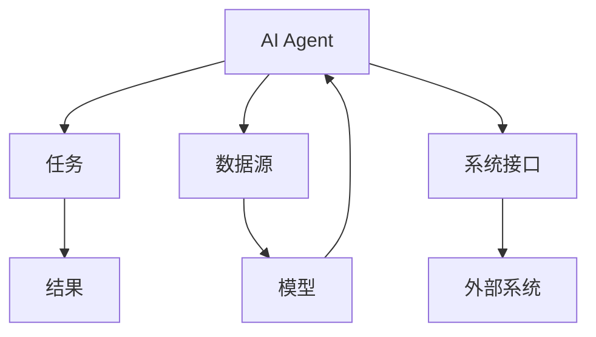
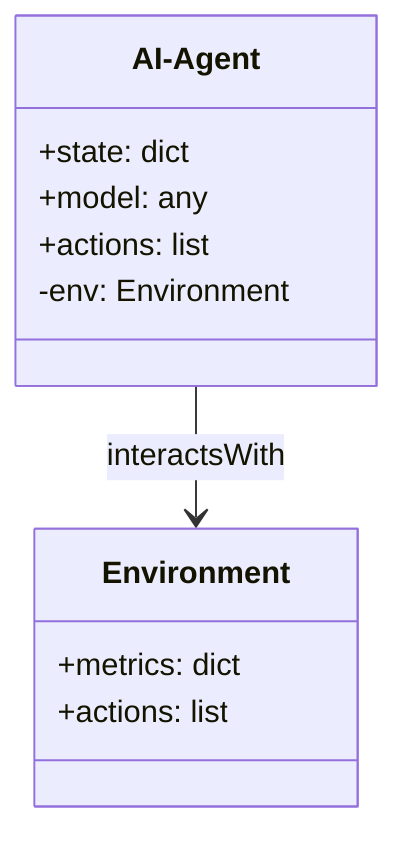
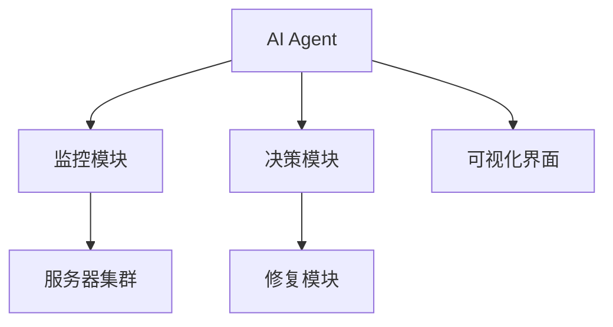

                 


# 《企业AI Agent的DevOps实践》

---

## 关键词：
企业AI Agent、DevOps、智能运维、自动化决策、DevOps实践

---

## 摘要：
本文深入探讨了企业AI Agent在DevOps实践中的应用，从基本概念、核心算法到系统架构，再到实际项目案例，全面分析了企业AI Agent如何与DevOps结合，实现智能化的运维和决策。通过理论与实践相结合的方式，本文为读者提供了从背景知识到落地实施的完整指南。

---

# 正文

---

## 第1章: 企业AI Agent的背景与概述

### 1.1 AI Agent的基本概念

#### 1.1.1 AI Agent的定义
AI Agent（人工智能代理）是一种能够感知环境并采取行动以实现目标的智能体。它通过接收输入数据，进行分析和决策，然后输出执行指令。AI Agent的核心在于其智能性和自主性，能够在复杂环境中完成特定任务。

#### 1.1.2 AI Agent的核心特征
- **自主性**：AI Agent能够自主决策，无需人工干预。
- **反应性**：能够实时感知环境变化并做出反应。
- **目标导向**：以特定目标为导向，优化行动策略。
- **学习能力**：通过数据和经验不断优化自身性能。

#### 1.1.3 企业级AI Agent的特殊性
企业级AI Agent需要具备高可用性、高可靠性和高扩展性，能够处理复杂的业务逻辑和大规模数据，同时符合企业级的安全和合规要求。

---

### 1.2 DevOps的基本概念与实践

#### 1.2.1 DevOps的定义与目标
DevOps是一种结合开发（Development）和运维（Operations）的实践方法，旨在通过自动化工具和流程，缩短开发周期，提高交付效率和系统稳定性。

#### 1.2.2 DevOps的核心实践方法
- **持续集成与交付（CI/CD）**：通过自动化工具实现代码的频繁集成和发布。
- **Infrastructure as Code（IaC）**：将基础设施配置化，通过代码管理环境。
- **监控与日志**：实时监控系统状态，快速定位和解决问题。

#### 1.2.3 DevOps与企业AI Agent的结合
企业AI Agent可以利用DevOps的自动化能力，实现从开发、测试到部署的全生命周期管理，提升AI系统的可靠性和效率。

---

### 1.3 企业AI Agent的典型应用场景

#### 1.3.1 智能运维
通过AI Agent实时监控系统状态，预测故障，自动修复，提升运维效率。

#### 1.3.2 自动化决策
在金融、物流等领域，AI Agent可以基于实时数据做出最优决策，如自动调整供应链策略。

#### 1.3.3 智能客服
利用自然语言处理技术，AI Agent可以提供智能客服支持，解决用户问题，提升用户体验。

---

## 第2章: 企业AI Agent的背景与挑战

### 2.1 企业AI Agent的发展背景

#### 2.1.1 人工智能技术的进步
深度学习、强化学习等技术的发展为AI Agent提供了强大的技术支持。

#### 2.1.2 DevOps的普及与深化
DevOps的普及使得企业更加注重自动化和效率，为AI Agent的部署和运维提供了基础。

#### 2.1.3 企业数字化转型的需求
企业数字化转型需要智能化的解决方案，AI Agent成为不可或缺的工具。

---

### 2.2 企业AI Agent的主要挑战

#### 2.2.1 技术层面的挑战
- **模型复杂性**：复杂的模型可能导致计算资源消耗过大。
- **实时性要求**：在高实时性场景中，AI Agent需要快速响应，对系统性能要求高。

#### 2.2.2 运维层面的挑战
- **可解释性**：AI Agent的决策过程需要可解释，以便进行故障排查和优化。
- **安全性**：AI Agent可能面临数据泄露、攻击等安全威胁。

#### 2.2.3 安全与伦理问题
- **数据隐私**：AI Agent处理大量敏感数据，如何确保数据安全和隐私是一个重要问题。
- **伦理问题**：AI Agent的决策可能对人类产生重大影响，需要考虑伦理问题。

---

### 2.3 企业AI Agent的未来趋势

#### 2.3.1 技术融合趋势
AI Agent将与云计算、边缘计算等技术深度融合，提升性能和扩展性。

#### 2.3.2 应用场景扩展
随着技术进步，AI Agent将应用于更多领域，如智能制造、智慧城市等。

#### 2.3.3 伦理与治理框架的完善
未来将更加注重AI Agent的伦理和治理，确保其应用符合社会价值观和法律法规。

---

## 第3章: 企业AI Agent的核心概念与联系

### 3.1 AI Agent的核心概念原理

#### 3.1.1 感知层
AI Agent通过传感器、API等方式获取环境数据，进行特征提取和数据预处理。

#### 3.1.2 决策层
基于感知层的数据，AI Agent利用机器学习模型进行决策，生成行动指令。

#### 3.1.3 执行层
通过API或其他执行机制，AI Agent将决策结果转化为实际操作，影响环境。

---

### 3.2 AI Agent与DevOps的关系

#### 3.2.1 AI Agent如何提升DevOps效率
- **自动化运维**：AI Agent可以自动监控和修复系统问题，减少人工干预。
- **智能部署**：AI Agent可以根据环境自动调整部署策略，优化资源利用率。

#### 3.2.2 DevOps如何支持AI Agent的部署与运维
- **CI/CD**：通过CI/CD管道，AI Agent的开发、测试和部署可以实现自动化。
- **IaC**：利用Infrastructure as Code，确保AI Agent的环境一致性和可重复性。

#### 3.2.3 两者的协同效应
AI Agent与DevOps的结合，实现了智能化的软件开发和运维，提升了企业的整体效率。

---

### 3.3 实体关系图（ER图）



---

## 第4章: 企业AI Agent的算法原理与实现

### 4.1 算法原理概

#### 4.1.1 强化学习算法
强化学习是一种通过试错机制，使AI Agent在环境中不断优化策略的算法。其核心是通过与环境交互，学习最优策略。

#### 4.1.2 强化学习的数学模型

$$ V(s) = \max_{a} \left[ r + V(s') \right] $$

其中：
- \( V(s) \) 表示状态 \( s \) 的价值函数。
- \( r \) 表示执行动作 \( a \) 后获得的奖励。
- \( s' \) 表示执行动作 \( a \) 后的新状态。

---

### 4.2 算法实现步骤

#### 4.2.1 环境与状态定义
定义AI Agent所处的环境和状态空间，例如在智能运维场景中，状态可能包括系统负载、响应时间等。

#### 4.2.2 动作空间定义
定义AI Agent可以执行的动作，例如启动备份、调整资源配额等。

#### 4.2.3 奖励函数设计
设计奖励函数，用于评估AI Agent的动作是否符合预期目标。例如，在故障恢复场景中，成功恢复故障可以得到正奖励，失败则得到负奖励。

#### 4.2.4 策略网络实现
使用深度神经网络作为策略网络，输出动作的概率分布。

#### 4.2.5 算法实现代码

```python
import numpy as np
import tensorflow as tf

# 定义策略网络
class PolicyNetwork:
    def __init__(self, state_dim, action_dim):
        self.state_dim = state_dim
        self.action_dim = action_dim
        self.model = self.build_model()
    
    def build_model(self):
        model = tf.keras.Sequential([
            tf.keras.layers.Dense(64, activation='relu', input_dim=self.state_dim),
            tf.keras.layers.Dense(self.action_dim, activation='softmax')
        ])
        return model
    
    def call(self, state):
        return self.model(state)
```

---

### 4.3 算法优化与调优

#### 4.3.1 参数调整
调整学习率、网络层数等超参数，优化算法性能。

#### 4.3.2 离线与在线学习
根据场景需求，选择适合的训练方式，如在线学习实时更新策略，或离线学习定期更新。

---

## 第5章: 企业AI Agent的系统分析与架构设计

### 5.1 系统分析

#### 5.1.1 项目背景
假设我们正在开发一个智能运维AI Agent，用于监控企业服务器集群的健康状态。

#### 5.1.2 需求分析
- 实时监控服务器状态。
- 自动检测异常并修复。
- 提供可视化界面供运维人员查看。

---

### 5.2 系统架构设计

#### 5.2.1 领域模型设计



---

#### 5.2.2 系统架构图



---

### 5.3 系统接口设计

#### 5.3.1 监控接口
AI Agent通过API获取服务器集群的实时指标，如CPU使用率、内存占用等。

#### 5.3.2 修复接口
AI Agent调用修复模块的API，执行如重启服务、调整资源配额等操作。

---

## 第6章: 企业AI Agent的项目实战

### 6.1 环境安装

#### 6.1.1 安装依赖
```bash
pip install numpy tensorflow pandas scikit-learn
```

#### 6.1.2 安装DevOps工具
```bash
pip install boto3 docker python-dotenv
```

---

### 6.2 核心代码实现

#### 6.2.1 AI Agent实现

```python
import numpy as np
import tensorflow as tf
import pandas as pd

class AI-Agent:
    def __init__(self, env):
        self.env = env
        self.model = self.build_model()
    
    def build_model(self):
        model = tf.keras.Sequential([
            tf.keras.layers.Dense(64, activation='relu', input_dim=self.env.state_dim),
            tf.keras.layers.Dense(self.env.action_dim, activation='softmax')
        ])
        return model
    
    def act(self, state):
        return self.model.predict(np.array([state]))[0]
```

#### 6.2.2 DevOps集成

```python
import boto3
import docker

class DevOpsIntegration:
    def __init__(self):
        self.ecs = boto3.client('ecs')
    
    def deploy(self, image_name):
        response = self.ecs.run_task(
            cluster='my-cluster',
            launchType='FARGATE',
            taskDefinition='my-task-def',
            containerName=image_name
        )
        return response['tasks'][0]['taskArn']
```

---

### 6.3 实际案例分析

#### 6.3.1 案例场景
AI Agent在智能运维中的应用：实时监控服务器集群，自动检测并修复故障。

#### 6.3.2 案例分析
- **数据采集**：AI Agent通过API获取服务器的CPU、内存使用情况。
- **异常检测**：基于历史数据，AI Agent学习正常状态，检测出异常。
- **自动修复**：AI Agent调用修复模块，执行故障恢复操作。
- **结果反馈**：修复完成后，AI Agent更新状态，并向运维人员报告结果。

---

## 第7章: 企业AI Agent的总结与展望

### 7.1 最佳实践

#### 7.1.1 技术层面
- 选择合适的AI算法和工具，确保系统的高效性和准确性。
- 定期优化模型，提升系统的适应性和鲁棒性。

#### 7.1.2 运维层面
- 建立完善的监控和日志系统，便于故障排查和性能优化。
- 制定合理的安全策略，确保数据和系统的安全性。

#### 7.1.3 伦理层面
- 遵守相关法律法规，确保AI Agent的使用符合伦理要求。
- 建立透明的决策机制，便于用户和运维人员理解AI Agent的行为。

---

### 7.2 小结

企业AI Agent与DevOps的结合，不仅提升了企业的智能化水平，还优化了运维效率。通过本文的分析和实践，我们看到AI Agent在企业中的巨大潜力，同时也需要我们不断探索和优化，以应对未来的挑战。

---

### 7.3 注意事项

- 在实际应用中，需注意数据隐私和安全问题。
- 确保AI Agent的决策过程可解释，便于调试和优化。
- 定期更新模型，适应环境的变化。

---

### 7.4 拓展阅读

- 《企业级AI系统设计》
- 《DevOps实战指南》
- 《强化学习入门与实践》

---

## 作者

**作者：AI天才研究院/AI Genius Institute & 禅与计算机程序设计艺术 /Zen And The Art of Computer Programming**

---

# 结语

通过本文的系统介绍，我们深入探讨了企业AI Agent在DevOps实践中的应用，从理论到实践，为读者提供了全面的指导。希望本文能为企业的智能化转型提供有价值的参考和启示。

