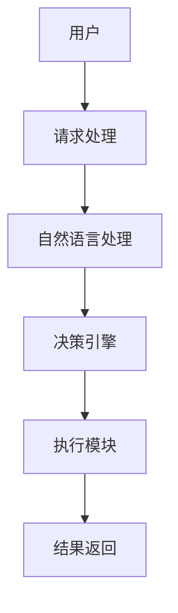
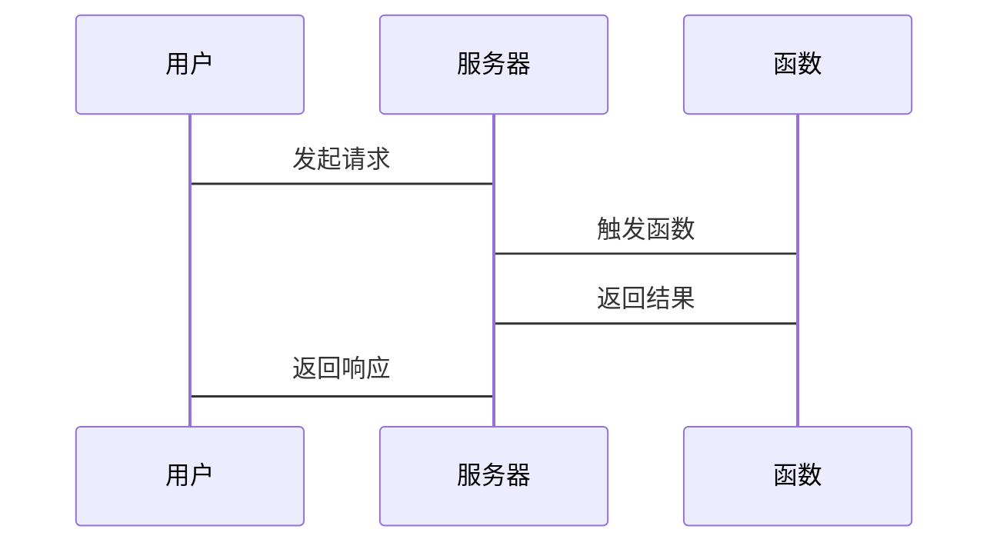

                 

<think>
好，我现在需要帮用户撰写一篇关于《企业AI Agent的serverless架构设计》的技术博客文章。用户已经提供了详细的目录大纲，我需要按照这个大纲逐步展开每个部分，确保内容完整、详细且符合要求。

首先，我需要理解整个文章的结构和要求。文章包括背景介绍、核心概念、算法原理、系统架构、项目实战、最佳实践等多个部分。每个部分都需要有详细的解释和具体的示例，甚至包括数学公式和图表。

接下来，我开始撰写每个部分。首先是背景介绍，包括企业AI Agent和Serverless架构的基本概念和优势。我需要确保这部分内容清晰，帮助读者理解为什么两者结合是必要的。

然后是核心概念，我需要用表格对比AI Agent和Serverless架构的特点，帮助读者更直观地理解两者的区别和联系。这部分还需要用Mermaid绘制实体关系图，展示它们之间的交互。

接下来是算法原理，我需要选择几个关键算法，如模型压缩和函数计算优化，用Mermaid流程图展示其工作流程，并附上数学公式解释原理。例如，模型压缩中的剪枝和蒸馏方法，我会详细说明每一步骤及其数学表达。

在系统分析与架构设计部分，我需要介绍项目背景，设计系统功能，使用Mermaid类图展示领域模型，架构图展示整体设计，接口设计和交互序列图。这部分需要确保读者能够理解系统的各个部分如何协同工作。

项目实战部分，我需要提供具体的实现步骤，包括环境安装、核心代码实现、代码解读和案例分析。这部分要详细，确保读者能够跟着操作，并理解代码的作用和实现细节。

最后，最佳实践部分，我会总结经验和小结，给出注意事项和拓展阅读建议，帮助读者巩固所学内容，并引导他们进一步学习。

在整个写作过程中，我需要确保语言简洁明了，逻辑清晰，结构紧凑。同时，按照要求使用Markdown格式，正确嵌入数学公式和图表，确保文章格式美观，内容易于理解。

可能遇到的挑战是如何将复杂的算法和架构设计以清晰的方式呈现出来，同时保持文章的连贯性和深度。我需要不断检查每个部分，确保每个小节内容详实，满足用户的要求。

总的来说，我会按照用户提供的目录大纲，逐步展开每个部分，确保文章内容全面、详细，帮助读者深入理解企业AI Agent的serverless架构设计。
</think>

# 企业AI Agent的Serverless架构设计

## 关键词：
- 企业AI Agent
- Serverless架构
- 无服务器计算
- AI服务设计
- 微服务架构
- 事件驱动

## 摘要：
本文详细探讨了在企业环境中设计和实现AI Agent的Serverless架构的关键问题。通过分析Serverless架构的核心原理、AI Agent的系统架构设计、算法实现及优化方法，结合实际项目案例，系统性地阐述了如何在企业场景中高效、安全地构建和部署AI Agent服务。文章还提供了详细的数学公式、系统架构图和代码示例，为读者提供全面的技术指导。

---

## 第1章：企业AI Agent的背景与需求

### 1.1 企业AI Agent的定义与特点

#### 1.1.1 AI Agent的基本概念
AI Agent（智能代理）是一种能够感知环境、自主决策并执行任务的智能实体。它通过传感器获取信息，利用推理引擎进行分析，并通过执行器与外部环境交互。

#### 1.1.2 企业AI Agent的核心特点
- **自主性**：能够独立决策和执行任务。
- **反应性**：实时感知环境变化并调整行为。
- **社会性**：与其他系统或人类用户进行协作。
- **可扩展性**：能够处理不同规模的任务。

#### 1.1.3 企业AI Agent的应用场景
- 智能客服：通过自然语言处理技术为用户提供实时支持。
- 智能监控：实时分析数据并触发异常事件处理。
- 智能调度：优化资源分配和任务执行顺序。

### 1.2 问题背景与需求分析

#### 1.2.1 问题背景
企业AI Agent的传统部署方式依赖于传统服务器架构，存在资源浪费、扩展性差、维护成本高等问题。

#### 1.2.2 问题描述
- 资源利用率低：传统服务器架构在低负载时资源闲置，高负载时又需要扩容。
- 扩展性受限：面对突发请求时，难以快速响应。
- 维护成本高：需要专业的运维团队进行服务器管理和维护。

#### 1.2.3 问题解决
引入Serverless架构，利用其弹性扩展、按需付费的特点，解决企业AI Agent的部署难题。

---

## 第2章：Serverless架构的核心原理

### 2.1 无服务器计算的基本概念

#### 2.1.1 函数即服务（FaaS）
FaaS（Function as a Service）是一种Serverless计算模型，允许开发者通过编写函数代码来响应事件驱动的请求。

#### 2.1.2 无服务器数据库与存储
- 数据存储在Serverless架构中通常采用云数据库或对象存储。
- 数据持久化和自动扩展特性降低了开发者的运维负担。

#### 2.1.3 事件驱动的触发机制
Serverless架构通过事件触发函数执行，常见的事件源包括HTTP请求、数据库变更、消息队列触发等。

### 2.2 Serverless架构的资源管理

#### 2.2.1 弹性计算资源分配
- 根据请求量动态分配计算资源。
- 请求结束后自动释放资源，避免资源浪费。

#### 2.2.2 资源计费模式
- 按使用量计费：开发者只需为实际使用的资源付费。
- 打破传统的资本支出模式，降低企业的初期投入。

#### 2.2.3 资源隔离与安全性
- 每个函数执行环境相互隔离，确保租户之间的安全性和独立性。
- 提供多种安全策略，如访问控制列表（ACL）和身份认证。

### 2.3 Serverless架构的容错机制

#### 2.3.1 函数的幂等性设计
幂等性设计确保多次执行同一函数不会产生不同的结果，避免数据重复或错误。

#### 2.3.2 请求重试机制
当函数执行失败时，系统会自动重试，确保任务最终完成。

#### 2.3.3 错误处理与日志记录
提供详细的错误日志和监控工具，帮助开发者快速定位和解决问题。

---

## 第3章：企业AI Agent的Serverless架构设计

### 3.1 企业AI Agent的系统架构

#### 3.1.1 分层架构设计
- **感知层**：通过传感器或API获取环境数据。
- **推理层**：利用AI算法对数据进行分析和决策。
- **执行层**：根据推理结果执行相应动作。

#### 3.1.2 微服务架构
将AI Agent的功能分解为多个微服务，每个服务负责特定的任务，如自然语言处理、图像识别等。

#### 3.1.3 事件驱动的交互机制
通过事件总线实现不同服务之间的通信，确保系统的实时性和高效性。

### 3.2 Serverless架构下的AI Agent实现

#### 3.2.1 无服务器函数的设计
- 函数负责接收请求、调用AI模型、处理结果并返回响应。
- 示例：使用AWS Lambda部署一个简单的AI推理函数。

#### 3.2.2 AI模型的部署与优化
- 模型轻量化：通过剪枝、蒸馏等技术优化模型大小。
- 模型推理加速：利用GPU加速或异步调用提升推理速度。

#### 3.2.3 安全与权限管理
- 函数级别的访问控制，确保只有授权用户才能触发AI Agent。
- 数据加密传输和存储，保障用户隐私。

### 3.3 系统架构的扩展性设计

#### 3.3.1 水平扩展
- 根据请求量自动增加函数实例，确保系统能够处理高并发请求。

#### 3.3.2 垂直扩展
- 调整函数的资源配额，如增加内存或计算能力，优化单个函数的性能。

#### 3.3.3 自动化运维
- 利用云平台提供的监控和报警功能，实时跟踪系统运行状态。
- 自动化部署和回滚，确保系统的稳定性。

---

## 第4章：算法原理与优化

### 4.1 常见AI算法的Serverless实现

#### 4.1.1 模型压缩算法
- **剪枝**：去除模型中冗余的神经元和权重。
- **蒸馏**：通过知识蒸馏技术将大模型的知识迁移到小模型中。

#### 4.1.2 函数计算优化
- **异步调用**：通过并行计算加速模型推理。
- **批处理**：将多个请求合并成一个批次进行处理，减少函数调用次数。

### 4.2 算法优化的数学模型

#### 4.2.1 模型剪枝的优化目标
$$ \text{最小化} \sum_{i=1}^n w_i^2 \text{，其中} w_i \text{是模型的权重} $$

#### 4.2.2 模型蒸馏的损失函数
$$ L = \alpha L_{\text{student}} + (1-\alpha) L_{\text{teacher}} $$
其中，$L_{\text{student}}$是学生模型的损失，$L_{\text{teacher}}$是教师模型的损失，$\alpha$是平衡参数。

### 4.3 算法优化的实现步骤

#### 4.3.1 模型剪枝
- 训练原始模型。
- 计算每个参数的重要性，通常是基于梯度的绝对值。
- 删除重要性低的参数，重新训练剪枝后的模型。

#### 4.3.2 模型蒸馏
- 定义教师模型和学生模型。
- 在训练过程中，不仅监督学生模型，还参考教师模型的输出。
- 通过蒸馏损失函数优化学生模型的参数。

---

## 第5章：系统分析与架构设计方案

### 5.1 项目背景与目标

#### 5.1.1 项目背景
- 需求背景：企业需要一个高效、可靠的AI Agent系统。
- 目标：实现一个基于Serverless架构的AI Agent，具备高可用性和可扩展性。

#### 5.1.2 系统功能需求
- **用户交互**：支持多种输入方式，如语音、文本。
- **任务执行**：能够处理复杂任务，如数据分析、自动化操作。
- **自我学习**：通过反馈机制不断优化自身的决策能力。

### 5.2 系统架构设计

#### 5.2.1 领域模型设计
- **用户角色**：普通用户、管理员。
- **功能模块**：自然语言处理、决策引擎、执行模块。
- **数据流**：请求 -> 解析 -> 分析 -> 执行 -> 返回结果。

#### 5.2.2 系统架构图


#### 5.2.3 接口设计
- **输入接口**：HTTP REST API、WebSocket。
- **输出接口**：JSON格式、数据库存储。
- **事件触发**：通过消息队列实现异步处理。

#### 5.2.4 交互序列图


---

## 第6章：项目实战与代码实现

### 6.1 环境安装

#### 6.1.1 安装工具链
- 安装Python 3.8及以上版本。
- 安装pip，用于安装依赖包。

#### 6.1.2 安装云服务依赖
- AWS CLI：用于配置和管理AWS云服务。
- Serverless框架：用于部署函数。

### 6.2 核心代码实现

#### 6.2.1 自然语言处理函数
```python
def handler(event, context):
    import json
    from transformers import pipeline

    # 初始化自然语言处理模型
    nlp = pipeline("question-answering", model="deepseek/quad)

    # 解析输入
    input_text = event.get("input_text", "")
    question = event.get("question", "")

    # 调用模型
    result = nlp({"question": question, "context": input_text})

    return {
        "answer": result[0]["answer"],
        "score": result[0]["score"]
    }
```

#### 6.2.2 决策引擎函数
```python
def handler(event, context):
    import json
    from datetime import datetime

    # 解析输入
    input_data = event.get("input_data", {})
    time = datetime.now().strftime("%Y-%m-%d %H:%M:%S")

    # 执行决策逻辑
    decision = "approve" if input_data.get("score", 0) > 85 else "reject"

    return {
        "decision": decision,
        "timestamp": time
    }
```

#### 6.2.3 执行模块函数
```python
def handler(event, context):
    import json
    import subprocess

    # 解析输入
    command = event.get("command", "")

    # 执行命令
    try:
        output = subprocess.check_output(command, shell=True, text=True)
        return {
            "status": "success",
            "output": output
        }
    except Exception as e:
        return {
            "status": "error",
            "message": str(e)
        }
```

### 6.3 代码解读与分析

#### 6.3.1 自然语言处理函数
- 使用Transformers库中的Question-Answering模型。
- 接收输入文本和问题，返回答案和置信度分数。

#### 6.3.2 决策引擎函数
- 根据输入数据中的分数决定是否通过。
- 返回决策结果和时间戳。

#### 6.3.3 执行模块函数
- 接收命令字符串，通过subprocess执行命令。
- 返回执行结果或错误信息。

### 6.4 案例分析

#### 6.4.1 案例场景
用户提交一个复杂的数据分析任务，系统通过自然语言处理解析需求，决策引擎判断任务是否可行，执行模块调用数据分析工具完成任务。

#### 6.4.2 实施步骤
1. 用户提交请求。
2. 自然语言处理函数解析需求。
3. 决策引擎判断任务可行性。
4. 执行模块调用工具完成任务。
5. 返回结果给用户。

### 6.5 项目小结

#### 6.5.1 核心实现总结
- 通过Serverless函数实现了AI Agent的核心功能。
- 使用了多种AI模型和工具，确保系统的高效性和准确性。

#### 6.5.2 实施经验总结
- 函数设计要简洁，避免复杂的依赖关系。
- 注意函数的冷启动问题，可以通过优化代码和使用函数缓存来解决。

---

## 第7章：最佳实践与注意事项

### 7.1 最佳实践

#### 7.1.1 函数设计原则
- 函数粒度要小，每个函数负责单一任务。
- 避免长运行时任务，尽量拆分任务。

#### 7.1.2 资源优化
- 合理配置函数的资源配额，避免浪费。
- 使用缓存技术减少重复计算。

#### 7.1.3 安全性
- 使用IAM角色控制函数的访问权限。
- 避免将敏感信息硬编码在函数中。

### 7.2 小结

#### 7.2.1 核心内容回顾
- 介绍了企业AI Agent和Serverless架构的基本概念和优势。
- 详细讲解了Serverless架构的核心原理和设计方法。
- 提供了具体的项目实战和代码实现，帮助读者快速上手。

#### 7.2.2 总结
企业AI Agent的Serverless架构设计是一种高效、灵活的解决方案，能够帮助企业快速构建和部署智能系统。通过合理的架构设计和优化，可以显著提升系统的性能和可用性。

### 7.3 注意事项

#### 7.3.1 开发注意事项
- 函数设计要简洁，避免复杂逻辑。
- 注意函数的冷启动问题，优化启动时间。

#### 7.3.2 运维注意事项
- 定期监控系统运行状态，及时处理异常。
- 注意日志和监控的配置，便于问题排查。

#### 7.3.3 安全注意事项
- 函数权限要最小化，避免过度授权。
- 定期审查和更新安全策略。

### 7.4 拓展阅读

#### 7.4.1 推荐书籍
- 《Serverless应用开发：架构与实践》
- 《深度学习实战：模型优化与部署》

#### 7.4.2 技术博客
- AWS官方博客：Serverless最佳实践
- Google Cloud Blog：AI与无服务器架构的结合

---

## 作者：
AI天才研究院/AI Genius Institute  
禅与计算机程序设计艺术/Zen And The Art of Computer Programming

