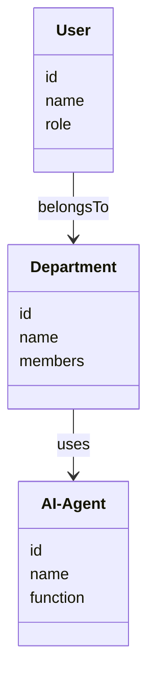
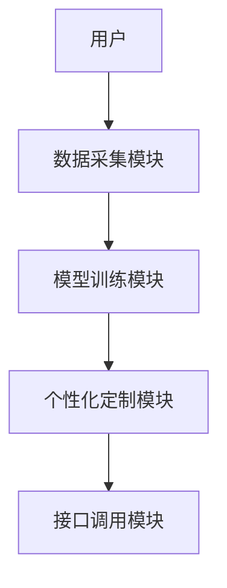
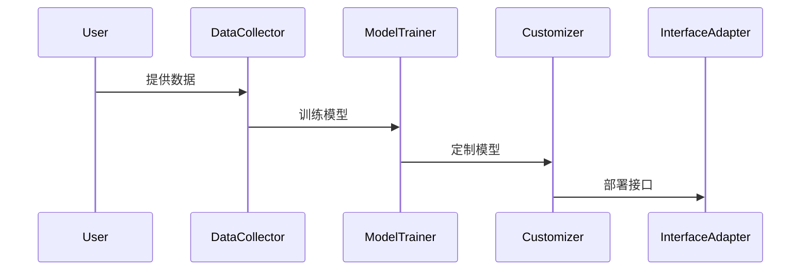

                 

# 企业AI Agent的个性化定制：适应不同部门需求

## 关键词：企业AI Agent，个性化定制，生成式AI，NLP，强化学习，系统架构，数学模型

## 摘要：  
随着人工智能技术的快速发展，企业AI Agent的应用越来越广泛。然而，不同部门的需求差异性使得AI Agent的通用化解决方案难以满足实际需求。本文从企业AI Agent的个性化定制出发，系统性地分析了不同部门的需求特点，探讨了如何通过生成式AI、NLP和强化学习等技术实现个性化定制，并结合实际案例展示了如何设计和实现适应不同部门需求的AI Agent系统。本文内容涵盖理论分析、算法实现、系统设计和项目实战，为企业的个性化AI Agent定制提供了全面的解决方案。

---

# 第一部分: 企业AI Agent的个性化定制基础

# 第1章: 企业AI Agent的基本概念

## 1.1 AI Agent的定义与特点
### 1.1.1 AI Agent的定义
AI Agent（人工智能代理）是指能够感知环境、自主决策并执行任务的智能实体。它通常具备以下特点：
- **自主性**：能够独立决策，无需外部干预。
- **反应性**：能够实时感知环境并做出响应。
- **目标导向**：以实现特定目标为导向执行任务。
- **学习能力**：通过数据和经验不断优化自身性能。

### 1.1.2 AI Agent的核心特点
AI Agent的核心特点包括：
- **模块化**：功能模块化设计，便于扩展和维护。
- **可定制性**：支持根据需求进行功能定制。
- **可扩展性**：能够适应不同规模和复杂度的任务。

### 1.1.3 企业级AI Agent的独特性
企业级AI Agent的独特性体现在：
- **高可用性**：需要在复杂的企业环境中稳定运行。
- **多样性**：需要适应不同部门的多样化需求。
- **安全性**：需要确保数据和系统的安全性。

## 1.2 个性化定制的必要性
### 1.2.1 企业部门需求的多样性
企业内部不同部门的需求差异性较大，例如：
- **销售部门**：需要智能化的客户关系管理。
- **技术支持部门**：需要快速的问题诊断和解决方案。
- **财务部门**：需要自动化财务数据分析。

### 1.2.2 个性化定制的核心价值
个性化定制的核心价值在于：
- **提高效率**：通过定制化功能提升部门工作效率。
- **降低成本**：避免通用化解决方案的资源浪费。
- **增强用户体验**：提供更贴合用户需求的服务。

### 1.2.3 个性化定制的实现路径
个性化定制的实现路径包括：
1. **需求分析**：深入了解各部门的具体需求。
2. **功能设计**：根据需求设计定制化功能模块。
3. **系统实现**：基于需求实现定制化AI Agent。
4. **测试优化**：对定制化系统进行测试和优化。

## 1.3 本章小结
本章介绍了企业AI Agent的基本概念及其独特性，分析了个性化定制的必要性，并提出了实现个性化的路径。通过本章的学习，读者可以理解为什么个性化定制是企业AI Agent发展的必然趋势。

---

# 第二部分: 企业AI Agent的核心概念与联系

# 第2章: 个性化定制的背景与问题分析

## 2.1 问题背景
### 2.1.1 企业部门需求的复杂性
企业内部需求复杂，不同部门对AI Agent的功能需求差异较大。例如：
- **市场部门**需要AI Agent能够快速生成市场报告。
- **研发部门**需要AI Agent协助代码审查和缺陷检测。

### 2.1.2 AI Agent在企业中的应用瓶颈
当前AI Agent在企业中的应用面临以下瓶颈：
- **通用性与个性化的矛盾**：通用化解决方案难以满足个性化需求。
- **功能适配性不足**：现有AI Agent功能难以完全匹配部门需求。
- **技术实现复杂性**：个性化定制需要较高的技术实现难度。

### 2.1.3 个性化定制的必要性
个性化定制的必要性体现在：
- **提高效率**：通过定制化功能提升部门工作效率。
- **降低成本**：避免通用化解决方案的资源浪费。
- **增强用户体验**：提供更贴合用户需求的服务。

## 2.2 问题描述
### 2.2.1 企业AI Agent的通用性与个性化需求的矛盾
通用化AI Agent难以满足个性化需求，主要体现在：
- **功能覆盖不足**：通用AI Agent的功能模块无法完全满足部门需求。
- **灵活性不足**：难以快速响应部门需求的变化。

### 2.2.2 不同部门对AI Agent功能的不同要求
不同部门对AI Agent的功能要求差异较大，例如：
- **销售部门**需要智能化的客户关系管理功能。
- **技术支持部门**需要快速的问题诊断和解决方案。

### 2.2.3 个性化定制的技术挑战
个性化定制的技术挑战包括：
- **需求分析的复杂性**：需要深入了解部门的具体需求。
- **功能实现的复杂性**：需要设计和实现复杂的定制化功能模块。
- **系统维护的复杂性**：定制化系统需要更高的维护成本。

## 2.3 问题解决
### 2.3.1 个性化定制的实现方法
个性化定制的实现方法包括：
1. **需求分析**：深入了解各部门的具体需求。
2. **功能设计**：根据需求设计定制化功能模块。
3. **系统实现**：基于需求实现定制化AI Agent。
4. **测试优化**：对定制化系统进行测试和优化。

### 2.3.2 通用与个性化的平衡策略
为了平衡通用性和个性化需求，可以采用以下策略：
- **模块化设计**：设计功能模块化的系统，便于功能扩展和定制。
- **动态配置**：支持根据需求动态配置功能模块。
- **灵活部署**：提供灵活的部署方式，适应不同部门的需求。

### 2.3.3 定制化AI Agent的设计原则
定制化AI Agent的设计原则包括：
- **模块化设计**：功能模块化设计，便于扩展和维护。
- **可定制性**：支持根据需求进行功能定制。
- **安全性**：确保数据和系统的安全性。

## 2.4 本章小结
本章分析了企业AI Agent个性化定制的背景和问题，提出了实现个性化定制的路径和设计原则。通过本章的学习，读者可以理解个性化定制的必要性和实现路径。

---

# 第三部分: 企业AI Agent的算法原理与数学模型

# 第3章: 生成式AI算法原理

## 3.1 生成式AI的基本原理
### 3.1.1 大语言模型的生成机制
大语言模型（LLM）的生成机制基于Transformer架构，通过自注意力机制和前馈网络实现文本生成。

### 3.1.2 Transformer模型的核心结构
Transformer模型的核心结构包括编码器和解码器，通过自注意力机制和位置编码实现文本的理解和生成。

### 3.1.3 概率生成模型的数学公式
概率生成模型的数学公式如下：
$$ P(y|x) = \frac{1}{Z} \exp(-E(x,y)) $$
其中，$x$ 是输入，$y$ 是输出，$E(x,y)$ 是能量函数，$Z$ 是归一化常数。

## 3.2 基于NLP的意图识别
### 3.2.1 意图识别的流程
意图识别的流程包括：
1. **文本预处理**：对输入文本进行分词和词性标注。
2. **特征提取**：提取文本的特征，如词向量和句向量。
3. **意图分类**：基于特征进行意图分类，输出意图标签。

### 3.2.2 基于词嵌入的意图表示
基于词嵌入的意图表示方法包括：
- **Word2Vec**：通过上下文信息生成词向量。
- **GloVe**：基于全局词频信息生成词向量。
- **BERT**：基于预训练语言模型生成词向量。

### 3.2.3 意图分类的算法实现
意图分类的算法实现包括：
1. **数据准备**：收集和标注意图数据。
2. **特征提取**：提取文本特征。
3. **模型训练**：训练意图分类模型。
4. **模型评估**：评估模型的准确率和召回率。

## 3.3 强化学习的应用
### 3.3.1 强化学习的基本概念
强化学习是一种基于奖励机制的学习方法，通过最大化累积奖励来优化决策策略。

### 3.3.2 在AI Agent中的应用
在AI Agent中的应用包括：
- **路径规划**：通过强化学习优化路径规划。
- **任务调度**：通过强化学习优化任务调度。

### 3.3.3 奖励函数的设计
奖励函数的设计需要考虑以下因素：
- **任务目标**：奖励函数应与任务目标一致。
- **动作空间**：奖励函数应与动作空间匹配。
- **环境状态**：奖励函数应反映环境状态的变化。

## 3.4 本章小结
本章介绍了生成式AI的基本原理，分析了基于NLP的意图识别和强化学习的应用。通过本章的学习，读者可以理解生成式AI和NLP在企业AI Agent中的应用。

---

# 第四部分: 企业AI Agent的系统架构与设计

# 第4章: 系统架构设计

## 4.1 系统模块划分
### 4.1.1 数据采集模块
数据采集模块负责采集企业内部的数据，如日志数据和用户行为数据。

### 4.1.2 模型训练模块
模型训练模块负责训练AI Agent的核心模型，如生成式模型和意图识别模型。

### 4.1.3 个性化定制模块
个性化定制模块负责根据部门需求定制AI Agent的功能模块。

### 4.1.4 接口调用模块
接口调用模块负责与其他系统进行交互，如与企业CRM系统进行数据对接。

## 4.2 系统设计原则
### 4.2.1 可扩展性
系统设计需要具备可扩展性，便于功能模块的扩展和升级。

### 4.2.2 高可用性
系统设计需要具备高可用性，确保系统在复杂环境下的稳定运行。

### 4.2.3 安全性
系统设计需要具备安全性，确保数据和系统的安全性。

## 4.3 系统接口设计
### 4.3.1 接口定义
系统接口设计需要定义清晰的接口规范，如API接口和数据格式。

### 4.3.2 接口调用
系统接口调用需要通过标准化的方式进行，如HTTP请求和JSON格式数据。

## 4.4 本章小结
本章分析了企业AI Agent的系统架构，提出了模块划分和设计原则。通过本章的学习，读者可以理解如何设计和实现企业AI Agent的系统架构。

---

# 第五部分: 项目实战与最佳实践

# 第5章: 项目实战

## 5.1 项目介绍
### 5.1.1 项目背景
本项目旨在实现一个适应不同部门需求的企业AI Agent系统。

### 5.1.2 项目目标
本项目的目标是设计和实现一个可定制化的企业AI Agent系统。

## 5.2 系统功能设计
### 5.2.1 领域模型类图
领域模型类图如下：

### 5.2.2 系统架构设计
系统架构设计如下：

### 5.2.3 系统交互设计
系统交互设计如下：

## 5.3 核心功能实现
### 5.3.1 需求解析
需求解析是实现个性化定制的第一步，需要深入了解各部门的具体需求。

### 5.3.2 功能实现
功能实现需要根据需求设计和实现定制化功能模块。

## 5.4 项目总结
### 5.4.1 成功经验
成功经验包括：
- **模块化设计**：功能模块化设计，便于扩展和维护。
- **动态配置**：支持根据需求动态配置功能模块。
- **灵活部署**：提供灵活的部署方式，适应不同部门的需求。

### 5.4.2 注意事项
注意事项包括：
- **需求变更**：定制化系统需要更高的维护成本。
- **技术实现**：个性化定制需要较高的技术实现难度。
- **用户体验**：需要持续优化用户体验。

## 5.5 本章小结
本章通过实际案例展示了如何设计和实现适应不同部门需求的企业AI Agent系统。通过本章的学习，读者可以掌握项目实战的经验和技巧。

---

# 第六部分: 最佳实践与拓展阅读

# 第6章: 最佳实践

## 6.1 设计原则
### 6.1.1 模块化设计
模块化设计是实现个性化定制的基础，需要将系统划分为功能模块，便于扩展和维护。

### 6.1.2 可扩展性
系统设计需要具备可扩展性，便于功能模块的扩展和升级。

### 6.1.3 安全性
系统设计需要具备安全性，确保数据和系统的安全性。

## 6.2 部署与优化
### 6.2.1 部署策略
部署策略需要根据企业需求选择合适的部署方式，如集中部署和分布式部署。

### 6.2.2 性能优化
性能优化需要通过技术手段提升系统性能，如优化算法和提升硬件性能。

## 6.3 维护与管理
### 6.3.1 系统维护
系统维护需要定期对系统进行检查和维护，确保系统的稳定运行。

### 6.3.2 用户管理
用户管理需要对系统用户进行管理，确保系统的安全性和稳定性。

## 6.4 本章小结
本章总结了企业AI Agent个性化定制的最佳实践，包括设计原则、部署优化和维护管理。通过本章的学习，读者可以掌握如何更好地设计和实现企业AI Agent系统。

---

# 作者：AI天才研究院/AI Genius Institute & 禅与计算机程序设计艺术 /Zen And The Art of Computer Programming

---

以上是《企业AI Agent的个性化定制：适应不同部门需求》的技术博客文章的详细目录结构和内容概要。文章从基础概念、核心算法、系统设计到项目实战和最佳实践，全面解析了企业AI Agent的个性化定制方法，为企业的智能化转型提供了有益的参考和指导。

