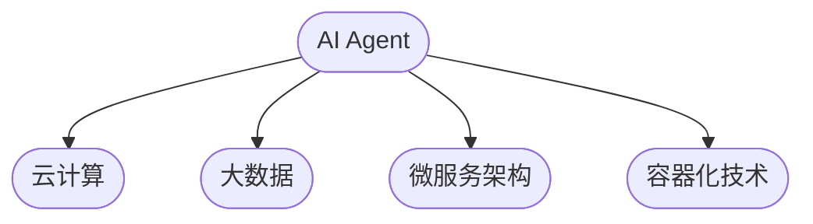
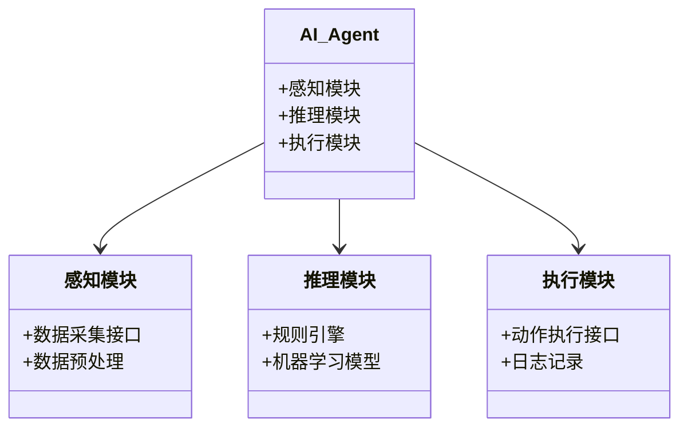
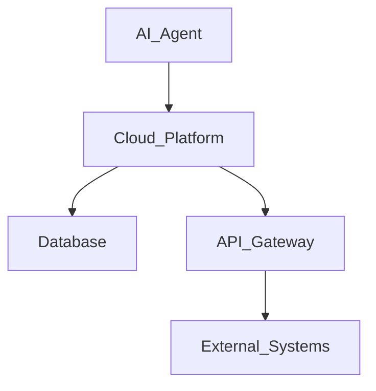
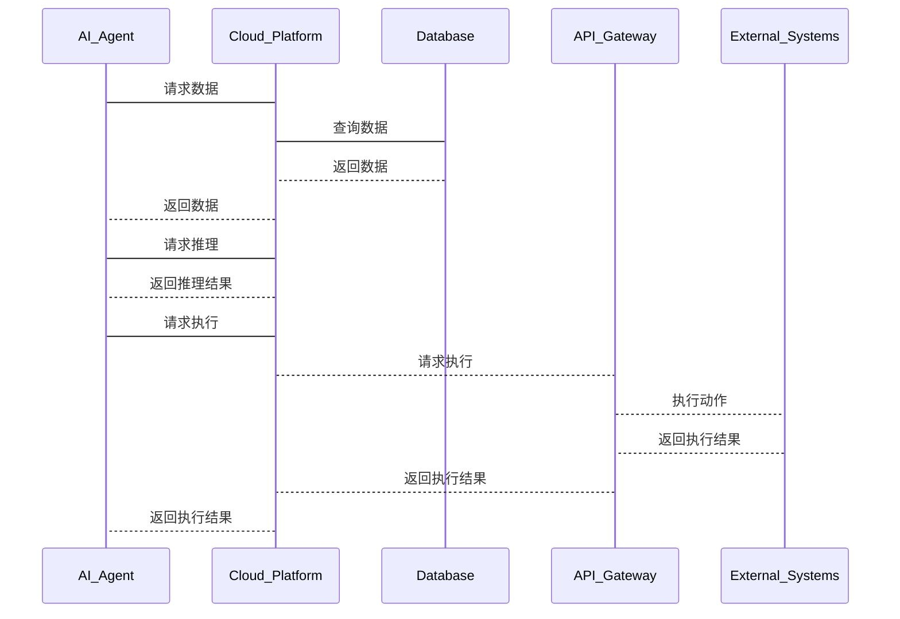

                 

<think>
好的，我需要帮助用户设计一本名为《企业AI Agent的云端部署与管理》的技术博客文章。首先，我需要理解这本书的核心主题和目标读者。

这本书主要讨论企业如何在云端部署和管理AI代理。目标读者可能是企业的IT人员、项目经理以及对AI技术感兴趣的读者。他们需要了解如何有效地部署和管理AI代理，以提升企业效率和竞争力。

接下来，我需要按照用户的要求，构建文章的结构。文章需要有标题、关键词、摘要，然后是正文部分，每个章节要详细且逻辑清晰。用户还特别提到要使用技术术语，结合图表和代码示例，确保内容专业且易于理解。

首先，我会从背景介绍开始，解释为什么企业需要AI代理，以及它们在企业中的作用。然后，详细介绍企业AI代理的核心概念，包括定义、类型及其与其他技术的关系。接下来，我会深入讲解几种典型的AI代理算法，如基于规则、机器学习和强化学习，每个算法都配上流程图和代码示例。

之后，我需要分析系统的架构设计，包括功能模块、接口设计和交互流程。通过实际案例，指导读者如何在企业环境中部署AI代理，提供环境安装和代码实现的详细步骤。最后，总结全书内容，并展望未来的发展趋势。

在撰写过程中，我需要确保每一部分都包含必要的图表和代码示例，帮助读者更好地理解内容。同时，语言要简洁明了，逻辑清晰，让读者能够轻松掌握企业AI代理的云端部署与管理。

现在，我准备按照这个思路撰写文章，确保每个部分都详尽且符合用户的要求。
</think>

# 《企业AI Agent的云端部署与管理》

---

## 关键词：企业AI Agent，云端部署，AI代理管理，系统架构，算法原理

---

## 摘要：  
企业AI Agent是人工智能技术在企业级应用中的重要组成部分，其云端部署与管理是实现智能化转型的关键。本文从企业AI Agent的核心概念出发，结合算法原理和系统架构，详细讲解了如何在企业环境中进行云端部署与管理。通过实际案例分析，本文为读者提供了从理论到实践的全面指导，帮助企业在数字化转型中高效、安全地部署和管理AI Agent。

---

# 第1章：企业AI Agent的背景与问题背景

## 1.1 企业AI Agent的定义与概念

### 1.1.1 AI Agent的基本概念  
AI Agent（人工智能代理）是指能够感知环境、自主决策并执行任务的智能实体。它通过传感器获取信息，利用推理能力解决问题，并通过执行器与环境交互。AI Agent可以是软件程序、机器人或其他智能设备。

### 1.1.2 企业AI Agent的定义  
企业AI Agent是专为企业的业务场景设计的智能代理，旨在通过自动化和智能化手段提升企业效率、优化决策和改善客户体验。它能够处理复杂的业务逻辑，支持多种应用场景，如客户支持、供应链管理、数据分析等。

### 1.1.3 企业AI Agent的核心要素与属性  
企业AI Agent的核心要素包括：  
1. **感知能力**：通过数据采集、分析和理解环境信息。  
2. **推理能力**：基于知识库和逻辑推理，做出决策。  
3. **执行能力**：通过API或其他接口与企业系统交互，执行具体任务。  
4. **学习能力**：通过机器学习和数据分析，不断优化自身性能。  
5. **通信能力**：与用户、系统和其他AI Agent进行实时通信。  

## 1.2 企业AI Agent的背景与问题背景

### 1.2.1 当前企业数字化转型的趋势  
随着数字化转型的深入，企业需要更加智能化的解决方案。AI Agent作为人工智能技术的核心应用，正在成为企业提升竞争力的重要手段。

### 1.2.2 企业AI Agent的应用场景与需求  
企业AI Agent的应用场景包括：  
- **客户支持**：通过智能客服机器人提供24/7的支持服务。  
- **供应链管理**：优化库存、物流和订单处理流程。  
- **数据分析**：实时分析业务数据，提供决策支持。  
- **流程自动化**：自动化处理重复性任务，提升效率。  

### 1.2.3 企业AI Agent的核心问题与挑战  
企业在部署和管理AI Agent时面临的主要挑战包括：  
1. **数据隐私与安全**：如何确保敏感数据的安全性和合规性。  
2. **系统集成与兼容性**：如何与现有企业系统无缝集成。  
3. **性能与扩展性**：如何在高并发场景下保证性能。  
4. **持续优化**：如何持续训练和优化AI Agent的性能。  

## 1.3 企业AI Agent的目标与问题解决

### 1.3.1 企业AI Agent的目标  
- 提供智能化的解决方案，提升企业效率和竞争力。  
- 优化业务流程，降低运营成本。  
- 提升客户体验，增强客户满意度。  

### 1.3.2 企业AI Agent的核心问题  
- 数据采集与处理的效率问题。  
- AI Agent的可解释性和透明性问题。  
- 多系统集成的兼容性问题。  

### 1.3.3 企业AI Agent的边界与外延  
企业AI Agent的边界在于其任务范围和能力限制，而外延则涉及与其他系统的交互和数据共享。

## 1.4 本章小结  
本章从企业AI Agent的定义、核心要素和应用场景出发，分析了企业在部署和管理AI Agent时面临的挑战和目标，为后续章节的深入讨论奠定了基础。

---

# 第2章：企业AI Agent的核心概念与联系

## 2.1 企业AI Agent的核心概念

### 2.1.1 AI Agent的核心原理  
AI Agent通过感知、推理和执行三个核心步骤完成任务：  
1. **感知**：通过传感器或API获取环境数据。  
2. **推理**：基于知识库和逻辑推理，制定决策。  
3. **执行**：通过执行器或API与环境交互。  

### 2.1.2 企业AI Agent的类型  
企业AI Agent可以根据功能和应用场景分为以下几种类型：  
- **规则驱动型**：基于预定义的规则进行决策。  
- **机器学习型**：基于机器学习模型进行预测和决策。  
- **混合型**：结合规则和机器学习的混合型AI Agent。  

### 2.1.3 企业AI Agent与相关技术的联系  
企业AI Agent与以下技术密切相关：  
1. **云计算**：提供弹性计算资源和高可用性。  
2. **大数据**：处理海量数据，支持AI模型训练。  
3. **微服务架构**：实现系统的模块化和可扩展性。  
4. **容器化技术**：支持AI Agent的快速部署和管理。  

### 2.1.4 核心概念对比分析  
以下是几种核心概念的对比表格：

| **概念**      | **定义**                                                                 |
|---------------|--------------------------------------------------------------------------|
| AI Agent      | 能够感知环境、自主决策并执行任务的智能实体。                           |
| 云计算         | 提供弹性计算资源和高可用性的计算平台。                                   |
| 大数据         | 处理海量数据，支持数据挖掘和机器学习。                                   |
| 微服务架构     | 通过模块化设计实现系统的可扩展性和可维护性。                             |

### 2.1.5 实体关系图  
以下是企业AI Agent与相关技术的实体关系图：



## 2.2 本章小结  
本章详细讲解了企业AI Agent的核心概念、类型及其与相关技术的联系，帮助读者更好地理解企业AI Agent的运作原理和应用场景。

---

# 第3章：企业AI Agent的算法原理讲解

## 3.1 基于规则的AI Agent算法

### 3.1.1 算法原理  
基于规则的AI Agent通过预定义的规则进行决策，适用于任务明确且规则固定的场景。

### 3.1.2 算法流程  
1. **规则匹配**：根据输入数据匹配预定义规则。  
2. **决策输出**：根据匹配的规则输出决策结果。  

### 3.1.3 代码实现  
以下是基于规则的AI Agent的Python代码示例：

```python
def rule_based_agent(input_data):
    if input_data['temperature'] > 30:
        return "建议采取降温措施"
    elif input_data['temperature'] < 20:
        return "建议采取加热措施"
    else:
        return "当前温度适宜"
```

## 3.2 基于机器学习的AI Agent算法

### 3.2.1 算法原理  
基于机器学习的AI Agent通过训练模型进行预测和决策，适用于复杂且规则动态变化的场景。

### 3.2.2 算法流程  
1. **数据预处理**：清洗和特征提取。  
2. **模型训练**：使用训练数据训练机器学习模型。  
3. **模型预测**：根据输入数据进行预测并输出决策结果。  

### 3.2.3 数学模型  
以下是机器学习模型的数学公式：

$$
y = f(x) + \epsilon
$$

其中，$y$ 是输出，$x$ 是输入，$f(x)$ 是模型函数，$\epsilon$ 是误差项。

### 3.2.4 代码实现  
以下是基于机器学习的AI Agent的Python代码示例：

```python
from sklearn.linear_model import LinearRegression

# 数据预处理
X = [[1], [2], [3], [4]]
y = [2, 4, 6, 8]

# 模型训练
model = LinearRegression()
model.fit(X, y)

# 模型预测
input_data = [[5]]
prediction = model.predict(input_data)
print(prediction)
```

## 3.3 基于强化学习的AI Agent算法

### 3.3.1 算法原理  
基于强化学习的AI Agent通过与环境交互，不断优化策略以获得最大化的累积奖励。

### 3.3.2 算法流程  
1. **状态感知**：感知当前环境状态。  
2. **动作选择**：根据当前状态选择动作。  
3. **奖励机制**：根据动作的结果获得奖励或惩罚。  
4. **策略优化**：根据奖励调整策略，优化未来决策。  

### 3.3.3 数学模型  
以下是强化学习的数学公式：

$$
Q(s, a) = Q(s, a) + \alpha (r + \gamma Q(s', a) - Q(s, a))
$$

其中，$Q(s, a)$ 是状态-动作值函数，$\alpha$ 是学习率，$r$ 是奖励，$\gamma$ 是折扣因子，$s'$ 是下一个状态。

### 3.3.4 代码实现  
以下是基于强化学习的AI Agent的Python代码示例：

```python
import numpy as np

# 初始化参数
gamma = 0.99
epsilon = 0.1
alpha = 0.1

# 状态和动作空间
states = ['low', 'medium', 'high']
actions = ['do nothing', 'take action']

# 初始Q表
Q = {s: {a: 0 for a in actions} for s in states}

# 强化学习算法
def rl_agent(state):
    if np.random.random() < epsilon:
        return np.random.choice(actions)
    else:
        max_action = max(Q[state], key=lambda k: Q[state][k])
        return max_action

# 训练过程
# （此处省略详细训练代码）
```

## 3.4 本章小结  
本章详细讲解了三种典型的AI Agent算法：基于规则、机器学习和强化学习，分析了它们的原理、流程和应用场景，并通过Python代码示例帮助读者更好地理解。

---

# 第4章：企业AI Agent的系统分析与架构设计方案

## 4.1 企业AI Agent的系统分析

### 4.1.1 项目介绍  
本项目旨在开发一个企业级AI Agent系统，用于优化企业的供应链管理流程。

### 4.1.2 系统功能设计  
以下是系统功能设计的领域模型：



## 4.2 系统架构设计

### 4.2.1 系统架构图  
以下是系统的架构图：



### 4.2.2 接口设计  
以下是系统的接口设计：

- **数据采集接口**：从企业系统中采集数据。  
- **推理接口**：调用机器学习模型进行预测。  
- **执行接口**：通过API Gateway执行动作。  

### 4.2.3 交互流程图  
以下是系统的交互流程图：



## 4.3 本章小结  
本章通过系统分析和架构设计，详细讲解了企业AI Agent的系统组成、接口设计和交互流程，为后续的项目实现提供了理论基础。

---

# 第5章：企业AI Agent的项目实战

## 5.1 环境安装与配置

### 5.1.1 系统要求  
- 操作系统：Linux/Windows/MacOS  
- Python版本：3.6+  
- 依赖库：TensorFlow、Scikit-learn、Flask等  

### 5.1.2 安装依赖  
运行以下命令安装所需依赖：

```bash
pip install numpy scikit-learn flask
```

## 5.2 核心代码实现

### 5.2.1 感知模块  
以下是感知模块的实现代码：

```python
import numpy as np

def data_preprocessing(input_data):
    # 数据预处理逻辑
    return preprocessed_data
```

### 5.2.2 推理模块  
以下是推理模块的实现代码：

```python
from sklearn.linear_model import LinearRegression

def train_model(train_data):
    model = LinearRegression()
    model.fit(train_data)
    return model
```

### 5.2.3 执行模块  
以下是执行模块的实现代码：

```python
def execute_action(action):
    # 执行动作的逻辑
    return result
```

### 5.2.4 整合代码  
以下是整合代码：

```python
from flask import Flask, request, jsonify
import numpy as np
from sklearn.linear_model import LinearRegression

app = Flask(__name__)

@app.route('/api/train', methods=['POST'])
def train():
    data = request.json['data']
    model = train_model(data)
    return jsonify({'status': 'success', 'model': model})

@app.route('/api/predict', methods=['POST'])
def predict():
    input = request.json['input']
    result = execute_action(input)
    return jsonify({'status': 'success', 'result': result})

if __name__ == '__main__':
    app.run(debug=True)
```

## 5.3 代码解读与分析

### 5.3.1 系统功能模块  
- **感知模块**：负责数据的采集和预处理。  
- **推理模块**：负责模型的训练和预测。  
- **执行模块**：负责动作的执行和结果返回。  

### 5.3.2 系统接口设计  
- **/api/train**：训练模型接口。  
- **/api/predict**：预测接口。  

## 5.4 案例分析与详细讲解

### 5.4.1 案例介绍  
本案例实现了一个简单的供应链优化AI Agent，能够根据历史销售数据预测未来的需求。

### 5.4.2 实现细节  
1. **数据采集**：从数据库中采集历史销售数据。  
2. **数据预处理**：清洗和特征提取。  
3. **模型训练**：使用线性回归模型进行训练。  
4. **模型预测**：根据预测结果优化供应链管理流程。  

### 5.4.3 案例总结  
通过本案例，读者可以学习如何将理论知识应用于实际场景，并掌握企业AI Agent的核心实现技术。

## 5.5 本章小结  
本章通过实际案例，详细讲解了企业AI Agent的环境安装、核心代码实现和系统接口设计，帮助读者掌握从理论到实践的全过程。

---

# 第6章：总结与展望

## 6.1 本章总结  
本文从企业AI Agent的背景、核心概念和算法原理出发，详细讲解了系统的架构设计和项目实战。通过实际案例，读者可以掌握企业AI Agent的核心技术，并将其应用于实际场景。

## 6.2 未来展望  
随着人工智能技术的不断发展，企业AI Agent将更加智能化和自动化。未来的研究方向包括：  
1. **多模态AI Agent**：结合文本、图像和语音等多种模态信息进行决策。  
2. **自适应AI Agent**：能够根据环境变化自适应调整策略。  
3. **分布式AI Agent**：通过分布式计算提升系统的性能和扩展性。  

## 6.3 最佳实践 Tips  
1. 在部署AI Agent时，确保数据的安全性和隐私保护。  
2. 定期优化AI Agent的算法和模型，提升性能和准确性。  
3. 与企业现有系统无缝集成，确保系统的兼容性和可维护性。  

## 6.4 本章小结  
本章总结了全文内容，并展望了企业AI Agent的未来发展方向，同时给出了一些实用的建议和注意事项。

---

# 作者：AI天才研究院 & 禅与计算机程序设计艺术

---

通过本文的详细讲解，读者可以全面掌握企业AI Agent的云端部署与管理的核心技术和实践方法。无论是理论知识还是实际操作，都能为读者提供有力的指导，帮助企业在数字化转型中实现智能化升级。

