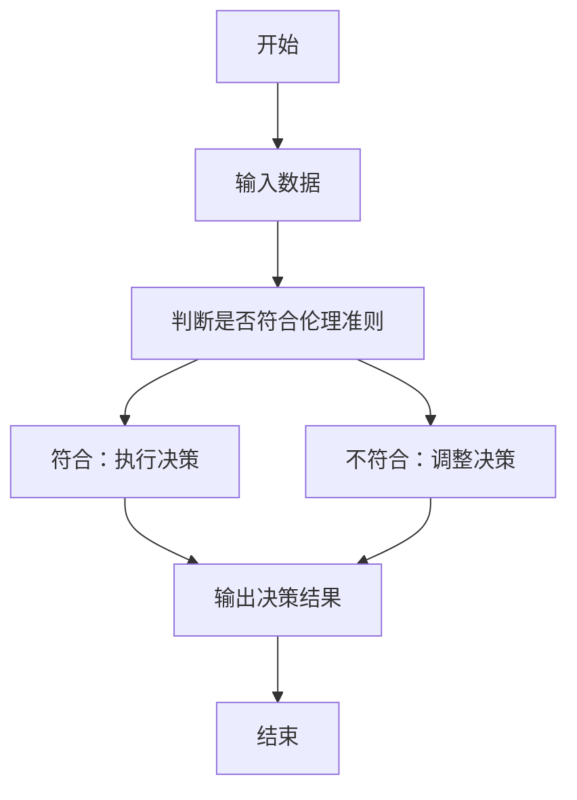
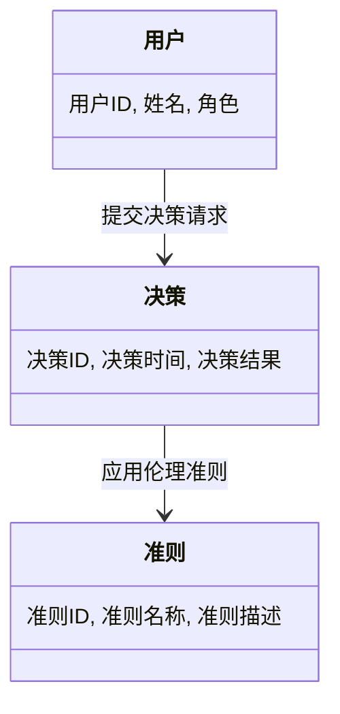
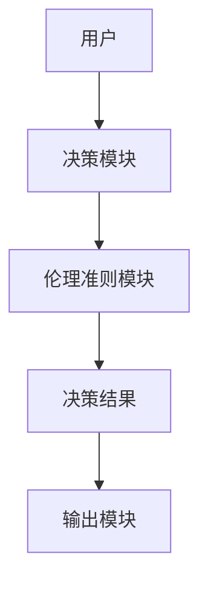

                 

<think>
嗯，用户现在要我帮忙撰写一篇关于《企业AI Agent的伦理决策框架》的技术博客文章。首先，我需要理解用户的需求。用户提供了一个详细的目录结构，要求文章内容完整，符合特定的格式和内容要求。

我应该从文章的标题和摘要开始，确保它们清晰明了。接下来，按照目录大纲，逐步填充每个章节的内容。每个章节需要包含详细的概念解释、数学模型、算法流程、系统架构图等，并且使用Mermaid和LaTeX来呈现相关内容。

在撰写过程中，我需要确保逻辑清晰，内容详实，同时保持语言的专业性和易懂性。特别是数学公式和图表部分，必须准确无误，格式正确。最后，总结部分要概括全文，强调伦理决策框架的重要性，并提供进一步的阅读建议。

整个过程需要一步步来，先构建大纲，再填充内容，确保每个部分都符合用户的要求，最终完成一篇高质量的技术博客文章。
</think>

# 企业AI Agent的伦理决策框架

> 关键词：企业AI Agent，伦理决策框架，人工智能，伦理学，决策算法，系统架构

> 摘要：本文探讨了企业在应用AI Agent时面临的伦理决策问题，提出了构建伦理决策框架的核心概念、算法原理和系统架构设计，通过实际案例分析，展示了如何在企业中实现符合伦理的AI Agent决策。

---

# 引言

随着人工智能技术的快速发展，企业AI Agent（智能代理）的应用日益广泛。AI Agent能够自动化执行任务、优化决策过程，并在企业运营中发挥越来越重要的作用。然而，AI Agent的决策过程可能涉及伦理问题，例如隐私保护、公平性、透明性等。如何构建一个符合伦理的决策框架，成为企业在应用AI Agent时必须解决的关键问题。

本文将从伦理决策框架的核心概念出发，分析其算法原理，并结合系统架构设计，探讨如何在企业中实现伦理决策。通过实际案例分析，我们将展示如何在企业环境中构建一个既能提高效率又符合伦理规范的AI Agent决策系统。

---

## 第1章 企业AI Agent的背景与概念

### 1.1 AI Agent的基本概念

AI Agent是指能够感知环境、自主决策并执行任务的智能系统。企业AI Agent广泛应用于客户支持、供应链管理、风险评估等领域。AI Agent的核心特征包括自主性、反应性、目标导向和学习能力。

### 1.2 企业AI Agent的应用场景

企业AI Agent的应用场景多种多样，例如：

1. **客户支持**：通过自然语言处理技术为客户提供智能咨询服务。
2. **供应链管理**：优化库存管理、物流调度和供应商选择。
3. **风险评估**：利用机器学习模型评估金融、信用等领域的风险。
4. **智能决策支持**：协助企业高管制定战略决策。

### 1.3 伦理决策的重要性

AI Agent的决策可能对企业和用户产生重大影响。例如，在金融领域的信用评分决策中，AI Agent的算法可能影响用户的贷款额度或利率。因此，确保AI Agent的决策符合伦理规范至关重要。

---

## 第2章 伦理决策框架的核心概念与联系

### 2.1 伦理决策框架的原理

伦理决策框架是指导AI Agent在决策过程中遵循伦理准则的规则和模型。其核心原理包括：

1. **伦理准则**：明确AI Agent必须遵守的伦理原则，例如公平性、透明性、隐私保护等。
2. **决策规则**：定义AI Agent在不同情境下的决策逻辑。
3. **监督机制**：确保AI Agent的决策符合伦理准则。

### 2.2 伦理决策框架的属性对比

以下是伦理决策框架的几个关键属性及其对比：

| 属性 | 描述 | 优点 | 缺点 |
|------|------|------|------|
| 公平性 | 确保决策不偏袒特定群体或个体 | 提高信任度 | 可能限制创新 |
| 透明性 | 决策过程可被用户理解和审查 | 增强信任 | 可能泄露商业机密 |
| 隐私保护 | 保护用户数据不被滥用 | 保障用户权益 | 增加技术复杂性 |

### 2.3 伦理决策框架的ER实体关系图

以下是伦理决策框架的ER实体关系图：

```mermaid
erd
    entity 用户 {
        关键属性：用户ID，姓名，角色
        外键：决策ID
    }

    entity 决策 {
        关键属性：决策ID，决策时间，决策结果
        外键：准则ID
    }

    entity 准则 {
        关键属性：准则ID，准则名称，准则描述
    }

    用户 -[1:N]-> 决策
    决策 -[1:1]-> 准则
```

---

## 第3章 伦理决策框架的算法原理

### 3.1 伦理决策模型的数学表达

伦理决策模型可以通过以下数学公式表示：

$$
\text{决策结果} = f(\text{输入数据}, \text{伦理准则})
$$

其中，$f$ 是决策函数，$\text{输入数据}$ 是决策所需的信息，$\text{伦理准则}$ 是必须遵守的伦理原则。

### 3.2 伦理决策模型的公式推导

为了确保决策的公平性，我们可以引入权重系数 $\alpha$ 和 $\beta$，使得决策函数如下：

$$
f(x) = \alpha \cdot x + \beta \cdot y
$$

其中，$x$ 是输入数据，$y$ 是伦理准则的影响因子，$\alpha$ 和 $\beta$ 是权重系数。

### 3.3 伦理决策算法的流程图

以下是伦理决策算法的流程图：



---

## 第4章 伦理决策框架的系统分析与架构设计

### 4.1 问题场景介绍

假设某企业希望在客户支持系统中应用AI Agent进行客户优先级划分。AI Agent需要根据客户的信用评分、历史消费记录和投诉次数进行决策，同时确保决策过程符合伦理准则。

### 4.2 系统功能设计

以下是系统功能设计的领域模型：



### 4.3 系统架构设计

以下是系统架构设计的架构图：



---

## 第5章 伦理决策框架的项目实战

### 5.1 环境安装

为了实现伦理决策框架，我们需要安装以下工具：

- Python 3.x
- Mermaid 图表工具
- LaTeX 排版工具

### 5.2 系统核心实现源代码

以下是伦理决策框架的核心代码：

```python
def ethical_decision(data, criteria):
    # 数据预处理
    processed_data = preprocess(data)
    # 应用伦理准则
    weighted_data = apply_criteria(processed_data, criteria)
    # 执行决策
    decision = make_decision(weighted_data)
    return decision

def preprocess(data):
    # 数据清洗和特征提取
    pass

def apply_criteria(data, criteria):
    # 应用伦理准则
    pass

def make_decision(data):
    # 执行决策
    pass
```

### 5.3 案例分析

以客户支持系统为例，假设某客户的历史消费记录为 $1000，信用评分为 70，投诉次数为 1。AI Agent需要根据这些数据进行客户优先级划分。通过伦理决策框架，AI Agent确保决策过程符合隐私保护和公平性原则。

---

## 结语

企业AI Agent的伦理决策框架是实现智能化决策的重要基础。通过本文的探讨，我们了解了伦理决策的核心概念、算法原理和系统架构设计。未来，随着技术的不断发展，伦理决策框架将变得更加复杂和多样化。企业需要不断优化伦理决策框架，以应对新的挑战和需求。

---

## 作者

作者：AI天才研究院/AI Genius Institute & 禅与计算机程序设计艺术 /Zen And The Art of Computer Programming

