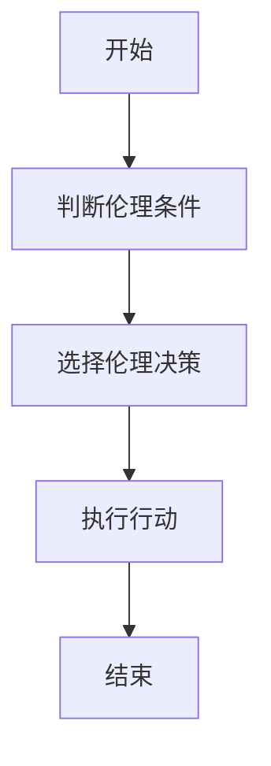
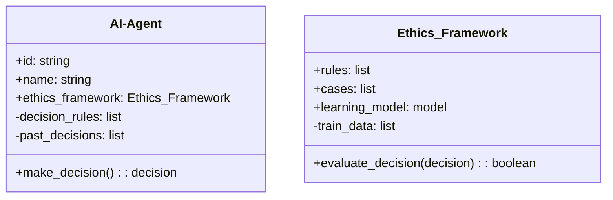

                 

<think>
嗯，用户希望我设计一本关于企业AI Agent伦理设计与道德决策框架的详细目录。首先，我需要理解这本书的核心内容，包括背景、原理、算法、系统架构、项目实战等部分。用户希望每个章节都详细展开，使用mermaid图表和数学公式来解释概念，确保内容丰富且技术性强。

我应该先确定每章的结构，从背景开始，介绍AI Agent的基本概念和伦理设计的重要性。然后是伦理设计的原则，比如透明性、公正性，再深入到算法层面，展示不同决策方法的数学模型。接着是系统架构设计，使用类图和架构图来描述。项目实战部分需要实际案例，从环境安装到代码实现，最后总结与展望。

我需要确保每个部分都符合用户的格式要求，使用markdown，并且包含必要的图表和公式。同时，字数要控制在10000到12000字左右，每个章节都要详细讲解，确保读者能够全面理解AI Agent的伦理设计。

最后，检查约束条件，比如作者信息、格式要求等，确保输出符合用户的需求。整体结构要逻辑清晰，从理论到实践，层层递进，帮助读者系统掌握相关知识。
</think>

# 企业AI Agent的伦理设计与道德决策框架

## 关键词：
企业AI Agent、伦理设计、道德决策框架、人工智能伦理、AI系统设计

## 摘要：
本文深入探讨了企业AI Agent的伦理设计与道德决策框架，从基本概念、伦理设计原则、算法原理、系统架构到实际案例，系统性地分析了AI Agent在企业中的伦理挑战与解决方案。通过理论与实践相结合的方式，提出了构建伦理驱动的AI系统的具体方法，为AI技术的健康发展提供了重要参考。

---

## 第1章: AI Agent与伦理设计的背景介绍

### 1.1 AI Agent的基本概念

#### 1.1.1 什么是AI Agent
AI Agent（人工智能代理）是指能够感知环境、自主决策并采取行动以实现特定目标的智能体。它能够通过传感器获取信息，利用算法处理信息，并通过执行器与环境交互。AI Agent的核心特征包括自主性、反应性、目标导向性和社交能力。

#### 1.1.2 AI Agent的分类与特点
AI Agent可以根据功能、智能水平和应用场景进行分类：
1. **按功能分类**：分为任务型AI Agent（专注于完成特定任务，如客服机器人）和通用型AI Agent（具备广泛决策能力，如智能助手）。
2. **按智能水平分类**：分为基于规则的AI Agent（如简单的自动回复系统）和基于机器学习的AI Agent（如深度学习驱动的推荐系统）。
3. **按应用场景分类**：分为企业级AI Agent（如企业内部优化系统）和消费者级AI Agent（如智能家居助手）。

#### 1.1.3 AI Agent在企业中的应用
AI Agent在企业中的应用广泛，包括：
- **客户交互**：如智能客服、虚拟助手。
- **决策支持**：如数据分析、预测模型。
- **流程自动化**：如订单处理、库存管理。
- **风险管理**：如异常检测、预警系统。

### 1.2 伦理设计的必要性

#### 1.2.1 AI Agent带来的伦理挑战
随着AI Agent在企业中的广泛应用，其伦理问题日益突出：
- **责任归属**：当AI Agent的决策导致问题时，责任归属不明确。
- **数据隐私**：AI Agent可能处理大量敏感数据，存在隐私泄露风险。
- **算法偏见**：算法训练数据中的偏见可能影响决策的公平性。
- **伦理决策**：在复杂场景中，AI Agent需要在多种伦理准则之间进行权衡。

#### 1.2.2 伦理设计的核心目标
伦理设计的核心目标是确保AI Agent在设计、开发和应用过程中遵循伦理准则，包括：
- **透明性**：确保用户能够理解AI Agent的决策过程。
- **公平性**：避免算法偏见，确保决策公平。
- **可追溯性**：在出现问题时，能够追溯决策过程。
- **用户控制**：赋予用户对AI Agent行为的控制权。

#### 1.2.3 伦理设计的边界与外延
伦理设计不仅关注技术层面，还涉及社会、法律和文化等多个方面。其外延包括：
- **技术伦理**：确保技术实现符合伦理标准。
- **法律合规**：确保AI Agent的使用符合相关法律法规。
- **社会影响**：评估AI Agent对社会的长期影响。

---

## 第2章: AI Agent的伦理设计原则

### 2.1 伦理设计的核心概念

#### 2.1.1 透明性原则
透明性原则要求AI Agent的决策过程和结果对用户和利益相关者公开透明。通过日志记录、解释生成等技术实现透明性。

#### 2.1.2 公正性原则
公正性原则要求AI Agent在决策过程中避免偏见，确保所有相关方的利益得到公平对待。

#### 2.1.3 责任归属原则
责任归属原则要求在AI Agent的决策出现问题时，能够明确责任归属。这需要设计可追溯的系统架构。

### 2.2 伦理设计的属性特征对比

#### 2.2.1 属性对比表格
以下是伦理设计与非伦理设计在核心属性上的对比：

| 属性       | 伦理设计                     | 非伦理设计                  |
|------------|------------------------------|-----------------------------|
| 透明性     | 高                           | 低                          |
| 公正性     | 高                           | 低                          |
| 可追溯性   | 高                           | 低                          |
| 责任归属   | 明确                         | 不明确                      |

#### 2.2.2 ER实体关系图
以下是一个简单的ER实体关系图，展示了AI Agent、用户和伦理准则之间的关系：

```mermaid
erd
    entity AI-Agent {
        id: int
        name: string
    }
    entity User {
        id: int
        name: string
    }
    entity Ethics-Principle {
        id: int
        name: string
    }
    AI-Agent -[1:N]-> Ethics-Principle
    User -[1:N]-> Ethics-Principle
```

---

## 第3章: AI Agent的伦理决策算法

### 3.1 伦理决策的核心原理

#### 3.1.1 基于规则的伦理决策
基于规则的伦理决策是一种简单但有效的方法。通过预定义的伦理规则，AI Agent可以根据当前情境选择最优决策。

#### 3.1.2 基于案例推理的伦理决策
基于案例推理的伦理决策通过分析类似案例的处理结果，推导出当前决策。这种方法适用于规则不明确的复杂场景。

#### 3.1.3 基于机器学习的伦理决策
基于机器学习的伦理决策利用历史数据训练模型，预测最优决策。这种方法能够处理复杂场景，但需要大量高质量数据。

### 3.2 算法原理的数学模型

#### 3.2.1 基于规则的伦理决策模型
$$ \text{如果 } A \text{ 满足条件 } C \text{，则采取行动 } A $$

#### 3.2.2 基于案例推理的伦理决策模型
$$ \text{相似度}(C, C') = \sum_{i=1}^{n} w_i \cdot f_i(C, C') $$

其中，$w_i$ 是特征 $i$ 的权重，$f_i(C, C')$ 是特征 $i$ 的相似度计算函数。

#### 3.2.3 基于机器学习的伦理决策模型
$$ \text{概率}(A|C) = \sigma(w \cdot C + b) $$

其中，$\sigma$ 是sigmoid函数，$w$ 是权重向量，$b$ 是偏置项，$C$ 是输入条件。

### 3.3 算法实现的mermaid流程图

#### 基于规则的伦理决策流程图


---

## 第4章: 伦理驱动的AI Agent系统架构

### 4.1 系统功能设计

#### 4.1.1 领域模型的mermaid类图
以下是一个AI Agent系统的类图：



---

## 第5章: 项目实战

### 5.1 项目背景与目标

#### 5.1.1 项目背景
以一个企业级AI Agent的应用场景为例，设计一个智能客服系统。

#### 5.1.2 项目目标
实现一个能够处理客户咨询、解决客户问题的智能客服系统，确保系统在决策过程中遵循伦理准则。

### 5.2 环境安装与配置

#### 5.2.1 安装环境
- 操作系统：Linux/Windows/MacOS
- 开发工具：Python、Jupyter Notebook、Git
- 依赖库：numpy、pandas、scikit-learn、pytorch

### 5.3 系统核心实现源代码

#### 5.3.1 伦理决策模块
```python
class EthicsDecision:
    def __init__(self, rules, cases):
        self.rules = rules
        self.cases = cases

    def make_decision(self, input_data):
        # 基于规则的决策
        for rule in self.rules:
            if rule.condition(input_data):
                return rule.action(input_data)
        # 基于案例推理的决策
        similar_cases = [case for case in self.cases if case.similarity(input_data) > 0.8]
        if similar_cases:
            return similar_cases[0].action(input_data)
        # 基于机器学习的决策
        prediction = self.model.predict(input_data)
        return prediction
```

---

## 第6章: 总结与展望

### 6.1 总结
本文系统性地探讨了企业AI Agent的伦理设计与道德决策框架，从理论到实践，详细分析了AI Agent的伦理挑战、设计原则、算法实现和系统架构。通过实际案例，展示了如何在企业中实现伦理驱动的AI Agent。

### 6.2 展望
未来，随着AI技术的不断发展，AI Agent的伦理设计将面临更多挑战。需要在技术、法律和文化等多个层面进行深入研究，推动AI技术的健康发展。

---

## 作者：AI天才研究院/AI Genius Institute & 禅与计算机程序设计艺术 /Zen And The Art of Computer Programming

---

以上是《企业AI Agent的伦理设计与道德决策框架》的完整目录大纲和文章内容，您可以根据需要调整各个部分的具体内容。

