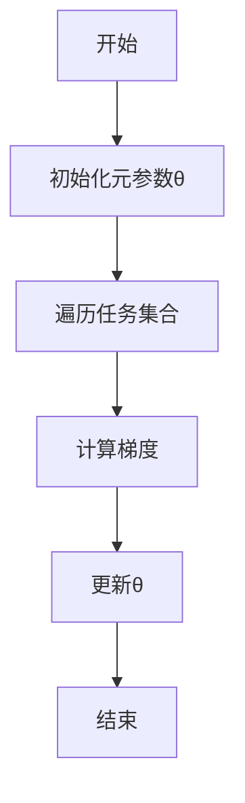
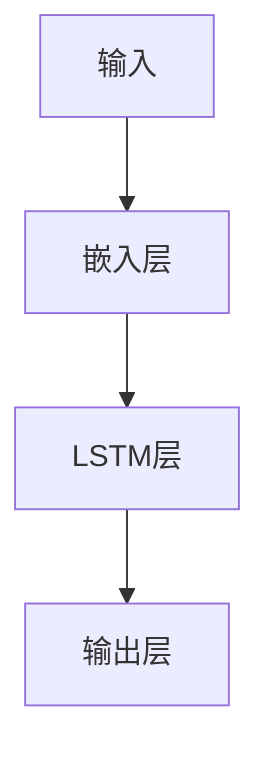
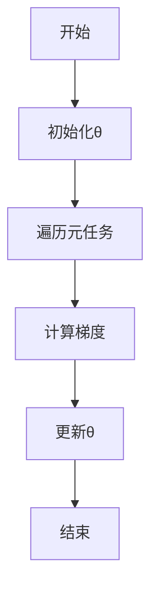
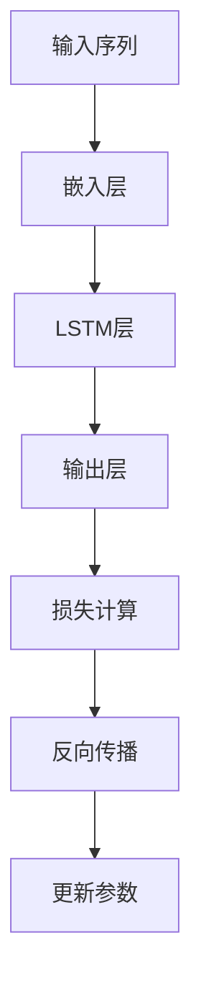
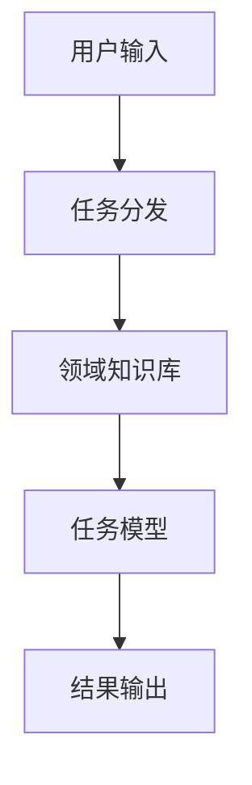
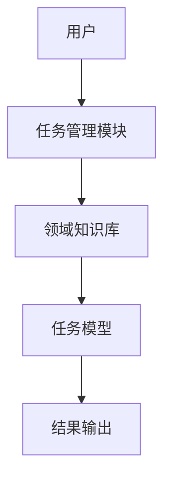

                 


# 《企业AI Agent的元学习应用：快速适应新任务与领域》

## 关键词：企业AI Agent，元学习，快速适应，任务迁移，领域适应，人工智能，算法优化

## 摘要：  
本文系统地探讨了企业AI Agent在元学习中的应用，重点分析了元学习如何帮助AI Agent快速适应新任务和新领域。通过理论分析、算法推导、系统设计和实战案例，详细阐述了元学习在企业AI Agent中的核心原理、实现方法和应用场景。文章结合数学公式、代码实现和图表，深入探讨了元学习算法（如MAML、Meta-LSTM）在企业AI Agent中的具体应用，展示了如何通过元学习实现任务快速迁移和领域知识适应。本文还提供了系统的架构设计、接口设计和交互流程，为读者提供了全面的理论和实践指导。

---

# 第1章: 企业AI Agent与元学习概述

## 1.1 AI Agent的基本概念
### 1.1.1 AI Agent的定义与特点
- **定义**：AI Agent是一种智能实体，能够感知环境、自主决策并执行任务。
- **特点**：
  - 自主性：独立决策，无需外部干预。
  - 反应性：实时感知环境并做出反应。
  - 学习能力：通过数据和经验改进性能。

### 1.1.2 AI Agent在企业中的应用领域
- **任务管理**：优化企业流程，提高效率。
- **数据分析**：处理大量数据，提取有价值的信息。
- **智能客服**：提供个性化服务，解决客户问题。
- **风险控制**：预测和规避潜在风险。

### 1.1.3 企业AI Agent的发展现状
- 当前技术瓶颈：任务适应性不足，领域迁移能力有限。
- 元学习的引入：通过快速迁移学习，提升AI Agent的适应能力。

## 1.2 元学习的基本概念
### 1.2.1 元学习的定义与核心思想
- **定义**：元学习是一种学习方法，通过学习如何学习，实现快速适应新任务。
- **核心思想**：元学习器能够从多个任务中提取通用知识，快速适应新任务。

### 1.2.2 元学习与传统机器学习的区别
| 特性 | 传统机器学习 | 元学习 |
|------|---------------|---------|
| 学习目标 | 具体任务 | 如何学习 |
| 适应性 | 需要重新训练 | 快速迁移 |
| 数据需求 | 数据量大 | 数据量小 |

### 1.2.3 元学习在AI Agent中的作用
- **快速任务适应**：通过元学习，AI Agent可以在新任务中快速调整策略。
- **领域知识迁移**：利用元学习，AI Agent能够快速适应不同领域。

## 1.3 企业AI Agent的元学习应用背景
### 1.3.1 企业任务快速适应的需求
- 企业环境复杂多变，任务需求多样。
- 快速适应任务可以显著提升企业效率。

### 1.3.2 元学习在任务迁移中的优势
- 减少新任务的训练时间。
- 提高模型的泛化能力。

### 1.3.3 当前企业AI Agent面临的挑战
- 领域迁移能力不足。
- 任务适应性有限。

## 1.4 本章小结
- 介绍了AI Agent的基本概念和应用领域。
- 阐述了元学习的核心思想及其在AI Agent中的作用。
- 强调了企业AI Agent在快速适应新任务中的需求和挑战。

---

# 第2章: 元学习与AI Agent的核心概念

## 2.1 元学习的核心原理
### 2.1.1 元学习的层次结构
- **元任务**：多个子任务的集合，用于训练元学习器。
- **元学习器**：通过元任务学习，能够快速适应新任务。

### 2.1.2 元学习的数学模型
$$ L_{meta}(θ) = \sum_{i=1}^{N} L_{i}(θ) $$
其中，$θ$是元学习器的参数，$L_{i}(θ)$是第$i$个任务的损失函数。

### 2.1.3 元学习的训练目标
- 优化元学习器的参数，使得其能够在新任务中快速收敛。

## 2.2 AI Agent的元学习应用框架
### 2.2.1 元学习在任务适应中的应用
- 通过元学习，AI Agent能够在新任务中快速调整策略。

### 2.2.2 元学习在策略优化中的应用
- 元学习器优化AI Agent的决策策略，使其更高效。

### 2.2.3 元学习在知识迁移中的应用
- 利用元学习，将已有知识快速迁移到新领域。

## 2.3 元学习与AI Agent的结合模型
### 2.3.1 元学习模型的输入输出结构
- **输入**：多个任务的特征和标签。
- **输出**：适应新任务的策略或参数。

### 2.3.2 AI Agent的知识表示方法
- **知识图谱**：用于表示领域知识。
- **嵌入表示**：将知识转化为低维向量。

### 2.3.3 元学习在AI Agent中的具体实现
- **模型agnostic方法**：适用于多种模型。
- **model-based方法**：针对特定模型优化。

## 2.4 核心概念对比分析
### 2.4.1 元学习与传统机器学习的对比
| 方面 | 元学习 | 传统机器学习 |
|------|---------|--------------|
| 数据需求 | 数据量小 | 数据量大 |
| 适应性 | 快速适应新任务 | 需要重新训练 |
| 应用场景 | 多任务学习 | 单任务学习 |

### 2.4.2 AI Agent与传统AI的区别
| 方面 | AI Agent | 传统AI |
|------|----------|---------|
| 自主性 | 高 | 低 |
| 反应性 | 强 | 弱 |
| 学习能力 | 强 | 一般 |

### 2.4.3 元学习在AI Agent中的独特优势
- 快速任务适应能力。
- 多领域知识迁移能力。

## 2.5 本章小结
- 阐述了元学习的核心原理和数学模型。
- 分析了AI Agent的元学习应用框架。
- 对比了元学习与传统机器学习的区别。

---

# 第3章: 元学习算法原理与数学模型

## 3.1 元学习算法的分类
### 3.1.1 基于模型的元学习算法
- **MAML（Model-Agnostic Meta-Learning）**：适用于多种模型。
- **Meta-SGD**：优化特定模型的参数。

### 3.1.2 模型不可知的元学习算法
- **Reptile**：通过迭代优化实现快速适应。
- **Meta-LSTM**：适用于序列数据的元学习。

### 3.1.3 元学习算法的优缺点对比
| 算法 | 优点 | 缺点 |
|------|-------|------|
| MAML | 模型agnostic，适用性强 | 计算复杂度高 |
| Meta-SGD | 计算效率高 | 模型依赖性高 |
| Reptile | 简单高效 | 收敛速度慢 |

## 3.2 元学习的核心算法详解
### 3.2.1 Model-Agnostic Meta-Learning (MAML)
- **数学模型**：
$$ L_{meta}(θ) = \sum_{i=1}^{N} L_{i}(θ) $$
- **优化目标**：
$$ θ = \arg\min_{θ} \sum_{i=1}^{N} L_{i}(θ) $$
- **流程图**：


### 3.2.2 Meta-LSTM网络结构
- **网络结构**：

- **数学模型**：
$$ h_t = \text{LSTM}(h_{t-1}, x_t) $$
$$ y_t = W_{output} h_t + b_{output} $$

### 3.2.3 元学习的优化目标函数
- **目标函数**：
$$ \mathcal{L} = \sum_{i=1}^{N} \mathcal{L}_i $$
其中，$\mathcal{L}_i$是第$i$个任务的损失函数。

## 3.3 元学习算法的流程图
### 3.3.1 MAML算法流程图


### 3.3.2 Meta-LSTM算法流程图


## 3.4 本章小结
- 详细讲解了元学习的核心算法，包括MAML和Meta-LSTM。
- 给出了数学模型和流程图，便于读者理解。
- 对比了不同算法的优缺点。

---

# 第4章: 系统分析与架构设计

## 4.1 问题场景介绍
- **任务需求**：企业AI Agent需要快速适应新任务和领域。
- **数据特点**：多领域、多任务、数据量小。

## 4.2 系统功能设计
### 4.2.1 领域模型
- **领域知识表示**：知识图谱、嵌入表示。
- **任务模型**：针对不同任务设计不同的模型。

### 4.2.2 系统架构


### 4.2.3 接口设计
- **输入接口**：接收新任务和领域数据。
- **输出接口**：返回任务适应结果。

## 4.3 系统架构设计
### 4.3.1 系统架构图


### 4.3.2 系统交互流程


## 4.4 本章小结
- 分析了系统的问题场景。
- 设计了系统的功能模块和架构。
- 给出了系统接口和交互流程。

---

# 第5章: 项目实战与案例分析

## 5.1 环境安装
- **Python版本**：3.6以上。
- **依赖库**：TensorFlow、Keras、PyTorch、numpy。

## 5.2 核心代码实现
### 5.2.1 MAML算法实现
```python
def maml_update(meta_model, inner_model, x, y, inner_steps=1):
    # 内部优化
    for _ in range(inner_steps):
        inner_loss = inner_model.loss(x, y)
        inner_model.minimize(inner_loss)
    # 元优化
    meta_loss = meta_model.loss(inner_model.get_weights())
    meta_model.minimize(meta_loss)
```

### 5.2.2 Meta-LSTM网络实现
```python
class MetaLSTM:
    def __init__(self, input_dim, hidden_dim):
        self.input_dim = input_dim
        self.hidden_dim = hidden_dim
        self.lstm = LSTM(hidden_dim)
        self.dense = Dense(1)
    
    def call(self, x):
        h = self.lstm(x)
        return self.dense(h)
```

## 5.3 案例分析
### 5.3.1 案例背景
- **任务需求**：智能客服领域适应。

### 5.3.2 实施过程
- **数据准备**：收集不同领域的客服数据。
- **模型训练**：利用MAML算法训练元学习器。
- **任务适应**：快速适应新领域。

## 5.4 项目小结
- 详细讲解了项目实战的环境安装和代码实现。
- 通过案例分析展示了元学习在企业AI Agent中的具体应用。
- 总结了项目实施的关键点和注意事项。

---

# 第6章: 最佳实践与总结

## 6.1 最佳实践
### 6.1.1 元学习算法的选择
- 根据任务需求选择合适的元学习算法。
- MAML适用于多种任务，Meta-LSTM适用于序列数据。

### 6.1.2 系统设计优化
- 设计高效的领域知识库。
- 优化系统的交互流程。

## 6.2 小结
- 元学习在企业AI Agent中的应用前景广阔。
- 通过元学习可以显著提升AI Agent的任务适应能力。
- 未来研究方向包括更高效的元学习算法和更智能的系统设计。

## 6.3 注意事项
- 数据质量对元学习效果影响重大。
- 算法选择需结合具体任务需求。
- 系统设计需注重可扩展性和可维护性。

## 6.4 拓展阅读
- 推荐阅读《元学习：从理论到实践》。
- 推荐学习相关课程：《深度学习中的元学习》。

---

# 作者：AI天才研究院/AI Genius Institute & 禅与计算机程序设计艺术 /Zen And The Art of Computer Programming

