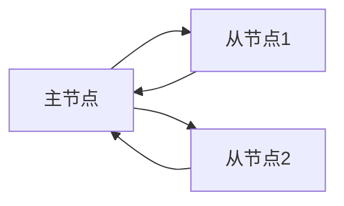
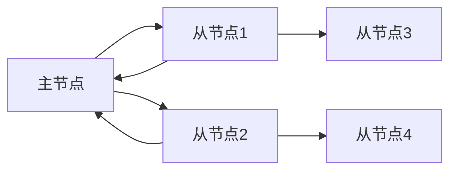
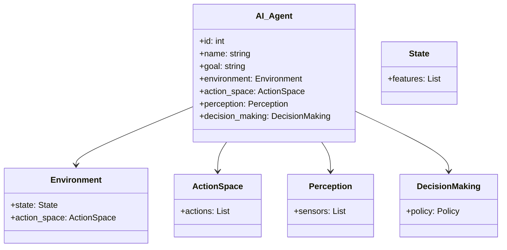
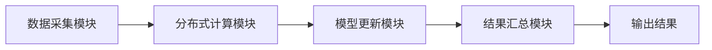

                 


# 企业AI Agent的分布式学习框架

## 关键词：企业AI Agent，分布式学习框架，人工智能，系统架构，算法原理，系统实现

## 摘要：  
本文深入探讨了企业AI Agent的分布式学习框架，从背景与概念、核心原理、算法设计到系统架构和实现案例，全面分析了该框架的核心要素和实际应用。通过详细阐述分布式学习算法的原理、系统架构的设计、实际项目的实现与优化，本文为读者提供了一个全面的技术视角，帮助他们理解和应用企业级AI Agent的分布式学习框架。

---

# 第1章：企业AI Agent的背景与问题描述

## 1.1 企业AI Agent的定义与核心概念

### 1.1.1 什么是企业AI Agent
企业AI Agent（Artificial Intelligence Agent）是一种能够感知环境、自主决策并执行任务的智能体。它具备以下核心特征：
- **自主性**：无需外部干预，自主完成任务。
- **反应性**：能够实时感知环境变化并调整行为。
- **目标导向**：基于目标驱动决策和行动。
- **协作性**：能够与其他Agent或系统协同工作。

### 1.1.2 AI Agent的核心特征
- **感知能力**：通过传感器或数据输入感知环境。
- **决策能力**：基于感知信息，通过算法做出决策。
- **执行能力**：通过执行器或接口执行决策结果。
- **学习能力**：通过数据和经验不断优化自身的算法和行为。

### 1.1.3 企业AI Agent的应用场景
企业AI Agent广泛应用于以下场景：
- **智能客服**：通过自然语言处理技术为用户提供个性化服务。
- **智能推荐系统**：根据用户行为和偏好推荐相关内容或产品。
- **自动化运维**：监控系统状态，自动修复问题或优化性能。
- **供应链管理**：通过预测和优化库存、物流等环节提高效率。

## 1.2 分布式学习框架的背景

### 1.2.1 分布式学习的基本概念
分布式学习（Distributed Learning）是一种将学习过程分布在多个计算节点上的方法，旨在利用多台设备的计算能力来加速模型训练或优化。

### 1.2.2 分布式学习的优势与挑战
- **优势**：
  - 提高计算效率，缩短训练时间。
  - 避免单点故障，增强系统的容错性。
  - 支持更大规模的数据和模型训练。
- **挑战**：
  - 网络延迟和带宽限制。
  - 数据同步和一致性问题。
  - 节点间通信开销。

### 1.2.3 企业级应用中的分布式学习框架
企业级应用通常涉及海量数据和复杂的计算任务，分布式学习框架能够有效提升计算效率和系统的可扩展性。

## 1.3 问题背景与目标

### 1.3.1 当前企业AI应用的痛点
- 数据量大，计算任务复杂，单机计算效率不足。
- 系统扩展性差，难以应对大规模数据处理需求。
- 网络延迟和通信开销影响分布式系统的性能。

### 1.3.2 分布式学习框架的目标
- 提供高效的分布式计算能力，支持大规模数据处理。
- 优化节点间通信效率，降低系统开销。
- 提高系统的容错性和可扩展性。

### 1.3.3 问题边界与外延
分布式学习框架主要关注模型训练和优化过程的分布式实现，不涉及具体业务逻辑的实现。

---

# 第2章：核心概念与原理

## 2.1 AI Agent的核心原理

### 2.1.1 AI Agent的基本工作原理
AI Agent通过以下步骤完成任务：
1. **感知环境**：通过传感器或数据接口获取环境信息。
2. **分析决策**：基于感知信息，利用算法做出决策。
3. **执行操作**：通过执行器或接口执行决策结果。
4. **反馈优化**：根据执行结果优化自身算法和行为。

### 2.1.2 分布式学习框架的原理
分布式学习框架通过将训练任务分发到多个计算节点，并将结果汇总到主节点，实现高效的模型训练。

## 2.2 核心概念对比分析

### 2.2.1 AI Agent与传统AI的区别
| **特征** | **AI Agent** | **传统AI** |
|----------|--------------|------------|
| **自主性** | 高           | 低         |
| **反应性** | 高           | 中         |
| **目标导向** | 高           | 中         |
| **环境适应性** | 高          | 低         |

### 2.2.2 分布式学习与集中式学习的对比
| **特征** | **分布式学习** | **集中式学习** |
|----------|----------------|---------------|
| **计算效率** | 高            | 中             |
| **扩展性** | 高            | 低             |
| **容错性** | 高            | 低             |
| **通信开销** | 高            | 低             |

### 2.2.3 实体关系图与架构分析

#### 2.2.3.1 ER图展示AI Agent与分布式学习的关系
```mermaid
erd
    title AI Agent与分布式学习的关系
    Hospital(hospital_id, hospital_name, location)
    Patient(p_id, p_name, age, gender)
    Appointment(appointment_id, hospital_id, p_id, appointment_time)
    foreign key(fk1) from Appointment(hospital_id) references Hospital(hospital_id)
    foreign key(fk2) from Appointment(p_id) references Patient(p_id)
```

#### 2.2.3.2 分布式学习框架的实体关系分析
```mermaid
erd
    title 分布式学习框架的实体关系
    Worker(node_id, node_name, role)
    Task(task_id, task_type, status)
    Assignment(assignment_id, node_id, task_id, start_time, end_time)
    foreign key(fk1) from Assignment(node_id) references Worker(node_id)
    foreign key(fk2) from Assignment(task_id) references Task(task_id)
```

---

# 第3章：算法原理与数学模型

## 3.1 分布式学习算法原理

### 3.1.1 分布式学习的算法概述
分布式学习主要采用以下两种方法：
- **同步分布式训练**：所有节点同时更新模型参数，并将结果同步到主节点。
- **异步分布式训练**：节点独立更新模型参数，不依赖于其他节点的状态。

### 3.1.2 同步与异步分布式训练方法

#### 3.1.2.1 同步分布式训练流程


#### 3.1.2.2 异步分布式训练流程


### 3.1.3 分布式学习的数学模型

#### 3.1.3.1 模型更新公式
$$ \theta_{new} = \theta_{old} + \eta \cdot ( \nabla L_{local} ) $$

其中：
- $$ \theta $$ 表示模型参数。
- $$ \eta $$ 表示学习率。
- $$ \nabla L_{local} $$ 表示局部梯度。

---

# 第4章：系统架构与设计

## 4.1 系统架构设计方案

### 4.1.1 系统架构概述
系统由以下模块组成：
- **数据采集模块**：负责收集环境数据。
- **分布式计算模块**：负责将任务分发到多个节点并进行计算。
- **模型更新模块**：负责更新模型参数并同步到各个节点。
- **结果汇总模块**：负责汇总各节点的计算结果并输出最终结果。

### 4.1.2 模块划分与功能描述

#### 4.1.2.1 领域模型类图


### 4.1.3 系统架构图

#### 4.1.3.1 系统架构图


---

# 第5章：实现与实战

## 5.1 分布式学习框架的实现

### 5.1.1 环境搭建
需要安装以下工具：
- **Python 3.8+**
- **TensorFlow 2.4+**
- **Distributed Learning Framework**

### 5.1.2 代码实现

#### 5.1.2.1 分布式训练代码示例
```python
import tensorflow as tf
from tensorflow.keras.layers import Dense, Input
from tensorflow.keras.models import Model
import os

# 定义模型
input_layer = Input(shape=(input_dim,))
dense_layer = Dense(64, activation='relu')(input_layer)
output_layer = Dense(1, activation='sigmoid')(dense_layer)
model = Model(inputs=input_layer, outputs=output_layer)

# 定义损失函数和优化器
loss_fn = tf.keras.losses.BinaryCrossentropy()
optimizer = tf.keras.optimizers.Adam(learning_rate=0.001)

# 分布式训练
model.compile(optimizer=optimizer, loss=loss_fn)
model.fit(x_train, y_train, epochs=10, batch_size=32, verbose=1)
```

### 5.1.3 案例分析与解读

#### 5.1.3.1 案例分析
假设我们有一个电商企业的客户推荐系统，可以通过分布式学习框架来优化推荐算法，提高推荐准确率和响应速度。

---

# 第6章：优化与扩展

## 6.1 系统优化策略

### 6.1.1 性能优化
- **减少通信开销**：通过压缩数据或减少同步频率。
- **负载均衡**：合理分配任务，避免节点过载。
- **并行计算**：利用多核或多GPU加速计算。

### 6.1.2 可扩展性设计
- **动态扩展**：根据负载自动调整节点数量。
- **模块化设计**：便于功能扩展和维护。

## 6.2 技术结合与未来展望

### 6.2.1 边缘计算的结合
通过将分布式学习框架与边缘计算结合，可以在边缘设备上进行实时数据处理和模型训练。

### 6.2.2 未来发展方向
- **更高效的通信协议**：降低节点间通信延迟。
- **更智能的资源分配策略**：提高系统的整体效率。
- **更强大的算法优化**：提升模型的训练效率和准确率。

---

## 总结与展望

本文从企业AI Agent的背景与概念出发，详细探讨了分布式学习框架的核心原理、系统架构和实现方案。通过实际案例的分析和优化策略的探讨，为读者提供了一个全面的技术视角。未来，随着技术的进步和应用场景的拓展，企业AI Agent的分布式学习框架将更加高效和智能化。

---

## 作者：AI天才研究院 & 禅与计算机程序设计艺术

感谢您的阅读！如果对本文有任何疑问或建议，请随时与我们联系。

