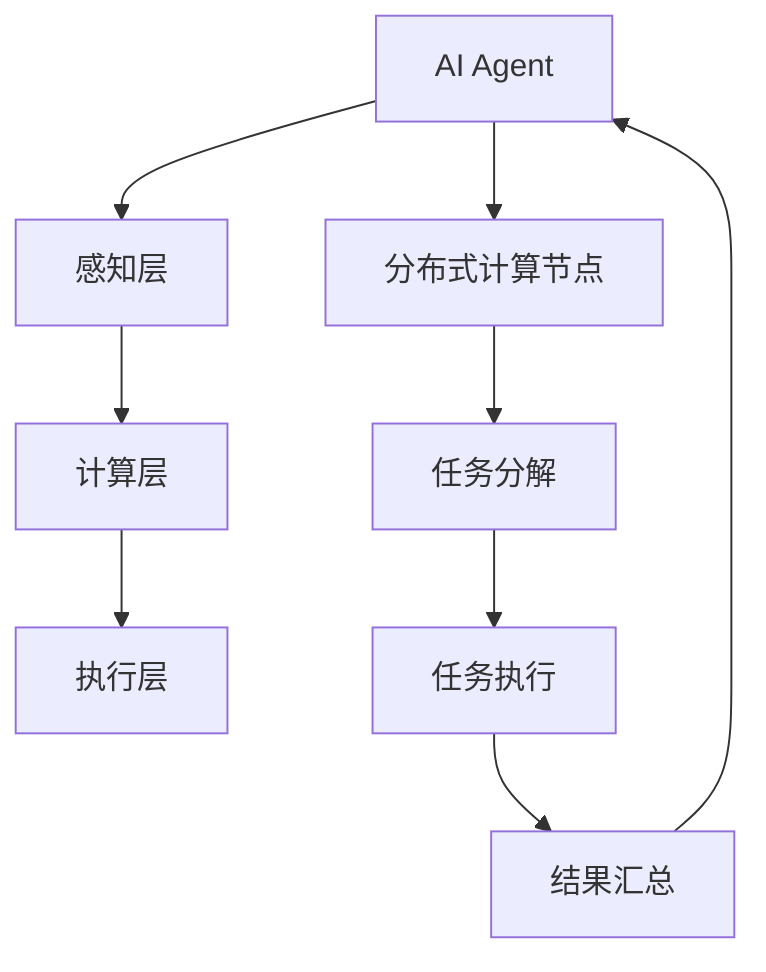
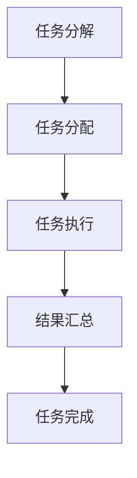
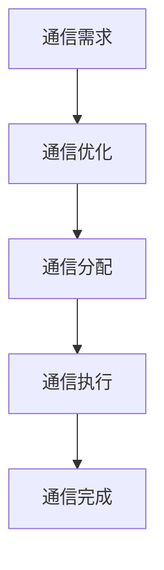
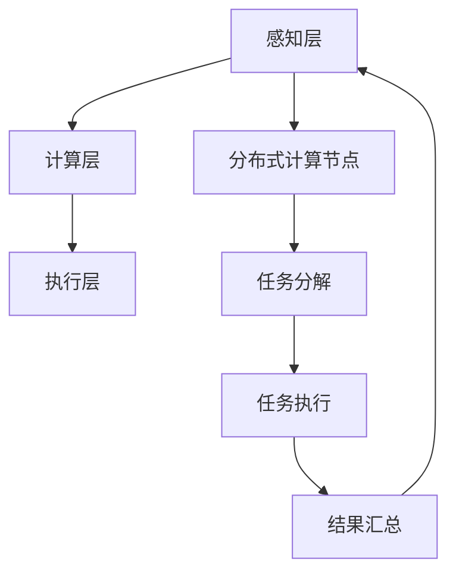

                 


# 企业AI Agent的分布式计算架构

> 关键词：企业AI Agent，分布式计算架构，分布式系统设计，AI算法优化，分布式任务分配，系统架构设计

> 摘要：随着人工智能技术的快速发展，企业AI Agent的应用场景越来越广泛。然而，AI Agent的分布式计算架构设计面临着性能、扩展性和容错性等方面的挑战。本文系统地介绍了企业AI Agent的分布式计算架构的核心概念、算法原理、系统架构设计、项目实战和最佳实践。通过分析分布式计算的关键技术，结合实际案例，深入探讨了如何设计高效的分布式计算架构，为企业的AI Agent开发提供了理论和实践的双重指导。

---

## 第一部分: 企业AI Agent的分布式计算架构概述

### 第1章: AI Agent与分布式计算基础

#### 1.1 AI Agent的基本概念

##### 1.1.1 AI Agent的定义与核心特征

AI Agent（人工智能代理）是一种能够感知环境并采取行动以实现目标的智能实体。它具备以下核心特征：

- **自主性**：能够在没有外部干预的情况下自主决策。
- **反应性**：能够实时感知环境并做出反应。
- **目标导向**：所有行为都以实现特定目标为导向。
- **社交能力**：能够与其他Agent或人类进行交互和协作。

##### 1.1.2 分布式计算的基本概念

分布式计算是指将计算任务分布在多台计算机或计算节点上，通过通信和协调完成共同目标的计算模式。其核心特征包括：

- **资源共享**：通过分布式计算，可以充分利用网络中的计算资源。
- **任务分解**：将复杂任务分解为多个子任务，分别在不同的节点上执行。
- **并行处理**：通过并行计算提高任务执行效率。

##### 1.1.3 企业AI Agent的背景与需求

随着企业智能化转型的推进，AI Agent在企业中的应用越来越广泛。企业AI Agent需要处理复杂的业务场景，例如智能客服、供应链优化、智能推荐等。然而，单机计算模式难以满足企业对高性能、高可用性和扩展性的要求，因此分布式计算架构成为企业AI Agent的核心技术支撑。

---

#### 1.2 企业AI Agent的核心概念与架构

##### 1.2.1 分布式计算架构的类型

分布式计算架构主要分为以下几种类型：

1. **集中式架构**：所有计算任务集中在一台中心服务器上，其他节点仅负责数据输入和输出。
2. **分布式架构**：计算任务分布在多个节点上，每个节点负责部分任务。
3. **对等式架构**：所有节点地位相同，任务动态分配，节点之间直接通信。

##### 1.2.2 AI Agent的分布式计算模型

AI Agent的分布式计算模型包括以下三个核心部分：

- **感知层**：负责感知环境信息，例如传感器数据、用户输入等。
- **计算层**：负责对感知到的信息进行处理和计算，例如机器学习模型的训练和推理。
- **执行层**：根据计算结果执行具体操作，例如发送指令、输出结果等。

##### 1.2.3 企业AI Agent的系统架构图

以下是企业AI Agent的系统架构图（Mermaid）：



---

#### 1.3 分布式计算的关键技术

##### 1.3.1 分布式系统的基本原理

分布式系统的基本原理包括：

- **通信机制**：通过网络通信协议实现节点之间的数据传输。
- **一致性管理**：确保分布式系统中数据的一致性。
- **容错机制**：通过冗余和备份确保系统可靠性。

##### 1.3.2 分布式计算中的通信机制

分布式计算中的通信机制包括：

1. **点对点通信**：直接在两个节点之间建立通信连接。
2. **发布-订阅模式**：通过消息中间件实现异步通信。
3. **rpc（远程过程调用）**：通过rpc框架实现函数调用的透明化。

##### 1.3.3 企业AI Agent的实现原理

企业AI Agent的实现原理包括：

- **任务分解**：将复杂任务分解为多个子任务。
- **任务分配**：根据节点的负载情况动态分配任务。
- **任务执行**：节点并行执行分配的任务。
- **结果汇总**：将各节点的执行结果汇总到中心节点。

---

## 第二部分: 企业AI Agent的分布式计算背景

### 第2章: 企业AI Agent的分布式计算背景

#### 2.1 企业级AI应用的挑战

##### 2.1.1 传统AI架构的局限性

传统AI架构主要依赖单机计算，存在以下局限性：

- **计算能力有限**：单机计算难以处理大规模数据和复杂任务。
- **扩展性差**：单机架构难以满足企业对扩展性的要求。
- **容错性差**：单机故障可能导致整个系统瘫痪。

##### 2.1.2 分布式计算在企业AI中的优势

分布式计算在企业AI中的优势包括：

- **高性能**：通过并行计算提高任务执行效率。
- **高扩展性**：可以根据需求动态扩展计算资源。
- **高容错性**：通过冗余和备份提高系统的可靠性。

##### 2.1.3 企业AI Agent的典型应用场景

企业AI Agent的典型应用场景包括：

- **智能客服**：通过AI Agent实现智能对话和问题解决。
- **供应链优化**：通过AI Agent优化供应链的生产和物流。
- **智能推荐**：通过AI Agent为用户提供个性化推荐。

---

#### 2.2 分布式计算在AI中的技术背景

##### 2.2.1 分布式计算的数学模型

分布式计算的数学模型可以通过图论和线性代数来描述。例如，分布式计算中的任务分配可以表示为一个图的边权重分配问题。

##### 2.2.2 分布式计算的算法基础

分布式计算的算法基础包括：

- **分布式排序算法**：如分布式归并排序。
- **分布式搜索算法**：如分布式广度优先搜索。
- **分布式聚类算法**：如分布式k-means算法。

##### 2.2.3 企业AI Agent的分布式计算框架

企业AI Agent的分布式计算框架包括：

- **MapReduce**：适用于大规模数据处理。
- **Spark**：适用于快速迭代的分布式计算。
- **Distributed TensorFlow**：适用于分布式机器学习模型训练。

---

## 第三部分: 分布式计算的核心算法原理

### 第3章: 分布式计算的核心算法原理

#### 3.1 分布式计算中的任务分配算法

##### 3.1.1 分布式任务分配的基本原理

分布式任务分配的基本原理包括：

- **任务分解**：将整体任务分解为多个子任务。
- **任务分配**：根据节点的负载情况动态分配子任务。
- **任务执行**：节点并行执行分配的子任务。
- **结果汇总**：将各节点的执行结果汇总到中心节点。

##### 3.1.2 分布式任务分配的数学模型

分布式任务分配的数学模型可以通过以下公式表示：

$$
\text{任务分配} = \arg \min_{x} \sum_{i=1}^{n} (x_i - t_i)^2
$$

其中，$x_i$ 表示第$i$个节点的负载，$t_i$ 表示第$i$个节点的任务量。

##### 3.1.3 分布式任务分配的实现流程

以下是分布式任务分配的实现流程（Mermaid）：



---

#### 3.2 分布式计算中的通信优化算法

##### 3.2.1 分布式通信的基本机制

分布式通信的基本机制包括：

- **点对点通信**：直接在两个节点之间建立通信连接。
- **发布-订阅模式**：通过消息中间件实现异步通信。
- **rpc（远程过程调用）**：通过rpc框架实现函数调用的透明化。

##### 3.2.2 分布式通信优化的数学模型

分布式通信优化的数学模型可以通过以下公式表示：

$$
\text{通信优化} = \arg \min_{x} \sum_{i=1}^{n} (x_i - c_i)^2
$$

其中，$x_i$ 表示第$i$个节点的通信带宽，$c_i$ 表示第$i$个节点的实际通信需求。

##### 3.2.3 分布式通信优化的实现流程

以下是分布式通信优化的实现流程（Mermaid）：



---

## 第四部分: 企业AI Agent的系统架构设计

### 第4章: 企业AI Agent的系统架构设计

#### 4.1 系统架构设计的基本原则

##### 4.1.1 系统架构设计的核心要素

系统架构设计的核心要素包括：

- **模块化设计**：将系统划分为多个功能模块，每个模块负责特定的功能。
- **高内聚低耦合**：每个模块内部高度内聚，模块之间耦合度低。
- **可扩展性**：系统架构应具备良好的可扩展性。

##### 4.1.2 系统架构设计的实现流程

系统架构设计的实现流程包括：

1. **需求分析**：明确系统的需求和目标。
2. **功能模块划分**：将系统划分为多个功能模块。
3. **模块交互设计**：设计模块之间的交互方式。
4. **架构优化**：根据需求优化系统架构。

##### 4.1.3 企业AI Agent的系统架构图

以下是企业AI Agent的系统架构图（Mermaid）：



---

#### 4.2 系统功能设计

##### 4.2.1 系统功能设计的核心要素

系统功能设计的核心要素包括：

- **功能模块划分**：将系统划分为多个功能模块，每个模块负责特定的功能。
- **功能交互设计**：设计模块之间的交互方式。
- **功能实现细节**：详细设计每个功能模块的实现细节。

##### 4.2.2 系统功能设计的实现流程

系统功能设计的实现流程包括：

1. **需求分析**：明确系统的需求和目标。
2. **功能模块划分**：将系统划分为多个功能模块。
3. **模块交互设计**：设计模块之间的交互方式。
4. **功能实现**：详细设计每个功能模块的实现细节。

---

## 第五部分: 企业AI Agent的项目实战

### 第5章: 企业AI Agent的项目实战

#### 5.1 项目环境搭建

##### 5.1.1 系统环境要求

系统环境要求包括：

- **操作系统**：支持分布式计算的Linux系统。
- **硬件配置**：具备多核处理器和足够内存。
- **软件环境**：安装分布式计算框架和相关工具。

##### 5.1.2 项目依赖安装

项目依赖安装包括：

- **安装分布式计算框架**：例如Hadoop、Spark、Distributed TensorFlow等。
- **安装相关工具**：例如JDK、Python、虚拟环境等。

##### 5.1.3 环境搭建步骤

环境搭建步骤包括：

1. **安装操作系统**：选择适合的Linux发行版。
2. **安装硬件驱动**：安装与硬件兼容的驱动程序。
3. **安装软件环境**：安装分布式计算框架和相关工具。
4. **配置环境变量**：设置必要的环境变量。

---

#### 5.2 系统核心实现

##### 5.2.1 核心代码实现

核心代码实现包括：

- **任务分解模块**：将整体任务分解为多个子任务。
- **任务分配模块**：根据节点的负载情况动态分配子任务。
- **任务执行模块**：节点并行执行分配的子任务。
- **结果汇总模块**：将各节点的执行结果汇总到中心节点。

##### 5.2.2 代码实现细节

代码实现细节包括：

- **任务分解**：使用分布式计算框架提供的API进行任务分解。
- **任务分配**：根据节点的负载情况动态分配任务。
- **任务执行**：节点并行执行分配的任务。
- **结果汇总**：将各节点的执行结果汇总到中心节点。

##### 5.2.3 代码实现示例

以下是任务分配模块的代码实现示例：

```python
import math

def distribute_task(tasks, workers):
    worker_tasks = []
    for i in range(len(tasks)):
        worker = i % workers
        worker_tasks.append((tasks[i], worker))
    return worker_tasks
```

---

#### 5.3 项目小结

##### 5.3.1 项目实现的关键点

项目实现的关键点包括：

- **任务分解**：将整体任务分解为多个子任务。
- **任务分配**：根据节点的负载情况动态分配任务。
- **任务执行**：节点并行执行分配的任务。
- **结果汇总**：将各节点的执行结果汇总到中心节点。

##### 5.3.2 项目实现的难点

项目实现的难点包括：

- **任务分配的公平性**：如何确保任务分配的公平性。
- **节点负载的动态变化**：如何应对节点负载的动态变化。
- **通信的高效性**：如何提高节点之间的通信效率。

---

## 第六部分: 企业AI Agent的

---

作者：AI天才研究院/AI Genius Institute & 禅与计算机程序设计艺术 /Zen And The Art of Computer Programming

---

*本文内容仅供参考，实际操作需根据具体情况进行调整*

