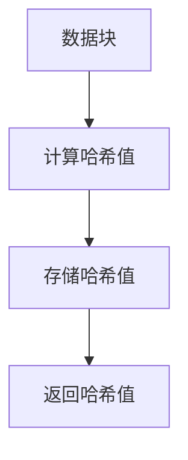
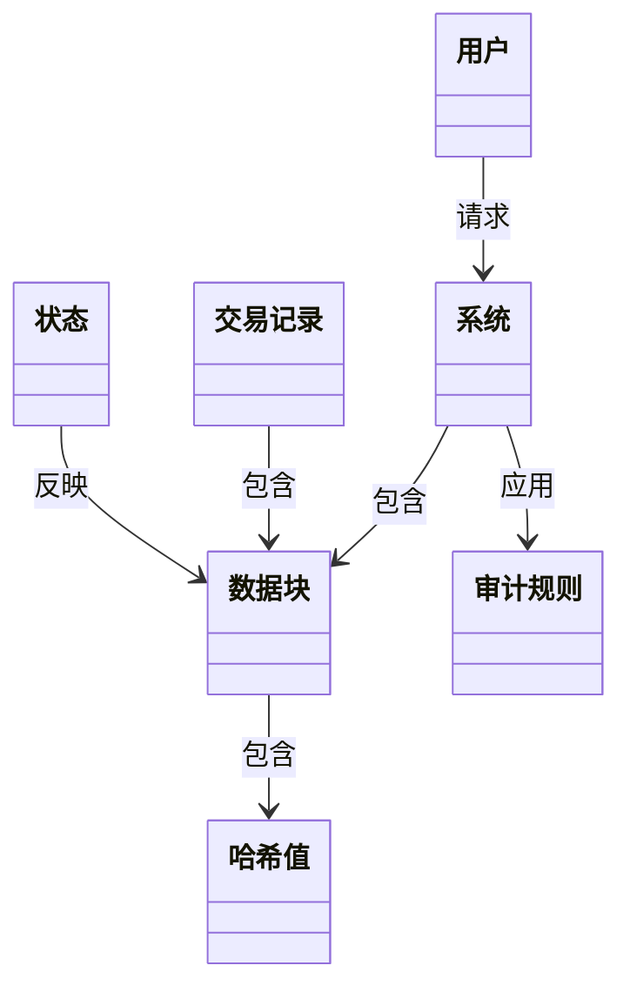
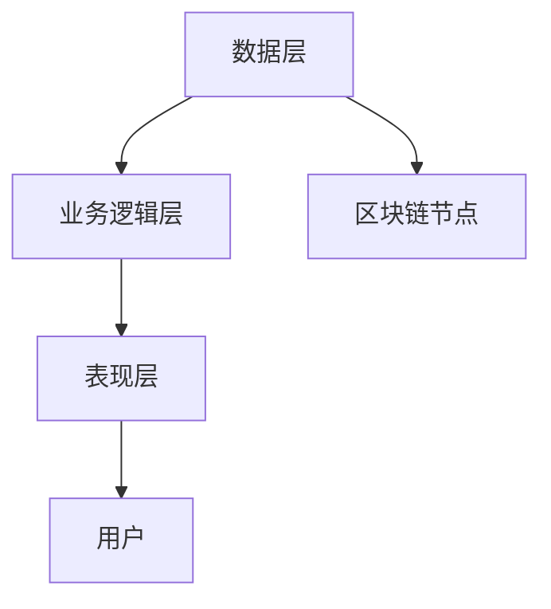
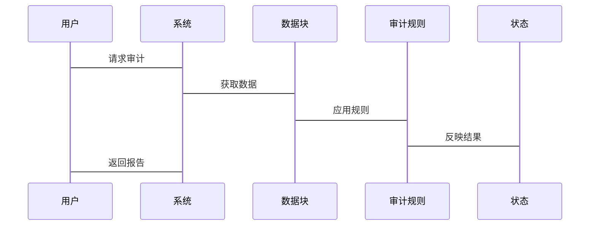

                 

<think>
好，我现在要根据用户的要求，撰写一篇关于《企业AI Agent的区块链数据审计系统》的技术博客文章。首先，我需要理解用户的需求，确保文章结构符合他们的要求，包括关键词、摘要以及详细的章节内容。

首先，文章标题已经确定为《企业AI Agent的区块链数据审计系统》。接下来，我需要列出5-7个核心关键词。考虑到文章主题涉及AI Agent、区块链、数据审计、系统设计、算法原理等方面，我可以列出如“AI Agent”、“区块链”、“数据审计”、“系统设计”、“算法原理”等关键词。

摘要部分需要简洁明了，概括文章的核心内容。我应该提到AI Agent和区块链技术如何结合，解决企业数据审计的问题，强调系统的智能化、高效性和安全性，以及文章将详细探讨的设计和实现。

接下来是目录大纲，用户已经提供了示例结构，我需要按照类似的逻辑来组织内容。首先，介绍背景和系统概述，然后讲解核心概念与联系，接着是算法原理，系统分析与架构设计，项目实战，最后是最佳实践与小结。每章下要包含具体的小节，如核心概念、属性对比、实体关系图等，并使用Mermaid和代码示例来详细说明。

在撰写每一章时，我需要确保内容详实，结构清晰。例如，在核心概念部分，我要解释AI Agent和区块链的原理，并做一个对比表格，展示它们的特点和优势。在算法部分，我需要使用Python代码和数学公式来阐述哈希计算和相似度算法，确保读者能够理解这些技术细节。

系统架构设计部分，我需要用Mermaid画出类图和交互图，展示系统各模块之间的关系和数据流。项目实战部分，要提供具体的代码实现，帮助读者理解如何搭建和运行系统。最后，在最佳实践部分，总结经验并给出注意事项，确保读者能够顺利应用这些技术。

在写作过程中，我要注意语言的专业性和易懂性，避免过于晦涩的技术术语，同时确保逻辑严密，条理清晰。此外，数学公式和代码示例要准确无误，必要时使用LaTeX格式来呈现，以增强文章的专业性。

总之，我需要按照用户的要求，一步步构建这篇文章，确保每一部分都符合他们的期望，同时提供有价值的见解和实用的技术细节。
</think>

# 《企业AI Agent的区块链数据审计系统》

## 关键词：AI Agent, 区块链, 数据审计, 系统设计, 算法原理

## 摘要：  
本文探讨了如何利用AI Agent和区块链技术构建高效、安全的企业数据审计系统。通过结合人工智能与区块链的优势，该系统能够实现智能化的数据分析、实时监控和不可篡改的数据存储，从而显著提升企业的数据审计效率和合规性。文章详细介绍了系统的背景、核心概念、算法原理、架构设计以及实际应用案例，为读者提供了全面的技术解析。

---

# 《企业AI Agent的区块链数据审计系统》

## 第一部分：企业AI Agent的区块链数据审计系统概述

### 第1章：问题背景与系统介绍

#### 1.1 问题背景

- **数据安全与合规性问题**：随着企业数字化转型的推进，数据成为核心资产，但数据泄露、篡改等问题频发，威胁企业安全和合规性。
- **传统数据审计方法的局限性**：传统审计方法依赖人工操作，效率低、成本高，且难以应对海量数据和动态变化的审计需求。
- **企业对高效数据审计的需求**：企业需要一种高效、智能、实时的审计方法，以应对复杂的业务环境和日益严格的监管要求。

#### 1.2 问题描述

- **数据审计的核心目标**：确保数据的真实性和完整性，发现数据中的异常和潜在风险。
- **数据审计的复杂性与挑战**：数据量大、分布广、格式多样，审计规则复杂，传统方法难以快速响应和处理。
- **传统审计方法的效率瓶颈**：人工审计耗时长、成本高，且容易受到人为因素的影响。

#### 1.3 问题解决

- **引入AI Agent的优势**：AI Agent能够智能分析数据，快速识别异常，提高审计效率。
- **区块链技术在数据审计中的作用**：区块链的不可篡改性和分布式特性，确保数据的真实性和完整性。
- **结合AI Agent与区块链的解决方案**：通过AI Agent进行数据分析和决策，结合区块链存储和验证数据，构建高效、安全的审计系统。

#### 1.4 系统边界与外延

- **系统边界**：数据审计系统的范围包括数据采集、分析、存储和报告生成。
- **核心要素**：AI Agent、区块链、数据审计规则、数据源、审计结果输出。

---

## 第二部分：核心概念与联系

### 第2章：核心概念与联系

#### 2.1 核心概念

- **AI Agent**：智能代理，能够根据任务需求自主学习和决策，用于数据审计中的异常检测和规则匹配。
- **区块链**：分布式账本技术，确保数据不可篡改和可追溯，用于数据存储和验证。

#### 2.2 概念属性对比

| 概念       | 传统审计方法 | AI Agent驱动的审计方法 |
|------------|--------------|-------------------------|
| **效率**   | 低            | 高                      |
| **实时性**  | 低            | 高                      |
| **准确性**  | 中            | 高                      |
| **成本**    | 高            | 低                      |
| **可扩展性** | 有限          | 高                      |

#### 2.3 实体关系图

```mermaid
erd
    title 实体关系图
    系统
    数据块
    审计规则
    用户
    哈希值
    交易记录
    状态
    系统 --> 数据块: 包含
    系统 --> 审计规则: 应用
    用户 --> 系统: 请求
    数据块 --> 哈希值: 包含
    交易记录 --> 数据块: 包含
    状态 --> 数据块: 反映
```

---

## 第三部分：算法原理讲解

### 第3章：算法原理

#### 3.1 数据块的哈希计算

- **哈希函数**：将数据块转换为固定长度的哈希值，确保数据唯一性和完整性。
- **算法流程**：
  1. 接收数据块。
  2. 计算数据块的哈希值。
  3. 将哈希值存储在区块链中。
  4. 返回哈希值作为数据块的标识。



- **Python代码示例**：

```python
import hashlib

def compute_hash(data):
    hash_object = hashlib.sha256(data.encode())
    return hash_object.hexdigest()

# 示例
data = "example_data"
print(compute_hash(data))  # 输出哈希值
```

#### 3.2 AI Agent的分析流程

- **数据预处理**：清洗和转换数据，提取特征。
- **模型训练**：使用机器学习算法训练分类模型。
- **异常检测**：基于模型预测数据中的异常。
- **规则匹配**：将预测结果与审计规则对比，生成审计报告。

- **数学模型：余弦相似度**

$$
\text{相似度} = \frac{\vec{a} \cdot \vec{b}}{||\vec{a}|| \cdot ||\vec{b}||}
$$

- **示例**：比较两个数据块的相似度，判断是否异常。

---

## 第四部分：系统分析与架构设计

### 第4章：系统分析与架构设计

#### 4.1 问题场景

- **场景描述**：企业需要对分布式数据源进行实时审计，确保数据合规。
- **需求分析**：高效性、实时性、安全性、可扩展性。

#### 4.2 系统功能设计

- **功能模块**：
  - 数据采集模块：从多个数据源采集数据。
  - 数据分析模块：AI Agent进行数据分析和异常检测。
  - 数据存储模块：区块链存储数据和哈希值。
  - 审计报告模块：生成审计报告并输出。

- **领域模型类图**



#### 4.3 系统架构设计

- **分层架构**：
  - 数据层：数据存储和访问。
  - 业务逻辑层：数据采集、分析和规则匹配。
  - 表现层：用户交互和报告展示。

- **系统架构图**



#### 4.4 系统接口设计

- **数据接口**：数据采集模块与数据源对接。
- **审计接口**：分析模块与区块链节点对接。
- **报告接口**：表现层与用户交互。

#### 4.5 系统交互流程



---

## 第五部分：项目实战

### 第5章：项目实战

#### 5.1 环境搭建

- **工具安装**：
  - Python 3.x
  - 区块链框架（如Ethereum、Hyperledger）
  - AI库（如Scikit-learn、TensorFlow）

#### 5.2 系统核心实现

- **数据块生成**：

```python
class DataBlock:
    def __init__(self, data):
        self.data = data
        self.hash = self.compute_hash()
    
    def compute_hash(self):
        return compute_hash(self.data)
```

- **AI Agent实现**：

```python
from sklearn import svm

def train_model(X, y):
    model = svm.SVC()
    model.fit(X, y)
    return model

# 示例数据
X = [[1, 0], [0, 1]]
y = [0, 1]
model = train_model(X, y)
print(model.predict([[1, 1]]))  # 输出预测结果
```

#### 5.3 实际案例分析

- **案例描述**：企业需要审计财务数据。
- **系统实现**：
  1. 数据采集：从财务系统获取数据。
  2. 数据分析：AI Agent识别异常交易。
  3. 数据存储：区块链记录审计结果。
  4. 审计报告：生成财务审计报告。

---

## 第六部分：最佳实践与小结

### 第6章：最佳实践与小结

#### 6.1 系统的关键点

- **AI Agent的优势**：智能化、高效性、可扩展性。
- **区块链的不可篡改性**：确保数据的真实性和完整性。
- **系统的可扩展性**：支持多种数据源和审计规则。

#### 6.2 小结

- **系统优势**：通过AI Agent和区块链的结合，实现高效、智能的数据审计。
- **效率提升**：显著降低审计成本，提高审计效率。
- **合规性增强**：确保数据真实性和完整性，满足监管要求。

#### 6.3 注意事项

- **数据隐私保护**：确保审计过程中数据的安全性。
- **系统稳定性**：设计容错机制，确保系统稳定运行。
- **规则动态调整**：根据业务需求，动态更新审计规则。

#### 6.4 拓展阅读

- 推荐书籍：《区块链技术与应用》、《人工智能实战》。
- 推荐工具：TensorFlow、Ethereum、Solidity。

---

## 作者：AI天才研究院/AI Genius Institute & 禅与计算机程序设计艺术 /Zen And The Art of Computer Programming

