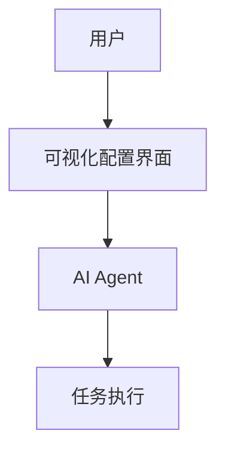
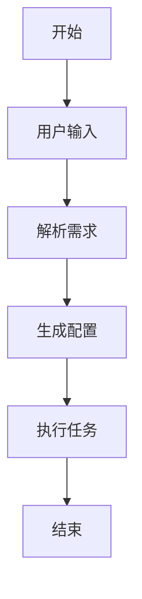
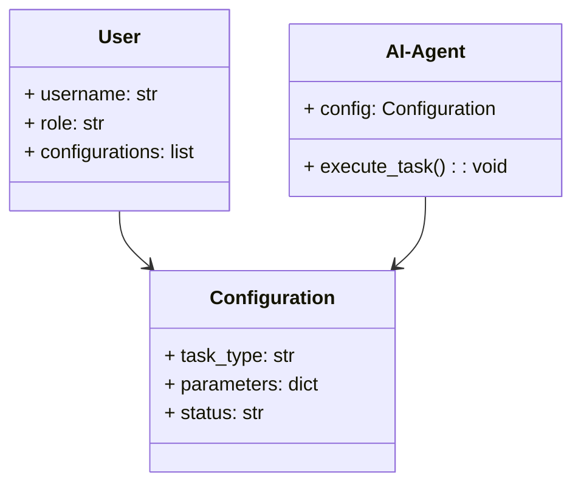
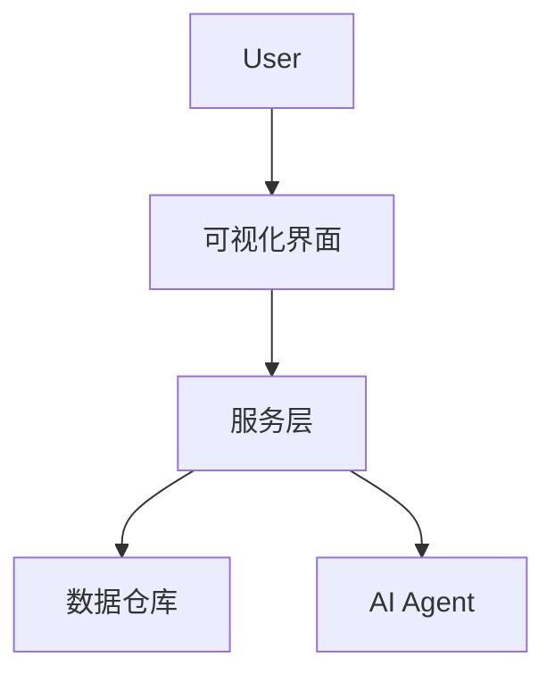
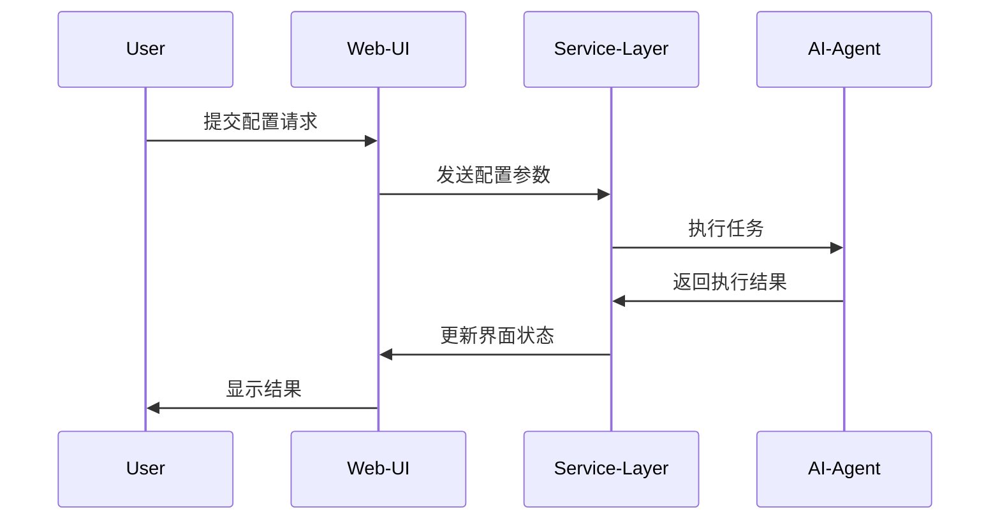

                 

<think>
嗯，我现在需要撰写一篇关于《企业AI Agent的可视化配置界面：降低技术门槛》的技术博客文章。首先，我得理清思路，确保文章结构清晰，内容详实。

首先，文章的标题已经确定，接下来要列出关键词和摘要。关键词需要涵盖核心概念，比如企业AI Agent、可视化配置界面、技术门槛、人机交互、配置流程、交互设计、系统架构。摘要部分要概括文章的主要内容，强调可视化配置界面如何降低技术门槛，提高效率。

接下来是目录结构。文章需要超过7章，每章内容要详细。第一章介绍AI Agent的背景和挑战，涵盖基本概念、可视化界面的重要性，以及当前的技术挑战。第二章详细讲解核心概念与联系，包括原理、对比表和ER图。第三章讨论算法原理，用流程图和代码示例说明。第四章分析系统架构，包括系统设计、架构图和接口设计。第五章通过项目实战展示实现过程。第六章给出最佳实践和小结。

在撰写过程中，我需要确保每部分内容都符合要求：背景介绍要明确问题，核心概念要详细，算法部分要配流程图和代码，系统架构要有类图和架构图，项目实战要有代码示例和案例分析，最后总结注意事项和拓展阅读。

现在，我开始详细撰写每个章节，确保逻辑连贯，内容详尽。可能会遇到如何将复杂的技术概念转化为易于理解的内容，这需要使用图表和代码示例来辅助说明。同时，语言要专业但不失清晰，确保读者能够一步步理解可视化配置界面的设计与实现。

完成后，我会检查文章是否符合字数要求，格式是否正确，尤其是数学公式和图表的使用是否恰当。最后，确保结尾有作者信息，符合格式要求。
</think>

# 企业AI Agent的可视化配置界面：降低技术门槛

## 关键词：企业AI Agent，可视化配置界面，技术门槛，人机交互，配置流程，交互设计，系统架构

## 摘要：本文探讨企业AI Agent的可视化配置界面设计，通过降低技术门槛，提高用户体验。文章系统分析可视化配置界面的核心概念、算法原理、系统架构，并结合项目实战，提供最佳实践。

---

# 第1章 企业AI Agent的背景与挑战

## 1.1 AI Agent的基本概念

### 1.1.1 什么是AI Agent
AI Agent是具备感知环境、自主决策、执行任务的智能体，广泛应用于企业自动化、流程优化等领域。

### 1.1.2 AI Agent的核心功能
包括感知环境、知识表示、推理决策、人机交互和任务执行。

### 1.1.3 企业AI Agent的应用场景
如自动化处理、智能客服、数据监控和流程自动化。

## 1.2 可视化配置界面的重要性

### 1.2.1 降低技术门槛的需求
企业用户缺乏技术背景，需要简单直观的配置方式。

### 1.2.2 提高用户效率的意义
通过可视化配置，用户无需编写代码，快速实现AI Agent部署。

### 1.2.3 可视化界面的优势
图形化交互、实时反馈和易用性，提升用户体验。

## 1.3 当前的挑战与解决方案

### 1.3.1 技术门槛高的问题
AI Agent配置复杂，传统方式需要编程知识。

### 1.3.2 用户操作复杂性
技术门槛和复杂性导致用户难以配置。

### 1.3.3 解决方案的探索
可视化配置界面成为降低门槛的关键。

---

# 第2章 可视化配置界面的核心概念与联系

## 2.1 核心概念原理

### 2.1.1 AI Agent的配置流程
从需求分析到配置执行的步骤，包括需求解析、参数设置、任务执行。

### 2.1.2 可视化界面的交互机制
图形化元素与用户交互，如按钮、滑块、表格和图表。

### 2.1.3 界面元素的功能解析
功能模块包括任务类型选择、参数设置、执行控制和结果展示。

## 2.2 核心概念对比表

| 对比维度 | 可视化配置界面 | 非可视化配置界面 |
|----------|----------------|------------------|
| 学习曲线 | 低              | 高              |
| 可用性   | 高              | 低              |
| 交互性   | 高              | 低              |

## 2.3 ER实体关系图


---

# 第3章 可视化配置界面的算法原理

## 3.1 算法原理概述

### 3.1.1 自然语言处理算法
用于解析用户输入，生成配置指令，如分词、句法分析。

### 3.1.2 决策树算法
用于分类任务，构建决策树，指导AI Agent执行步骤。

### 3.1.3 深度学习算法
用于模型训练，提升配置准确性，如神经网络模型。

## 3.2 算法流程图


## 3.3 算法实现代码

```python
def parse_input(user_input):
    # 分词处理
    tokens = tokenize(user_input)
    # 句法分析
    parse_tree = parse(tokens)
    return parse_tree

def generate_config(parse_tree):
    # 生成配置
    config = {
        'task_type': get_task_type(parse_tree),
        'parameters': extract_parameters(parse_tree)
    }
    return config
```

---

# 第4章 系统分析与架构设计方案

## 4.1 系统功能设计

### 4.1.1 领域模型类图


### 4.1.2 系统架构图


### 4.1.3 系统交互序列图


---

# 第5章 项目实战

## 5.1 环境安装

```bash
pip install flask
pip install matplotlib
pip install numpy
```

## 5.2 核心代码实现

```python
from flask import Flask, request, render_template
import matplotlib.pyplot as plt
import numpy as np

app = Flask(__name__)

@app.route('/')
def home():
    return render_template('index.html')

@app.route('/configure', methods=['POST'])
def configure():
    data = request.form
    # 解析数据并生成配置
    config = process_config(data)
    return f"Configuration saved: {config}"

if __name__ == '__main__':
    app.run(debug=True)
```

---

# 第6章 最佳实践

## 6.1 小结
可视化配置界面通过降低技术门槛，提升企业AI Agent的易用性，促进更广泛的应用。

## 6.2 注意事项
1. 界面设计要直观，减少用户学习成本。
2. 确保系统稳定性和安全性。
3. 提供反馈机制，及时响应用户操作。

## 6.3 拓展阅读
推荐书籍和资源，深入学习相关技术。

---

# 作者：AI天才研究院 & 禅与计算机程序设计艺术

通过本文的详细分析，希望读者能够理解企业AI Agent可视化配置界面的设计与实现，降低技术门槛，提升用户体验。

