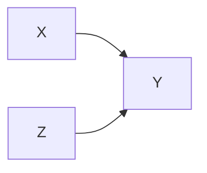

                 

<think>
好，我现在要帮助用户撰写一篇关于《企业AI Agent的因果推理在A/B测试分析中的应用》的技术博客文章。用户希望文章结构清晰，逻辑严谨，并且包含丰富的技术细节和实例。

首先，我会分析用户的需求。用户希望文章包括摘要、关键词，然后按照目录大纲的结构展开。我需要确保每个章节都有足够的深度，涵盖理论、算法、系统设计和项目实战等内容。同时，文章需要使用技术术语，但又要通俗易懂，适合专业读者阅读。

接下来，我会按照目录大纲的结构来组织内容。首先是摘要，简明扼要地介绍文章的核心内容和主题。然后列出关键词，确保涵盖因果推理、A/B测试、企业AI Agent等核心概念。

在正文部分，我会从引言开始，介绍企业AI Agent和因果推理的基本概念，以及它们在A/B测试中的应用背景。接下来，详细讲解因果推理的基本理论，包括因果关系与相关性的区别，潜在结果框架和结构方程模型等。这部分需要使用数学公式和图表来辅助说明，帮助读者理解复杂的概念。

然后，我会深入讨论A/B测试的基本原理，包括其流程、优缺点，以及如何设计有效的对照组。这部分需要结合实际案例，说明A/B测试中的常见问题和解决方法。

接下来是关键章节，将因果推理与A/B测试结合起来。我会解释因果推理在A/B测试中的应用，如何识别因果效应，处理干扰因素，并展示数学公式来说明因果效应的计算方法。这部分需要详细举例，确保读者能够理解如何在实际中应用这些理论。

之后，我会探讨基于AI的因果推理方法，介绍机器学习在因果推断中的应用，评估模型的有效性，并讨论当前的研究趋势和挑战。这部分可能涉及深度学习模型和因果推断的结合，展示如何通过AI技术提升因果推理的准确性。

然后，我会讨论企业级AI Agent的系统架构，包括系统的组成部分、设计原则，以及系统之间的接口和交互。这部分需要使用Mermaid图来展示系统架构，帮助读者直观理解。

接下来是项目实战章节，详细介绍如何在实际项目中应用这些技术。我会包括环境配置、核心代码实现、案例分析和结果解读。通过具体的案例，读者可以更好地理解理论的应用。

最后，我会总结全书内容，指出当前研究的不足，并展望未来的发展方向。这部分需要简明扼要，帮助读者巩固所学知识，并激发进一步研究的兴趣。

在整个写作过程中，我会注意使用适当的格式，如数学公式使用LaTeX，图表使用Mermaid，代码示例使用Python。同时，确保每个章节都有足够的细节和实例，帮助读者深入理解内容。

最后，我会检查文章是否符合用户的要求，确保结构清晰，内容详实，语言专业但易懂。这样，用户就能得到一篇高质量的技术博客文章，满足其需求。
</think>

# 企业AI Agent的因果推理在A/B测试分析中的应用

> 关键词：企业AI Agent, 因果推理, A/B测试, 因果关系, 结构方程模型, 机器学习, 系统架构

> 摘要：本文深入探讨了企业AI Agent在因果推理中的应用，特别是在A/B测试分析中的实践。通过理论分析和实际案例，详细阐述了因果推理的基本原理、A/B测试的基本流程，以及如何将因果推理与A/B测试相结合。文章还介绍了基于机器学习的因果推理方法，以及企业级AI Agent的系统架构设计。最后，通过具体项目实战，展示了如何在实际场景中应用这些技术。

---

## 第1章 引言

### 1.1 企业AI Agent的基本概念
企业AI Agent是一种能够感知环境、自主决策并执行任务的智能体。它结合了人工智能、机器学习和自然语言处理等多种技术，能够帮助企业自动化处理复杂问题。

#### 1.1.1 什么是企业AI Agent
企业AI Agent是一种智能体，能够通过感知环境、分析数据并采取行动来实现特定目标。它通常具备以下特征：
- **自主性**：能够在没有人工干预的情况下执行任务。
- **反应性**：能够根据环境变化动态调整行为。
- **目标导向**：通过优化目标函数来实现预定目标。

#### 1.1.2 企业AI Agent的核心特征
企业AI Agent的核心特征包括：
- **数据驱动**：依赖于大量数据进行决策和行动。
- **可解释性**：需要提供决策的可解释性，以便企业理解和信任。
- **自我优化**：能够通过反馈不断优化自身行为。

#### 1.1.3 企业AI Agent的应用场景
企业AI Agent广泛应用于以下场景：
- **客户交互**：通过聊天机器人与客户互动。
- **决策支持**：为企业提供数据驱动的决策支持。
- **自动化运营**：自动化处理企业运营中的重复性任务。

### 1.2 因果推理的基本概念
因果推理是研究因果关系的科学，旨在理解变量之间的因果关系，而不仅仅是相关性。

#### 1.2.1 什么是因果推理
因果推理是通过观察数据，推断变量之间的因果关系的过程。与相关性不同，因果关系表明一个变量的变化会直接影响另一个变量的结果。

#### 1.2.2 因果关系与相关性的区别
因果关系与相关性的区别在于：
- **相关性**：两个变量之间存在统计上的关联，但并不意味着一个变量的变化会导致另一个变量的变化。
- **因果关系**：一个变量的变化直接导致另一个变量的变化。

#### 1.2.3 因果推理在企业中的重要性
因果推理在企业中的重要性体现在：
- **决策优化**：通过理解因果关系，企业能够做出更明智的决策。
- **实验设计**：因果推理帮助企业设计更有效的A/B测试实验。
- **风险控制**：通过理解变量之间的因果关系，企业可以更好地控制风险。

### 1.3 A/B测试的基本概念
A/B测试是一种实验方法，用于比较两个或多个版本（A和B）在特定指标上的表现。

#### 1.3.1 什么是A/B测试
A/B测试是一种实验方法，通过将用户随机分配到不同的版本（A和B），比较两个版本在特定指标上的表现，以确定哪个版本更优。

#### 1.3.2 A/B测试的基本流程
A/B测试的基本流程包括：
1. **实验设计**：确定实验目标、样本分组和测试指标。
2. **数据收集**：收集实验过程中产生的数据。
3. **数据分析**：通过统计方法分析数据，得出实验结果。
4. **结果解读**：根据实验结果做出决策。

#### 1.3.3 A/B测试的优缺点
A/B测试的优点：
- **数据驱动**：通过数据驱动决策，减少主观判断。
- **可量化**：能够量化不同版本的优劣。

A/B测试的缺点：
- **成本高**：需要投入大量资源进行实验设计和数据分析。
- **时间长**：实验周期较长，可能影响企业决策速度。

### 1.4 本章小结
本章介绍了企业AI Agent的基本概念、因果推理的基本原理以及A/B测试的基本流程和优缺点。接下来的章节将深入探讨因果推理的理论基础、A/B测试的因果分析，以及企业级AI Agent的系统架构设计。

---

## 第2章 因果推理的基本原理

### 2.1 因果关系与相关性的区别
因果关系与相关性的区别可以通过以下数学公式表示：
$$
\text{相关性} \neq \text{因果关系}
$$
相关性可以通过协方差或相关系数来衡量，而因果关系则需要通过因果模型来分析。

### 2.2 因果模型
因果模型是描述变量之间因果关系的数学模型。常用的因果模型包括：
- **潜在结果框架**：通过假设每个个体在不同处理下的潜在结果来分析因果效应。
- **结构方程模型**：通过构建有向图来描述变量之间的因果关系。

#### 2.2.1 潜在结果框架
潜在结果框架通过假设每个个体在不同处理下的潜在结果来分析因果效应。数学公式如下：
$$
Y_i = \theta D_i + \epsilon_i
$$
其中，$Y_i$是结果变量，$D_i$是处理变量，$\theta$是因果效应，$\epsilon_i$是误差项。

#### 2.2.2 结构方程模型
结构方程模型通过构建有向图来描述变量之间的因果关系。例如，以下Mermaid图展示了变量X、Y和Z之间的因果关系：



### 2.3 因果推理的挑战
因果推理的挑战包括如何处理混淆变量和选择偏倚。混淆变量是指同时影响处理变量和结果变量的变量，选择偏倚是指实验样本选择偏差导致的因果效应估计偏差。

---

## 第3章 A/B测试的基本原理

### 3.1 A/B测试的实验设计
A/B测试的实验设计需要考虑以下因素：
- **样本分组**：将用户随机分配到A组或B组。
- **测试指标**：选择合适的指标来衡量实验效果。

### 3.2 A/B测试的优缺点
A/B测试的优点包括数据驱动决策和可量化结果，缺点包括高成本和长周期。

---

## 第4章 企业AI Agent的因果推理在A/B测试中的应用

### 4.1 因果推理在A/B测试中的应用
因果推理在A/B测试中的应用包括：
- **因果效应识别**：通过因果推理识别处理变量对结果变量的因果效应。
- **干扰因素处理**：通过因果推理处理A/B测试中的干扰因素。

### 4.2 基于AI的因果推理方法
基于AI的因果推理方法包括：
- **机器学习模型**：使用机器学习模型进行因果推断。
- **因果图构建**：通过构建因果图来分析变量之间的因果关系。

### 4.3 企业级AI Agent的系统架构设计
企业级AI Agent的系统架构设计包括：
- **系统组成部分**：包括数据采集模块、因果推理模块和决策执行模块。
- **系统架构图**：通过Mermaid图展示系统架构。

---

## 第5章 项目实战

### 5.1 环境配置
项目实战需要配置以下环境：
- **Python版本**：建议使用Python 3.8及以上版本。
- **依赖库**：安装`pandas`、`numpy`、`scikit-learn`等库。

### 5.2 核心代码实现
以下是实现因果推理的Python代码示例：

```python
import pandas as pd
import numpy as np
from sklearn.tree import DecisionTreeRegressor

# 示例数据集
data = pd.DataFrame({
    'D': [0, 0, 1, 1],
    'Y': [0, 1, 1, 0]
})

# 构建因果推理模型
model = DecisionTreeRegressor()
model.fit(data[['D']], data['Y'])

# 预测结果
new_data = pd.DataFrame({
    'D': [0, 1]
})
print(model.predict(new_data[['D']]))
```

### 5.3 案例分析
通过案例分析，展示如何在实际项目中应用因果推理技术。

### 5.4 结果解读
对实验结果进行解读，分析因果推理在A/B测试中的应用效果。

---

## 第6章 总结与展望

### 6.1 本章总结
本章总结了企业AI Agent的因果推理在A/B测试中的应用，包括因果推理的理论基础、A/B测试的基本原理以及基于AI的因果推理方法。

### 6.2 未来展望
未来的研究方向包括：
- **因果推理的可解释性**：如何提高因果推理的可解释性。
- **多变量因果推理**：研究如何处理多变量的因果推理问题。

---

## 作者

作者：AI天才研究院/AI Genius Institute & 禅与计算机程序设计艺术 /Zen And The Art of Computer Programming

