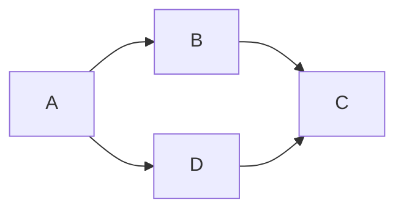
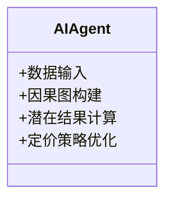
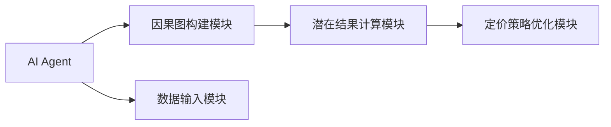
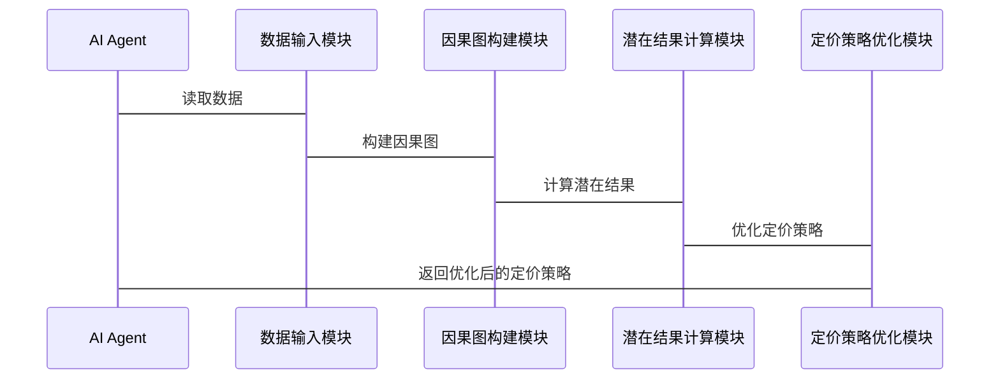

                 


# 企业AI Agent的因果推理在产品定价策略中的应用

## 关键词：企业AI Agent，因果推理，产品定价策略，因果图模型，潜在结果框架，定价优化，机器学习

## 摘要：  
随着人工智能技术的快速发展，企业AI Agent在商业决策中的应用越来越广泛。本文探讨了AI Agent如何利用因果推理来优化产品定价策略。通过分析因果关系，AI Agent能够识别变量之间的因果关系，从而制定更精准的定价策略，提高企业的市场竞争力和盈利能力。本文从因果推理的基本概念、算法实现、系统设计到实际应用案例进行了详细阐述，为读者提供了一个全面的理解框架。

---

## 第一部分：企业AI Agent与因果推理概述

### 第1章：企业AI Agent的基本概念

#### 1.1 什么是企业AI Agent  
企业AI Agent是一种能够感知环境、执行任务并做出决策的智能体。它通过数据驱动的方式，帮助企业实现自动化和智能化的商业决策。

#### 1.2 AI Agent的核心特征  
- **自主性**：能够在没有人工干预的情况下独立运行。  
- **反应性**：能够实时感知环境变化并做出响应。  
- **目标导向**：具有明确的目标，能够优化决策以实现目标。  
- **学习能力**：通过机器学习算法不断优化自身的决策能力。  

#### 1.3 企业AI Agent的应用场景  
- **客户服务**：自动化客户支持、个性化推荐。  
- **供应链管理**：优化库存、预测需求。  
- **市场营销**：制定精准的营销策略。  
- **产品定价**：优化定价策略，提高利润率。  

---

### 第2章：因果推理的基本概念

#### 2.1 什么是因果推理  
因果推理是一种分析变量之间因果关系的方法，旨在识别因果变量与结果变量之间的关系。

#### 2.2 因果关系与相关关系的区别  
- **相关关系**：变量之间存在统计上的关联，但不一定存在因果关系。  
- **因果关系**：变量之间存在直接的因果联系，一个变量的变化会导致另一个变量的变化。  

#### 2.3 因果推理在企业中的应用价值  
- **提高决策的准确性**：通过识别因果关系，企业能够做出更科学的决策。  
- **优化业务流程**：通过因果推理，企业能够优化流程中的关键环节。  
- **提升预测能力**：因果推理能够提高预测模型的准确性。  

---

## 第二部分：因果推理的核心概念与原理

### 第3章：因果图模型

#### 3.1 因果图的基本结构  
因果图（Directed Acyclic Graph, DAG）是一种有向无环图，用于表示变量之间的因果关系。  

**Mermaid图：因果图的基本结构**  


#### 3.2 调节变量与中介变量  
- **调节变量**：影响因果关系的变量，例如价格对需求的影响可能受到季节的影响。  
- **中介变量**：介于因果变量和结果变量之间的变量，例如广告支出（中介变量）影响销售额（结果变量）。  

#### 3.3 因果图的构建方法  
- **基于规则的方法**：通过领域知识构建因果图。  
- **基于数据的方法**：通过统计学习构建因果图。  

---

### 第4章：潜在结果框架

#### 4.1 潜在结果的概念  
潜在结果是指在某个特定情况下，变量的可能结果。例如，如果价格提高，潜在结果是销量下降。  

#### 4.2 潜在结果的估计方法  
- **隐变量调整方法**：通过调整隐变量来估计潜在结果。  
- **加权匹配方法**：通过加权匹配来估计潜在结果。  
- **机器学习方法**：使用机器学习模型来估计潜在结果。  

#### 4.3 潜在结果与因果推理的关系  
潜在结果是因果推理的基础，因果推理通过分析潜在结果来识别因果关系。  

---

### 第5章：因果推理的数学模型

#### 5.1 因果关系的数学表示  
因果关系可以用以下方程表示：  
$$ Y = f(X, U) $$  
其中，Y是结果变量，X是因果变量，U是其他变量。  

#### 5.2 因果图的方程表示  
因果图可以用结构方程模型（SEM）来表示：  
$$ Y = \beta X + \gamma Z + \epsilon $$  
其中，Z是控制变量，ε是误差项。  

#### 5.3 潜在结果的公式化  
潜在结果可以用以下公式表示：  
$$ Y_i^{do(X)} = f_i(X, U_i) $$  
其中，i表示个体，X是处理变量，U_i是其他变量。  

---

## 第三部分：产品定价策略中的因果推理应用

### 第6章：产品定价策略的基本概念

#### 6.1 定价策略的分类  
- **成本导向定价**：基于成本加成定价。  
- **需求导向定价**：基于市场需求定价。  
- **竞争导向定价**：基于竞争对手定价。  

#### 6.2 定价策略的影响因素  
- **市场需求**：需求弹性、消费者偏好。  
- **成本因素**：生产成本、运营成本。  
- **竞争环境**：竞争对手的价格、市场结构。  

#### 6.3 企业定价策略的目标  
- **最大化利润**：通过优化价格提高利润率。  
- **市场份额**：通过价格策略扩大市场份额。  
- **品牌形象**：通过价格策略提升品牌形象。  

---

### 第7章：因果推理在定价策略中的作用

#### 7.1 识别因果关系  
因果推理能够识别价格变化与销量变化之间的因果关系，从而制定更科学的定价策略。  

#### 7.2 优化定价模型  
因果推理能够优化定价模型，提高模型的准确性和可靠性。  

#### 7.3 提高定价决策的准确性  
因果推理能够通过分析因果关系，提高定价决策的准确性。  

---

### 第8章：基于因果推理的定价策略设计

#### 8.1 因果图在定价中的应用  
通过因果图，企业可以识别价格变化对销量、利润等结果变量的影响。  

#### 8.2 潜在结果在定价中的应用  
通过潜在结果，企业可以估计价格变化对销量的潜在影响。  

#### 8.3 定价策略的因果验证  
通过因果验证，企业可以验证定价策略的因果关系，确保定价策略的有效性。  

---

## 第四部分：企业AI Agent的因果推理算法实现

### 第9章：因果推理算法概述

#### 9.1 常见的因果推理算法  
- **结构方程模型（SEM）**  
- **因果森林（Causal Forest）**  
- **倾向评分匹配（Propensity Score Matching）**  

#### 9.2 算法的优缺点对比  
| 算法名称          | 优点                          | 缺点                          |
|-------------------|-------------------------------|-------------------------------|
| 结构方程模型      | 能够处理复杂的因果关系        | 对数据要求较高                |
| 因果森林          | 非参数化，适用于复杂数据       | 计算复杂性较高                |
| 倾向评分匹配      | 易于实现，适用于小样本数据      | 对结果变量的控制较低          |

#### 9.3 算法的选择与应用  
算法的选择取决于数据的性质和问题的具体需求。  

---

### 第10章：因果图构建算法

#### 10.1 基于规则的因果图构建  
通过领域知识构建因果图，例如专家意见、理论模型。  

#### 10.2 基于数据的因果图构建  
通过统计学习方法构建因果图，例如Granger因果检验、Pearl的do-算子。  

#### 10.3 算法实现的步骤  
1. 数据预处理：清洗数据、处理缺失值。  
2. 构建因果图：选择合适的算法构建因果图。  
3. 验证因果图：通过实验或数据验证因果图的合理性。  

---

### 第11章：潜在结果估计算法

#### 11.1 隐变量调整方法  
通过调整隐变量，估计潜在结果。  

#### 11.2 加权匹配方法  
通过加权匹配，估计潜在结果。  

#### 11.3 机器学习方法  
通过机器学习模型，估计潜在结果。  

---

## 第五部分：系统分析与架构设计

### 第12章：系统功能设计

#### 12.1 领域模型图  


#### 12.2 系统架构设计  


#### 12.3 接口设计  
- **输入接口**：接收外部数据输入。  
- **输出接口**：输出优化后的定价策略。  

---

### 第13章：系统交互流程图



---

## 第六部分：项目实战

### 第14章：环境安装与核心功能实现

#### 14.1 环境安装  
- **Python**：安装Python 3.x  
- **库的安装**：安装`numpy`, `pandas`, `scikit-learn`, `networkx`, `pymermaid`  

#### 14.2 核心功能实现  
```python
import numpy as np
import pandas as pd
from sklearn.linear_model import LinearRegression

# 示例数据
data = {
    'price': [10, 20, 30, 40, 50],
    'sales': [100, 80, 60, 40, 20]
}
df = pd.DataFrame(data)

# 构建因果图
graph = {
    'nodes': ['price', 'sales'],
    'edges': [('price', 'sales')]
}

# 潜在结果计算
model = LinearRegression()
model.fit(df[['price']], df['sales'])
potential_results = model.predict(df[['price']])
```

#### 14.3 代码解读  
- **数据输入**：读取数据并存储在DataFrame中。  
- **因果图构建**：定义因果图的节点和边。  
- **潜在结果计算**：使用线性回归模型计算潜在结果。  

---

### 第15章：实际案例分析与应用解读

#### 15.1 案例背景  
某企业希望通过优化定价策略来提高利润。  

#### 15.2 数据分析  
通过因果图构建和潜在结果计算，发现价格对销量有显著的负向影响。  

#### 15.3 定价策略优化  
根据分析结果，调整价格策略，例如降低价格以提高销量。  

---

## 第七部分：总结与最佳实践

### 第16章：总结

#### 16.1 本章小结  
企业AI Agent通过因果推理能够优化产品定价策略，提高企业的市场竞争力和盈利能力。  

#### 16.2 注意事项  
- 数据质量：因果推理依赖高质量的数据。  
- 模型选择：选择合适的算法和模型。  
- 实验验证：通过实验验证定价策略的有效性。  

### 第17章：未来趋势与拓展阅读

#### 17.1 未来趋势  
- **因果机器学习**：结合机器学习和因果推理，进一步优化定价策略。  
- **实时定价**：通过实时数据优化定价策略。  

#### 17.2 拓展阅读  
- Pearl, J. (2009). Causal Inference: What If?  
- Hernán, M. A., & Robins, J. M. (2016). Causal Inference: What If?  

---

## 作者：AI天才研究院/AI Genius Institute & 禅与计算机程序设计艺术/Zen And The Art of Computer Programming

