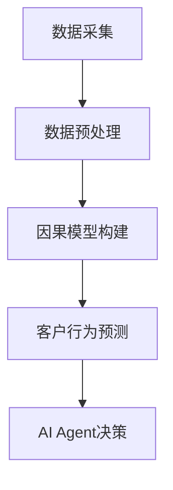
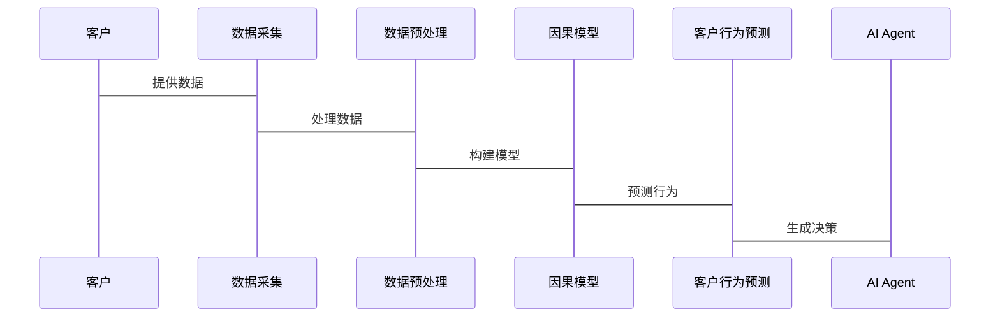

                 


# 企业AI Agent的因果推理在客户行为分析中的应用

## 关键词：企业AI Agent, 因果推理, 客户行为分析, 人工智能, 数据科学

## 摘要：本文详细探讨了企业AI Agent在客户行为分析中的应用，特别是因果推理在其中的关键作用。通过分析因果关系，企业可以更准确地预测客户行为，优化决策流程，并提升客户满意度和忠诚度。文章从基本概念、算法原理、系统架构到实际案例，全面解析了因果推理在企业客户行为分析中的应用，并通过具体代码实现和系统设计展示了如何构建高效的企业AI Agent系统。

---

## 第1章: 企业AI Agent与因果推理概述

### 1.1 企业AI Agent的定义与特点

企业AI Agent是指在企业环境中应用的人工智能代理，用于自动化决策、数据分析和问题解决。其特点包括：

- **自主性**：能够独立执行任务，无需人工干预。
- **反应性**：能够根据环境变化实时调整行为。
- **学习能力**：通过数据和经验不断优化决策模型。

### 1.2 因果推理的基本概念

因果推理研究的是事件之间的因果关系，旨在理解“为什么”某个事件发生，而不仅仅是“什么”发生了。与相关性分析不同，因果推理关注的是变量之间的因果关系。

### 1.3 企业客户行为分析的背景与挑战

客户行为分析是企业洞察客户需求、优化服务的重要手段。然而，传统方法往往局限于相关性分析，无法准确理解客户行为的因果关系。企业AI Agent通过因果推理，能够更深入地分析客户行为背后的原因，从而做出更精准的决策。

---

## 第2章: 因果推理的核心概念与原理

### 2.1 因果关系的数学模型

因果关系可以通过多种数学模型进行建模，其中最常见的是潜在结果框架（Potential Outcome Framework）和结构方程模型（SEM）。

#### 2.1.1 潜在结果框架

潜在结果框架假设每个客户在不同情况下会有不同的行为结果。通过分析这些潜在结果，可以识别出因果关系。例如，客户是否会购买某产品，取决于是否收到推荐信息。

公式表示：
$$ Y_i = \theta X_i + \epsilon_i $$

其中，$Y_i$ 是客户行为结果，$X_i$ 是干预变量，$\theta$ 是因果效应，$\epsilon_i$ 是误差项。

#### 2.1.2 结构方程模型

结构方程模型通过构建因果图来描述变量之间的关系。例如，客户满意度可能受到产品质量和服务体验的影响。

### 2.2 因果推理的基本原理

因果推理的核心在于识别因果效应，并通过干预分析来预测结果。反事实推理是一种重要的方法，它假设在其他情况下会发生什么。

例如，如果客户没有收到推荐信息，他们是否会购买产品？

### 2.3 因果推理与机器学习的结合

机器学习算法可以用于因果推理，例如使用随机森林或神经网络来估计因果效应。

---

## 第3章: 企业AI Agent的因果推理模型

### 3.1 企业客户行为的因果关系建模

客户行为的因果关系建模需要识别关键变量，例如客户年龄、购买历史和推荐信息。

#### 3.1.1 客户行为的因果关系分析

通过因果图分析客户行为的影响因素，例如：

- 购买历史（路径：购买历史 → 客户满意度 → 购买行为）
- 产品推荐（路径：产品推荐 → 客户兴趣 → 购买行为）

#### 3.1.2 客户行为的潜在结果分析

假设客户在没有推荐的情况下，购买行为的变化。

### 3.2 基于因果推理的客户行为预测模型

通过因果推理算法预测客户行为，例如客户流失预测。

#### 3.2.1 模型的构建与训练

使用潜在结果框架训练模型，识别因果效应。

#### 3.2.2 模型的评估与验证

通过实验验证模型的准确性，例如A/B测试。

### 3.3 企业AI Agent的因果推理实现

AI Agent通过因果推理算法做出决策，例如优化推荐策略。

---

## 第4章: 企业客户行为分析的系统架构设计

### 4.1 系统总体架构

系统包括数据采集、模型构建、预测模块和AI Agent决策模块。

#### 4.1.1 数据采集与预处理模块

收集客户行为数据，并进行清洗和特征提取。

#### 4.1.2 因果推理模型构建模块

基于因果图构建模型，识别因果效应。

#### 4.1.3 客户行为预测模块

预测客户行为，并生成决策建议。

#### 4.1.4 AI Agent决策模块

根据预测结果，调整推荐策略。

### 4.2 系统功能设计

系统功能包括数据管理、模型训练、预测分析和决策优化。

#### 4.2.1 数据采集与预处理

使用Python进行数据清洗和特征工程。

代码示例：
```python
import pandas as pd
data = pd.read_csv('customer_data.csv')
data.dropna(inplace=True)
```

#### 4.2.2 因果推理模型构建

使用潜在结果框架训练模型。

代码示例：
```python
from causal_inference import CausalModel
model = CausalModel(data)
model.fit('treatment', 'outcome')
```

#### 4.2.3 客户行为预测

预测客户行为，并生成报告。

#### 4.2.4 AI Agent决策

优化推荐策略，提升客户满意度。

### 4.3 系统架构图

使用Mermaid绘制系统架构图：



### 4.4 系统交互图

使用Mermaid绘制系统交互图：



---

## 第5章: 项目实战

### 5.1 客户流失预测案例

#### 5.1.1 问题描述

预测客户是否会流失，并识别关键影响因素。

#### 5.1.2 数据分析

使用因果推理分析客户流失的原因。

#### 5.1.3 模型实现

构建因果推理模型，预测客户流失概率。

代码示例：
```python
import numpy as np
from sklearn.linear_model import LogisticRegression
from causal_inference import Counterfactual

# 数据加载与预处理
data = pd.read_csv('customer_churn.csv')
data.dropna(inplace=True)

# 构建因果模型
model = LogisticRegression()
model.fit(data[['age', 'tenure', 'monthly_charges']], data['churn'])

# 反事实推理
cf = Counterfactual(model, data[['age', 'tenure', 'monthly_charges']], 'churn')
cf_result = cf.compute()
```

#### 5.1.4 实验验证

通过A/B测试验证模型的准确性。

### 5.2 个性化推荐系统案例

#### 5.2.1 问题描述

根据客户行为推荐产品。

#### 5.2.2 数据分析

分析客户购买历史和推荐信息的影响。

#### 5.2.3 模型实现

构建推荐系统，优化推荐策略。

代码示例：
```python
import surprise
from surprise import Dataset, SVD

# 数据加载
data = Dataset.load_from_df(
    data[['user_id', 'item_id', 'rating']], 
    user_col='user_id', 
    item_col='item_id'
)

# 训练模型
model = SVD()
model.fit(data)

# 预测推荐
predictions = model.predict('user_id', 'item_id')
```

---

## 第6章: 最佳实践与总结

### 6.1 小结

因果推理在企业客户行为分析中具有重要作用，能够帮助企业更准确地预测客户行为，优化决策流程。

### 6.2 注意事项

- 确保数据质量，避免偏差。
- 选择合适的因果推理方法。
- 定期验证模型准确性。

### 6.3 扩展阅读

推荐相关书籍和论文，进一步深入学习。

---

## 作者：AI天才研究院/AI Genius Institute & 禅与计算机程序设计艺术 /Zen And The Art of Computer Programming

---

**附录：**

### 附录A: 术语表

- **因果关系**：事件之间的因果联系。
- **潜在结果框架**：用于估计因果效应的数学模型。
- **反事实推理**：假设其他情况下会发生什么的推理方法。

### 附录B: 参考文献

- 预留位置，可根据需要添加具体参考文献。

