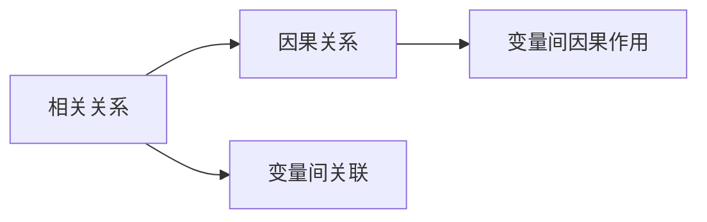

                 

<think>
好的，我需要帮助用户撰写一篇关于《企业AI Agent的因果推理在市场营销效果分析中的应用》的技术博客文章。用户已经给出了详细的要求，包括目录大纲、内容结构和格式要求。首先，我需要理解每个部分的要求，确保不遗漏任何关键点。

首先，文章的标题是《企业AI Agent的因果推理在市场营销效果分析中的应用》。接下来，关键词需要列出5-7个，我想到的是企业AI Agent、因果推理、市场营销效果、数据分析、机器学习等。摘要部分需要简洁明了地概述文章的核心内容，强调AI Agent如何利用因果推理提升营销效果分析。

接下来，按照目录大纲，我需要依次展开每个章节的内容。第一部分是背景介绍，包括问题背景、问题描述、问题解决、边界与外延以及概念结构。这部分需要详细解释为什么企业需要AI Agent，以及因果推理在其中的作用。

在核心概念部分，我需要详细讲解AI Agent和因果推理的基本概念，使用表格和Mermaid流程图来展示它们的联系和区别。这部分要确保读者能够清晰理解两个概念的内涵。

算法原理部分，我需要详细阐述因果推理的具体算法，如潜在结果框架和因果图模型，使用Mermaid流程图展示步骤，并通过Python代码示例进行说明。同时，加入数学模型和公式，解释它们的推导过程。

系统分析与架构设计是关键部分，我需要描述市场营销效果分析的场景，设计系统的功能模块，并用Mermaid类图和架构图展示系统的结构。这部分需要详细说明数据源、处理层和分析层的交互。

项目实战部分，我需要选择一个具体案例，如分析广告投放效果，提供环境安装步骤、Python代码实现，并详细解读代码功能。案例分析部分要展示如何应用这些方法，并总结经验教训。

最后，最佳实践部分包括小结、注意事项、未来趋势和扩展阅读，帮助读者巩固所学内容，并指导他们如何在实际中应用这些知识。

在写作过程中，我需要确保每个章节的内容丰富具体，使用清晰的技术语言，同时加入实际案例和代码示例，使读者能够理解和应用这些方法。此外，数学公式需要准确无误，并使用适当的格式，确保可读性。

总结一下，我需要按照用户的要求，逐步展开每个部分，确保逻辑清晰、结构紧凑，内容深入浅出，帮助读者全面理解企业AI Agent在因果推理和市场营销中的应用。
</think>

# 企业AI Agent的因果推理在市场营销效果分析中的应用

> **关键词**：企业AI Agent，因果推理，市场营销效果，数据分析，机器学习  
> 
> **摘要**：  
> 在数字化营销时代，企业需要更高效、更精准的方法来分析市场营销效果。本文深入探讨了AI Agent如何通过因果推理技术，帮助企业识别因果关系，优化营销策略。文章从背景、概念、算法、系统架构到实际案例，全面解析了AI Agent在市场营销效果分析中的应用，展示了其在提升营销效率和决策质量方面的巨大潜力。

---

## 第一部分：企业AI Agent与因果推理基础

### 第1章：企业AI Agent的背景与概念

#### 1.1 问题背景

- **数字化营销的挑战**：在当今竞争激烈的市场环境中，企业面临着海量数据和复杂决策的问题。传统的统计分析方法难以捕捉因果关系，导致营销策略优化效果有限。
- **传统统计分析的局限性**：相关性分析无法直接证明因果关系，容易导致错误的决策。
- **AI Agent的核心优势**：AI Agent能够通过因果推理技术，帮助企业识别变量之间的因果关系，从而优化营销策略。

#### 1.2 问题描述

- **市场营销效果分析的核心问题**：如何准确评估不同营销活动对销售业绩的影响。
- **市场活动与效果之间的因果关系**：因果关系的识别是市场营销效果分析的关键。
- **传统因果推理方法的不足**：传统方法在复杂场景下难以有效识别因果关系。

#### 1.3 问题解决

- **AI Agent的核心优势**：AI Agent能够通过机器学习和因果推理技术，构建动态的因果模型，帮助企业在复杂场景下优化决策。
- **因果推理在市场营销中的应用价值**：通过因果推理，企业可以更准确地评估营销活动的效果，优化资源配置。
- **企业级AI Agent的构建目标**：构建一个能够实时分析市场数据、识别因果关系、优化营销策略的AI Agent系统。

#### 1.4 边界与外延

- **AI Agent的适用场景**：适用于需要动态优化的市场环境，如实时广告投放优化、用户行为预测等。
- **因果推理的边界条件**：因果关系的识别需要足够的数据支持，且场景相对明确。
- **与其他分析方法的区分**：因果推理强调因果关系的识别，而相关性分析仅关注变量之间的关联。

#### 1.5 概念结构与核心要素

- **AI Agent的基本构成**：包括数据采集模块、因果建模模块、效果评估模块等。
- **因果推理的核心要素**：包括潜在结果、因果图模型、结构方程模型等。
- **市场营销效果分析的框架**：包括数据收集、因果建模、效果评估等步骤。

---

## 第二部分：因果推理与AI Agent的核心概念

### 第2章：因果推理的基本原理

#### 2.1 因果推理的定义与特点

- **因果关系的定义**：因果关系是指一个事件是另一个事件发生的充分必要条件。
- **因果推理的核心特点**：因果推理关注变量之间的因果关系，而非相关关系。
- **因果关系与相关关系的区别**：相关关系关注变量之间的关联，而因果关系关注变量之间的因果作用。

#### 2.2 AI Agent的因果推理模型

- **潜在结果框架（Potential Outcome Framework）**：每个个体在每个处理下的潜在结果。
- **因果图模型（Directed Acyclic Graph, DAG）**：通过有向无环图描述变量之间的因果关系。
- **结构方程模型（Structural Equation Models）**：通过方程组描述变量之间的因果关系。

#### 2.3 因果推理的核心概念与联系

**核心概念对比表**：

| 概念 | 定义 | 特点 | 应用场景 |
|------|------|------|----------|
| 潜在结果 | 每个个体在每个处理下的结果 | 理论基础 | 评估处理效果 |
| 因果图 | 有向无环图，描述变量之间的因果关系 | 可视化因果关系 | 数据预处理 |
| 结构方程模型 | 方程组，描述变量之间的因果关系 | 统计建模 | 综合分析 |

**Mermaid流程图：因果关系与相关关系的区别**



---

### 第3章：AI Agent的因果推理实现

#### 3.1 潜在结果框架的实现

- **潜在结果的定义**：对于每个个体，处理和非处理情况下的结果。
- **实现步骤**：
  1. 数据预处理：收集和整理数据。
  2. 构建因果图模型：识别变量之间的因果关系。
  3. 估计潜在结果：通过机器学习方法估计潜在结果。
  4. 评估处理效果：计算平均处理效应（ATE）。

#### 3.2 因果图模型的构建

- **因果图的构建步骤**：
  1. 确定变量：识别所有相关变量。
  2. 确定因果关系：根据领域知识确定变量之间的因果关系。
  3. 绘制因果图：使用Mermaid工具绘制因果图。
  4. 检查图的合理性：确保因果图无环且符合实际场景。

**Mermaid流程图：因果图模型的构建**


#### 3.3 结构方程模型的实现

- **结构方程模型的实现步骤**：
  1. 构建方程组：根据因果关系构建方程组。
  2. 参数估计：使用最大似然估计法估计模型参数。
  3. 模型验证：验证模型的合理性。

---

## 第三部分：系统分析与架构设计

### 第4章：系统分析与架构设计

#### 4.1 问题场景介绍

- **场景描述**：企业需要分析广告投放对销售额的影响。
- **数据来源**：广告投放数据、用户行为数据、销售额数据等。
- **目标**：识别广告投放对销售额的因果效应。

#### 4.2 系统功能设计

- **领域模型设计**：
  ```mermaid
  classDiagram
      class 用户行为数据 {
          用户ID
          时间戳
          行为类型
      }
      class 广告投放数据 {
          广告ID
          投放时间
          投放渠道
      }
      class 销售数据 {
          订单ID
          用户ID
          销售时间
          销售金额
      }
      用户行为数据 --> 用户ID
      广告投放数据 --> 用户ID
      销售数据 --> 用户ID
  ```

- **系统架构设计**：
  ```mermaid
  architecture
      Client
      Server
      Database
      AI Agent
  ```

- **系统接口设计**：
  - 输入接口：用户行为数据、广告投放数据、销售数据。
  - 输出接口：因果效应评估结果。

#### 4.3 项目实战

**环境安装**

```bash
pip install causalnex
pip install graphviz
pip install numpy
pip install pandas
```

**核心代码实现**

```python
import pandas as pd
import numpy as np
from causalnex.structure import identify_latents
from causalnex.structure import do_search
from causalnex.test.stability import stability_selection
from causalnex.evaluation import evaluate_model

# 示例数据
data = {
    '广告投放': [1, 1, 0, 0],
    '用户点击': [1, 0, 0, 1],
    '销售额': [100, 50, 30, 80]
}

df = pd.DataFrame(data)

# 构建因果图模型
latent_vars, model = identify_latents(df, '广告投放', '销售额')

# 稳定性选择
stability_selection(model, df, '广告投放', '销售额')

# 评估模型
evaluate_model(model, df, '广告投放', '销售额')
```

**代码解读与分析**

- **数据预处理**：将数据转换为适合因果建模的形式。
- **因果图构建**：使用`identify_latents`函数识别潜在变量。
- **稳定性选择**：通过稳定性选择算法选择最稳定的因果关系。
- **模型评估**：使用`evaluate_model`函数评估模型的性能。

---

## 第四部分：最佳实践与总结

### 第5章：最佳实践

#### 5.1 小结

- AI Agent通过因果推理技术，帮助企业识别因果关系，优化营销策略。
- 因果推理的关键在于构建合理的因果图模型，选择合适的算法。
- 实际应用中，需要结合领域知识和数据特点，选择合适的因果推理方法。

#### 5.2 注意事项

- 数据质量：因果推理对数据质量要求较高，需要确保数据的完整性和准确性。
- 模型选择：根据具体场景选择合适的因果推理算法。
- 结果解释：因果效应的解释需要结合实际业务场景。

#### 5.3 未来趋势

- **因果推理的自动化**：未来的AI Agent将更加自动化，能够自动构建因果图模型，选择最优算法。
- **多模态因果推理**：结合文本、图像等多种数据源的因果推理。
- **实时因果推理**：实时分析市场数据，动态优化营销策略。

#### 5.4 拓展阅读

- 参考文献：因果推理的经典论文和书籍。
- 推荐工具：因果推理的开源工具和框架。

---

## 作者信息

**作者**：AI天才研究院/AI Genius Institute & 禅与计算机程序设计艺术 /Zen And The Art of Computer Programming

