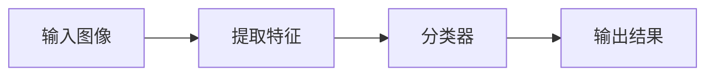
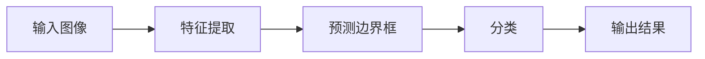
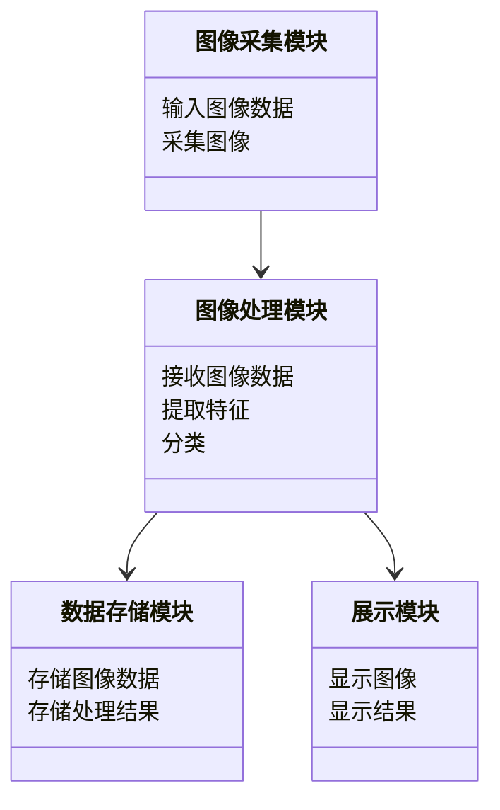
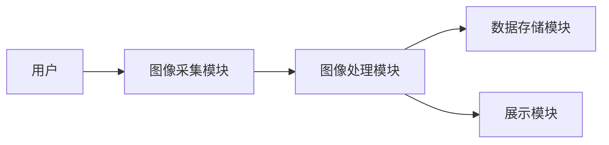
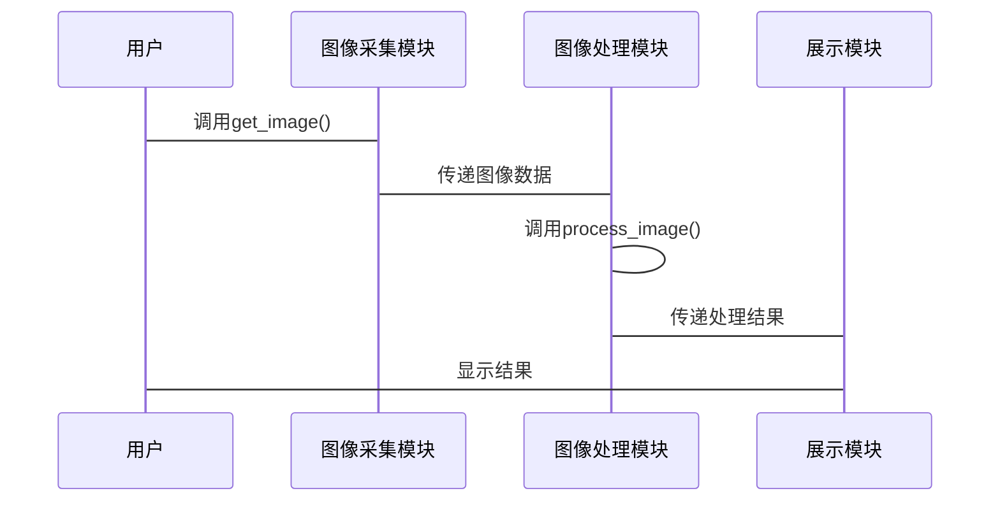

                 

<think>
嗯，我现在需要帮用户完成一个关于“企业AI Agent的图像识别与处理技术应用”的技术博客文章。首先，我得理解用户的需求。他希望文章结构清晰，有深度，能够详细讲解AI Agent在图像处理中的应用。

我应该从背景开始，介绍企业AI Agent是什么，图像识别的重要性，以及它们结合起来的应用场景。这部分需要用简单易懂的语言，让读者明白问题的背景和意义。

接下来，核心概念部分，需要详细讲解AI Agent和图像识别的基本原理，以及它们是如何协同工作的。可能需要对比分析，用表格和图表来帮助理解。

然后是算法原理，这里要选择一些主流的图像处理算法，比如CNN、YOLO等，用流程图和代码示例来展示它们的工作机制。同时，数学公式需要用latex来表示，帮助读者理解算法的内在逻辑。

系统分析与架构设计部分，我需要介绍项目场景，设计系统功能，并用类图和架构图来展示整体结构。这部分要确保读者能够清晰地看到各个模块之间的关系和交互。

项目实战部分，要提供一个具体的案例，详细描述环境搭建、代码实现和实际应用效果。通过实际案例，读者可以更好地理解和应用所学知识。

最后，总结与展望部分，要回顾整篇文章的主要内容，并指出未来的发展方向。同时，给出一些最佳实践的建议，帮助读者在实际项目中避免常见问题。

在写作过程中，我需要确保每一部分都详细具体，避免过于笼统。同时，要使用专业的技术术语，但也要保持语言的通俗易懂，确保读者能够轻松理解。

现在，我需要检查一下是否覆盖了所有必要的部分，比如背景、核心概念、算法、系统架构、项目实战和总结。确保每一部分都有足够的细节，并且有图表和代码示例来支持讲解。这样，整篇文章才能既有深度又易于理解。
</think>

# 企业AI Agent的图像识别与处理技术应用

## 关键词：企业AI Agent, 图像识别, 图像处理技术, AI算法, 系统架构

## 摘要：本文深入探讨了企业AI Agent在图像识别与处理技术中的应用，从基本概念到算法原理，再到系统架构与项目实战，全面解析了这一技术的核心内容。通过详细的技术分析和实际案例，本文为读者提供了从理论到实践的完整指南。

---

# 第1章: 企业AI Agent与图像识别概述

## 1.1 问题背景与问题描述

### 1.1.1 企业AI Agent的核心概念
企业AI Agent是一种智能化的自动化系统，能够通过感知环境、分析数据并执行任务来优化企业的运营效率。它结合了人工智能、机器学习和自然语言处理等多种技术，具备自主决策和问题解决的能力。

### 1.1.2 图像识别技术的定义与作用
图像识别是计算机视觉领域的重要技术，通过算法对图像中的内容进行识别、分类或理解。它在企业中的应用广泛，例如产品质量检测、智能监控、文档处理等领域。

### 1.1.3 企业AI Agent与图像识别的结合场景
企业AI Agent可以通过图像识别技术实现自动化操作，例如识别产品缺陷、监控生产线、分类文件等。这种结合不仅提高了效率，还降低了人工成本。

## 1.2 问题解决与边界

### 1.2.1 企业AI Agent在图像识别中的应用价值
通过图像识别技术，企业AI Agent能够快速处理大量图像数据，提高决策的准确性和效率。例如，在制造业中，AI Agent可以通过图像识别检测产品缺陷，减少人工检查的时间和成本。

### 1.2.2 图像识别技术的边界与限制
尽管图像识别技术在许多领域表现出色，但它也存在一些局限性，例如对光照、角度变化的敏感性，以及对复杂场景的处理能力不足。此外，图像识别技术的实现需要大量的计算资源和高质量的数据支持。

### 1.2.3 企业AI Agent与图像识别的协同工作模式
企业AI Agent与图像识别技术的结合需要通过接口进行数据传递和指令控制。AI Agent负责协调图像识别系统与其他企业系统的交互，确保整个流程的高效运行。

## 1.3 概念结构与核心要素

### 1.3.1 企业AI Agent的组成要素
企业AI Agent通常包括感知模块、决策模块和执行模块。感知模块负责数据的采集和分析，决策模块基于分析结果做出决策，执行模块负责执行具体的任务。

### 1.3.2 图像识别技术的关键组件
图像识别技术主要由特征提取、分类器和后处理模块组成。特征提取模块通过卷积神经网络等方法提取图像的特征，分类器基于这些特征进行分类，后处理模块对结果进行优化和调整。

### 1.3.3 两者的结合与系统架构
企业AI Agent与图像识别技术的结合通常采用分层架构。感知层负责图像数据的采集和初步处理，决策层基于图像识别结果做出决策，执行层负责执行具体的任务。

## 1.4 本章小结
本章介绍了企业AI Agent和图像识别技术的基本概念及其在企业中的应用价值。通过分析二者的结合场景和协同工作模式，为后续的技术实现奠定了基础。

---

# 第2章: 企业AI Agent与图像识别的核心概念

## 2.1 核心概念原理

### 2.1.1 企业AI Agent的基本原理
企业AI Agent通过感知环境、分析数据并执行任务来优化企业的运营。它通常包括感知模块、决策模块和执行模块，能够自主决策和解决问题。

### 2.1.2 图像识别技术的核心算法
图像识别的核心算法包括卷积神经网络（CNN）、目标检测算法（如YOLO、Faster R-CNN）和图像分割算法（如U-Net）。这些算法通过提取图像特征并进行分类或分割来实现图像识别。

### 2.1.3 两者结合的实现机制
企业AI Agent通过调用图像识别算法对图像数据进行处理，并根据处理结果做出决策。这种实现机制通常涉及数据接口的定义和系统模块的协同工作。

## 2.2 核心概念对比分析

### 2.2.1 AI Agent与传统自动化系统的区别
- **自主性**：AI Agent具备自主决策能力，而传统自动化系统通常依赖预设规则。
- **学习能力**：AI Agent可以通过机器学习不断优化性能，而传统系统不具备学习能力。
- **灵活性**：AI Agent能够适应复杂多变的环境，而传统系统在变化的环境中表现较差。

### 2.2.2 图像识别技术与传统数据处理方式的对比
- **处理对象**：图像识别处理的是图像数据，而传统数据处理通常处理结构化数据。
- **复杂性**：图像识别需要处理大量的非结构化数据，过程较为复杂。
- **准确性**：图像识别技术依赖算法模型的准确性，而传统数据处理的准确性通常更高。

### 2.2.3 企业AI Agent与图像识别结合的独特优势
- **高效性**：通过图像识别技术，企业AI Agent能够快速处理大量图像数据。
- **准确性**：图像识别技术能够提高数据处理的准确性，减少人工错误。
- **灵活性**：企业AI Agent可以根据不同的场景灵活调整图像识别算法的应用。

## 2.3 实体关系与系统架构

### 2.3.1 ER实体关系图
```mermaid
er
    actor: 用户
    system: 企业AI Agent
    image_data: 图像数据
    action: 操作指令
    relation: 用户 -> 提供图像数据
    relation: 图像数据 -> 系统处理
    relation: 系统 -> 发出操作指令
```

## 2.4 本章小结
本章通过对比分析和系统架构设计，深入探讨了企业AI Agent与图像识别技术的核心概念及其结合方式。通过ER实体关系图，明确了各实体之间的关系和数据流。

---

# 第3章: 图像识别算法原理与实现

## 3.1 常见图像识别算法

### 3.1.1 基于CNN的图像分类算法
卷积神经网络（CNN）是一种广泛应用于图像分类的深度学习算法。其核心思想是通过卷积操作提取图像的特征，并通过池化操作降低计算复杂度。最终，特征向量通过全连接层进行分类。

### 3.1.2 目标检测算法（如YOLO、Faster R-CNN）
目标检测算法不仅能够识别图像中的物体，还能定位物体的位置。YOLO是一种基于单个神经网络的实时目标检测算法，而Faster R-CNN则通过区域建议网络（RPN）生成候选框并进行分类。

### 3.1.3 图像分割算法（如U-Net）
图像分割算法能够将图像中的每个像素进行分类，生成图像的语义分割结果。U-Net是一种广泛应用于医学图像分割的卷积神经网络，其架构包括编码器和解码器两部分。

## 3.2 算法原理与流程图

### 3.2.1 基于CNN的图像分类流程


### 3.2.2 基于YOLO的目标检测流程


## 3.3 算法实现与代码示例

### 3.3.1 使用Python实现图像分类代码
```python
import tensorflow as tf
from tensorflow.keras import layers

# 构建CNN模型
model = tf.keras.Sequential([
    layers.Conv2D(32, (3,3), activation='relu', input_shape=(224, 224, 3)),
    layers.MaxPooling2D((2,2)),
    layers.Conv2D(64, (3,3), activation='relu'),
    layers.MaxPooling2D((2,2)),
    layers.Flatten(),
    layers.Dense(64, activation='relu'),
    layers.Dense(10, activation='softmax')
])

# 编译模型
model.compile(optimizer='adam', loss='sparse_categorical_crossentropy', metrics=['accuracy'])
```

### 3.3.2 图像分割算法的数学模型
图像分割的损失函数通常采用交叉熵损失函数：
$$ L = -\sum_{i=1}^{N} y_i \log(p_i) + (1 - y_i) \log(1 - p_i) $$
其中，\( y_i \) 是真实标签，\( p_i \) 是预测概率。

---

# 第4章: 系统分析与架构设计方案

## 4.1 问题场景介绍
企业AI Agent与图像识别技术的结合需要一个高效的系统架构，以支持图像数据的采集、处理、存储和展示。本文将从系统功能设计、架构设计和接口设计三个方面进行详细阐述。

## 4.2 系统功能设计

### 4.2.1 领域模型类图


## 4.3 系统架构设计

### 4.3.1 系统架构图


## 4.4 系统接口设计

### 4.4.1 接口定义
- 图像采集模块接口：`get_image()`，返回采集到的图像数据。
- 图像处理模块接口：`process_image(image)`，处理图像数据并返回结果。
- 数据存储模块接口：`save_result(result)`，存储处理结果。

## 4.5 系统交互设计

### 4.5.1 序列图


---

# 第5章: 项目实战

## 5.1 环境安装
本文将以Python为例，介绍图像识别项目的环境搭建步骤：
1. 安装Python和必要的库（如TensorFlow、OpenCV）。
2. 安装深度学习框架（如Keras、PyTorch）。
3. 安装图像处理库（如Pillow、scikit-image）。

## 5.2 核心代码实现

### 5.2.1 图像分类代码
```python
import tensorflow as tf
from tensorflow.keras import layers

# 构建CNN模型
model = tf.keras.Sequential([
    layers.Conv2D(32, (3,3), activation='relu', input_shape=(224, 224, 3)),
    layers.MaxPooling2D((2,2)),
    layers.Conv2D(64, (3,3), activation='relu'),
    layers.MaxPooling2D((2,2)),
    layers.Flatten(),
    layers.Dense(64, activation='relu'),
    layers.Dense(10, activation='softmax')
])

# 编译模型
model.compile(optimizer='adam', loss='sparse_categorical_crossentropy', metrics=['accuracy'])

# 训练模型
model.fit(train_images, train_labels, epochs=10, validation_data=(test_images, test_labels))
```

### 5.2.2 图像分割代码
```python
import tensorflow as tf
from tensorflow.keras import layers

# 构建U-Net模型
def unet_model(input_shape):
    inputs = layers.Input(input_shape)
    conv1 = layers.Conv2D(64, (3,3), activation='relu', padding='same')(inputs)
    conv1 = layers.Conv2D(64, (3,3), activation='relu', padding='same')(conv1)
    pool1 = layers.MaxPooling2D((2,2))(conv1)
    
    conv2 = layers.Conv2D(128, (3,3), activation='relu', padding='same')(pool1)
    conv2 = layers.Conv2D(128, (3,3), activation='relu', padding='same')(conv2)
    pool2 = layers.MaxPooling2D((2,2))(conv2)
    
    conv3 = layers.Conv2D(256, (3,3), activation='relu', padding='same')(pool2)
    conv3 = layers.Conv2D(256, (3,3), activation='relu', padding='same')(conv3)
    pool3 = layers.MaxPooling2D((2,2))(conv3)
    
    conv4 = layers.Conv2D(512, (3,3), activation='relu', padding='same')(pool3)
    conv4 = layers.Conv2D(512, (3,3), activation='relu', padding='same')(conv4)
    pool4 = layers.MaxPooling2D((2,2))(conv4)
    
    conv5 = layers.Conv2D(1024, (3,3), activation='relu', padding='same')(pool4)
    conv5 = layers.Conv2D(1024, (3,3), activation='relu', padding='same')(conv5)
    
    up6 = layers.Conv2DTranspose(512, (2,2), strides=(2,2), padding='same')(conv5)
    up6 = layers.Concatenate()([up6, conv4])
    conv6 = layers.Conv2D(512, (3,3), activation='relu', padding='same')(up6)
    conv6 = layers.Conv2D(512, (3,3), activation='relu', padding='same')(conv6)
    
    up7 = layers.Conv2DTranspose(256, (2,2), strides=(2,2), padding='same')(conv6)
    up7 = layers.Concatenate()([up7, conv3])
    conv7 = layers.Conv2D(256, (3,3), activation='relu', padding='same')(up7)
    conv7 = layers.Conv2D(256, (3,3), activation='relu', padding='same')(conv7)
    
    up8 = layers.Conv2DTranspose(128, (2,2), strides=(2,2), padding='same')(conv7)
    up8 = layers.Concatenate()([up8, conv2])
    conv8 = layers.Conv2D(128, (3,3), activation='relu', padding='same')(up8)
    conv8 = layers.Conv2D(128, (3,3), activation='relu', padding='same')(conv8)
    
    up9 = layers.Conv2DTranspose(64, (2,2), strides=(2,2), padding='same')(conv8)
    up9 = layers.Concatenate()([up9, conv1])
    conv9 = layers.Conv2D(64, (3,3), activation='relu', padding='same')(up9)
    conv9 = layers.Conv2D(64, (3,3), activation='relu', padding='same')(conv9)
    
    output = layers.Conv2D(1, (1,1), activation='sigmoid')(conv9)
    
    return tf.keras.Model(inputs=inputs, outputs=output)

# 编译模型
model = unet_model((256, 256, 3))
model.compile(optimizer='adam', loss='binary_crossentropy', metrics=['accuracy'])

# 训练模型
model.fit(train_images, train_labels, epochs=20, validation_data=(test_images, test_labels))
```

## 5.3 案例分析与详细解读

### 5.3.1 图像分类案例
假设我们有一个包含10类图像的数据集，我们可以使用上述CNN模型进行图像分类。训练完成后，我们可以用测试集验证模型的准确率。如果准确率达到95%以上，说明模型表现良好。

### 5.3.2 图像分割案例
假设我们有一个医学图像数据集，我们需要对图像中的病变区域进行分割。使用上述U-Net模型进行训练，训练完成后，我们可以用测试集验证模型的分割效果。通过混淆矩阵和IOU指标，我们可以评估模型的性能。

---

# 第6章: 总结与展望

## 6.1 总结
本文深入探讨了企业AI Agent在图像识别与处理技术中的应用，从基本概念到算法原理，再到系统架构与项目实战，全面解析了这一技术的核心内容。通过详细的技术分析和实际案例，本文为读者提供了从理论到实践的完整指南。

## 6.2 展望
随着人工智能技术的不断发展，企业AI Agent与图像识别技术的结合将更加紧密。未来，我们需要进一步优化算法模型，提高系统的实时性和准确性，同时降低计算资源的消耗。

## 6.3 最佳实践 tips
- 在实际项目中，建议先进行小规模测试，验证算法的可行性。
- 确保数据质量，避免噪声数据对模型性能的影响。
- 定期更新模型，以适应数据分布的变化。

---

# 作者：AI天才研究院/AI Genius Institute & 禅与计算机程序设计艺术 /Zen And The Art of Computer Programming

