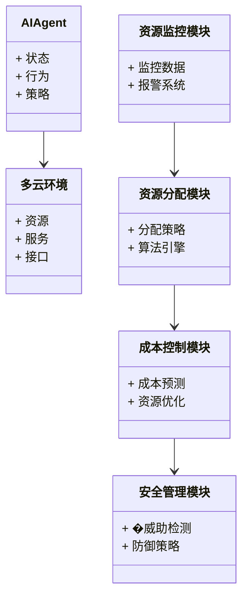
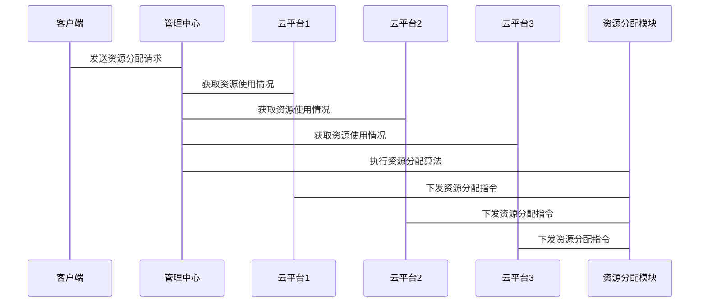

                 

<think>
好的，我现在需要帮助用户设计一本书的目录，这本书的标题是《企业AI Agent的多云环境管理策略》。用户希望目录结构清晰，内容详尽，涵盖从基础概念到实际应用的各个方面。

首先，我需要理解用户的需求。这本书的目标读者是企业IT管理者和技术人员，他们可能对AI Agent和多云环境有一定的了解，但需要深入探讨如何在多云环境中有效管理AI Agent。因此，目录需要覆盖从基本概念、多云环境的挑战、AI Agent的作用，到具体的算法、系统架构设计，以及实际案例分析。

接下来，我需要分解这个主题。第一部分应该是概述，介绍AI Agent和多云环境的基本概念。这包括AI Agent的定义、特点，多云环境的定义、挑战，以及两者结合的意义。这部分帮助读者打下基础，理解为什么需要在多云环境中管理AI Agent。

第二部分应该详细探讨AI Agent的算法原理。这部分需要涵盖几种主要的算法，如强化学习、图神经网络和机器学习，解释它们如何应用于资源分配、成本控制和安全性问题。每个算法都需要详细说明其原理、实现方法以及优化策略，并通过实际案例进行分析，使读者能够理解并应用这些算法。

第三部分涉及系统架构设计。这部分需要介绍如何设计支持AI Agent的多云管理系统，包括模块划分、交互流程以及系统接口设计。使用Mermaid图来展示系统架构和交互流程，能够更直观地帮助读者理解。

第四部分是项目实战，这部分需要通过一个具体案例来展示如何在实际中应用这些策略。从环境安装、核心代码实现到案例分析，都需要详细说明，让读者能够跟随步骤进行实际操作，并从中学到如何解决实际问题。

最后，第五部分总结与展望，回顾全书的内容，并展望未来的发展趋势，同时给出一些最佳实践的建议，帮助读者更好地理解和应用所学知识。

在思考过程中，我需要确保每个章节都有足够的细节，比如在算法部分，不仅要解释理论，还要提供代码示例和实际应用案例。此外，系统架构部分需要使用Mermaid图来展示，使结构更清晰。

总的来说，这本书的结构应该是从基础概念到技术细节，再到实际应用，层层递进，确保读者能够全面掌握企业AI Agent在多云环境管理中的策略和方法。
</think>

# 企业AI Agent的多云环境管理策略

---

## 关键词：
企业AI Agent、多云环境、资源分配、成本控制、安全性优化、AI算法、系统架构设计

---

## 摘要：
本文系统阐述了企业AI Agent在多云环境管理中的策略与方法。首先介绍了AI Agent和多云环境的基本概念及其在企业管理中的重要性，然后深入分析了多云环境中的资源分配、成本控制和安全性优化等问题。接着，详细探讨了AI Agent在多云环境管理中的算法原理，包括强化学习、图神经网络和机器学习等技术，并通过实际案例进行了分析。最后，结合系统架构设计和项目实战，提出了具体的实现方案和最佳实践。本文旨在为企业技术管理者和技术人员提供理论指导和实践参考，帮助其更好地应对多云环境下的AI Agent管理挑战。

---

## 第一部分: 企业AI Agent的多云环境管理策略概述

### 第1章: AI Agent与多云环境的基本概念

#### 1.1 AI Agent的定义与特点
- **1.1.1 AI Agent的定义**
  - AI Agent（人工智能代理）是指能够感知环境、自主决策并执行任务的智能实体。
  - AI Agent可以是软件程序、机器人或其他智能设备，具备自主性、反应性和社会性等特点。

- **1.1.2 AI Agent的核心特点**
  - 自主性：AI Agent能够独立决策和行动，无需人工干预。
  - 反应性：能够实时感知环境变化并做出响应。
  - 社会性：能够与其他系统、设备或用户进行交互和协作。

- **1.1.3 企业级AI Agent的应用场景**
  - 企业资源管理：如ERP系统中的智能决策支持。
  - 生产优化：如制造业中的智能调度系统。
  - 客户服务：如智能客服机器人。

#### 1.2 多云环境的定义与挑战
- **1.2.1 多云环境的定义**
  - 多云环境是指企业同时使用多个云服务提供商（如AWS、Azure、阿里云等）构建 IT 基础设施的环境。
  - 多云环境的特点包括资源分散、服务异构、管理复杂等。

- **1.2.2 多云环境的主要特点**
  - 资源分散：计算资源分布在多个云平台上。
  - 服务异构：不同云平台提供的服务接口和性能存在差异。
  - 管理复杂：需要统一管理多个云平台的资源和数据。

- **1.2.3 多云环境在企业中的应用现状**
  - 企业为了规避单点故障、降低运营成本，选择多云部署。
  - 多云环境能够提高企业的灵活性和扩展性。

#### 1.3 企业AI Agent与多云环境的结合
- **1.3.1 AI Agent在多云环境中的作用**
  - AI Agent可以优化多云环境中的资源分配、成本控制和安全性。
  - AI Agent能够实现多云环境的智能监控和自动化运维。

- **1.3.2 多云环境下AI Agent的优势**
  - 提高资源利用率：通过AI算法优化资源分配。
  - 降低运营成本：通过智能决策减少浪费。
  - 提升安全性：通过AI进行实时威胁检测和防御。

- **1.3.3 企业采用AI Agent管理多云环境的必要性**
  - 多云环境的复杂性要求智能化的管理工具。
  - AI Agent能够显著提高企业的运营效率和安全性。

---

## 第二部分: 多云环境管理的核心问题

### 第2章: 多云环境管理的核心问题

#### 2.1 多云环境的资源分配问题
- **2.1.1 资源分配的基本概念**
  - 资源分配是指将计算资源（如CPU、内存）合理分配给不同的任务或服务。
  - 资源分配的目标是最大化资源利用率和系统性能。

- **2.1.2 资源分配的挑战**
  - 多云环境下资源分布分散，难以统一调度。
  - 不同云平台的资源性能和价格差异大，增加了优化的难度。
  - 资源需求动态变化，需要实时调整分配策略。

- **2.1.3 资源分配的优化目标**
  - 最小化资源浪费。
  - 提高系统响应速度。
  - 降低运营成本。

#### 2.2 多云环境的成本控制问题
- **2.2.1 成本控制的基本概念**
  - 成本控制是指在多云环境下，通过优化资源使用策略，降低企业的云服务成本。
  - 成本控制的目标是实现成本最小化，同时保证系统的性能和可靠性。

- **2.2.2 成本控制的挑战**
  - 不同云平台的价格差异大，难以找到最优组合。
  - 资源需求动态变化，增加了成本预测的难度。
  - 需要实时监控和调整资源使用策略。

- **2.2.3 成本控制的优化策略**
  - 基于历史数据的预测模型。
  - 动态调整资源分配策略。
  - 利用AI算法进行成本优化。

#### 2.3 多云环境的安全性问题
- **2.3.1 安全性的基本概念**
  - 多云环境中的安全性是指保护企业数据和系统免受网络攻击和数据泄露。
  - 安全性问题包括数据隐私、访问控制和身份认证等方面。

- **2.3.2 安全性的挑战**
  - 多云环境下数据分散存储，增加了安全管理的难度。
  - 不同云平台的安全策略不一致，难以统一管理。
  - 网络攻击针对多云环境的复杂性增加。

- **2.3.3 安全性的优化策略**
  - 建立统一的安全管理平台。
  - 实施细粒度的访问控制。
  - 利用AI技术进行实时威胁检测。

---

## 第三部分: AI Agent的算法原理

### 第3章: AI Agent的算法原理

#### 3.1 基于强化学习的资源分配算法
- **3.1.1 强化学习的基本概念**
  - 强化学习是一种机器学习范式，通过智能体与环境的交互，学习最优策略。
  - 强化学习的核心是通过奖励机制，引导智能体做出最优决策。

- **3.1.2 资源分配的强化学习模型**
  - 状态空间：表示当前资源使用情况和任务需求。
  - 动作空间：表示可能的资源分配决策。
  - 奖励函数：根据资源利用率和系统性能，给出奖励或惩罚。

- **3.1.3 算法实现与优化**
  - 使用深度强化学习框架（如DQN）进行资源分配。
  - 通过经验回放和策略优化，提升算法的收敛性和稳定性。

#### 3.2 基于图神经网络的多云环境分析
- **3.2.1 图神经网络的基本概念**
  - 图神经网络是一种处理图结构数据的深度学习模型。
  - 图神经网络能够捕捉图中节点之间的关系和全局结构信息。

- **3.2.2 多云环境的图模型构建**
  - 将多云环境中的云平台、资源和任务建模为图的节点。
  - 根据资源依赖关系和任务调度关系，构建图的边。

- **3.2.3 算法实现与优化**
  - 使用图神经网络进行资源分配和任务调度。
  - 通过注意力机制和门控机制，提升模型的表达能力。

#### 3.3 基于机器学习的成本预测模型
- **3.3.1 成本预测的基本概念**
  - 成本预测是基于历史数据和当前需求，预测未来的云服务成本。
  - 成本预测的目标是为资源分配提供决策支持。

- **3.3.2 成本预测的机器学习模型**
  - 使用回归模型（如线性回归、随机森林）进行成本预测。
  - 通过特征工程，提取影响成本的关键因素。

- **3.3.3 算法实现与优化**
  - 数据预处理和特征选择。
  - 模型训练和调优。
  - 模型评估和部署。

---

## 第四部分: 系统架构设计与项目实战

### 第4章: 系统架构设计与项目实战

#### 4.1 问题场景介绍
- 企业需要在多云环境下管理AI Agent，实现资源优化、成本控制和安全性提升。

#### 4.2 系统功能设计
- **功能模块划分**
  - 资源监控模块：实时监控多云环境中的资源使用情况。
  - 资源分配模块：基于AI算法进行资源分配。
  - 成本控制模块：优化资源使用策略，降低运营成本。
  - 安全管理模块：进行实时威胁检测和防御。

- **领域模型（Mermaid类图）**

- **系统架构设计（Mermaid架构图）**

#### 4.3 系统接口设计
- **API接口**
  - 资源监控接口：获取各云平台的资源使用情况。
  - 资源分配接口：下发资源分配指令。
  - 成本控制接口：调整资源使用策略。
  - 安全管理接口：进行威胁检测和防御。

#### 4.4 系统交互设计（Mermaid序列图）

---

## 第五部分: 总结与展望

### 第5章: 总结与展望

#### 5.1 总结
- 本文系统阐述了企业AI Agent在多云环境管理中的策略与方法。
- 通过算法和系统架构设计，展示了AI Agent在资源分配、成本控制和安全性优化中的重要作用。

#### 5.2 展望
- 随着AI技术的不断发展，AI Agent在多云环境管理中的应用将更加广泛。
- 未来的研究方向包括更高效的算法设计、更智能的系统架构以及更安全的管理策略。

---

## 附录: 作者信息

作者：AI天才研究院/AI Genius Institute & 禅与计算机程序设计艺术 /Zen And The Art of Computer Programming

