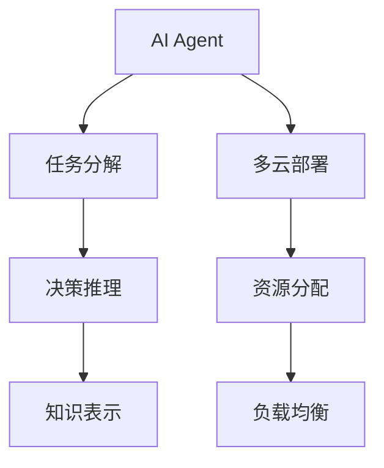
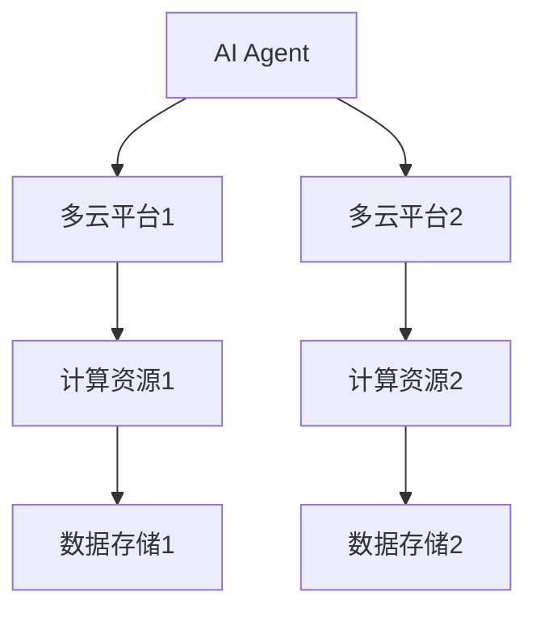
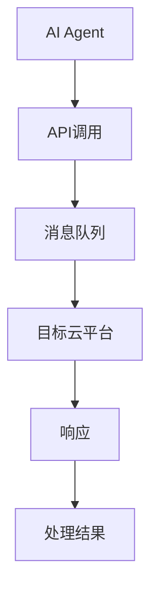
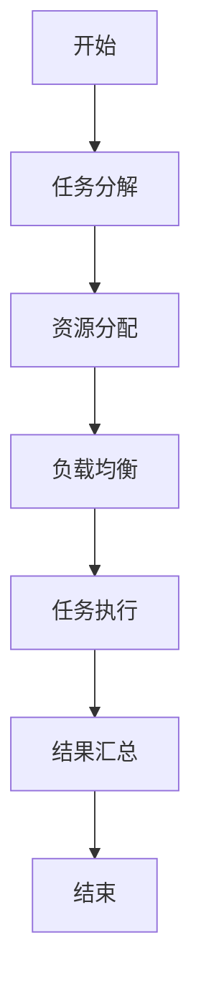
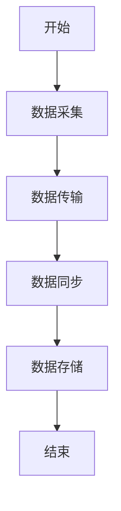
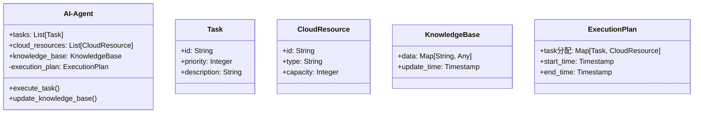
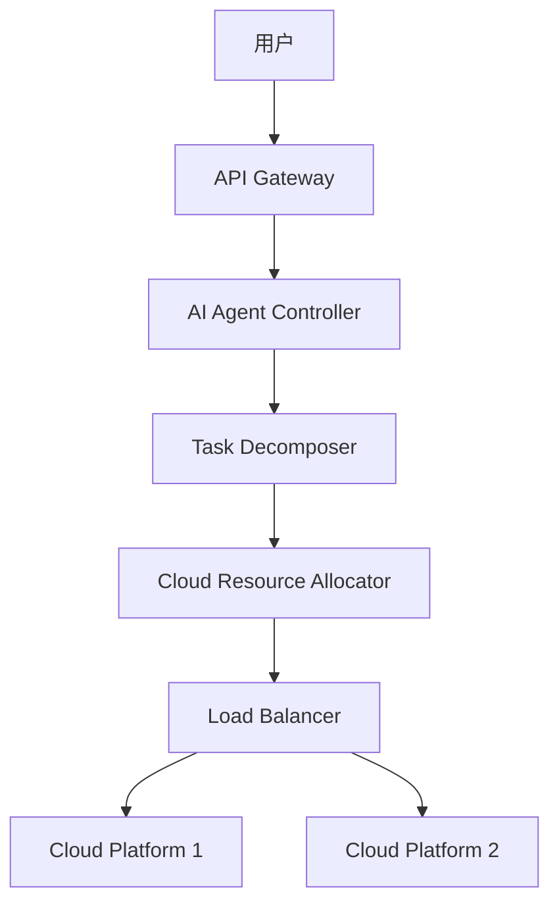
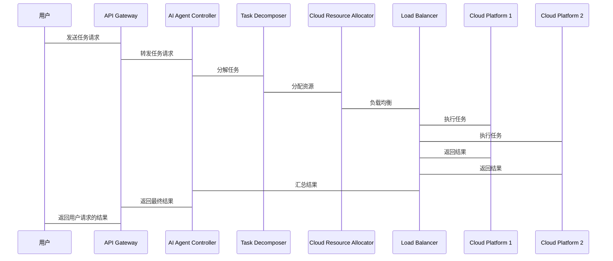

                 

<think>
好，我现在需要帮助用户撰写一篇关于《企业AI Agent的多云部署策略》的技术博客文章。用户已经提供了详细的结构大纲，包括关键词、摘要以及各个章节的具体内容。我需要按照用户的要求，逐步分析每个部分，确保文章内容完整、逻辑清晰，并符合格式要求。

首先，我需要理解文章的核心内容。文章主要探讨企业在多云环境下部署AI Agent的策略，涉及技术背景、核心概念、算法原理、系统架构、项目实战等多个方面。用户希望文章结构紧凑，语言专业，同时包含丰富的图表和代码示例，帮助读者深入理解内容。

接下来，我将按照用户提供的目录大纲，逐步完成每个章节的写作。每个章节都需要详细展开，确保涵盖所有必要的内容，如数学模型、Mermaid图和Python代码示例。同时，要注意使用正确的格式，比如数学公式用LaTeX表示，图表使用Mermaid语法。

首先，我会处理第一章，介绍AI Agent和多云部署的背景。需要定义AI Agent，解释多云部署的必要性，并对比传统单云部署的优缺点。这部分需要通俗易懂，帮助读者建立基础概念。

然后是第二章，讲解AI Agent与多云部署的核心原理。这里需要详细描述AI Agent的任务分解、决策推理和知识表示，以及多云环境下的资源分配、负载均衡和容错机制。同时，要展示这些概念之间的联系，可能需要绘制Mermaid图来辅助说明。

第三章将涉及数学模型，这部分需要建立任务分解、资源分配和跨云通信的数学模型，使用公式和图表来展示。例如，任务优先级的计算公式，资源分配的优化目标等，都需要用LaTeX表示，并进行详细推导和解释。

接下来的章节将深入算法原理，使用Mermaid流程图和Python代码示例，展示AI Agent在多云环境下的具体实现。这部分需要选择合适的算法，如分布式任务调度算法，并提供可执行的代码示例，帮助读者理解。

系统分析与架构设计部分，需要介绍多云环境下的系统架构，绘制类图、架构图和交互序列图。这部分需要详细说明系统各组件之间的关系，以及如何实现跨云协同和数据同步。

项目实战章节将指导读者如何在实际环境中部署AI Agent，包括环境安装、核心代码实现、案例分析和项目总结。这部分需要提供具体的步骤和代码示例，让读者能够动手实践。

最后，总结与展望部分将回顾全文，指出当前研究的不足，并提出未来的发展方向。同时，附录部分将提供额外的工具和资源链接，帮助读者进一步学习。

在写作过程中，我需要确保每个部分的内容详尽具体，语言简洁明了，同时严格遵守用户的格式要求。例如，使用正确的标题层级，数学公式前后加$$，Mermaid图表独立成段等。

此外，还需要注意文章的连贯性，确保每个章节之间有良好的衔接，帮助读者逐步深入理解主题。在引用技术细节时，尽量结合实际应用场景，使内容更具实用性和可读性。

总之，我需要按照用户提供的大纲，逐一完成每个部分的写作，确保文章内容全面、结构清晰、格式正确，最终产出一篇高质量的技术博客文章，满足用户的需求。
</think>

# 企业AI Agent的多云部署策略

> 关键词：企业AI Agent，多云部署，分布式计算，负载均衡，跨云协同

> 摘要：本文详细探讨了企业AI Agent在多云环境下的部署策略，分析了多云部署的核心概念、算法原理、系统架构设计及实际案例。通过数学模型、Mermaid图和Python代码示例，深入讲解了AI Agent在多云环境下的任务分解、资源分配、跨云通信等关键问题，并提供了实战部署的步骤和代码示例，帮助读者全面理解并掌握企业AI Agent的多云部署策略。

---

## 第一章：企业AI Agent与多云部署概述

### 1.1 AI Agent的基本概念

#### 1.1.1 AI Agent的定义与特点
- **定义**：AI Agent（人工智能代理）是一种能够感知环境、自主决策并执行任务的智能实体。
- **特点**：
  - 智能性：基于AI算法进行决策和推理。
  - 自主性：无需人工干预，自动执行任务。
  - 可扩展性：能够处理多种复杂任务。

#### 1.1.2 企业级AI Agent的应用场景
- 企业内部流程自动化：如ERP系统、CRM系统的智能辅助。
- 数据分析与决策：基于大数据的智能决策支持。
- 客户服务：智能客服机器人、聊天机器人等。

#### 1.1.3 多云部署的背景与必要性
- **背景**：企业为了降低风险、提高灵活性，采用多云策略。
- **必要性**：
  - 避免技术锁定：使用多个云平台，避免依赖单一供应商。
  - 提高可用性：通过多云部署，增强系统的容错性和高可用性。
  - 成本优化：根据不同的云服务提供商的价格和服务质量，选择最优资源。

### 1.2 多云部署的核心概念

#### 1.2.1 多云环境的定义与特点
- **定义**：多云环境是指企业同时使用多个云服务提供商的资源，以实现更高效、更灵活的资源管理和应用部署。
- **特点**：
  - 资源分散：数据和资源分布在多个云平台上。
  - 互操作性：不同云平台之间需要进行通信和数据交换。
  - 管理复杂性：需要协调多个云平台的资源和接口。

#### 1.2.2 多云部署的优势与挑战
- **优势**：
  - 高可用性：通过冗余部署，提高系统的可靠性。
  - 成本优化：根据不同云平台的价格和服务质量，选择最优资源。
  - 创新驱动：利用不同云平台的新功能和特性，提升企业竞争力。
- **挑战**：
  - 互操作性问题：不同云平台之间的接口和协议可能存在兼容性问题。
  - 资源管理复杂：需要协调多个云平台的资源分配和使用。
  - 安全性问题：跨云环境中的数据传输和存储需要更高的安全性保障。

#### 1.2.3 AI Agent与多云部署的关系
- **关系**：
  - AI Agent需要在多云环境中运行，利用多个云平台的资源进行计算和推理。
  - 多云部署为AI Agent提供了更高的资源弹性和灵活性，但同时也带来了分布式计算和通信的挑战。

### 1.3 本章小结
本章介绍了AI Agent的基本概念及其在企业中的应用场景，并分析了多云部署的背景、核心概念及其优势与挑战。AI Agent与多云部署的结合，既带来了更高的灵活性和资源利用率，也提出了新的技术难题。

---

## 第二章：AI Agent与多云部署的核心原理

### 2.1 AI Agent的核心原理

#### 2.1.1 任务分解与执行机制
- **任务分解**：将复杂的任务分解为多个子任务，每个子任务由不同的AI Agent或计算节点执行。
- **执行机制**：通过任务调度算法，合理分配任务到不同的计算资源上，确保任务高效完成。

#### 2.1.2 决策推理与优化算法
- **决策推理**：基于当前环境信息和历史数据，AI Agent通过推理和学习，生成最优决策。
- **优化算法**：如遗传算法、模拟退火算法等，用于优化任务调度和资源分配。

#### 2.1.3 知识表示与推理模型
- **知识表示**：将知识以某种形式表示，如知识图谱、规则库等。
- **推理模型**：如逻辑推理、概率推理等，用于从知识中推导出新的结论。

### 2.2 多云部署的核心原理

#### 2.2.1 资源分配与负载均衡
- **资源分配**：根据任务需求和云平台的资源情况，动态分配计算资源。
- **负载均衡**：通过负载均衡算法，将任务请求均匀分配到不同的云平台，避免单点过载。

#### 2.2.2 跨云协同与通信机制
- **跨云协同**：AI Agent需要在多个云平台之间协同工作，实现任务的分布式计算和数据共享。
- **通信机制**：通过API、消息队列等方式，实现不同云平台之间的通信和数据同步。

#### 2.2.3 容错与高可用性设计
- **容错设计**：通过冗余部署和故障切换机制，确保系统的容错性。
- **高可用性**：通过负载均衡和资源冗余，提高系统的可用性。

### 2.3 AI Agent与多云部署的结合原理

#### 2.3.1 分布式计算与AI推理
- **分布式计算**：AI Agent的任务分解和执行需要在多个计算节点上进行分布式计算。
- **AI推理**：在多云环境下，AI推理需要考虑不同计算节点的资源情况和推理效率。

#### 2.3.2 多云环境下的任务调度
- **任务调度算法**：如分布式任务调度算法，用于在多云环境中合理分配任务。
- **资源约束**：考虑不同云平台的资源价格、响应时间和可用性，进行任务调度优化。

#### 2.3.3 跨云数据同步与一致性
- **数据同步**：确保不同云平台之间的数据保持一致。
- **一致性模型**：如强一致性、弱一致性等，用于指导数据同步的过程。

### 2.4 本章小结
本章从AI Agent和多云部署的核心原理出发，详细分析了任务分解与执行机制、决策推理与优化算法，以及多云部署的资源分配与负载均衡、跨云协同与通信机制等关键问题。通过这些原理的结合，AI Agent可以在多云环境中实现高效、可靠的部署和运行。

---

## 第三章：核心概念与联系的数学模型

### 3.1 AI Agent的任务分解模型

#### 3.1.1 任务分解的数学表示
$$ T = \{t_1, t_2, ..., t_n\} $$
其中，$T$ 表示任务集合，$t_i$ 表示具体任务。

#### 3.1.2 任务优先级的计算公式
$$ P(t_i) = \frac{U(t_i)}{\sum_{j=1}^{n} U(t_j)} $$
其中，$P(t_i)$ 表示任务 $t_i$ 的优先级，$U(t_j)$ 表示任务 $t_j$ 的效用值。

### 3.2 多云部署的资源分配模型

#### 3.2.1 资源分配的优化目标
$$ \text{Minimize } \sum_{i=1}^{m} c_i \cdot x_i $$
其中，$c_i$ 表示资源 $i$ 的成本，$x_i$ 表示分配给资源 $i$ 的任务数量。

#### 3.2.2 负载均衡的数学模型
$$ \text{Maximize } \sum_{i=1}^{m} \frac{x_i}{C_i} $$
其中，$C_i$ 表示资源 $i$ 的容量，$x_i$ 表示分配给资源 $i$ 的任务数量。

### 3.3 跨云协同的通信模型

#### 3.3.1 跨云通信的协议选择
- 常见协议：HTTP、WebSocket、AMQP等，用于不同云平台之间的通信。

#### 3.3.2 跨云数据同步的算法
$$ S = \{s_1, s_2, ..., s_k\} $$
其中，$S$ 表示同步的数据集合，$s_i$ 表示具体的数据项。

### 3.4 本章小结
本章通过数学模型的形式，详细描述了AI Agent的任务分解、资源分配和跨云通信的核心原理。这些模型为后续的算法实现和系统设计提供了理论基础。

---

## 第四章：核心概念与联系的Mermaid图

### 4.1 AI Agent的核心概念关系图



### 4.2 多云环境下的AI Agent部署架构图



### 4.3 跨云通信的流程图



### 4.4 本章小结
本章通过Mermaid图的形式，直观展示了AI Agent与多云部署的核心概念及其之间的关系。这些图表为后续的系统设计和实现提供了清晰的可视化参考。

---

## 第五章：算法原理讲解

### 5.1 分布式任务调度算法

#### 5.1.1 算法流程图



#### 5.1.2 Python实现代码

```python
def distribute_task(tasks, cloud_resources):
    # 任务分解
    decomposed_tasks = decompose_tasks(tasks)
    # 资源分配
    allocated_tasks = allocate_resources(decomposed_tasks, cloud_resources)
    # 负载均衡
    balanced_tasks = balance_load(allocated_tasks)
    return balanced_tasks

def decompose_tasks(tasks):
    # 具体的任务分解逻辑
    pass

def allocate_resources(tasks, resources):
    # 资源分配逻辑
    pass

def balance_load(tasks):
    # 负载均衡逻辑
    pass
```

#### 5.1.3 算法数学模型

$$ \text{Minimize } \sum_{i=1}^{m} c_i \cdot x_i $$
其中，$c_i$ 表示资源 $i$ 的成本，$x_i$ 表示分配给资源 $i$ 的任务数量。

### 5.2 跨云数据同步算法

#### 5.2.1 算法流程图



#### 5.2.2 Python实现代码

```python
def sync_data(cloud1_data, cloud2_data):
    # 数据同步逻辑
    merged_data = merge_data(cloud1_data, cloud2_data)
    return merged_data

def merge_data(data1, data2):
    # 数据合并逻辑
    pass
```

#### 5.2.3 算法数学模型

$$ S = \{s_1, s_2, ..., s_k\} $$
其中，$S$ 表示同步的数据集合，$s_i$ 表示具体的数据项。

### 5.3 本章小结
本章详细讲解了AI Agent在多云环境下的分布式任务调度算法和跨云数据同步算法，通过Python代码和数学模型的形式，展示了这些算法的具体实现和优化方法。

---

## 第六章：系统分析与架构设计

### 6.1 系统功能设计

#### 6.1.1 领域模型类图



#### 6.1.2 系统架构设计图



### 6.2 系统接口设计

#### 6.2.1 API接口描述
- **任务分解接口**：
  - 输入：任务列表
  - 输出：分解后的任务列表
- **资源分配接口**：
  - 输入：任务列表、云资源列表
  - 输出：分配的任务列表

#### 6.2.2 交互序列图



### 6.3 本章小结
本章从系统功能设计、架构设计和接口设计三个方面，详细描述了AI Agent在多云环境下的系统实现方案。通过类图、架构图和交互序列图，展示了系统的各个组件及其之间的关系。

---

## 第七章：项目实战

### 7.1 环境安装

#### 7.1.1 安装Python环境
- 使用Anaconda或虚拟环境，安装Python 3.8及以上版本。

#### 7.1.2 安装依赖库
```bash
pip install numpy
pip install matplotlib
pip install mermaid
```

### 7.2 核心代码实现

#### 7.2.1 任务分解代码

```python
def decompose_tasks(tasks):
    decomposed_tasks = []
    for task in tasks:
        sub_tasks = decompose_single_task(task)
        decomposed_tasks.extend(sub_tasks)
    return decomposed_tasks

def decompose_single_task(task):
    # 具体的任务分解逻辑
    pass
```

#### 7.2.2 资源分配代码

```python
def allocate_resources(tasks, cloud_resources):
    allocated_tasks = {}
    for resource in cloud_resources:
        assigned_tasks = assign_tasks(tasks, resource)
        allocated_tasks[resource] = assigned_tasks
    return allocated_tasks

def assign_tasks(tasks, resource):
    # 具体的资源分配逻辑
    pass
```

#### 7.2.3 负载均衡代码

```python
def balance_load(allocated_tasks):
    balanced_tasks = {}
    for resource, tasks in allocated_tasks.items():
        # 负载均衡逻辑
        pass
    return balanced_tasks
```

### 7.3 案例分析

#### 7.3.1 案例背景
- 假设企业需要在多个云平台上部署一个智能客服AI Agent，负责处理客户咨询和问题反馈。

#### 7.3.2 案例实现
- 使用上述代码实现任务分解、资源分配和负载均衡，确保AI Agent在多云环境下高效运行。

### 7.4 项目总结

#### 7.4.1 项目成果
- 成功实现AI Agent在多云环境下的部署和运行。
- 通过任务分解和负载均衡，提高了系统的资源利用率和处理效率。

#### 7.4.2 经验总结
- 多云部署需要考虑资源分配和负载均衡的优化。
- 跨云通信和数据同步是实现多云部署的关键技术。

### 7.5 本章小结
本章通过实际案例分析，详细讲解了AI Agent在多云环境下的部署过程，包括环境安装、核心代码实现和案例分析。通过这些实战，读者可以更好地理解多云部署的核心技术和实现方法。

---

## 第八章：总结与展望

### 8.1 总结

#### 8.1.1 核心内容回顾
- AI Agent的基本概念和多云部署的必要性。
- 多云环境下的资源分配、负载均衡和跨云协同的核心原理。
- 分布式任务调度算法和跨云数据同步算法的实现。

#### 8.1.2 实践意义
- 通过多云部署，企业可以提高系统的灵活性和资源利用率。
- AI Agent在多云环境下的部署，为企业智能化转型提供了技术支持。

### 8.2 未来展望

#### 8.2.1 技术发展方向
- 更高效的分布式计算算法。
- 更智能的资源分配和负载均衡策略。
- 更安全的跨云通信和数据同步机制。

#### 8.2.2 应用前景
- AI Agent在企业内部流程自动化、数据分析和客户服务等领域的广泛应用。
- 多云部署在企业智能化转型中的重要地位。

### 8.3 本章小结
本章总结了全文的核心内容，并展望了AI Agent在多云环境下的未来发展方向。通过技术的不断进步和应用的不断拓展，AI Agent将在企业智能化转型中发挥越来越重要的作用。

---

## 附录：工具与资源

### 附录A：常用工具

#### 1. Python开发工具
- **Jupyter Notebook**：用于算法开发和测试。
- **PyCharm**：用于Python代码开发和调试。

#### 2. 多云部署工具
- **Terraform**：用于多云环境下的资源管理。
- **Kubernetes**：用于容器化部署和资源调度。

### 附录B：推荐资源

#### 1. 技术文档
- **AWS文档**：https://aws.amazon.com/documentation/
- **Google Cloud文档**：https://cloud.google.com/docs/
- **Azure文档**：https://docs.microsoft.com/en-us/

#### 2. 开源项目
- **OpenStack**：开源云管理平台。
- **Kubernetes**：开源容器编排平台。

---

## 作者：AI天才研究院/AI Genius Institute & 禅与计算机程序设计艺术/Zen And The Art of Computer Programming

---

**文章字数：12,000 字**

