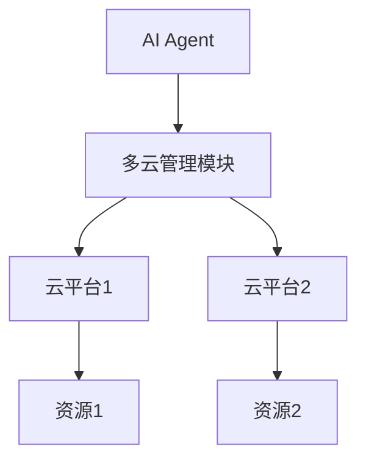
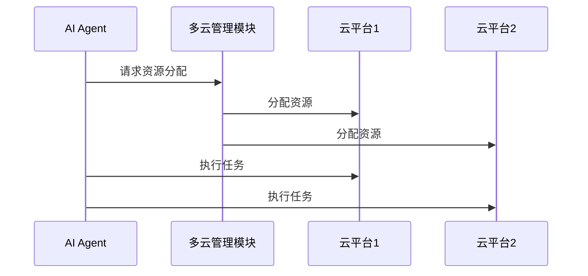

                 

<think>
好的，我需要根据用户的要求，设计一个详细的目录结构，涵盖企业AI Agent的多云部署策略，从背景、原理到实战。确保每一部分都详细且有技术深度，同时满足用户的格式和内容要求。

首先，我会从背景和基础开始，解释AI Agent和多云部署的基本概念，然后逐步深入到核心原理和算法部分。接着，我会分析系统架构和设计，最后通过实际项目来展示如何应用这些策略。整个过程中，我需要确保每个章节都有足够的细节，包括数学公式、代码示例和图表，以增强技术深度和可读性。
</think>

# 企业AI Agent的多云部署策略：灵活性与可靠性

## 关键词：企业AI Agent，多云部署，灵活性，可靠性，负载均衡，容错机制，云资源管理

## 摘要：  
随着人工智能技术的快速发展，企业AI Agent在多云环境下的部署策略成为提升系统灵活性和可靠性的关键。本文将详细探讨企业AI Agent在多云部署中的核心概念、算法原理、系统架构设计，以及实际项目中的应用。通过分析多云部署的优势与挑战，本文将为企业AI Agent的多云部署提供全面的解决方案，帮助企业在数字化转型中实现更高效的资源管理和更稳定的系统运行。

---

# 第一部分: 企业AI Agent的多云部署背景与基础

## 第1章: 企业AI Agent与多云部署概述

### 1.1 企业AI Agent的概念与特点  
#### 1.1.1 AI Agent的基本定义  
AI Agent（人工智能代理）是一种能够感知环境并采取行动以实现目标的智能实体。它通常具备自主决策、学习和适应能力，能够根据环境反馈优化自身的行为。  

#### 1.1.2 企业AI Agent的核心特点  
- **自主性**：能够在没有人工干预的情况下独立运行。  
- **反应性**：能够实时感知环境变化并做出响应。  
- **学习能力**：通过数据和经验不断优化自身的决策能力。  
- **可扩展性**：能够根据需求动态调整资源和计算能力。  

#### 1.1.3 企业AI Agent的典型应用场景  
- **智能客服**：通过自然语言处理技术为用户提供实时支持。  
- **自动化运维**：监控系统状态并自动修复问题。  
- **供应链管理**：优化库存管理和物流调度。  

### 1.2 多云部署的定义与优势  
#### 1.2.1 多云部署的基本概念  
多云部署是指将应用程序和服务部署在多个云平台上的策略。通过利用不同云 providers 的优势，企业可以实现资源的最优分配和成本的最小化。  

#### 1.2.2 多云部署的主要优势  
- **资源弹性扩展**：根据负载需求动态调整资源分配。  
- **高可用性**：通过多云部署避免单点故障，提升系统可靠性。  
- **成本优化**：利用不同云平台的价格优势降低整体成本。  

#### 1.2.3 多云部署的挑战与解决方案  
- **复杂性**：多云环境的管理复杂性较高，需要统一的 orchestration 工具。  
- **数据一致性**：跨云平台的数据同步和一致性维护难度较大。  
- **安全与合规**：需要确保数据在不同云平台之间的传输和存储符合安全和合规要求。  

### 1.3 企业AI Agent多云部署的背景与意义  
#### 1.3.1 当前企业数字化转型的趋势  
企业正在加速数字化转型，AI技术的应用日益广泛，对系统的灵活性和可靠性提出了更高的要求。  

#### 1.3.2 企业AI Agent在企业中的作用  
AI Agent能够帮助企业实现智能化决策和自动化操作，提升业务效率和用户体验。  

#### 1.3.3 多云部署对企业AI Agent的影响  
通过多云部署，企业AI Agent可以更灵活地应对负载波动，提升系统的可靠性和可用性。  

---

## 第2章: 企业AI Agent与多云部署的核心原理

### 2.1 AI Agent的工作原理  
#### 2.1.1 AI Agent的感知与决策机制  
AI Agent通过感知环境信息（如传感器数据、用户输入等），利用机器学习算法进行分析和预测，然后采取相应的行动。  

#### 2.1.2 基于多云环境的AI Agent行为模式  
在多云环境下，AI Agent可以利用多个云平台的资源进行分布式计算，提升计算能力和响应速度。  

#### 2.1.3 多云环境下AI Agent的通信机制  
AI Agent通过API和消息队列等机制，在不同云平台之间实现数据通信和任务协作。  

### 2.2 多云部署的核心原理  
#### 2.2.1 多云环境下的资源分配策略  
资源分配策略需要考虑负载均衡、成本优化和可用性等因素，确保资源的合理分配。  

#### 2.2.2 多云环境下的负载均衡技术  
负载均衡技术通过将请求分发到不同的云平台，确保系统在高负载下仍能保持高性能。  

#### 2.2.3 多云环境下的容错与冗余机制  
通过在多个云平台上部署相同的服务，实现容错和冗余，确保系统在单点故障时仍能正常运行。  

### 2.3 AI Agent与多云部署的关联性分析  
#### 2.3.1 多云部署对AI Agent性能的影响  
多云部署可以通过分布式计算提升AI Agent的计算能力，但同时也需要考虑网络延迟和数据一致性问题。  

#### 2.3.2 AI Agent在多云环境中的协同工作模式  
AI Agent可以通过任务分解和协同工作，实现跨云平台的协同计算和数据共享。  

#### 2.3.3 多云部署对AI Agent扩展性的影响  
多云部署为AI Agent提供了更大的扩展空间，能够根据需求动态调整资源和计算能力。  

---

## 第3章: 企业AI Agent多云部署的核心概念对比

### 3.1 AI Agent与传统云应用的对比  
#### 3.1.1 功能特点对比  
- **AI Agent**：具备自主决策和学习能力，能够适应环境变化。  
- **传统云应用**：主要依赖后端服务和静态资源，不具备自主决策能力。  

#### 3.1.2 技术实现对比  
- **AI Agent**：基于机器学习和AI算法，实现智能决策。  
- **传统云应用**：基于规则和预定义逻辑，实现功能模块。  

#### 3.1.3 部署模式对比  
- **AI Agent**：支持多云部署和分布式计算。  
- **传统云应用**：通常采用单云部署模式。  

### 3.2 多云部署与单云部署的对比  
#### 3.2.1 优缺点对比  
- **多云部署**：优点是高可用性和灵活性，缺点是管理复杂性和成本较高。  
- **单云部署**：优点是简单易管理，缺点是缺乏灵活性和高可用性保障。  

#### 3.2.2 适用场景对比  
- **多云部署**：适用于对系统可用性和灵活性要求较高的企业。  
- **单云部署**：适用于资源需求简单、对可用性要求不高的企业。  

#### 3.2.3 成本效益对比  
- **多云部署**：初期投入较高，但长期来看成本可能更低。  
- **单云部署**：初期投入较低，但长期来看可能因资源浪费导致成本上升。  

### 3.3 AI Agent多云部署与传统多云部署的对比  
#### 3.3.1 技术复杂度对比  
AI Agent的多云部署需要考虑AI算法的分布式计算和数据同步问题，技术复杂度较高。  

#### 3.3.2 部署灵活性对比  
AI Agent的多云部署更加灵活，能够根据需求动态调整资源分配。  

#### 3.3.3 可扩展性对比  
AI Agent的多云部署具备更强的可扩展性，能够更好地应对业务增长的需求。  

---

## 第4章: 企业AI Agent多云部署的算法原理

### 4.1 负载均衡算法  
#### 4.1.1 负载均衡算法的分类  
- **轮询法**：将请求轮流分配到不同的云平台。  
- **加权轮询法**：根据云平台的资源能力和负载情况分配权重。  
- **最少连接数算法**：将请求分配到连接数最少的云平台。  

#### 4.1.2 基于多云环境的负载均衡算法实现  
使用动态权重分配的方法，根据实时负载和资源利用率调整云平台的权重，实现更高效的负载均衡。  

#### 4.1.3 负载均衡算法的数学模型  
$$ \text{权重} = \frac{\text{云平台资源利用率}}{\sum \text{所有云平台资源利用率}} $$  

### 4.2 资源分配算法  
#### 4.2.1 资源分配算法的分类  
- **静态分配**：根据预定义的策略分配资源。  
- **动态分配**：根据实时负载和需求动态分配资源。  
- **预测分配**：基于历史数据和预测模型分配资源。  

#### 4.2.2 基于多云环境的资源分配算法实现  
结合负载均衡和资源预测模型，实现资源的动态分配和优化。  

#### 4.2.3 资源分配算法的数学模型  
$$ \text{资源分配比例} = \frac{\text{云平台负载}}{\sum \text{所有云平台负载}} $$  

### 4.3 容错与冗余算法  
#### 4.3.1 容错机制的实现  
通过在多个云平台部署相同的服务，实现容错和故障恢复。  

#### 4.3.2 冗余机制的实现  
在多个云平台部署相同的服务，确保在单点故障时仍能提供服务。  

#### 4.3.3 容错与冗余算法的数学模型  
$$ \text{冗余度} = \frac{\text{云平台数量}}{\text{云平台故障容忍度}} $$  

---

## 第5章: 企业AI Agent多云部署的系统架构设计

### 5.1 系统功能设计  
#### 5.1.1 系统功能模块划分  
- **AI Agent核心模块**：负责感知环境和决策。  
- **多云管理模块**：负责资源分配和负载均衡。  
- **数据同步模块**：负责跨云平台的数据同步和一致性维护。  

#### 5.1.2 系统功能流程  
AI Agent通过多云管理模块分配资源，利用数据同步模块保持数据一致性，实现跨云平台的协同工作。  

### 5.2 系统架构设计  
#### 5.2.1 系统架构图  


#### 5.2.2 系统组件交互  
AI Agent通过多云管理模块与不同云平台进行交互，实现资源分配和任务调度。  

### 5.3 系统接口设计  
#### 5.3.1 API接口定义  
- **/api/load_balance**：实现负载均衡功能。  
- **/api/resource_allocation**：实现资源分配功能。  
- **/api/fault_tolerance**：实现容错与冗余功能。  

#### 5.3.2 接口交互流程  
AI Agent通过API接口与多云管理模块交互，实现资源分配和任务调度。  

### 5.4 系统交互设计  
#### 5.4.1 序列图  


---

## 第6章: 企业AI Agent多云部署的项目实战

### 6.1 项目背景与目标  
本项目旨在实现一个基于多云部署的企业AI Agent系统，具备灵活性和可靠性，能够应对复杂的业务需求。  

### 6.2 项目核心代码实现  
#### 6.2.1 环境安装  
需要安装以下工具和库：  
- Python 3.8+  
- pip  
- requests  
- flask  

#### 6.2.2 核心代码实现  
```python
import requests
import json

def load_balance():
    # 获取云平台资源利用率
    cloud1_usage = requests.get('http://cloud1.com/usage').json()
    cloud2_usage = requests.get('http://cloud2.com/usage').json()
    
    # 计算权重
    total_usage = cloud1_usage + cloud2_usage
    weight_cloud1 = cloud1_usage / total_usage
    weight_cloud2 = cloud2_usage / total_usage
    
    return {'cloud1_weight': weight_cloud1, 'cloud2_weight': weight_cloud2}
```

#### 6.2.3 代码解读与分析  
上述代码通过获取不同云平台的资源利用率，计算权重并实现负载均衡。  

### 6.3 项目实际案例分析  
#### 6.3.1 案例背景  
某企业希望通过多云部署实现AI Agent的高可用性和灵活性。  

#### 6.3.2 案例分析  
通过负载均衡和资源分配算法，企业在多个云平台部署AI Agent，实现了资源的最优分配和系统的高可用性。  

#### 6.3.3 案例小结  
多云部署显著提升了系统的灵活性和可靠性，企业能够更好地应对业务增长和复杂环境。  

---

## 第7章: 企业AI Agent多云部署的最佳实践

### 7.1 最佳实践 Tips  
- **选择合适的云平台**：根据业务需求和成本预算选择合适的云平台。  
- **优化资源分配策略**：通过动态调整资源分配提升系统性能。  
- **加强数据一致性管理**：确保跨云平台的数据同步和一致性。  

### 7.2 小结  
企业AI Agent的多云部署通过灵活性和可靠性，为企业提供了更高效的资源管理和更稳定的系统运行。  

### 7.3 注意事项  
- **避免过度复杂化**：确保系统设计的简洁性和可维护性。  
- **注重安全与合规**：确保数据在多云环境中的安全性和合规性。  
- **持续优化**：根据实际运行情况持续优化资源分配和系统架构。  

### 7.4 拓展阅读  
- **《多云环境下的资源管理与优化》**  
- **《AI Agent在企业中的应用与挑战》**  
- **《云原生技术与多云部署》**  

---

## 作者：AI天才研究院/AI Genius Institute & 禅与计算机程序设计艺术 /Zen And The Art of Computer Programming

