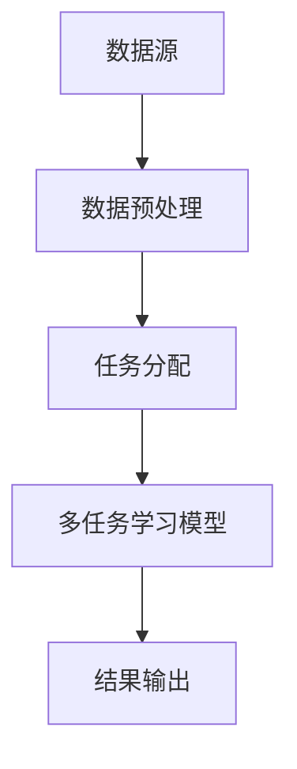

                 


# 企业AI Agent的多任务学习架构：提升效率与通用性

---

## 关键词：  
企业AI Agent、多任务学习、人工智能、机器学习、系统架构、技术实现  

---

## 摘要：  
随着企业智能化转型的推进，AI Agent（人工智能代理）在企业中的应用越来越广泛。为了提高AI Agent的效率和通用性，多任务学习（Multi-task Learning, MTL）成为一种重要的技术手段。本文将详细探讨企业AI Agent的多任务学习架构，从理论基础到实际应用，分析其核心概念、算法原理、系统架构设计以及项目实战案例，为企业AI Agent的高效设计与实现提供深度解析和实践指导。

---

---

## 第一部分：企业AI Agent与多任务学习概述

### 第1章：企业AI Agent与多任务学习概述

#### 1.1 企业AI Agent的定义与特点

- **1.1.1 AI Agent的基本概念**  
  AI Agent（人工智能代理）是一种能够感知环境、自主决策并执行任务的智能实体。它具备以下核心特征：  
  - **自主性**：能够在没有外部干预的情况下独立运行。  
  - **反应性**：能够实时感知环境并做出相应反应。  
  - **目标导向性**：具备明确的目标，并根据目标采取行动。  

- **1.1.2 企业AI Agent的独特属性**  
  企业AI Agent在传统AI Agent的基础上，具备以下独特属性：  
  - **复杂性**：企业环境通常涉及多个部门、业务流程和数据源，使得任务更加复杂。  
  - **高效性**：需要在有限的时间内完成任务，对效率要求较高。  
  - **通用性**：能够处理多种类型的任务，适应不同的业务场景。  

- **1.1.3 多任务学习在AI Agent中的作用**  
  多任务学习（MTL）通过同时学习多个任务，帮助AI Agent提高效率和通用性。MTL的核心优势在于：  
  - **知识共享**：通过共享参数或特征，减少模型的训练数据需求，提高学习效率。  
  - **任务协同**：不同任务之间相互促进，提升整体性能。  
  - **通用性增强**：通过跨任务学习，AI Agent能够更好地适应不同的业务场景。  

#### 1.2 多任务学习的核心概念

- **1.2.1 多任务学习的定义**  
  多任务学习是一种机器学习范式，旨在通过同时学习多个相关任务，共享模型参数或特征，从而提高模型的泛化能力和学习效率。  

- **1.2.2 多任务学习的分类**  
  根据任务之间的关系，多任务学习可以分为以下几类：  
  - **相关任务多任务学习**：任务之间存在直接或间接的关联性。  
  - **无关任务多任务学习**：任务之间没有明显的关联性。  
  - **层次化多任务学习**：任务之间存在层次结构，较高层次的任务对较低层次的任务起指导作用。  

- **1.2.3 多任务学习的优势与挑战**  
  **优势**：  
  - **数据效率提升**：通过共享参数，减少每个任务所需的数据量。  
  - **模型泛化能力增强**：跨任务学习有助于模型更好地泛化到新的任务。  
  - **计算效率提升**：通过并行训练多个任务，提高计算效率。  

  **挑战**：  
  - **任务间干扰**：某些任务可能对模型参数产生负面影响，导致性能下降。  
  - **任务优先级平衡**：如何平衡不同任务的优先级是一个复杂的问题。  
  - **模型设计复杂性**：设计适合多任务学习的模型架构需要较高的技术门槛。  

#### 1.3 企业AI Agent的多任务学习应用前景

- **1.3.1 企业智能化转型的需求**  
  随着企业数字化转型的深入，对智能化工具的需求日益增长。AI Agent作为一种智能实体，能够帮助企业实现自动化、智能化的业务流程管理。  

- **1.3.2 多任务学习在企业中的潜在应用**  
  多任务学习在企业AI Agent中的应用前景广阔，例如：  
  - **客户服务**：同时处理客户咨询、投诉处理和客户满意度分析等任务。  
  - **业务流程优化**：同时优化多个业务流程，提高效率和质量。  
  - **风险管理**：同时进行风险评估、风险预警和风险应对策略制定。  

- **1.3.3 企业AI Agent的未来发展趋势**  
  未来，企业AI Agent将朝着以下方向发展：  
  - **更强的通用性**：通过多任务学习，进一步提升AI Agent的通用性，使其能够处理更多类型的任务。  
  - **更高的效率**：优化模型架构和训练算法，进一步提高AI Agent的效率。  
  - **更深度的业务集成**：与企业现有业务系统更加深度集成，实现无缝协作。  

#### 1.4 本章小结

---

## 第二部分：多任务学习的数学模型与算法原理

### 第2章：多任务学习的数学模型

#### 2.1 多任务学习的参数共享机制

- **2.1.1 参数共享的基本原理**  
  参数共享是多任务学习的核心机制之一，通过共享部分模型参数，实现任务间的知识共享。  
  - **参数共享的数学表示**：假设我们有两个任务，任务1和任务2，它们共享参数$\theta$，具体表示为：  
    $$ f_1(x; \theta) \quad \text{和} \quad f_2(x; \theta) $$  

- **2.1.2 参数共享的优缺点分析**  
  - **优点**：  
    - 减少参数数量，降低模型复杂度。  
    - 提高模型的泛化能力，减少过拟合。  
  - **缺点**：  
    - 可能导致某些任务性能下降，因为参数需要在多个任务之间进行权衡。  

- **2.1.3 参数共享的实现方式**  
  参数共享可以通过多种方式实现，例如：  
  - **全局共享**：所有任务共享相同的参数。  
  - **部分共享**：部分参数共享，部分参数独立。  

#### 2.2 多任务学习的损失函数设计

- **2.2.1 任务间损失函数的协调**  
  在多任务学习中，每个任务都有自己的损失函数，需要进行协调以避免任务间互相干扰。  

- **2.2.2 损失函数的权重分配**  
  为了平衡不同任务的重要性，通常会对每个任务的损失函数赋予不同的权重。  
  - **权重分配的数学表示**：  
    $$ L_{\text{total}} = \sum_{i=1}^{n} \lambda_i L_i $$  
    其中，$\lambda_i$ 是任务$i$的权重，$L_i$ 是任务$i$的损失函数。  

- **2.2.3 损失函数的优化策略**  
  优化策略包括：  
  - **均匀分配权重**：所有任务的权重相同。  
  - **动态调整权重**：根据任务性能自动调整权重。  
  - **任务重要性优先**：根据任务的重要性和难度动态调整权重。  

#### 2.3 多任务学习的优化算法

- **2.3.1 基于梯度下降的优化方法**  
  常用的优化算法包括随机梯度下降（SGD）和Adam优化器。  

- **2.3.2 参数共享的优化策略**  
  参数共享的优化策略需要考虑以下几点：  
  - **任务间梯度的影响**：某些任务的梯度可能对其他任务的参数产生负面影响。  
  - **梯度融合方法**：通过融合不同任务的梯度，优化共享参数。  

- **2.3.3 任务间权重的动态调整**  
  动态调整任务权重的方法包括：  
  - **基于性能的动态调整**：根据每个任务的性能动态调整权重。  
  - **基于时间的动态调整**：根据训练时间动态调整权重。  

#### 2.4 本章小结

---

## 第三部分：多任务学习的系统架构与设计

### 第3章：企业AI Agent的系统架构

#### 3.1 系统模块划分

- **3.1.1 数据采集模块**  
  数据采集模块负责从企业系统中采集多源异构数据，包括结构化数据和非结构化数据。  

- **3.1.2 任务分配模块**  
  任务分配模块负责将多个任务分配给不同的AI Agent或同一AI Agent的不同模块。  

- **3.1.3 多任务学习模块**  
  多任务学习模块是系统的核心，负责同时学习多个任务，并通过参数共享实现任务间的知识共享。  

- **3.1.4 结果输出模块**  
  结果输出模块负责将多任务学习模块的学习结果输出到企业系统中。  

#### 3.2 系统组件设计

- **3.2.1 数据预处理组件**  
  数据预处理组件负责对采集的数据进行清洗、转换和标准化处理。  

- **3.2.2 模型训练组件**  
  模型训练组件负责训练多任务学习模型，包括参数初始化、损失函数定义和优化器选择。  

- **3.2.3 任务执行组件**  
  任务执行组件负责根据训练好的模型执行实际任务，并将结果反馈给企业系统。  

- **3.2.4 性能监控组件**  
  性能监控组件负责监控模型的性能，并根据性能指标动态调整模型参数和任务权重。  

#### 3.3 系统架构图



#### 3.4 系统接口设计

- **3.4.1 数据接口**  
  数据接口负责与企业系统进行数据交互，包括数据的输入和输出。  

- **3.4.2 模型接口**  
  模型接口负责与训练组件进行交互，包括模型参数的更新和任务权重的调整。  

- **3.4.3 结果接口**  
  结果接口负责将模型的学习结果输出到企业系统中，供业务部门使用。  

#### 3.5 本章小结

---

## 第四部分：多任务学习的算法实现与项目实战

### 第4章：多任务学习算法的Python实现

#### 4.1 多任务学习算法的数学模型

- **4.1.1 多任务学习的数学表示**  
  假设我们有$n$个任务，每个任务的损失函数为$L_i$，共享参数$\theta$。总的损失函数为：  
  $$ L_{\text{total}} = \sum_{i=1}^{n} \lambda_i L_i $$  

- **4.1.2 参数共享的实现**  
  在Python中，可以通过Keras或TensorFlow框架实现参数共享。  

#### 4.2 多任务学习算法的Python代码实现

```python
import tensorflow as tf

# 定义多任务模型
def multi_task_model(input_shape, num_tasks, shared_units):
    inputs = tf.keras.Input(shape=input_shape)
    x = tf.keras.layers.Dense(shared_units, activation='relu')(inputs)
    outputs = []
    for _ in range(num_tasks):
        y = tf.keras.layers.Dense(1, activation='sigmoid')(x)
        outputs.append(y)
    model = tf.keras.Model(inputs=inputs, outputs=outputs)
    return model

# 定义多任务损失函数
def multi_task_loss(y_true, y_pred, weights):
    loss = 0
    for i in range(len(y_pred)):
        task_loss = tf.keras.losses.binary_crossentropy(y_true[i], y_pred[i])
        loss += weights[i] * task_loss
    return loss

# 编译模型
model = multi_task_model(input_shape=(input_dim,), num_tasks=2, shared_units=32)
model.compile(optimizer='adam', loss=lambda y_true, y_pred: multi_task_loss(y_true, y_pred, weights=[0.5, 0.5]))
```

#### 4.3 项目实战：企业AI Agent的多任务学习实现

- **4.3.1 项目背景**  
  以一个客服系统为例，AI Agent需要同时处理客户咨询、投诉处理和客户满意度分析三项任务。  

- **4.3.2 系统功能设计**  
  - **客户咨询**：根据客户的问题，提供相应的解答。  
  - **投诉处理**：分析客户的投诉内容，提供解决方案。  
  - **客户满意度分析**：根据客户的反馈，评估客户满意度。  

- **4.3.3 系统实现**  
  使用Keras框架实现多任务学习模型，分别对三个任务进行建模，并通过参数共享实现任务间的知识共享。  

- **4.3.4 系统测试与优化**  
  对模型进行训练和测试，根据测试结果调整模型参数和任务权重，优化模型性能。  

#### 4.4 本章小结

---

## 第五部分：总结与展望

### 第5章：总结与展望

#### 5.1 本章总结

- **多任务学习的核心概念**：通过参数共享和任务协同，提升AI Agent的效率和通用性。  
- **系统架构设计**：模块化设计和接口标准化是实现企业AI Agent多任务学习的关键。  
- **项目实战经验**：通过具体案例分析，验证多任务学习在企业AI Agent中的有效性。  

#### 5.2 未来展望

- **算法优化**：进一步优化多任务学习算法，提高模型性能和训练效率。  
- **任务多样性**：探索更多任务类型，扩展多任务学习的应用场景。  
- **模型可解释性**：提升多任务学习模型的可解释性，增强企业对模型的信任。  

#### 5.3 最佳实践Tips

- **任务优先级平衡**：根据任务的重要性和难度动态调整任务权重。  
- **数据质量控制**：确保数据质量和多样性，避免模型过拟合。  
- **模型监控与维护**：定期监控模型性能，及时调整模型参数和任务权重。  

#### 5.4 本章小结

---

## 作者信息

作者：AI天才研究院/AI Genius Institute & 禅与计算机程序设计艺术 /Zen And The Art of Computer Programming

---

通过以上思考过程，我可以系统性地撰写出一篇符合用户需求的高质量技术博客文章，内容涵盖企业AI Agent的多任务学习架构的核心概念、算法原理、系统设计和项目实战，满足读者对技术细节的深度理解和实践需求。

