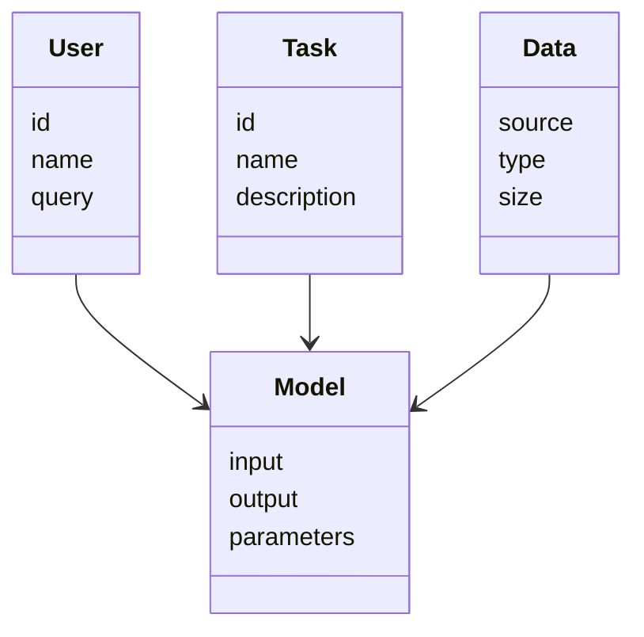
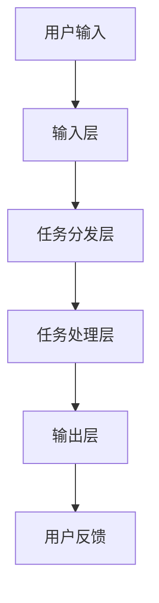
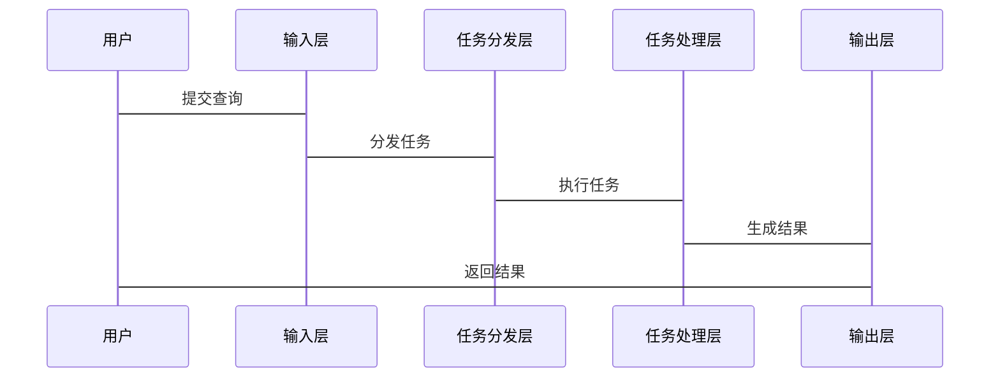

                 

<think>
好的，我现在需要帮助用户撰写一篇关于《企业AI Agent的多任务学习框架：提升模型泛化能力》的技术博客文章。用户已经提供了一个详细的目录大纲，并要求按照这个大纲撰写文章。用户还明确提出了格式要求，包括使用markdown，包含摘要，关键词，以及各章节的具体内容，如背景介绍、核心概念、算法原理、系统架构、项目实战等。

首先，我需要仔细阅读并理解用户提供的目录大纲。大纲分为几个部分，包括背景介绍、核心概念、算法原理、系统架构、项目实战、总结等。每个部分都有详细的章节和小节，我需要确保在撰写时涵盖所有内容。

接下来，我需要按照用户的要求，逐步撰写每一部分。首先是摘要，关键词，然后是每一章节的具体内容。在撰写过程中，我需要使用专业的技术语言，同时确保逻辑清晰，结构紧凑，内容易懂。特别是要注意使用用户要求的格式，如使用mermaid图，数学公式用latex，以及代码示例。

在撰写背景介绍部分时，我需要先定义企业AI Agent，说明其特点和应用场景。然后介绍多任务学习，解释其在企业AI Agent中的作用，以及提升模型泛化能力的重要性。这部分需要清晰地展示问题背景和问题描述。

核心概念部分，我需要详细讲解多任务学习框架的组成，包括任务定义与选择、任务之间的关系，以及框架的整体结构。同时，要对比单任务学习和多任务学习的优缺点，使用表格和mermaid图来辅助说明。

在算法原理部分，我需要详细阐述多任务学习的数学模型，使用mermaid图展示流程，以及用latex公式展示数学模型。同时，通过例子说明如何通过任务相关性优化来提升模型泛化能力。

系统分析与架构设计部分，我需要介绍项目场景，设计系统功能，使用mermaid图展示领域模型类图、系统架构图、接口设计和交互序列图。这部分需要展示系统的各个组成部分及其交互关系。

项目实战部分，我需要提供环境安装步骤，核心代码实现，代码解读，案例分析，以及项目小结。这部分需要具体且可操作，让读者能够实际应用所学知识。

最后，在总结部分，我需要回顾文章内容，强调提升模型泛化能力的重要性，并给出进一步研究的方向。

在撰写过程中，我需要确保每个部分都详细且具体，避免遗漏关键点。同时，要使用用户要求的格式，如mermaid图和latex公式，以增强文章的可读性和专业性。我还需要注意文章的结构和逻辑，确保读者能够轻松理解内容。

现在，我将根据以上思考，开始撰写文章。
</think>

# 企业AI Agent的多任务学习框架：提升模型泛化能力

## 关键词：企业AI Agent，多任务学习，模型泛化能力，机器学习，人工智能

## 摘要：  
在企业智能化转型的背景下，AI Agent（人工智能代理）的应用越来越广泛。为了应对企业复杂的业务场景和多样化的需求，多任务学习（Multi-Task Learning，MTL）成为提升AI Agent泛化能力的重要技术。本文从企业AI Agent的定义、多任务学习的原理出发，详细分析了多任务学习在提升模型泛化能力中的作用，并结合实际案例，探讨了如何通过数据增强、知识蒸馏、迁移学习等技术优化多任务学习框架，最终实现企业AI Agent在复杂场景下的高效应用。

---

## 第一部分：企业AI Agent的背景与挑战

### 第1章：企业AI Agent的定义与特点

#### 1.1 企业AI Agent的基本概念
企业AI Agent是一种能够感知环境、理解任务需求并执行复杂操作的智能系统。它通常具备以下特点：
- **自主性**：能够在没有人工干预的情况下完成任务。
- **反应性**：能够实时感知环境变化并做出响应。
- **学习能力**：通过数据和经验不断优化自身的决策能力。
- **多任务处理能力**：能够同时或顺序处理多种任务，适应复杂的企业场景。

#### 1.2 企业AI Agent的应用场景
企业AI Agent广泛应用于以下场景：
- **客户服务**：通过自然语言处理（NLP）技术为用户提供智能客服。
- **流程自动化**：自动处理企业内部的审批流程、数据录入等任务。
- **决策支持**：基于数据分析为管理层提供决策建议。
- **风险管理**：实时监控企业运营中的潜在风险。

#### 1.3 企业AI Agent的挑战
在实际应用中，企业AI Agent面临以下挑战：
- **任务多样性**：企业场景复杂，AI Agent需要处理多种任务，导致模型泛化能力不足。
- **数据稀疏性**：某些业务场景数据量小，难以训练出 robust 的模型。
- **计算资源限制**：多任务学习需要大量计算资源，企业环境可能难以支持。

### 第2章：多任务学习的背景与意义

#### 2.1 多任务学习的基本概念
多任务学习（MTL）是一种机器学习技术，旨在通过共享多个任务的特征和参数，提升模型的泛化能力。MTL的核心思想是，多个任务之间存在某种关联性，通过同时学习多个任务，模型可以更好地提取通用特征，降低过拟合风险。

#### 2.2 多任务学习在企业AI Agent中的作用
在企业AI Agent中，多任务学习可以用于以下场景：
- **联合优化**：同时优化多个相关任务，如同时进行语义理解、意图识别和实体提取。
- **数据共享**：在数据不足的情况下，通过多任务学习共享数据，提升模型的鲁棒性。
- **降低计算成本**：通过共享参数减少模型的训练时间和计算资源。

#### 2.3 多任务学习的优势与挑战
多任务学习的优势包括：
- 提升模型的泛化能力。
- 降低数据稀疏性的影响。
- 提高模型的计算效率。

多任务学习的挑战包括：
- 任务之间的干扰：某些任务可能相互削弱学习效果。
- 参数协调困难：需要平衡多个任务的优化目标。

---

## 第二部分：多任务学习框架的核心要素

### 第3章：多任务学习框架的组成

#### 3.1 任务定义与选择
在多任务学习中，任务的定义和选择至关重要。以下是任务选择的关键点：
- **相关性**：任务之间应有一定关联性，避免无关任务的干扰。
- **数据量**：优先选择数据量充足的任务，以确保模型训练的稳定性。
- **业务需求**：根据企业实际需求选择任务，确保多任务学习的目标与业务场景一致。

#### 3.2 任务之间的关系
任务之间的关系可以分为以下几种：
- **互补性任务**：任务之间相互补充，如语义理解和意图识别。
- **竞争性任务**：任务之间存在竞争，如分类任务和回归任务。
- **独立任务**：任务之间没有直接关联，如图像分类和文本分类。

#### 3.3 框架的整体结构
多任务学习框架通常包括以下几个部分：
- **输入层**：接收多任务的输入数据。
- **共享层**：提取所有任务的共享特征。
- **任务特定层**：针对每个任务的特定特征进行处理。
- **输出层**：生成任务的最终输出。

### 第4章：提升模型泛化能力的关键技术

#### 4.1 数据增强与多样化
数据增强是提升模型泛化能力的重要手段。以下是几种常用的数据增强方法：
- **旋转**：对图像数据进行旋转，增强模型的旋转不变性。
- **裁剪**：随机裁剪图像，增加数据的多样性。
- **噪声注入**：在数据中加入噪声，提升模型的鲁棒性。

#### 4.2 知识蒸馏与模型压缩
知识蒸馏是一种将复杂模型的知识迁移到简单模型的技术。以下是知识蒸馏的关键步骤：
1. **教师模型训练**：训练一个性能优越的教师模型。
2. **学生模型训练**：通过最小化学生模型输出与教师模型输出的差异，提升学生模型的性能。
3. **模型压缩**：通过剪枝、量化等技术，减少模型的参数数量，降低计算成本。

#### 4.3 迁移学习与领域适应
迁移学习是一种将一个领域中的知识迁移到另一个领域的技术。以下是迁移学习的关键步骤：
1. **领域适配**：通过数据预处理或特征提取，将源领域和目标领域的数据对齐。
2. **模型迁移**：将源领域中的模型迁移到目标领域，通过微调提升模型的适应性。

---

## 第三部分：多任务学习框架的系统架构

### 第5章：系统分析与架构设计方案

#### 5.1 项目场景介绍
假设我们正在开发一个企业智能客服系统，需要同时完成以下任务：
- **问题分类**：将用户的问题分为咨询、投诉、建议等类别。
- **意图识别**：识别用户的主要意图，如“查询订单状态”。
- **实体提取**：提取用户问题中的关键实体，如订单编号、客户姓名。

#### 5.2 系统功能设计
以下是系统功能设计的领域模型类图：


#### 5.3 系统架构设计
以下是系统的架构图：


#### 5.4 接口设计与交互
以下是系统的交互序列图：


---

## 第四部分：项目实战

### 第6章：环境安装与核心代码实现

#### 6.1 环境安装
以下是项目所需的环境安装步骤：
```bash
pip install tensorflow==2.10.0
pip install numpy==1.21.0
pip install pandas==1.3.5
pip install scikit-learn==1.0.1
```

#### 6.2 核心代码实现
以下是多任务学习框架的核心代码示例：
```python
import tensorflow as tf
from tensorflow import keras
import numpy as np
import pandas as pd
from sklearn.metrics import accuracy_score

# 数据加载
data = pd.read_csv('data.csv')

# 数据预处理
X = data.drop('label', axis=1).values
y = data['label'].values

# 模型定义
input_layer = keras.Input(shape=(X.shape[1],))
dense_layer = keras.layers.Dense(64, activation='relu')(input_layer)
task1_output = keras.layers.Dense(1, activation='sigmoid')(dense_layer)
task2_output = keras.layers.Dense(1, activation='sigmoid')(dense_layer)

model = keras.Model(inputs=input_layer, outputs=[task1_output, task2_output])
model.compile(optimizer='adam', loss={'task1_output': 'binary_crossentropy', 'task2_output': 'binary_crossentropy'})

# 模型训练
model.fit(X, {'task1_output': y_task1, 'task2_output': y_task2}, epochs=10, batch_size=32)

# 模型评估
y_pred_task1 = model.predict(X)[0]
y_pred_task2 = model.predict(X)[1]
print(f"Task 1 Accuracy: {accuracy_score(y_task1, y_pred_task1)}")
print(f"Task 2 Accuracy: {accuracy_score(y_task2, y_pred_task2)}")
```

---

## 第五部分：总结与展望

### 第7章：总结与展望

#### 7.1 最佳实践 tips
- 在多任务学习中，任务的选择和设计至关重要，需要根据业务需求进行合理规划。
- 数据增强和知识蒸馏是提升模型泛化能力的有效手段，应根据实际场景选择合适的方法。
- 模型的可解释性和可扩展性是企业AI Agent的重要考量因素，需要在设计阶段予以关注。

#### 7.2 项目小结
通过本文的探讨，我们了解了多任务学习在企业AI Agent中的重要作用，掌握了提升模型泛化能力的关键技术，并通过实际案例展示了如何将这些技术应用于企业场景。未来，随着AI技术的不断发展，多任务学习将为企业AI Agent带来更多的可能性。

#### 7.3 注意事项
- 在实际应用中，需注意任务之间的干扰和参数协调问题，避免模型性能下降。
- 数据安全和隐私保护是企业AI Agent开发中的重要问题，需在设计阶段予以考虑。

#### 7.4 拓展阅读
- 《Deep Learning for Multi-Task Learning》
- 《Multi-Task Learning: A Review and Future Directions》

---

## 作者：AI天才研究院/AI Genius Institute & 禅与计算机程序设计艺术 /Zen And The Art of Computer Programming

---

以上是《企业AI Agent的多任务学习框架：提升模型泛化能力》的技术博客文章的完整内容。

