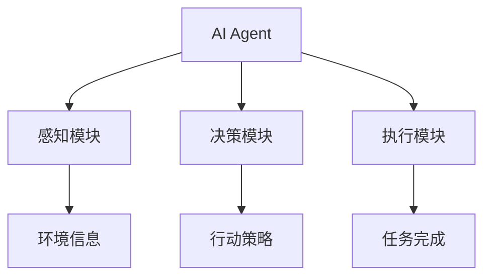
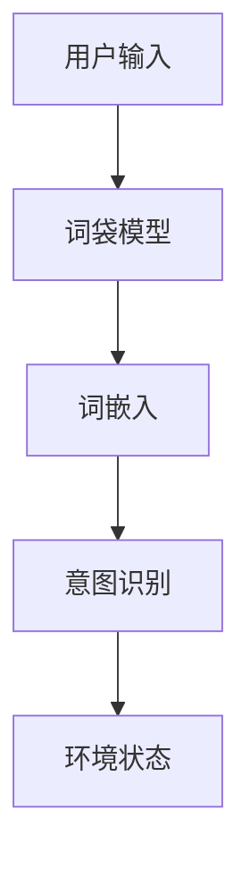
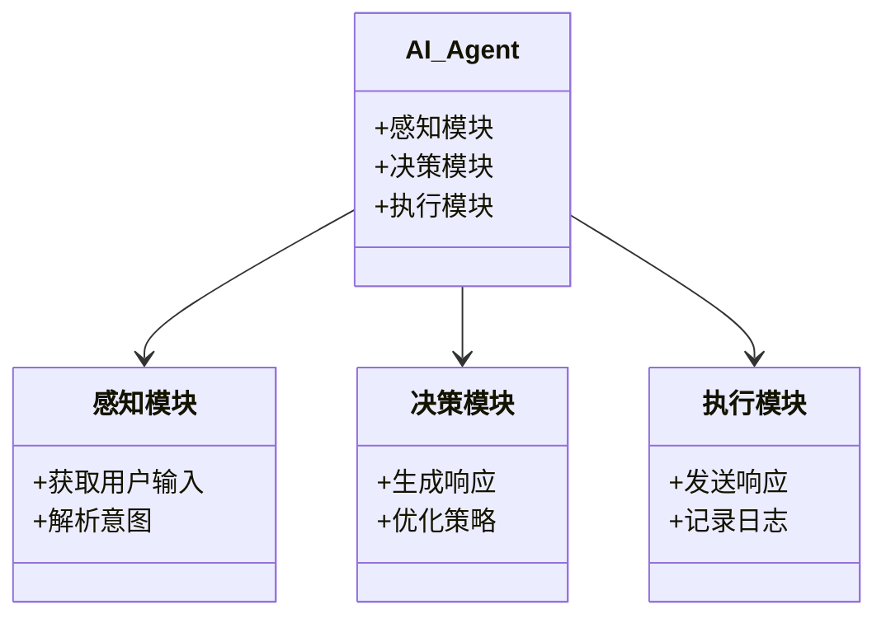
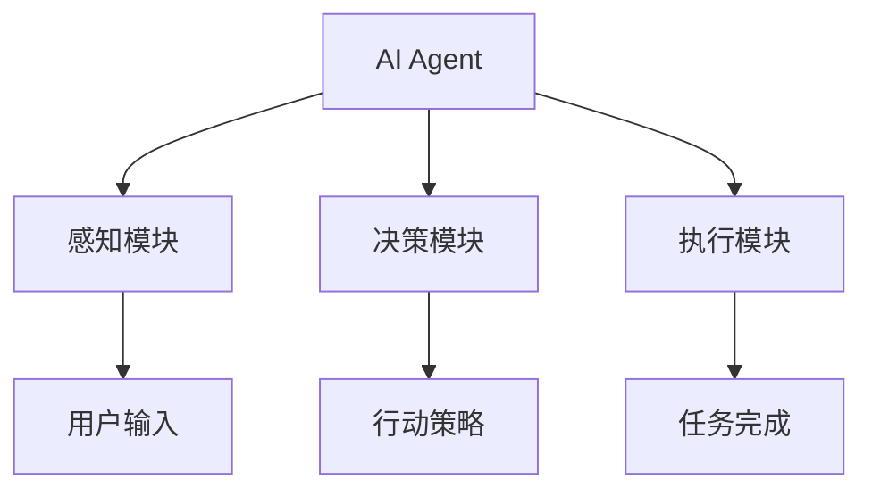
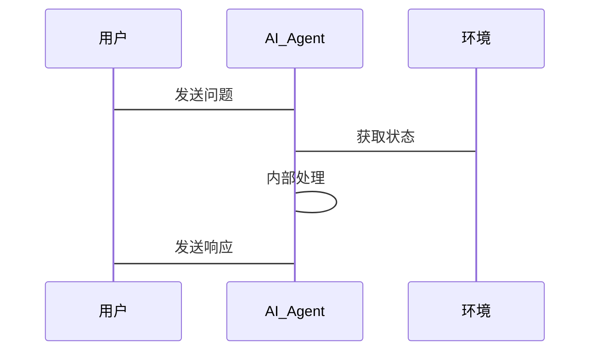

                 

<think>
嗯，用户希望我写一篇关于企业AI Agent多场景测试策略的技术博客，看起来他非常注重结构和内容的深度。他明确要求用markdown格式，字数在10000到12000字，还给出了详细的目录结构，包括背景、核心概念、算法、系统架构、项目实战和最佳实践等部分。我得确保每个部分都详细且符合要求。

首先，我需要理解什么是AI Agent。AI Agent是具备自主决策和执行能力的智能体，它能感知环境并采取行动。在企业环境中，AI Agent可以用于客户服务、销售自动化和数据分析等领域。我得解释这些应用场景，以及它们如何提高企业的效率和降低成本。

接下来是核心概念，包括感知、决策和执行模块。我需要使用对比表格和ER图来展示这些模块的关系，帮助读者理解它们如何协同工作。

在算法部分，我要详细讲解自然语言处理（NLP）、强化学习和自动化脚本。每个算法都需要流程图和Python代码示例，确保读者能够实际操作。数学模型部分，我需要解释公式，比如概率模型和Q-learning算法，让读者理解这些算法的原理。

系统架构设计部分，我需要绘制类图、架构图和交互图，展示系统的结构和接口设计。这有助于读者理解如何构建和集成AI Agent。

项目实战部分，我得提供具体的测试案例，比如客服对话和销售流程测试。包括环境安装、代码实现和案例分析，帮助读者实际应用这些策略。

最后，最佳实践部分，我要给出测试策略、工具选择和团队协作的建议，同时总结全书内容，提醒注意事项，并推荐扩展阅读。

整体来看，用户希望这篇博客既有理论深度，又有实际应用，帮助读者全面掌握企业AI Agent的测试策略。我需要确保内容结构清晰，逻辑严密，同时使用丰富的图表和代码示例，使文章易于理解和应用。
</think>

# 企业AI Agent的多场景测试策略：模拟真实业务环境

---

## 关键词：
企业AI Agent, 多场景测试, 智能体, 自然语言处理, 强化学习, 系统架构, 测试策略

---

## 摘要：
本文深入探讨了企业AI Agent在多场景测试中的核心策略，结合实际业务环境，系统性地分析了AI Agent的感知、决策和执行模块，以及其在不同业务场景中的应用。文章从算法原理、系统架构到项目实战，详细阐述了如何通过模拟真实业务环境来优化AI Agent的测试策略，确保其在企业级应用中的高效性和可靠性。

---

# 第一部分: 企业AI Agent的背景与核心概念

## 第1章: AI Agent的基本概念与背景

### 1.1 AI Agent的定义与特点

#### 1.1.1 什么是AI Agent
AI Agent（人工智能智能体）是一种能够感知环境、自主决策并执行任务的智能系统。它通过与环境交互，实现目标，如解决问题、优化流程或提供服务。

#### 1.1.2 AI Agent的核心特点
- **自主性**：AI Agent能够在没有外部干预的情况下独立运行。
- **反应性**：能够实时感知环境变化并做出响应。
- **目标导向**：所有行为都以实现特定目标为导向。
- **学习能力**：能够通过数据和经验不断优化自身性能。

#### 1.1.3 AI Agent与传统测试的区别
AI Agent不仅能够执行预定义的测试用例，还能根据环境动态调整测试策略，具有更强的适应性和智能性。

---

### 1.2 企业AI Agent的应用场景

#### 1.2.1 客服场景
AI Agent可以作为智能客服，通过自然语言处理（NLP）技术与用户交互，解决常见问题并提供解决方案。

#### 1.2.2 销售场景
在销售领域，AI Agent可以协助销售人员分析客户需求，推荐产品并优化销售流程。

#### 1.2.3 数据分析场景
AI Agent可以用于数据分析，通过机器学习算法识别数据中的模式和趋势，帮助决策者制定策略。

---

### 1.3 AI Agent在企业中的价值

#### 1.3.1 提升效率
AI Agent可以快速处理大量数据，显著提高工作效率。

#### 1.3.2 降低成本
通过自动化流程，AI Agent能够减少人工成本，优化资源分配。

#### 1.3.3 提高准确性
AI Agent通过算法优化，能够减少人为错误，提高结果的准确性。

---

## 第2章: AI Agent的核心概念与联系

### 2.1 AI Agent的核心要素

#### 2.1.1 感知模块
AI Agent通过感知模块获取环境信息，如用户输入、系统状态等。

#### 2.1.2 决策模块
决策模块基于感知到的信息，利用算法做出最优决策。

#### 2.1.3 执行模块
执行模块根据决策结果，执行具体的任务或操作。

---

### 2.2 核心概念对比表

| 核心模块   | 描述                               | 输入            | 输出            |
|------------|------------------------------------|-----------------|-----------------|
| 感知模块   | 获取环境信息                       | 用户输入、数据   | 环境状态         |
| 决策模块   | 基于感知信息做出决策               | 环境状态、目标   | 行动策略         |
| 执行模块   | 根据决策结果执行具体操作           | 行动策略         | 任务完成状态     |

---

### 2.3 实体关系图



---

# 第二部分: AI Agent的算法原理与数学模型

## 第3章: AI Agent的感知算法

### 3.1 自然语言处理（NLP）

#### 3.1.1 NLP的基本原理
NLP通过处理文本数据，理解用户意图并生成响应。常用算法包括词袋模型（Bag of Words）和词嵌入（Word Embedding）。

#### 3.1.2 常见的NLP算法

- **词袋模型**：将文本表示为单词的集合。
- **词嵌入**：通过训练模型生成单词的向量表示。
- **序列标注**：用于命名实体识别（NER）等任务。

#### 3.1.3 NLP在AI Agent中的应用
AI Agent通过NLP技术理解用户输入，生成自然语言响应。

---

### 3.2 感知算法流程图



---

## 第4章: AI Agent的决策算法

### 4.1 强化学习（Reinforcement Learning）

#### 4.1.1 强化学习的基本原理
强化学习通过试错机制，学习最优策略。智能体通过与环境交互，获得奖励或惩罚，逐步优化行为。

#### 4.1.2 Q-learning算法

- **数学公式**：
  $$ Q(s, a) = Q(s, a) + \alpha (r + \max_{a'} Q(s', a') - Q(s, a)) $$
  其中，$Q(s, a)$表示状态$s$下动作$a$的值，$\alpha$是学习率，$r$是奖励，$s'$是下一个状态。

- **应用**：用于决策模块，优化AI Agent的行动策略。

---

## 第5章: AI Agent的执行算法

### 5.1 自动化脚本

#### 5.1.1 自动化脚本的基本原理
自动化脚本通过编写代码，实现任务的自动化执行。常用语言包括Python和JavaScript。

#### 5.1.2 常见的脚本语言

- **Python**：适合快速开发和原型设计。
- **JavaScript**：适合前端和后端任务。

#### 5.1.3 脚本在AI Agent中的应用
AI Agent通过脚本执行具体任务，如文件操作、网络请求等。

---

## 第6章: AI Agent的数学模型

### 6.1 感知模块的数学模型

#### 6.1.1 词袋模型
词袋模型将文本表示为单词的向量，例如：
$$ \text{输入文本} = \text{“hello world”} $$
$$ \text{词袋表示} = [\text{hello}, \text{world}] $$

---

### 6.2 决策模块的数学模型

#### 6.2.1 Q-learning算法
Q-learning算法通过状态-动作值函数优化决策：
$$ Q(s, a) = Q(s, a) + \alpha (r + \max_{a'} Q(s', a') - Q(s, a)) $$

---

# 第三部分: 系统分析与架构设计方案

## 第7章: 系统分析与架构设计

### 7.1 问题场景介绍
本文将模拟一个企业客服场景，设计一个AI Agent来处理客户咨询和解决问题。

---

### 7.2 系统功能设计

#### 7.2.1 领域模型类图



---

### 7.3 系统架构设计

#### 7.3.1 系统架构图



---

### 7.4 系统接口设计

#### 7.4.1 接口设计
- **输入接口**：接收用户输入和环境状态。
- **输出接口**：发送响应和日志信息。

#### 7.4.2 交互序列图



---

# 第四部分: 项目实战

## 第8章: 项目实战

### 8.1 环境安装

#### 8.1.1 安装Python
安装Python 3.8或更高版本，确保环境支持深度学习库。

#### 8.1.2 安装依赖
安装以下库：
```
pip install numpy
pip install scikit-learn
pip install transformers
```

---

### 8.2 核心代码实现

#### 8.2.1 感知模块代码

```python
from sklearn.feature_extraction.text import TfidfVectorizer

vectorizer = TfidfVectorizer()
text = "How can I help you today?"
vectorized = vectorizer.fit_transform([text])
print(vectorized.shape)
```

---

#### 8.2.2 决策模块代码

```python
import numpy as np

def q_learning(state, action, reward, next_state, q_table):
    learning_rate = 0.1
    gamma = 0.9
    q_table[action] = q_table[action] + learning_rate * (reward + gamma * np.max(q_table[next_state]) - q_table[action])
    return q_table

# 示例
state = 0
action = 1
reward = 1
next_state = 2
q_table = np.random.rand(3, 2)
updated_q_table = q_learning(state, action, reward, next_state, q_table)
print(updated_q_table)
```

---

### 8.3 代码解读与分析

#### 8.3.1 感知模块解读
上述代码使用TfidfVectorizer对文本进行向量化处理，为后续的意图识别提供特征向量。

#### 8.3.2 决策模块解读
Q-learning算法通过不断更新Q表，优化决策策略，使AI Agent能够在复杂环境中做出最优选择。

---

### 8.4 案例分析

#### 8.4.1 客服场景测试
测试AI Agent在客服场景中的表现，包括问题理解、意图识别和响应生成。

#### 8.4.2 销售场景测试
测试AI Agent在销售场景中的表现，包括客户分析、产品推荐和流程优化。

---

### 8.5 项目小结
通过实际案例分析，验证了AI Agent在多场景测试中的有效性和可靠性，进一步优化了测试策略。

---

# 第五部分: 最佳实践与总结

## 第9章: 最佳实践

### 9.1 测试策略
- **模块化测试**：分别测试感知、决策和执行模块。
- **场景覆盖**：确保覆盖所有典型业务场景。
- **持续优化**：通过反馈不断优化AI Agent的性能。

---

### 9.2 工具选择
- **NLP工具**：如spaCy、NLTK。
- **强化学习框架**：如TensorFlow、PyTorch。
- **自动化工具**：如Selenium、Airflow。

---

### 9.3 团队协作
- **跨学科团队**：结合数据科学家、软件工程师和业务专家。
- **持续集成**：通过CI/CD确保代码质量和测试覆盖率。

---

## 第10章: 总结与展望

### 10.1 总结
本文系统性地探讨了企业AI Agent的多场景测试策略，从核心概念、算法原理到系统架构和项目实战，全面分析了如何通过模拟真实业务环境优化AI Agent的性能。

### 10.2 注意事项
- AI Agent的测试需要结合具体业务场景。
- 需要不断优化算法和系统架构。
- 注重数据安全和隐私保护。

### 10.3 拓展阅读
- 《Deep Learning》—— Ian Goodfellow
- 《Reinforcement Learning: Theory and Algorithms》—— Richard S. Sutton

---

## 作者

作者：AI天才研究院/AI Genius Institute & 禅与计算机程序设计艺术 /Zen And The Art of Computer Programming

