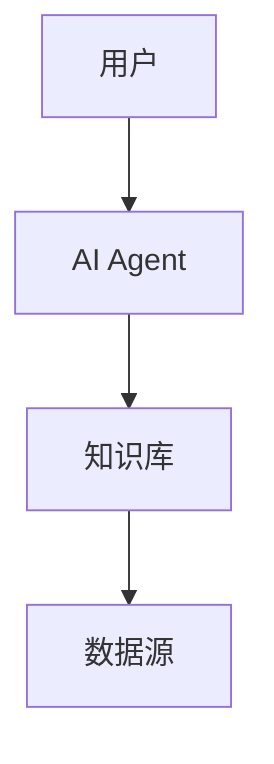
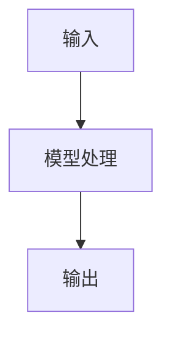
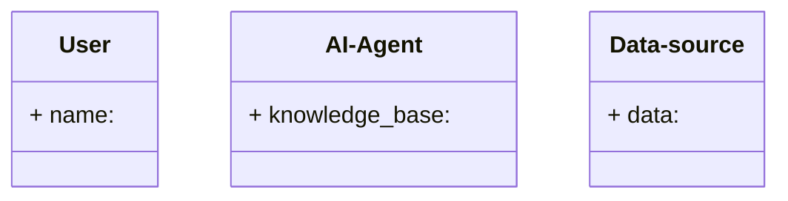
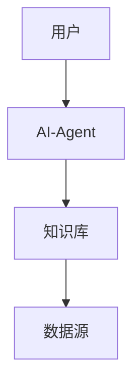
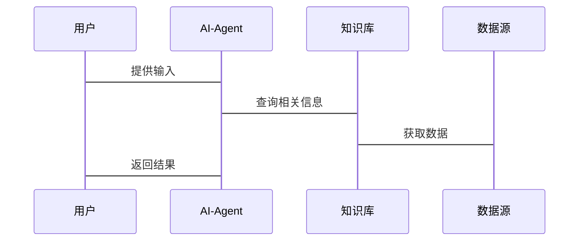

                 


# 企业AI Agent的多场景适配：从办公室到工厂

**关键词：** 企业AI Agent, 多场景适配, 办公室场景, 工厂场景, AI算法原理, 系统架构设计

**摘要：**  
企业AI Agent作为一种智能实体，能够根据环境信息自主决策并执行任务，已在多个领域展现出巨大潜力。本文从办公室和工厂两个典型场景出发，详细探讨企业AI Agent的核心概念、算法原理、系统设计及实际应用，帮助读者全面理解其多场景适配的实现与价值。

---

## 第1章 企业AI Agent的概述

### 1.1 AI Agent的基本概念
AI Agent（人工智能代理）是一种能够感知环境、自主决策并执行任务的智能实体。它通过与用户或系统的交互，利用数据和模型提供解决方案或完成特定目标。

#### 1.1.1 什么是AI Agent
AI Agent具备以下特点：
- **自主性**：无需外部干预，自主完成任务。
- **反应性**：实时感知环境变化并调整行为。
- **目标导向**：以明确的目标为导向进行决策。
- **学习能力**：通过数据和经验不断优化自身性能。

#### 1.1.2 企业AI Agent的特点与优势
- **智能化**：利用先进算法处理复杂问题。
- **适应性**：能够根据环境变化自适应调整。
- **高效性**：自动化处理任务，提高效率。

#### 1.1.3 企业AI Agent的应用价值
在企业环境中，AI Agent可以应用于流程自动化、决策支持、客户交互等领域，显著提升企业效率和竞争力。

---

### 1.2 企业AI Agent与传统AI的区别
传统AI主要关注特定任务的处理，而AI Agent具备更强的自主性和目标导向性。

#### 1.2.1 传统AI的局限性
传统AI依赖于预定义规则，缺乏灵活性和适应性。

#### 1.2.2 AI Agent的核心创新
AI Agent能够自主决策，具备更强的环境感知和问题解决能力。

#### 1.2.3 企业AI Agent的演进
从传统AI到AI Agent，是技术发展的必然趋势，代表着人工智能技术的进一步深化。

---

### 1.3 企业AI Agent的应用场景
企业AI Agent的应用场景广泛，涵盖办公室和工厂等多个领域。

#### 1.3.1 办公室场景
- **邮件处理**：自动分类、整理和回复邮件。
- **日程管理**：协助安排会议和任务。
- **信息检索**：快速获取所需信息。

#### 1.3.2 工厂场景
- **生产监控**：实时监控生产线状态。
- **库存管理**：优化库存水平，减少浪费。
- **预测维护**：预测设备故障，提前安排维护。

#### 1.3.3 其他场景的扩展
- **客户服务**：提供24/7的客户支持。
- **数据分析**：处理大量数据，提取有价值的信息。

---

## 第2章 企业AI Agent的核心概念

### 2.1 AI Agent的核心原理
AI Agent的核心原理包括知识表示、自然语言处理和决策逻辑。

#### 2.1.1 知识表示与推理
知识表示是AI Agent理解和处理信息的基础，常用符号逻辑或语义网络等方式。

#### 2.1.2 自然语言处理
自然语言处理使AI Agent能够理解并生成人类语言，实现与用户的有效交互。

#### 2.1.3 决策与执行
AI Agent根据感知的信息和目标，制定决策并执行相应的动作。

---

### 2.2 AI Agent的属性对比
通过对比不同属性，可以更好地理解AI Agent的特点。

#### 2.2.1 知识库的构建
知识库是AI Agent的核心，存储必要的信息和规则。

#### 2.2.2 交互方式的多样性
支持多种交互方式，如文本、语音和图形界面。

#### 2.2.3 适应性与可扩展性
AI Agent能够根据环境变化自适应调整，并具备良好的扩展性。

---

### 2.3 实体关系图
通过Mermaid流程图展示实体关系。



---

## 第3章 企业AI Agent的算法原理

### 3.1 基于大模型的AI Agent算法
#### 3.1.1 模型结构
模型结构包括编码器和解码器，用于处理输入和生成输出。

#### 3.1.2 训练流程
训练流程包括数据预处理、模型训练和评估。

#### 3.1.3 推理过程
推理过程包括输入处理、模型推理和结果输出。

---

### 3.2 算法流程图
通过Mermaid流程图展示算法流程。



---

### 3.3 算法实现代码
以下是一个简单的Python代码示例。

```python
def ai_agent(input):
    # 处理逻辑
    return output
```

---

### 3.4 数学模型与公式
#### 3.4.1 概率模型
概率模型公式：
$$ P(A|B) = \frac{P(B|A)P(A)}{P(B)} $$

#### 3.4.2 损失函数
损失函数公式：
$$ L = -\sum_{i} y_i \log(p_i) + (1 - y_i) \log(1 - p_i) $$

---

## 第4章 企业AI Agent的系统分析与架构设计

### 4.1 问题场景介绍
#### 4.1.1 办公室场景
在办公室场景中，AI Agent需要处理邮件、日程安排等任务。

#### 4.1.2 工厂场景
在工厂场景中，AI Agent需要监控生产线、优化库存等。

---

### 4.2 系统功能设计
#### 4.2.1 领域模型
通过Mermaid类图展示领域模型。



---

### 4.3 系统架构设计
通过Mermaid架构图展示系统架构。



---

### 4.4 系统接口设计
系统接口设计需要考虑模块之间的交互和数据流。

---

### 4.5 系统交互流程
通过Mermaid序列图展示系统交互流程。



---

## 第5章 企业AI Agent的项目实战

### 5.1 环境安装
安装必要的开发环境和工具。

---

### 5.2 核心代码实现
实现AI Agent的核心功能，包括输入处理、模型推理和结果输出。

---

### 5.3 案例分析
通过具体案例分析，展示AI Agent的实际应用效果。

---

### 5.4 项目总结
总结项目实施过程中的经验和教训，提出改进建议。

---

## 第6章 最佳实践与总结

### 6.1 小结
总结全文内容，强调企业AI Agent的重要性和应用前景。

---

### 6.2 注意事项
在实际应用中，需要注意数据安全、模型优化和用户体验等问题。

---

### 6.3 扩展阅读
推荐相关书籍和资源，供读者进一步学习。

---

## 作者：AI天才研究院/AI Genius Institute & 禅与计算机程序设计艺术/Zen And The Art of Computer Programming

---

**感谢您的阅读！**

