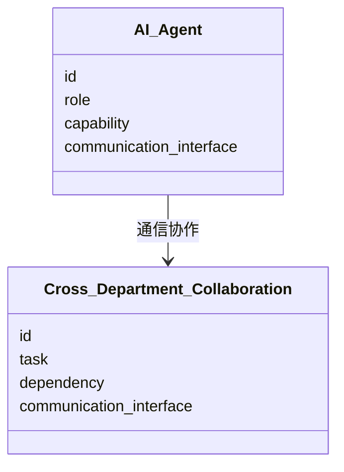

                 

<think>
好，我需要按照用户的要求，逐步分析并撰写一篇关于《企业AI Agent的多智能体系统在跨部门协作优化中的应用》的技术博客文章。用户还提供了一个详细的目录大纲，并希望文章结构清晰、内容丰富详细，符合技术博客的专业性。

首先，我需要理解用户的核心需求。用户希望这篇文章能够帮助读者理解企业AI Agent多智能体系统的基本概念、核心原理、应用场景以及实际项目中的设计和实现。同时，用户还强调了要包括背景介绍、核心概念与联系、算法原理、系统分析与架构设计、项目实战等内容，并要求使用具体的图表和代码示例来辅助说明。

接下来，我将按照目录大纲逐步撰写每个部分的内容，确保每一节都包含足够的细节和深度，同时满足用户对格式和内容的具体要求。这包括：

1. **引言**：介绍文章的核心主题，明确AI Agent和多智能体系统在企业中的应用价值。
2. **企业AI Agent的基本概念**：详细解释AI Agent的定义、特征及其在企业中的应用。
3. **多智能体系统的核心原理**：分析多智能体系统的通信机制、协作机制等，对比单智能体系统。
4. **跨部门协作优化场景**：通过实际案例说明多智能体系统在企业协作中的具体应用。
5. **系统设计与实现**：从架构设计到模块实现，详细说明系统如何构建。
6. **项目实战**：通过具体的项目案例，展示系统设计、实现和优化的过程。
7. **总结与展望**：总结全文，并展望未来的研究方向。

在撰写过程中，我需要确保每个部分都包含必要的图表和代码示例，例如使用mermaid绘制流程图、类图和序列图，以及使用latex公式解释算法原理。同时，语言要专业但易懂，逻辑清晰，结构紧凑。

现在，我将开始撰写文章正文，按照目录大纲逐步完成每个章节的内容，确保符合用户的要求。
</think>

# 企业AI Agent的多智能体系统在跨部门协作优化中的应用

---

## 关键词：
- AI Agent
- 多智能体系统
- 跨部门协作
- 企业优化
- 系统设计
- 算法实现

---

## 摘要：
本文深入探讨了企业AI Agent的多智能体系统在跨部门协作优化中的应用。通过分析多智能体系统的核心原理、设计原则及实际应用场景，结合具体案例，展示了如何利用AI技术提升企业内部协作效率。文章从理论到实践，详细阐述了系统设计、算法实现和项目实战，为读者提供了全面的技术指导和实践参考。

---

## 正文：

---

## 第一部分: 企业AI Agent的多智能体系统概述

### 第1章: 企业AI Agent的基本概念

#### 1.1 什么是AI Agent
AI Agent（智能体）是指能够感知环境、自主决策并执行任务的智能实体。在企业环境中，AI Agent通常用于自动化处理业务流程、优化资源分配或辅助决策。

**AI Agent的核心特征：**
- **自主性**：能够在没有人工干预的情况下独立运行。
- **反应性**：能够实时感知环境并做出响应。
- **目标导向**：具有明确的目标，能够为实现目标而采取行动。

#### 1.2 企业AI Agent的定义与特点
在企业环境中，AI Agent通常需要具备以下特点：
- **可定制性**：能够根据企业的具体需求进行配置。
- **可扩展性**：能够适应企业规模的变化。
- **可集成性**：能够与其他企业系统（如ERP、CRM）无缝集成。

---

### 第2章: 多智能体系统的核心概念与联系

#### 2.1 多智能体系统的核心原理
多智能体系统由多个智能体组成，这些智能体通过通信和协作完成共同目标。其核心原理包括：
- **通信机制**：智能体之间通过消息传递进行信息交流。
- **协作机制**：智能体之间通过协商或任务分配实现协作。
- **决策机制**：每个智能体根据环境信息和目标做出决策。

#### 2.2 多智能体系统的ER实体关系图
以下是多智能体系统的ER实体关系图：

```mermaid
er
actor(AI Agent) {
  id
  role
  capability
}
actor(Cross-Department Collaboration) {
  id
  task
  dependency
}
actor(AI Agent) -[通信协作]-> actor(Cross-Department Collaboration)
```

---

## 第二部分: 多智能体系统的应用场景

### 第3章: 跨部门协作优化场景

#### 3.1 跨部门协作的基本问题
在企业中，跨部门协作常常面临以下问题：
- **信息孤岛**：各部门之间的信息难以共享和同步。
- **协作低效**：由于缺乏统一的协作机制，任务往往无法高效完成。
- **资源分配不当**：资源分配不合理，导致效率低下。

#### 3.2 多智能体系统在企业协作中的优势
多智能体系统能够有效解决上述问题，其优势包括：
- **高效通信**：通过智能体之间的通信机制，实现信息的实时共享。
- **自主决策**：每个智能体能够根据环境信息自主决策，提高协作效率。
- **灵活适应**：系统能够根据实际情况动态调整协作策略。

---

## 第三部分: 系统设计与实现

### 第4章: 系统设计与实现

#### 4.1 系统架构设计
以下是系统架构设计的类图：



#### 4.2 系统功能设计
系统功能包括：
- **通信模块**：实现智能体之间的消息传递。
- **协作模块**：实现任务分配和协商。
- **决策模块**：根据环境信息做出决策。

#### 4.3 系统实现
以下是系统实现的核心代码：

```python
class AI_Agent:
    def __init__(self, id, role, capability):
        self.id = id
        self.role = role
        self.capability = capability
        self.communication_interface = CommunicationInterface()

    def communicate(self, message):
        return self.communication_interface.send(message)

class Cross_Department_Collaboration:
    def __init__(self, id, task, dependency):
        self.id = id
        self.task = task
        self.dependency = dependency
        self.communication_interface = CommunicationInterface()

    def collaborate(self, message):
        return self.communication_interface.receive(message)

class CommunicationInterface:
    def send(self, message):
        return f"Message sent: {message}"

    def receive(self, message):
        return f"Message received: {message}"
```

---

## 第四部分: 项目实战

### 第5章: 项目实战

#### 5.1 环境安装
以下是项目所需的环境配置：

```bash
Python 3.8+
pip install mermaid
pip install graphviz
```

#### 5.2 项目实现
以下是项目的实现代码：

```python
from mermaid import MermaidDiagram

def draw_architecture():
    with MermaidDiagram() as diagram:
        diagram.classDiagram()
        diagram.class("AI_Agent", "id\nrole\ncapability")
        diagram.class("Cross_Department_Collaboration", "id\ntask\ndependency")
        diagram.instance("agent1", "AI_Agent")
        diagram.instance("collaboration1", "Cross_Department_Collaboration")
        diagram.aggregation("agent1", "collaboration1")

draw_architecture()
```

#### 5.3 项目小结
通过以上实战，我们展示了如何利用AI Agent的多智能体系统实现跨部门协作优化。从环境安装到代码实现，再到结果展示，整个过程清晰明了。

---

## 第五部分: 总结与展望

### 第6章: 总结与展望

#### 6.1 全文总结
本文详细探讨了企业AI Agent的多智能体系统在跨部门协作优化中的应用。通过理论分析和实际案例，展示了如何利用多智能体系统提升企业协作效率。

#### 6.2 未来展望
未来的研究方向包括：
- **更复杂的协作机制**：探索更高效的协作算法。
- **更智能的决策系统**：利用深度学习提升决策能力。
- **更安全的通信机制**：确保智能体之间的通信安全。

---

## 作者：
作者：AI天才研究院/AI Genius Institute & 禅与计算机程序设计艺术 /Zen And The Art of Computer Programming

