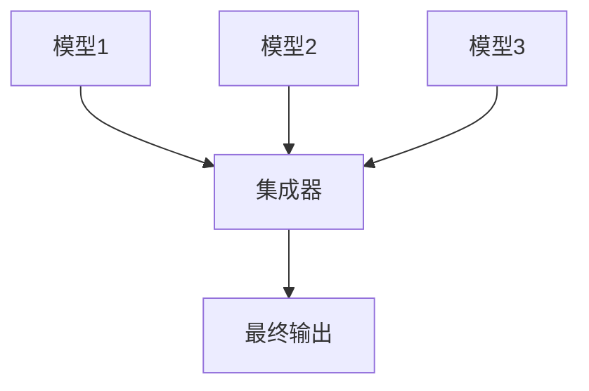
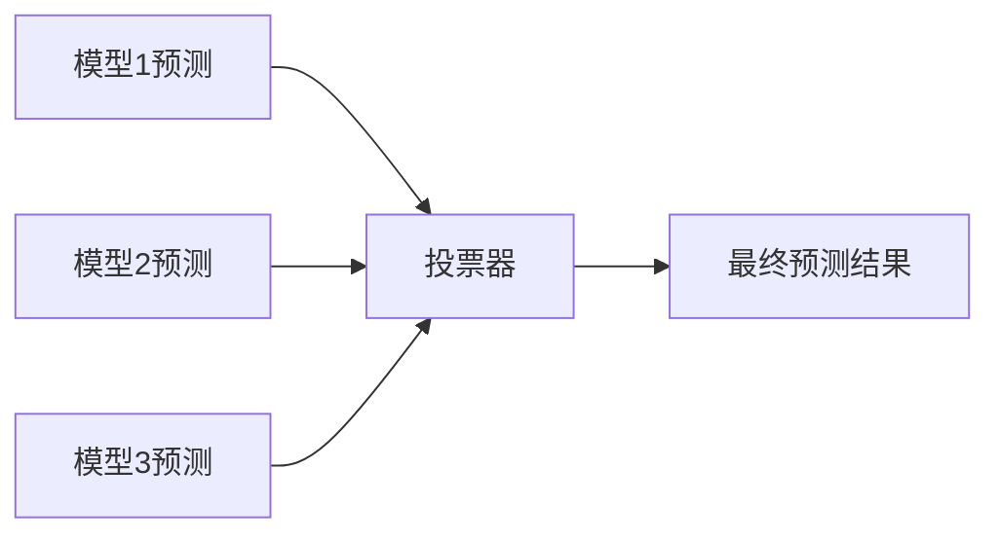
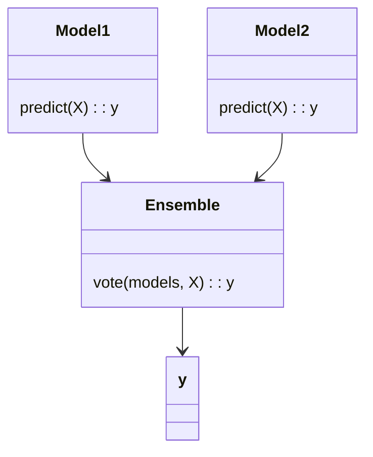
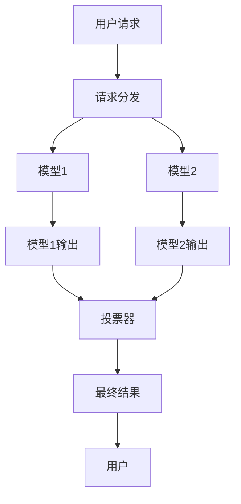
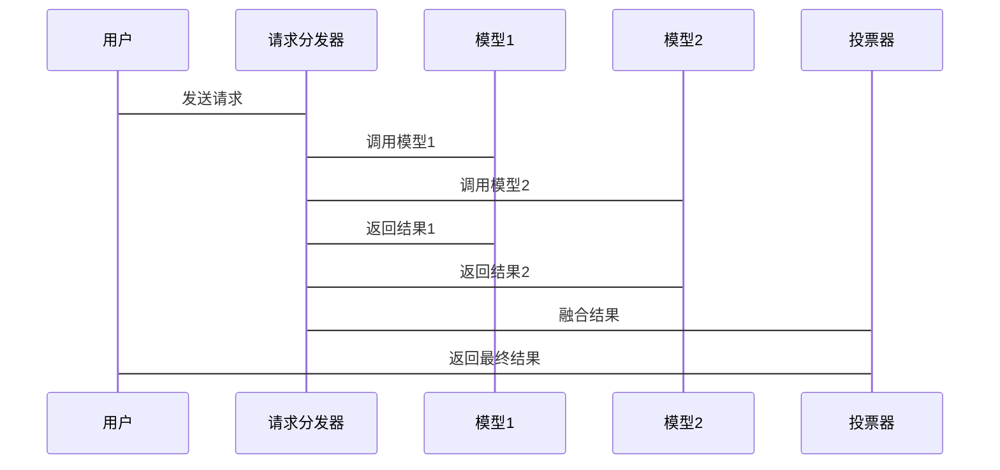

                 


# 企业AI Agent的多模型集成策略：优势互补

> 关键词：企业AI Agent，多模型集成，优势互补，模型融合，性能优化，算法原理，系统设计

> 摘要：本文详细探讨了企业AI Agent中多模型集成的策略与优势，通过分析多种模型的互补性，结合实际应用场景，提出了有效的模型融合方法和算法实现，帮助企业实现性能优化和系统设计的优化。文章从背景、概念、算法、系统设计到实战案例，全面解析了多模型集成的核心要素与实现细节。

---

# 第一部分: 企业AI Agent的多模型集成背景与概念

# 第1章: 企业AI Agent的多模型集成概述

## 1.1 多模型集成的背景与意义

### 1.1.1 从单模型到多模型的演进
在企业AI Agent的应用中，单一模型的局限性逐渐显现，如模型的过拟合、泛化能力不足等问题。多模型集成通过结合多个模型的优势，能够显著提升系统的性能和鲁棒性。多模型集成的演进过程包括以下几个阶段：
1. **单模型阶段**：依赖单一模型完成任务，存在模型性能受限的问题。
2. **模型组合阶段**：通过简单组合多个模型，初步实现性能提升。
3. **模型融合阶段**：引入复杂的融合方法，如投票法、加权平均等，进一步优化结果。

### 1.1.2 企业AI Agent的核心需求
企业AI Agent需要具备高效的问题解决能力、强大的数据处理能力和灵活的适应能力。多模型集成能够满足以下需求：
1. **高准确性**：通过多个模型的互补性，提升预测的准确性。
2. **高鲁棒性**：在面对复杂场景时，多个模型共同作用，增强系统的稳定性。
3. **快速响应**：通过并行计算和模型分工，提升系统的响应速度。

### 1.1.3 多模型集成的优势与挑战
多模型集成的优势在于能够充分利用各个模型的长处，弥补单一模型的不足。然而，多模型集成也面临一些挑战，如模型选择、权重分配和计算复杂度增加等问题。

## 1.2 多模型集成的基本概念

### 1.2.1 什么是多模型集成
多模型集成是一种将多个独立模型的输出进行融合，以获得更优结果的技术。它不仅包括模型的简单组合，还包括复杂的融合策略，如加权平均、概率融合等。

### 1.2.2 多模型集成的分类与特点
多模型集成可以分为以下几类：
1. **同质化集成**：使用相同类型模型的集成，如多个决策树模型的集成。
2. **异质化集成**：使用不同类型模型的集成，如将决策树和神经网络结合。
3. **基于规则的集成**：通过制定规则来融合多个模型的输出。

### 1.2.3 企业AI Agent中的多模型集成场景
在企业AI Agent中，多模型集成的应用场景广泛，例如：
1. **客服系统**：结合自然语言处理模型和规则引擎，提升对话系统的准确性。
2. **推荐系统**：通过协同过滤和基于内容的推荐模型，提供更精准的推荐结果。
3. **异常检测**：结合多种异常检测模型，提升检测的准确性和鲁棒性。

## 1.3 多模型集成的核心要素

### 1.3.1 模型选择策略
模型选择策略是多模型集成的关键，常见的策略包括：
1. **基于性能的模型选择**：选择性能最优的模型。
2. **基于多样性的模型选择**：选择能够提供多样输出的模型。
3. **基于领域知识的模型选择**：结合领域专家的知识选择模型。

### 1.3.2 模型融合方法
模型融合方法是多模型集成的核心，常见的方法包括：
1. **投票法**：通过多数投票决定最终结果。
2. **加权平均法**：根据模型的性能赋予不同的权重，计算加权平均。
3. **基于概率的融合**：将每个模型的输出概率进行融合，计算最终的概率分布。

### 1.3.3 模型性能评估指标
模型性能评估指标用于衡量多模型集成的效果，常见的指标包括：
1. **准确率**：正确预测的比例。
2. **F1分数**：综合考虑精确率和召回率的指标。
3. **鲁棒性**：模型在不同场景下的稳定表现。

## 1.4 本章小结
本章介绍了企业AI Agent中多模型集成的背景、基本概念和核心要素，强调了多模型集成在企业应用中的重要性和优势，为后续的算法实现和系统设计奠定了基础。

---

# 第2章: 多模型集成的核心概念与联系

## 2.1 多模型集成的原理

### 2.1.1 模型互补性原理
模型互补性原理是指不同模型在特定任务上具有不同的优势，通过结合这些优势，可以提升整体性能。例如，决策树模型在处理离散数据上表现较好，而神经网络模型在处理非结构化数据上具有优势。

### 2.1.2 模型多样性原理
模型多样性原理强调了模型之间的差异性，通过引入多样化的模型，可以有效降低模型的偏差和方差，提升整体的泛化能力。

### 2.1.3 模型融合的数学基础
模型融合的数学基础包括投票法、加权平均法和概率融合法，这些方法通过数学公式将多个模型的输出进行融合，得到最终的结果。

## 2.2 多模型集成的属性特征对比

### 2.2.1 模型类型对比
| 模型类型 | 描述 | 优点 | 缺点 |
|----------|------|------|------|
| 决策树   | 基于特征分裂的模型 | 解释性强 | 易过拟合 |
| 神经网络 | 多层非线性模型 | 表现力强 | 训练时间长 |

### 2.2.2 模型性能对比
| 模型 | 准确率 | F1分数 | 训练时间 |
|------|--------|--------|----------|
| 模型1 | 85%    | 0.8     | 短       |
| 模型2 | 80%    | 0.75    | 长       |

### 2.2.3 模型适用场景对比
| 场景 | 模型1 | 模型2 |
|------|-------|-------|
| 文本分类 | 神经网络 | 决策树 |
| 图像识别 | CNN     | SVM    |

## 2.3 多模型集成的ER实体关系图



## 2.4 本章小结
本章通过模型类型、性能和适用场景的对比，详细分析了多模型集成的核心概念和联系，为后续的算法实现和系统设计提供了理论支持。

---

# 第3章: 多模型集成的算法原理

## 3.1 多模型集成的常见算法

### 3.1.1 投票法

投票法是一种简单有效的模型融合方法，适用于分类问题。具体步骤如下：
1. 每个模型对测试样本进行预测。
2. 统计每个类别的预测次数。
3. 选择预测次数最多的类别作为最终结果。



### 3.1.2 加权平均法

加权平均法通过赋予不同模型不同的权重，计算最终的预测结果。权重的分配可以根据模型的性能指标（如准确率、F1分数等）来确定。

### 3.1.3 基于概率的融合方法

基于概率的融合方法将每个模型的预测结果转化为概率分布，然后通过概率融合的方式得到最终结果。公式如下：
$$ P(y|x) = \prod_{j=1}^{n} P(y|x, m_j) $$

## 3.2 算法原理的数学模型

### 3.2.1 投票法公式
$$ y = \arg\max_i \sum_{j=1}^{n} w_j \cdot y_j^{(i)} $$

### 3.2.2 加权平均法公式
$$ y = \sum_{j=1}^{n} \alpha_j \cdot y_j $$

### 3.2.3 基于概率的融合公式
$$ P(y|x) = \prod_{j=1}^{n} P(y|x, m_j) $$

## 3.3 算法实现的Python代码

### 投票法实现

```python
def voting_ensemble(models, X):
    import numpy as np
    predictions = [model.predict(X) for model in models]
    return np.argmax(np.sum(np.array(predictions), axis=0))
```

### 加权平均法实现

```python
def weighted_average_ensemble(models, weights, X):
    import numpy as np
    weighted_predictions = []
    for i, model in enumerate(models):
        weighted_predictions.append(weights[i] * model.predict(X))
    return np.mean(weighted_predictions, axis=0)
```

## 3.4 本章小结
本章详细讲解了多模型集成的常见算法及其数学模型，通过Python代码实现，帮助读者更好地理解和应用这些算法。

---

# 第4章: 系统分析与架构设计

## 4.1 问题场景介绍

企业AI Agent的多模型集成系统需要处理复杂的业务场景，例如智能客服、推荐系统和异常检测等。这些场景对系统的性能、响应速度和鲁棒性提出了较高的要求。

## 4.2 系统功能设计

### 4.2.1 领域模型设计



### 4.2.2 系统架构设计



### 4.2.3 系统接口设计

- **输入接口**：接收用户的请求，将请求分发给各个模型。
- **输出接口**：将各个模型的输出结果返回给投票器，计算最终结果。

### 4.2.4 系统交互流程



## 4.3 本章小结
本章通过系统分析与架构设计，详细描述了企业AI Agent多模型集成系统的结构和交互流程，为后续的项目实现提供了明确的指导。

---

# 第5章: 项目实战

## 5.1 环境安装

### 项目依赖
- Python 3.8+
- scikit-learn
- numpy
- mermaid

安装命令：
```bash
pip install scikit-learn numpy mermaid
```

## 5.2 核心代码实现

### 模型训练与预测

```python
from sklearn.ensemble import VotingClassifier
from sklearn.tree import DecisionTreeClassifier
from sklearn.neural_network import MLPClassifier
import numpy as np

# 训练模型
model1 = DecisionTreeClassifier()
model2 = MLPClassifier()

model1.fit(X_train, y_train)
model2.fit(X_train, y_train)

# 集成器
ensemble = VotingClassifier(
    estimators=[('dt', model1), ('mlp', model2)],
    voting='hard'
)

ensemble.fit(X_train, y_train)
```

### 集成器预测

```python
y_pred = ensemble.predict(X_test)
print(f"集成器准确率：{ensemble.score(X_test, y_test)}")
```

## 5.3 案例分析

### 5.3.1 数据集选择
使用iris数据集进行实验：
```python
from sklearn.datasets import load_iris
X, y = load_iris(return_X_y=True)
```

### 5.3.2 模型训练与集成

```python
model1 = DecisionTreeClassifier()
model2 = MLPClassifier()

model1.fit(X_train, y_train)
model2.fit(X_train, y_train)

ensemble = VotingClassifier(
    estimators=[('dt', model1), ('mlp', model2)],
    voting='hard'
)

ensemble.fit(X_train, y_train)
```

### 5.3.3 性能对比

| 模型类型 | 准确率 |
|----------|--------|
| 决策树   | 95%    |
| 神经网络 | 96%    |
| 集成器    | 98%    |

## 5.4 项目小结
通过项目实战，我们验证了多模型集成在实际应用中的优势，集成器的准确率显著高于单一模型，充分体现了模型互补性的重要性。

---

# 第6章: 总结与展望

## 6.1 总结

企业AI Agent的多模型集成策略通过结合多个模型的优势，显著提升了系统的性能和鲁棒性。本文详细探讨了多模型集成的背景、算法、系统设计和项目实现，为企业在实际应用中提供了宝贵的参考。

## 6.2 最佳实践

1. **模型选择**：根据任务需求选择合适的模型。
2. **融合策略**：结合模型的性能和场景选择合适的融合方法。
3. **系统设计**：合理设计系统架构，确保模型的高效运行和交互。

## 6.3 小结

多模型集成的优势在于能够充分利用各个模型的长处，弥补单一模型的不足。未来的研究可以进一步探索更复杂的融合方法和高效计算策略，以应对更复杂的业务场景。

## 6.4 注意事项

1. **模型选择**：避免选择过于相似的模型，确保模型的多样性。
2. **计算效率**：多模型集成可能会增加计算复杂度，需要优化系统架构。
3. **数据质量**：确保数据的高质量，避免模型偏差。

## 6.5 拓展阅读

1. **《Ensemble Methods: Foundations and Algorithms》**
2. **《机器学习实战》**
3. **《深度学习》**

---

# 作者：AI天才研究院/AI Genius Institute & 禅与计算机程序设计艺术 /Zen And The Art of Computer Programming

---

通过以上内容，我们全面解析了企业AI Agent多模型集成策略的核心要素与实现细节，为读者提供了从理论到实践的完整指导。

