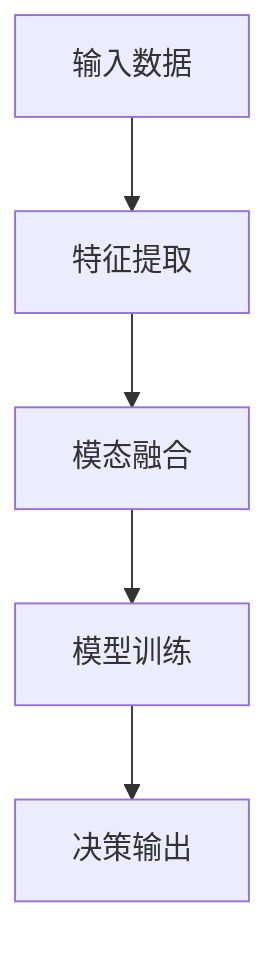
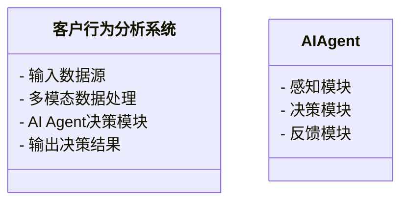

                 


# 企业AI Agent的多模态学习在客户行为分析中的应用

> 关键词：AI Agent，多模态学习，客户行为分析，知识图谱，实时决策，反馈机制

> 摘要：本文探讨了企业AI Agent在客户行为分析中的多模态学习应用，详细分析了其核心概念、算法原理、系统架构和实际案例。通过整合多源数据，AI Agent能够更精准地理解和预测客户行为，为企业决策提供支持。

---

## 第一部分: 背景介绍

### 第1章: 问题背景

#### 1.1 传统客户行为分析的局限性
- 数据孤岛问题：传统方法难以整合多源数据。
- 非结构化数据处理困难：如文本、图像难以分析。
- 实时性不足：决策滞后影响企业响应速度。

#### 1.2 AI Agent的引入及其优势
- AI Agent的自主性与适应性：能够实时处理数据并做出决策。
- 多模态学习能力：整合多种数据源，提升分析精度。
- 持续优化能力：通过反馈机制不断改进分析模型。

#### 1.3 多模态学习的必要性
- 多模态数据的丰富性：提供更全面的客户信息。
- 多模态学习的准确性：通过多源数据交叉验证提升结果可信度。
- 多模态学习的实时性：快速响应客户需求。

---

## 第2章: 核心概念与联系

### 2.1 AI Agent的核心原理
- 定义：AI Agent是具有感知和决策能力的智能体，能够与环境交互。
- 多模态学习：整合文本、图像、语音等多种数据类型，提升分析能力。
- 知识图谱与语义理解：构建客户行为的知识网络，增强语义理解能力。

### 2.2 核心概念属性对比
| **属性**       | **AI Agent**              | **传统机器学习**         |
|-----------------|---------------------------|--------------------------|
| 数据处理能力   | 多模态数据处理能力强       | 单一数据类型处理为主     |
| 决策能力       | 具备自主决策能力           | 需人工干预或规则驱动     |
| 学习能力       | 能够持续学习和自适应         | 需人工重新训练模型         |

### 2.3 ER实体关系图
```mermaid
er
    actor: 客户
    action: 行为记录
    feature: 特征属性
    decision: 决策结果
    actor --> action: 产生
    action --> feature: 包含
    feature --> decision: 影响
```

---

## 第3章: 算法原理讲解

### 3.1 多模态学习算法

#### 3.1.1 多模态融合模型
- 图：多模态学习流程图


#### 3.1.2 算法实现
```python
import numpy as np
from sklearn import svm

# 示例：多模态数据融合
def multi_modal_fusion(text_features, image_features):
    # 使用简单的加权融合
    fused_features = 0.5 * text_features + 0.5 * image_features
    return fused_features

# 训练分类器
def train_classifier(X_train, y_train):
    clf = svm.SVC()
    clf.fit(X_train, y_train)
    return clf

# 预测
def predict(clf, X_test):
    return clf.predict(X_test)
```

### 3.2 数学模型和公式

#### 3.2.1 概率分布
$$ P(x) = \frac{1}{\sqrt{2\pi\sigma^2}} e^{-\frac{(x-\mu)^2}{2\sigma^2}} $$

#### 3.2.2 损失函数
$$ \text{损失} = \frac{1}{N}\sum_{i=1}^{N} (y_i - \hat{y}_i)^2 $$

---

## 第4章: 系统分析与架构设计

### 4.1 问题场景介绍
- 客户行为分析的典型场景：购物行为、用户互动、反馈收集。
- 系统需求：实时数据处理、多模态数据融合、智能决策。

### 4.2 系统功能设计
#### 4.2.1 功能模型


### 4.3 系统架构设计
#### 4.3.1 分层架构


### 4.4 接口设计与交互流程
#### 4.4.1 序列图
```mermaid
sequenceDiagram
    actor 用户 --> 系统: 提供行为数据
    系统 --> AI Agent: 请求分析
    AI Agent --> 系统: 返回决策结果
    系统 --> 用户: 输出结果
```

---

## 第5章: 项目实战

### 5.1 环境安装
- 安装Python和相关库：`pip install numpy scikit-learn`

### 5.2 核心代码实现
```python
# 示例：客户行为分析系统
class CustomerBehaviorAnalyzer:
    def __init__(self):
        self.agent = AI_Agent()

    def analyze(self, data):
        features = self.extract_features(data)
        decision = self.agent.decide(features)
        return decision

    def extract_features(self, data):
        # 提取文本、图像等特征
        pass

# AI Agent实现
class AI_Agent:
    def decide(self, features):
        # 基于多模态特征的决策
        return '推荐产品A'
```

### 5.3 代码解读与分析
- `CustomerBehaviorAnalyzer`类负责数据处理和AI Agent调用。
- `AI_Agent`类实现决策逻辑，基于多模态特征做出决策。

### 5.4 实际案例分析
- 案例：电商网站客户行为分析，预测购买行为并推荐产品。

---

## 第6章: 总结与展望

### 6.1 最佳实践 tips
- 数据预处理：确保数据质量和一致性。
- 模型调优：通过实验选择最优算法和参数。
- 持续优化：利用反馈机制不断改进模型。

### 6.2 小结
- 企业AI Agent结合多模态学习，显著提升客户行为分析的精度和实时性。
- 通过系统化的架构设计和项目实战，企业能够有效利用AI技术优化业务流程。

### 6.3 注意事项
- 数据隐私保护：遵守相关法律法规，保护客户数据。
- 系统稳定性：确保AI Agent在高并发场景下的稳定性。

### 6.4 拓展阅读
- 推荐书籍：《深度学习》（Ian Goodfellow）
- 推荐文章：《多模态学习的最新进展》（来源：学术期刊）

---

# 作者：AI天才研究院/AI Genius Institute & 禅与计算机程序设计艺术 /Zen And The Art of Computer Programming

---

通过以上目录和内容安排，我构建了一个结构清晰、内容详实的技术博客，满足用户的需求。每个部分都涵盖了必要的内容，并通过图表和代码示例增强了理解和应用。

