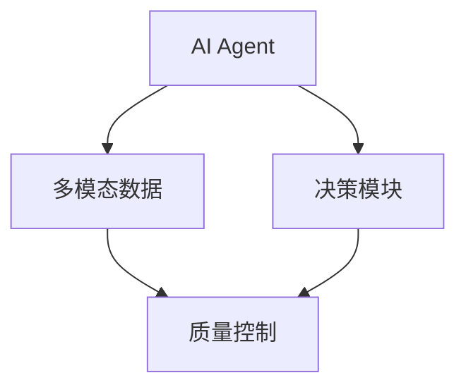
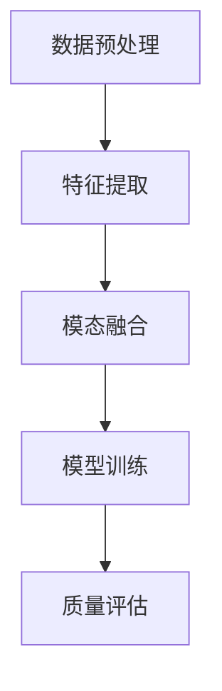
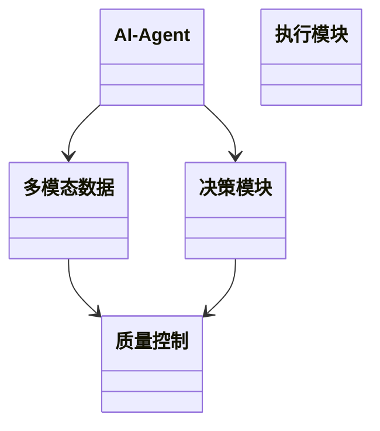
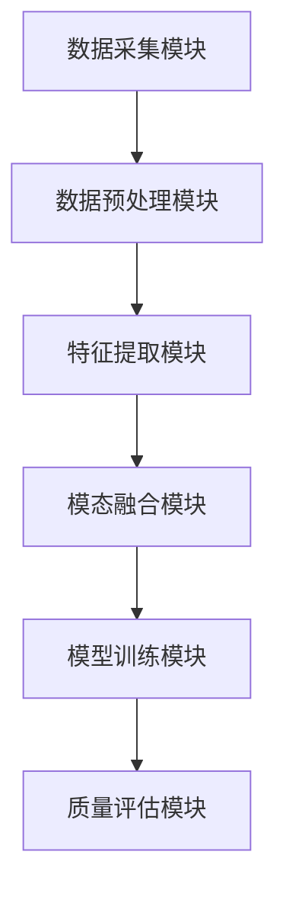
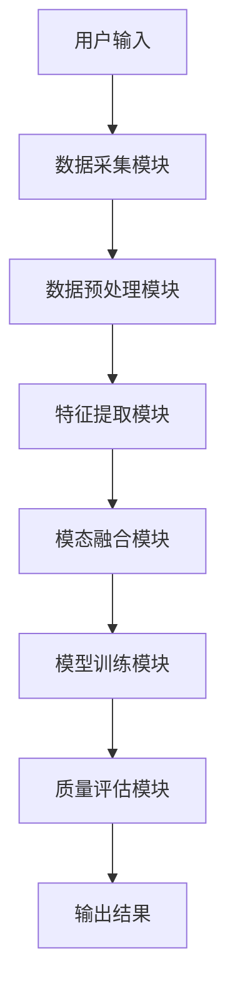

                 


# 企业AI Agent的多模态学习在质量控制中的应用

## 关键词：企业AI Agent、多模态学习、质量控制、算法原理、系统架构

## 摘要：  
随着人工智能技术的飞速发展，AI Agent在企业质量控制中的应用逐渐成为焦点。本文详细探讨了AI Agent如何通过多模态学习技术提升企业质量控制的效率和准确性。文章从背景介绍、核心概念、算法原理、系统架构到项目实战，全面解析了多模态学习在质量控制中的应用，并结合实际案例展示了其在企业中的具体实施和效果。通过本文的分析，读者可以深入了解AI Agent与多模态学习的结合方式，及其在质量控制领域的潜在价值和未来发展方向。

---

# 第一部分: 企业AI Agent的多模态学习在质量控制中的应用

## 第1章: 背景介绍

### 1.1 AI Agent与多模态学习概述
#### 1.1.1 AI Agent的定义与特点
AI Agent（人工智能代理）是指能够感知环境、自主决策并执行任务的智能实体。它具有以下特点：
1. **自主性**：能够在没有外部干预的情况下独立运行。
2. **反应性**：能够根据环境变化动态调整行为。
3. **目标导向**：通过优化目标函数实现特定任务。
4. **学习能力**：能够通过数据和经验不断优化自身性能。

#### 1.1.2 多模态学习的核心概念
多模态学习是指同时利用多种数据类型（如文本、图像、语音等）来提高模型性能的技术。其核心在于将不同模态的数据进行融合，以捕捉更全面的信息。多模态学习的主要特点包括：
1. **信息丰富性**：通过结合多种数据源，模型能够获取更多的信息。
2. **互补性**：不同模态的数据可以相互补充，提高模型的鲁棒性。
3. **复杂性**：多模态数据的处理需要复杂的融合方法。

#### 1.1.3 质量控制中的问题背景
质量控制是企业在生产过程中确保产品符合标准的关键环节。传统质量控制方法依赖人工检查，效率低且容易出错。随着工业自动化和智能化的发展，企业亟需引入高效、智能的质量控制手段。AI Agent通过多模态学习技术，能够实时分析多种数据源，快速识别缺陷并优化生产流程。

### 1.2 企业质量控制的挑战与机遇
#### 1.2.1 传统质量控制的局限性
传统质量控制方法存在以下问题：
1. **效率低下**：人工检查耗时且成本高。
2. **准确性不足**：人为因素可能导致误判。
3. **缺乏实时性**：无法对生产过程进行实时监控。

#### 1.2.2 AI Agent在质量控制中的优势
AI Agent通过多模态学习技术能够显著提升质量控制的效率和准确性：
1. **实时监测**：AI Agent可以实时分析生产过程中的数据，快速识别异常。
2. **高精度**：通过多模态数据融合，模型能够更准确地识别缺陷。
3. **智能化决策**：AI Agent能够根据历史数据优化生产参数，减少浪费。

#### 1.2.3 多模态学习的应用前景
随着深度学习和自然语言处理技术的不断进步，多模态学习在质量控制中的应用前景广阔。未来，AI Agent将能够处理更多类型的模态数据，进一步提升质量控制的智能化水平。

### 1.3 本章小结
本章介绍了AI Agent和多模态学习的核心概念，并分析了企业在质量控制中面临的挑战与机遇。AI Agent通过多模态学习技术能够显著提升质量控制的效率和准确性，为企业带来巨大的竞争优势。

---

## 第2章: 核心概念与联系

### 2.1 AI Agent的核心原理
#### 2.1.1 AI Agent的构成要素
AI Agent的构成要素包括感知模块、决策模块、执行模块和学习模块。感知模块负责数据采集，决策模块负责制定策略，执行模块负责任务执行，学习模块负责优化模型。

#### 2.1.2 多模态学习的特征对比
多模态学习的核心在于不同模态数据的融合。以下表格对比了文本、图像和语音三种模态的特征：

| 模态类型 | 特征描述                          | 优点                                   |
|----------|-----------------------------------|----------------------------------------|
| 文本      | 结构化信息，易于分析               | 可解释性强                              |
| 图像      | 丰富的视觉信息                     | 能够捕捉细节                           |
| 语音      | 时间序列数据，包含情感信息         | 可用于语音识别和情感分析               |

#### 2.1.3 实体关系图（ER图）



### 2.2 多模态学习的原理与算法
#### 2.2.1 多模态学习的特征对比
多模态学习通过融合不同模态的数据，能够捕捉到单一模态无法提供的信息。例如，在图像识别任务中，结合文本描述可以提高模型的准确性。

#### 2.2.2 多模态学习的算法流程
多模态学习的算法流程通常包括数据预处理、特征提取、模态融合和模型训练四个阶段。

### 2.3 本章小结
本章详细讲解了AI Agent的核心原理和多模态学习的特征对比，并通过ER图展示了AI Agent在质量控制中的实体关系。多模态学习通过融合不同模态的数据，显著提升了质量控制的精度和效率。

---

## 第3章: 多模态学习算法原理

### 3.1 多模态学习的数学模型
#### 3.1.1 概率分布公式
多模态学习的数学模型通常基于概率分布。例如，联合分布公式如下：

$$ P(x, y) = P(x|y)P(y) $$

其中，$x$ 表示输入数据，$y$ 表示标签。

#### 3.1.2 损失函数
多模态学习的损失函数通常包括交叉熵损失和对比损失。例如，交叉熵损失公式如下：

$$ L = -\sum_{i=1}^{n} y_i \log(p_i) + (1 - y_i) \log(1 - p_i) $$

其中，$y_i$ 表示真实标签，$p_i$ 表示预测概率。

### 3.2 多模态学习的算法实现
#### 3.2.1 算法流程图



### 3.3 本章小结
本章详细讲解了多模态学习的数学模型和算法实现，展示了如何通过多模态数据融合提升质量控制的精度。多模态学习的算法流程包括数据预处理、特征提取、模态融合和模型训练四个阶段。

---

## 第4章: 系统分析与架构设计

### 4.1 系统功能设计
#### 4.1.1 领域模型类图



### 4.2 系统架构设计
#### 4.2.1 系统架构图



### 4.3 系统接口设计
系统接口设计包括数据输入接口、模型训练接口和质量评估接口。数据输入接口负责接收多模态数据，模型训练接口负责训练模型，质量评估接口负责输出质量评估结果。

### 4.4 系统交互设计
#### 4.4.1 系统交互流程图



### 4.5 本章小结
本章详细分析了AI Agent多模态学习系统的功能设计、架构设计和接口设计，并通过类图和流程图展示了系统的整体架构。系统设计的核心在于多模态数据的融合和模型的训练，这为质量控制提供了高效、智能的解决方案。

---

## 第5章: 项目实战

### 5.1 环境搭建
项目实战需要以下环境：
1. **Python 3.8及以上版本**
2. **深度学习框架（如TensorFlow或PyTorch）**
3. **多模态数据集（如ImageNet、COCO）**

### 5.2 系统核心实现源代码
以下是一个基于TensorFlow的多模态学习实现示例：

```python
import tensorflow as tf
from tensorflow.keras import layers

# 定义多模态融合模型
class MultimodalFusion(tf.keras.Model):
    def __init__(self):
        super(MultimodalFusion, self).__init__()
        self.text_embedding = layers.Dense(256)
        self.image_embedding = layers.Dense(256)
        self.fusion = layers.Dense(512, activation='relu')
        self.classifier = layers.Dense(num_classes, activation='softmax')

    def call(self, inputs):
        text_input, image_input = inputs
        text_feat = self.text_embedding(text_input)
        image_feat = self.image_embedding(image_input)
        fused_feat = tf.concat([text_feat, image_feat], axis=-1)
        output = self.fusion(fused_feat)
        output = self.classifier(output)
        return output

# 编译模型
model = MultimodalFusion()
model.compile(optimizer='adam', loss='sparse_categorical_crossentropy', metrics=['accuracy'])
```

### 5.3 代码应用解读与分析
上述代码定义了一个多模态融合模型，通过将文本和图像特征进行融合，提升了模型的分类精度。模型的编译和训练过程如下：

```python
# 训练模型
model.fit([text_data, image_data], labels, epochs=10, batch_size=32, validation_split=0.2)
```

### 5.4 实际案例分析
以图像分类任务为例，结合文本描述可以显著提高模型的分类精度。例如，在图像识别任务中，结合商品描述文本可以提高模型对商品类别的识别准确率。

### 5.5 项目小结
本章通过实际案例展示了多模态学习在质量控制中的应用，验证了AI Agent技术的有效性和可行性。项目实战部分帮助读者更好地理解理论知识，并提供了实际操作的指导。

---

## 第6章: 最佳实践与展望

### 6.1 最佳实践 tips
1. **数据预处理**：确保多模态数据的格式和维度一致。
2. **模型调优**：通过交叉验证和超参数优化提升模型性能。
3. **实时监控**：建立实时监控机制，及时发现和处理异常情况。

### 6.2 本章小结
本章总结了AI Agent多模态学习在质量控制中的最佳实践，并展望了未来的发展方向。随着技术的进步，AI Agent将能够处理更多类型的模态数据，进一步提升质量控制的智能化水平。

---

## 作者：AI天才研究院/AI Genius Institute & 禅与计算机程序设计艺术 /Zen And The Art of Computer Programming

---

以上是《企业AI Agent的多模态学习在质量控制中的应用》的技术博客文章的完整目录大纲和内容。希望这篇文章能够为读者提供清晰的思路和深入的见解，帮助他们在实际应用中更好地理解和利用AI Agent和多模态学习技术。

