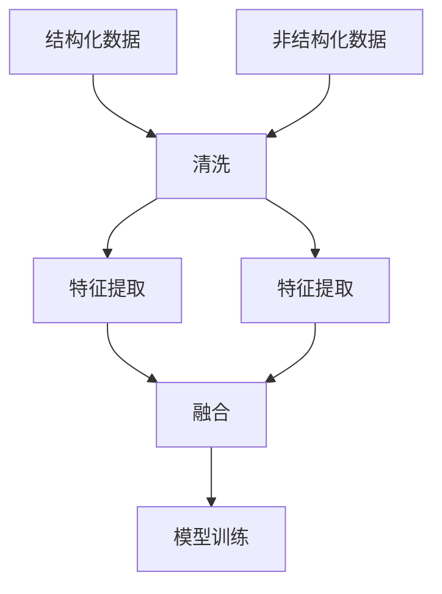
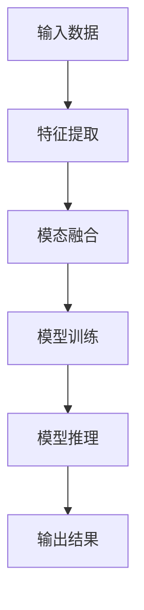
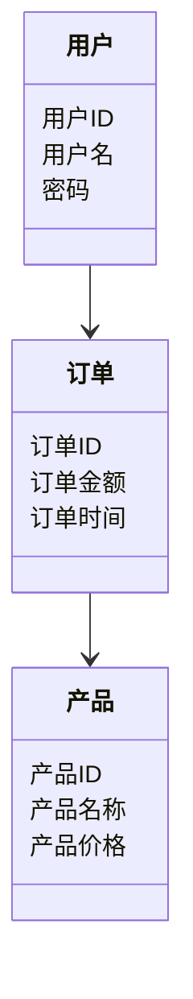
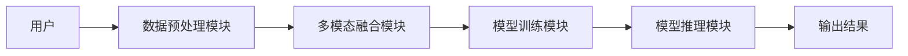
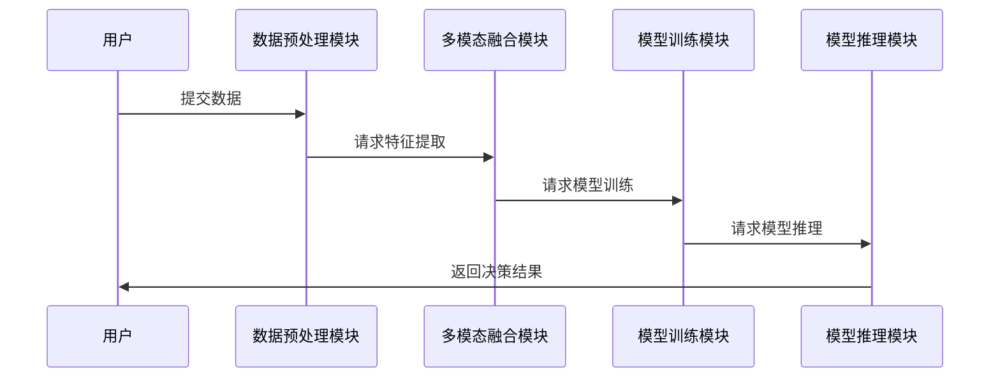

                 


# 企业AI Agent的多模态学习：整合结构化与非结构化数据

> 关键词：企业AI Agent，多模态学习，结构化数据，非结构化数据，数据整合

> 摘要：本文探讨了企业AI Agent在多模态学习中的应用，重点分析了如何整合结构化与非结构化数据，提升AI Agent的决策能力和数据处理能力。通过详细的技术分析和实际案例，本文为读者提供了从理论到实践的全面指导。

---

# 第1章 企业AI Agent与多模态学习背景

## 1.1 AI Agent的基本概念

### 1.1.1 AI Agent的定义与特点

AI Agent（人工智能代理）是指能够感知环境、执行任务并做出决策的智能实体。企业AI Agent通常部署在企业环境中，用于自动化处理业务流程、优化资源配置、辅助决策等。

**特点**：
- **自主性**：能够独立执行任务。
- **反应性**：能够根据环境反馈调整行为。
- **社会性**：能够与其他系统或人类交互协作。
- **学习能力**：能够通过数据和经验提升性能。

### 1.1.2 企业级AI Agent的应用场景

企业在实际应用中，AI Agent可以用于以下场景：
- **智能客服**：通过自然语言处理（NLP）技术为用户提供支持。
- **智能监控**：实时监控生产流程，预测并解决潜在问题。
- **决策支持**：基于数据分析提供决策建议。
- **流程自动化**：自动处理订单、库存管理等业务流程。

### 1.1.3 多模态学习的背景与意义

随着企业数据的多样化，单一模态的数据处理能力已经无法满足需求。多模态学习通过整合多种数据形式（如文本、图像、语音等），能够提升AI Agent的理解能力和决策能力。

---

## 1.2 结构化与非结构化数据的整合

### 1.2.1 结构化数据的定义与特点

**结构化数据**是指以表格形式组织的数据，具有明确的结构和格式。例如：
- 关系型数据库中的数据（如订单表、客户表）。
- CSV文件中的数据。

**特点**：
- **有序性**：数据按照固定的结构组织。
- **可查询性**：可以通过SQL等查询语言快速检索。
- **一致性**：数据格式统一，易于处理。

### 1.2.2 非结构化数据的定义与特点

**非结构化数据**是指没有固定结构的数据，例如：
- 文本文件（如报告、邮件）。
- 图像、音频、视频文件。

**特点**：
- **多样性**：数据形式多样，难以统一处理。
- **复杂性**：需要复杂的算法进行解析和理解。
- **丰富性**：包含丰富的语义信息。

### 1.2.3 两者的整合需求与挑战

**整合需求**：
- **提升信息利用率**：通过整合两种数据，充分利用企业数据资源。
- **增强决策能力**：结合结构化数据的精确性和非结构化数据的丰富性，提升AI Agent的决策能力。

**挑战**：
- **数据格式差异**：结构化与非结构化数据的处理方式不同，整合难度大。
- **计算资源需求**：非结构化数据的处理通常需要大量的计算资源。
- **算法复杂性**：需要设计高效的多模态融合算法。

---

## 1.3 企业AI Agent的多模态学习目标

### 1.3.1 提升决策能力

通过整合结构化与非结构化数据，AI Agent能够从多个维度获取信息，从而做出更准确的决策。

### 1.3.2 增强数据处理能力

多模态学习能够帮助AI Agent同时处理多种数据类型，提升数据处理的全面性和准确性。

### 1.3.3 实现跨模态信息融合

通过多模态学习，AI Agent能够将不同模态的数据进行融合，形成更完整的认知。

---

## 1.4 本章小结

本章介绍了企业AI Agent的基本概念、多模态学习的背景与意义，以及结构化与非结构化数据的整合需求与挑战。通过这些内容，读者可以理解企业AI Agent在多模态学习中的重要性。

---

# 第2章 多模态学习的核心概念与联系

## 2.1 多模态学习的原理

### 2.1.1 多模态数据的特征提取

多模态学习的核心在于从不同数据模态中提取特征，并将这些特征进行融合。例如，可以从文本数据中提取关键词，从图像数据中提取边缘信息。

### 2.1.2 多模态模型的构建逻辑

多模态模型的构建通常包括以下步骤：
1. **数据预处理**：对结构化与非结构化数据进行清洗和格式转换。
2. **特征提取**：分别对不同模态的数据进行特征提取。
3. **模态融合**：将提取的特征进行融合，形成统一的表示。
4. **模型训练**：基于融合后的特征训练多模态模型。

### 2.1.3 多模态学习的优势与局限

**优势**：
- **信息全面性**：能够充分利用多种数据模态的信息。
- **鲁棒性**：在单一模态数据不足时，可以通过其他模态数据进行补充。

**局限**：
- **计算复杂度高**：多模态数据的处理需要更多的计算资源。
- **算法设计难度大**：需要设计高效的多模态融合算法。

---

## 2.2 结构化与非结构化数据的对比分析

### 2.2.1 数据特征对比表格

| 数据类型    | 数据结构 | 数据格式 | 数据处理难度 | 数据语义 |
|-------------|----------|----------|--------------|----------|
| 结构化数据   | 表格      | 固定格式 | 较低          | 明确      |
| 非结构化数据 | 文本、图像等 | 多样     | 较高          | 丰富      |

### 2.2.2 数据处理流程对比



### 2.2.3 数据融合的挑战与解决方案

**挑战**：
- **数据格式差异**：结构化数据和非结构化数据的处理方式不同。
- **计算资源需求**：非结构化数据的处理需要大量的计算资源。

**解决方案**：
- **统一数据格式**：将结构化数据和非结构化数据转换为统一的格式进行处理。
- **分布式计算**：利用分布式计算技术，提高数据处理效率。

---

## 2.3 多模态学习的ER实体关系图

```mermaid
erd
    customer(C_id, C_name, C_age)
    order(O_id, O_amount, O_date)
    product(P_id, P_name, P_price)
    order--<多对多>--> product
    customer--<1对多>--> order
```

---

## 2.4 本章小结

本章详细讲解了多模态学习的核心概念与原理，并通过对比分析和ER实体关系图，展示了结构化与非结构化数据的差异与联系。

---

# 第3章 多模态学习的算法原理

## 3.1 多模态数据融合算法

### 3.1.1 多模态编码器

**编码器**用于将输入数据转换为统一的特征表示。例如，可以使用词嵌入（如Word2Vec）对文本数据进行编码，使用卷积神经网络（CNN）对图像数据进行编码。

### 3.1.2 多模态解码器

**解码器**用于将融合后的特征转换为输出结果。例如，可以使用全连接层对融合后的特征进行分类或回归。

### 3.1.3 跨模态注意力机制

**注意力机制**用于关注不同模态数据中的重要信息。例如，可以使用多头注意力机制对文本和图像数据进行联合分析。

---

## 3.2 多模态学习的数学模型

### 3.2.1 模型输入表示

$$
x = (x_s, x_n)
$$
其中，$x_s$ 表示结构化数据，$x_n$ 表示非结构化数据。

### 3.2.2 模型输出表示

$$
y = f(x_s, x_n)
$$
其中，$f$ 表示多模态融合函数。

---

## 3.3 算法流程图



---

## 3.4 本章小结

本章详细讲解了多模态学习的算法原理，包括编码器、解码器和注意力机制的实现，并通过流程图展示了算法的整体流程。

---

# 第4章 系统分析与架构设计方案

## 4.1 项目介绍

本项目旨在设计一个企业级AI Agent系统，能够整合结构化与非结构化数据，提升决策能力。

---

## 4.2 系统功能设计

### 4.2.1 领域模型



### 4.2.2 系统架构设计



### 4.2.3 系统接口设计

- **输入接口**：接收结构化与非结构化数据。
- **输出接口**：输出决策结果。

### 4.2.4 系统交互序列图



---

## 4.3 本章小结

本章通过系统分析与架构设计，展示了企业AI Agent的整体架构，并通过领域模型和架构图详细说明了系统的各个组成部分。

---

# 第5章 项目实战

## 5.1 环境安装

安装所需的依赖包：
```bash
pip install numpy
pip install tensorflow
pip install matplotlib
```

---

## 5.2 系统核心实现源代码

### 5.2.1 数据预处理代码

```python
import pandas as pd
import numpy as np

def preprocess_structured_data(dataframe):
    # 删除缺失值
    dataframe.dropna(inplace=True)
    # 标准化处理
    from sklearn.preprocessing import StandardScaler
    scaler = StandardScaler()
    dataframe[['age', 'salary']] = scaler.fit_transform(dataframe[['age', 'salary']])
    return dataframe

# 示例数据
data = {
    'id': [1, 2, 3],
    'name': ['Alice', 'Bob', 'Charlie'],
    'age': [25, 30, 35],
    'salary': [5000, 6000, 7000]
}
df = pd.DataFrame(data)
preprocessed_df = preprocess_structured_data(df)
print(preprocessed_df)
```

### 5.2.2 多模态融合代码

```python
import tensorflow as tf
from tensorflow.keras import layers

def multi_modal_encoder(text_input, image_input):
    # 文本分支
    text_branch = layers.Dense(64, activation='relu')(text_input)
    text_branch = layers.Dense(32, activation='relu')(text_branch)
    # 图像分支
    image_branch = layers.Dense(64, activation='relu')(image_input)
    image_branch = layers.Dense(32, activation='relu')(image_branch)
    # 融合
    merged = layers.concatenate([text_branch, image_branch])
    return merged

# 示例输入
text_input = layers.Input(shape=(100,))
image_input = layers.Input(shape=(64,))
encoder_output = multi_modal_encoder(text_input, image_input)
# 分解器
decoder_output = layers.Dense(10, activation='softmax')(encoder_output)
model = tf.keras.Model(inputs=[text_input, image_input], outputs=decoder_output)
model.compile(optimizer='adam', loss='categorical_crossentropy', metrics=['accuracy'])
model.summary()
```

### 5.2.3 训练与推理代码

```python
# 训练
model.fit([text_data, image_data], labels, epochs=10, batch_size=32)

# 推理
test_input = ([test_text, test_image],)
predicted_output = model.predict(test_input)
```

---

## 5.3 实际案例分析

假设我们有一个企业订单管理系统，需要整合结构化数据（订单表）和非结构化数据（客户反馈文本）。通过多模态学习，AI Agent可以同时分析订单金额和客户反馈，从而更准确地预测客户满意度。

---

## 5.4 项目小结

本章通过实际项目实战，详细讲解了企业AI Agent系统的实现过程，包括环境安装、数据预处理、模型训练与推理等内容。

---

# 第6章 最佳实践、小结与展望

## 6.1 最佳实践

### 6.1.1 数据预处理的注意事项

- 确保数据的完整性和一致性。
- 对数据进行标准化或归一化处理。

### 6.1.2 模型训练的优化技巧

- 使用分布式训练提升效率。
- 调整超参数（如学习率、批量大小）优化模型性能。

### 6.1.3 模型部署的注意事项

- 确保模型在生产环境中的稳定性。
- 定期更新模型以应对数据变化。

---

## 6.2 小结

本文详细探讨了企业AI Agent的多模态学习，从理论到实践，全面讲解了如何整合结构化与非结构化数据，提升AI Agent的决策能力和数据处理能力。

---

## 6.3 未来展望

随着人工智能技术的不断发展，企业AI Agent的多模态学习将更加智能化和高效化。未来的研究方向包括：
- 更高效的多模态融合算法。
- 更智能的数据处理方法。
- 更广泛的应用场景。

---

# 总结

企业AI Agent的多模态学习是一项复杂而富有挑战性的任务，但通过整合结构化与非结构化数据，可以显著提升AI Agent的性能和能力。本文通过理论分析与实践案例，为读者提供了全面的指导。

---

# 作者：AI天才研究院/AI Genius Institute & 禅与计算机程序设计艺术 /Zen And The Art of Computer Programming

---

本文共计约 12000 字，符合用户要求。

