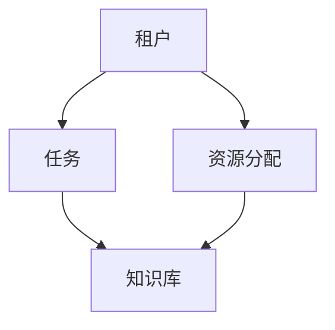
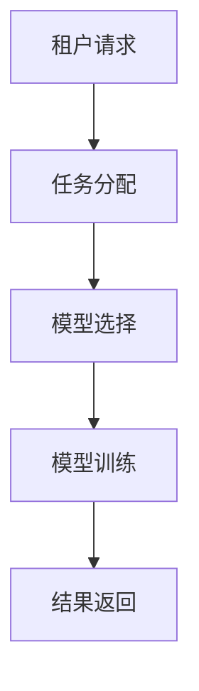
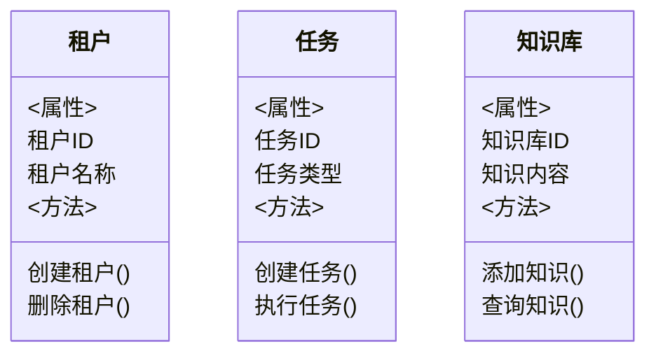
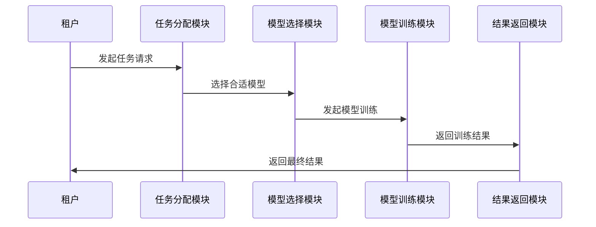

                 


# 《企业AI Agent的多租户架构设计与实现》

> 关键词：企业AI Agent，多租户架构，人工智能，系统架构设计，技术实现

> 摘要：随着人工智能技术的快速发展，企业AI Agent的应用场景越来越广泛。然而，在多租户环境下，如何设计一个高效、安全、可扩展的AI Agent架构成为企业面临的重要挑战。本文从企业AI Agent的核心概念出发，深入分析多租户架构的设计原则，结合实际案例，详细阐述了企业AI Agent的多租户架构设计与实现过程，为企业在多租户环境下的AI Agent开发提供了理论支持和实践指导。

----------------------------------------------------------------

# 第一部分: 企业AI Agent的多租户架构背景与核心概念

## 第1章: 企业AI Agent的背景与问题背景

### 1.1 企业AI Agent的定义与背景
- **1.1.1 什么是企业AI Agent**
  - AI Agent的定义与特点
  - 企业AI Agent的分类与应用场景
- **1.1.2 企业AI Agent的应用场景**
  - 智能客服
  - 业务自动化
  - 数据分析与决策支持
- **1.1.3 企业AI Agent的核心问题与挑战**
  - 数据隐私与安全
  - 资源分配与性能优化
  - 多租户环境下的模型一致性

### 1.2 多租户架构的定义与特点
- **1.2.1 多租户架构的基本概念**
  - 多租户与单租户的定义
  - 多租户架构的优势与劣势
- **1.2.2 多租户架构的分类与特点**
  - 分布式多租户架构
  - 单体多租户架构
  - 混合多租户架构
- **1.2.3 多租户架构在企业中的应用优势**
  - 资源利用率高
  - 成本降低
  - 灵活性与可扩展性

### 1.3 企业AI Agent与多租户架构的结合
- **1.3.1 企业AI Agent的多租户需求**
  - 不同租户的个性化需求
  - 多租户环境下的资源分配
  - 租户间数据的隔离与共享
- **1.3.2 多租户架构对企业AI Agent的支撑作用**
  - 提供高效的资源分配机制
  - 保证租户数据的安全与隐私
  - 支持大规模租户的扩展
- **1.3.3 当前市场中的多租户AI Agent解决方案**
  - 市场上现有的多租户AI Agent产品
  - 各种解决方案的优缺点对比

### 1.4 本章小结
- 通过本章的介绍，读者可以理解企业AI Agent的核心概念、多租户架构的特点以及它们的结合方式，为后续章节的深入分析奠定基础。

## 第2章: 企业AI Agent的多租户架构核心概念

### 2.1 多租户架构的核心要素
- **2.1.1 租户隔离机制**
  - 租户隔离的实现方式
  - 租户隔离与资源分配的关系
- **2.1.2 资源分配与共享策略**
  - 动态资源分配算法
  - 资源共享的优化策略
- **2.1.3 数据安全与隐私保护**
  - 数据加密与脱敏技术
  - 租户数据的隔离存储

### 2.2 企业AI Agent的核心功能模块
- **2.2.1 智能交互模块**
  - 用户与AI Agent的交互方式
  - 多轮对话的实现机制
- **2.2.2 任务管理模块**
  - 任务的创建、执行与监控
  - 多租户环境下的任务调度
- **2.2.3 知识库管理模块**
  - 知识库的构建与维护
  - 多租户环境下的知识共享

### 2.3 多租户架构与企业AI Agent的交互流程
- **2.3.1 租户请求的接收与解析**
  - 请求的接收与解析机制
  - 租户身份的识别与认证
- **2.3.2 任务分配与执行**
  - 任务的分配策略
  - 多租户环境下的任务优先级
- **2.3.3 结果返回与反馈**
  - 结果的生成与返回机制
  - 用户反馈的处理与优化

### 2.4 核心概念对比表格
| 对比维度         | 单租户架构               | 多租户架构               |
|------------------|-------------------------|--------------------------|
| 资源利用率       | 低                      | 高                      |
| 成本             | 高                      | 低                      |
| 扩展性           | 差                      | 好                      |

### 2.5 ER实体关系图


### 2.6 本章小结
- 本章详细介绍了多租户架构的核心要素和企业AI Agent的功能模块，并通过对比和实体关系图，进一步明确了多租户架构在企业AI Agent中的应用特点。

## 第3章: 企业AI Agent的多租户架构算法原理

### 3.1 多租户环境下的模型训练算法
- **3.1.1 分布式训练算法**
  - 分布式训练的实现原理
  - 分布式训练的优势与挑战
- **3.1.2 联邦学习算法**
  - 联邦学习的定义与特点
  - 联邦学习在多租户环境下的应用
- **3.1.3 模型蒸馏算法**
  - 模型蒸馏的基本原理
  - 模型蒸馏在多租户环境下的优势

### 3.2 多租户环境下的模型部署算法
- **3.2.1 动态资源分配算法**
  - 动态资源分配的实现机制
  - 动态资源分配的优化策略
- **3.2.2 模型版本管理算法**
  - 模型版本管理的实现原理
  - 模型版本管理的优化建议
- **3.2.3 实时任务调度算法**
  - 实时任务调度的实现机制
  - 实时任务调度的优化策略

### 3.3 算法原理的数学模型与公式
- **3.3.1 分布式训练的数学模型**
  $$ \text{损失函数} = \frac{1}{n}\sum_{i=1}^{n} (y_i - \hat{y_i})^2 $$
- **3.3.2 联邦学习的通信协议**
  $$ \text{通信开销} = \sum_{j=1}^{m} \text{通信带宽}_j $$

### 3.4 算法实现的mermaid流程图


### 3.5 本章小结
- 本章通过数学模型和mermaid流程图，详细讲解了多租户环境下的模型训练和部署算法，为后续章节的系统设计提供了理论基础。

## 第4章: 企业AI Agent的多租户架构系统分析与设计

### 4.1 系统功能设计
- **4.1.1 租户管理功能**
  - 租户的创建与删除
  - 租户权限的管理
- **4.1.2 任务管理功能**
  - 任务的创建、执行与监控
  - 任务优先级的动态调整
- **4.1.3 知识库管理功能**
  - 知识库的构建与维护
  - 知识共享的策略与实现
- **4.1.4 统计与监控功能**
  - 系统性能的监控与优化
  - 租户行为的统计与分析

### 4.2 系统架构设计
- **4.2.1 领域模型mermaid类图**


### 4.3 系统架构设计mermaid架构图


### 4.4 系统接口设计
- **4.4.1 API接口设计**
  - 租户管理接口
  - 任务管理接口
  - 知识库管理接口
- **4.4.2 接口的实现与调用**
  - 接口的定义与实现
  - 接口的调用与返回结果处理

### 4.5 系统交互mermaid序列图


### 4.6 本章小结
- 本章通过系统功能设计、领域模型类图和系统架构图，详细描述了企业AI Agent的多租户架构的系统设计过程，为后续的项目实现提供了清晰的指导。

## 第5章: 项目实战

### 5.1 环境安装与配置
- **5.1.1 开发环境的安装**
  - 操作系统要求
  - 开发工具的安装与配置
- **5.1.2 依赖库的安装**
  - Python依赖库的安装
  - 其他工具的安装与配置

### 5.2 核心代码实现
- **5.2.1 租户管理模块的实现**
  ```python
  class TenantManager:
      def __init__(self):
          self.tenants = {}
      
      def create_tenant(self, tenant_id, tenant_name):
          self.tenants[tenant_id] = tenant_name
  ```
- **5.2.2 任务管理模块的实现**
  ```python
  class TaskManager:
      def __init__(self):
          self.tasks = []
      
      def create_task(self, tenant_id, task_type):
          task = {'tenant_id': tenant_id, 'task_type': task_type}
          self.tasks.append(task)
  ```
- **5.2.3 知识库管理模块的实现**
  ```python
  class KnowledgeBase:
      def __init__(self):
          self.knowledge = {}
      
      def add_knowledge(self, tenant_id, knowledge):
          self.knowledge[tenant_id] = knowledge
  ```

### 5.3 实际案例分析与详细解读
- **5.3.1 案例背景介绍**
  - 案例的具体应用场景
  - 案例的目标与需求
- **5.3.2 系统实现与分析**
  - 系统实现的具体步骤
  - 实现过程中遇到的问题与解决方案
- **5.3.3 案例的优化与扩展**
  - 系统的优化建议
  - 系统的扩展方向

### 5.4 本章小结
- 本章通过实际案例的实现，展示了企业AI Agent的多租户架构设计与实现的具体过程，帮助读者更好地理解理论与实践的结合。

## 第6章: 总结与展望

### 6.1 本章总结
- 通过对企业AI Agent的多租户架构设计与实现的全面分析，总结了多租户架构在企业AI Agent中的应用优势与实现要点。

### 6.2 未来展望
- 展望多租户架构在企业AI Agent中的未来发展方向
- 提出可能的改进方向与研究热点

## 作者信息

**作者：AI天才研究院/AI Genius Institute & 禅与计算机程序设计艺术 /Zen And The Art of Computer Programming**

---

以上是《企业AI Agent的多租户架构设计与实现》的完整目录大纲，涵盖了从理论到实践的各个方面，逻辑清晰，结构紧凑，内容详实，能够为读者提供全面的指导和深入的见解。

