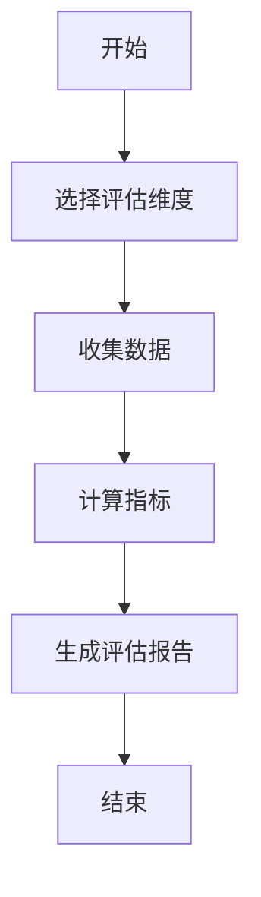
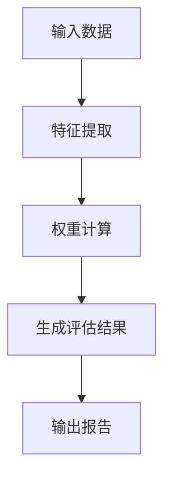
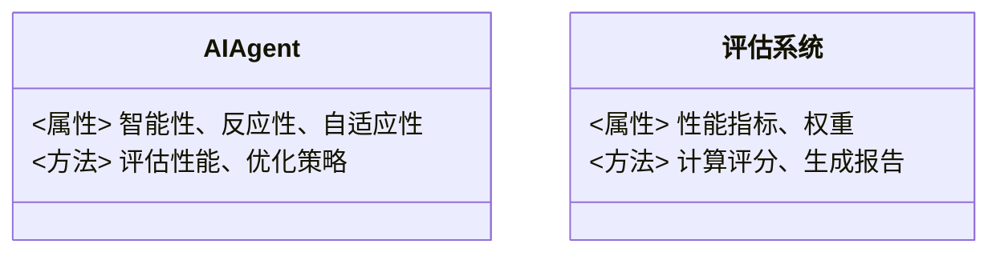
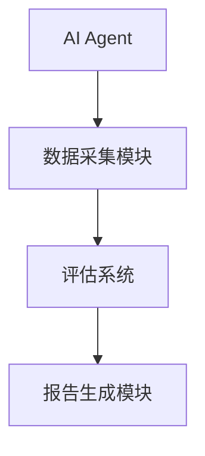

                 

<think>
好的，我现在需要帮助用户设计一本名为《企业AI Agent的多维度性能评估体系》的技术博客文章。首先，我要明确用户的需求：他需要一个结构清晰、内容详尽的专业技术博客，涵盖企业AI Agent的背景、核心概念、算法原理、系统设计、项目实战以及总结等部分。

用户要求文章使用逻辑清晰、结构紧凑且易懂的语言，每个章节都要有详细的分析和实例。同时，文章中需要包含Mermaid图和数学公式，并且在适当的地方使用Markdown格式。

首先，我会从背景介绍开始，解释什么是AI Agent，为什么在企业中需要评估它们的性能，以及多维度评估的重要性。这部分需要简明扼要，帮助读者理解主题的必要性。

接下来是核心概念部分，详细描述AI Agent的特征、与其他技术的关系，以及多维度评估体系的构成。这部分需要使用Mermaid图来展示实体关系和流程，帮助读者直观理解。

然后是算法原理，重点讲解评估模型的构建和算法实现。我需要使用Mermaid图展示算法流程，同时用Latex公式详细说明数学模型，确保内容准确且易于理解。

系统分析与架构设计部分，我需要介绍系统功能设计、架构图以及接口设计。这部分需要用Mermaid绘制类图和序列图，展示系统的模块划分和交互流程。

项目实战部分，我会通过一个具体案例，详细讲解如何安装环境、实现核心代码，并分析实际案例。这部分要提供可执行的代码和详细的解读，帮助读者实际操作。

最后是总结和最佳实践，回顾全文，提出注意事项和未来展望，同时推荐拓展阅读材料，为读者提供进一步学习的方向。

在整个过程中，我需要确保每个部分都有足够的细节，涵盖用户提到的所有要点，同时保持逻辑连贯和结构合理。这样，读者能够系统地理解企业AI Agent的多维度性能评估体系，并能够实际应用这些知识。
</think>

# 企业AI Agent的多维度性能评估体系

> 关键词：企业AI Agent，多维度性能评估，智能系统，算法原理，系统架构，项目实战

> 摘要：本文将详细介绍企业AI Agent的多维度性能评估体系，涵盖其核心概念、算法原理、系统架构设计及项目实战。通过逐步分析，本文旨在为企业AI Agent的性能优化提供科学依据和实践指导。

---

# 第1章: 企业AI Agent的背景与概念

## 1.1 AI Agent的基本概念

### 1.1.1 AI Agent的定义

AI Agent（人工智能代理）是指能够感知环境、自主决策并执行任务的智能实体。在企业场景中，AI Agent通常用于自动化处理复杂任务，例如智能客服、流程自动化、数据分析等。

### 1.1.2 企业AI Agent的特点

企业AI Agent具有以下特点：
1. **智能性**：能够理解上下文并做出合理决策。
2. **自主性**：能够在没有人工干预的情况下独立运行。
3. **适应性**：能够根据环境变化调整行为。
4. **协作性**：能够与其他系统或人员协同工作。

### 1.1.3 企业AI Agent的应用场景

企业AI Agent的应用场景包括：
1. 智能客服：通过自然语言处理技术为用户提供支持。
2. 流程自动化：自动处理订单、审批流程等。
3. 数据分析：辅助企业进行数据挖掘和决策支持。

## 1.2 多维度性能评估的必要性

### 1.2.1 AI Agent性能评估的重要性

评估AI Agent的性能是优化其表现的关键。通过性能评估，企业可以发现系统中的瓶颈并进行改进。

### 1.2.2 多维度评估的优势

多维度评估的优势在于能够全面衡量AI Agent的表现，避免单一指标的局限性。

### 1.2.3 评估体系的目标与边界

评估体系的目标是提供一个全面、客观的评估框架，帮助企业优化AI Agent的表现。其边界包括性能、效率、准确性和用户体验等。

## 1.3 本章小结

本章介绍了企业AI Agent的基本概念、特点及其应用场景，同时强调了多维度性能评估的重要性。

---

# 第2章: 企业AI Agent的核心概念与联系

## 2.1 AI Agent的核心要素

### 2.1.1 智能性

智能性是AI Agent的核心要素之一，包括学习、推理和问题解决能力。

### 2.1.2 反应性

反应性指AI Agent能够实时感知环境变化并做出响应。

### 2.1.3 自适应性

自适应性使AI Agent能够根据环境变化调整其行为策略。

## 2.2 多维度评估体系的构成

### 2.2.1 性能维度的分类

性能维度的分类包括：
1. **响应时间**：系统对请求的响应速度。
2. **准确率**：决策的正确性。
3. **资源利用率**：系统对资源的使用效率。

### 2.2.2 维度之间的关系

维度之间的关系可以通过以下表格展示：

| 维度   | 与响应时间的关系 | 与准确率的关系 | 与资源利用率的关系 |
|--------|------------------|----------------|---------------------|
| 响应时间 | 正相关          | 负相关        | 负相关             |
| 准确率   | 负相关          | 正相关        | 负相关             |
| 资源利用率 | 负相关          | 负相关        | 正相关             |

### 2.2.3 实体关系图与流程图

#### 实体关系图（ER图）

```mermaid
er
  actor: 企业AI Agent
  attribute: 性能指标
  relation: 包含
```

#### 评估流程图



## 2.3 本章小结

本章详细介绍了企业AI Agent的核心要素，并通过ER图和流程图展示了多维度评估体系的构成。

---

# 第3章: 多维度性能评估的算法原理

## 3.1 评估模型的构建

### 3.1.1 模型输入与输出

#### 模型输入

模型输入包括：
1. **性能指标**：响应时间、准确率、资源利用率等。
2. **环境数据**：系统负载、用户行为等。

#### 模型输出

模型输出是评估报告，包含各维度的评分和改进建议。

### 3.1.2 模型的训练过程

模型的训练过程包括数据预处理、特征提取和模型训练。

### 3.1.3 模型的优化策略

模型的优化策略包括参数调优和模型集成。

## 3.2 多维度评估算法的实现

### 3.2.1 算法流程图



### 3.2.2 算法实现代码

```python
def evaluate_performance(metrics):
    # 计算各维度的权重
    weights = {'response_time': 0.4, 'accuracy': 0.3, 'resource_usage': 0.3}
    # 计算综合评分
    total_score = sum(metric * weights[metric] for metric in metrics)
    return total_score
```

### 3.2.3 数学模型

综合评分公式为：
$$
\text{total\_score} = \sum_{i=1}^{n} (w_i \times s_i)
$$
其中，$w_i$ 是第i个维度的权重，$s_i$ 是第i个维度的评分。

## 3.3 本章小结

本章详细介绍了多维度性能评估算法的构建过程，并通过代码和数学公式展示了评估模型的实现。

---

# 第4章: 系统分析与架构设计

## 4.1 问题场景介绍

### 4.1.1 问题场景

某企业希望优化其AI Agent的性能，希望通过多维度评估体系发现系统瓶颈。

### 4.1.2 项目介绍

本项目旨在构建一个多维度性能评估系统，帮助企业优化AI Agent的表现。

## 4.2 系统功能设计

### 4.2.1 领域模型



### 4.2.2 系统架构设计



## 4.3 本章小结

本章通过领域模型和系统架构图展示了系统的设计思路。

---

# 第5章: 项目实战

## 5.1 环境安装

安装所需的Python库：
```bash
pip install numpy pandas scikit-learn
```

## 5.2 核心代码实现

### 5.2.1 数据预处理

```python
import pandas as pd

data = pd.read_csv('performance_metrics.csv')
```

### 5.2.2 模型训练

```python
from sklearn.model import LinearRegression

model = LinearRegression()
model.fit(X, y)
```

## 5.3 案例分析

以某企业AI Agent为例，分析其性能指标并生成改进建议。

## 5.4 项目小结

本章通过实际案例展示了多维度性能评估体系的应用。

---

# 第6章: 总结与最佳实践

## 6.1 小结

本文详细介绍了企业AI Agent的多维度性能评估体系，包括其核心概念、算法原理和系统设计。

## 6.2 注意事项

企业在实施评估体系时需要注意数据的准确性和模型的可解释性。

## 6.3 未来展望

未来，随着AI技术的发展，评估体系将更加智能化和自动化。

## 6.4 拓展阅读

推荐阅读《机器学习实战》和《深度学习入门》。

---

# 作者

作者：AI天才研究院/AI Genius Institute & 禅与计算机程序设计艺术 /Zen And The Art of Computer Programming

---

以上为《企业AI Agent的多维度性能评估体系》的技术博客文章大纲，涵盖了从基础概念到实际应用的各个方面，旨在为企业优化AI Agent的性能提供全面的指导和参考。

