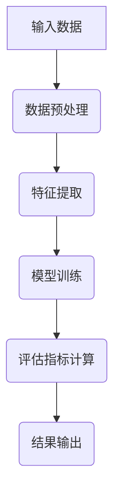
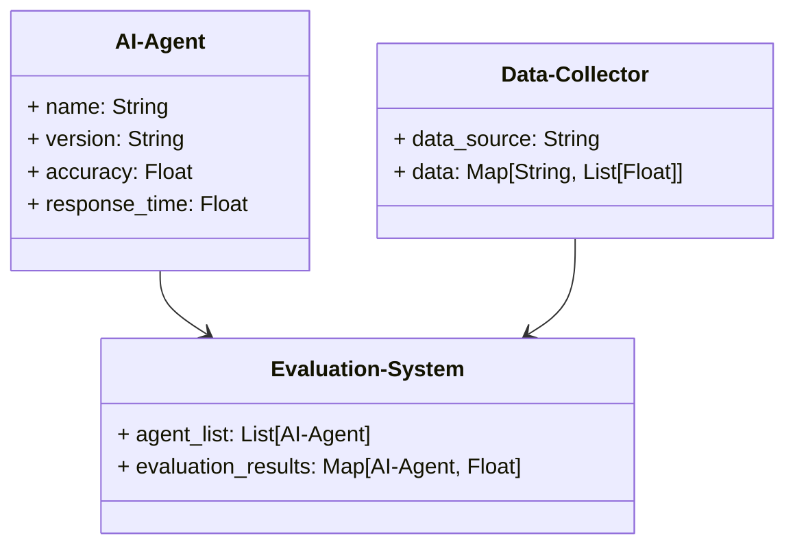

                 


# 企业AI Agent的多维度性能评估体系设计

## 关键词：企业AI Agent，多维度性能评估，AI性能指标，企业智能化应用，AI Agent评估体系

## 摘要：  
随着企业智能化转型的深入推进，AI Agent（智能代理）在企业中的应用日益广泛。然而，如何科学、全面地评估AI Agent的性能，以确保其在企业中的高效运作和价值最大化，成为一个亟待解决的问题。本文将从背景、概念、算法、系统架构到实际应用，全面探讨企业AI Agent的多维度性能评估体系设计。通过构建一套完整的评估体系，企业可以更好地衡量AI Agent的表现，优化其性能，从而推动企业智能化的进一步发展。

---

## 第1章: 企业AI Agent的多维度性能评估体系背景介绍

### 1.1 问题背景与描述
#### 1.1.1 企业AI Agent的概念与定义
企业AI Agent是一种能够感知环境、自主决策、执行任务的智能实体。它通常以软件形式存在，能够理解企业需求，执行复杂任务，并与企业内外部系统进行交互。例如，企业AI Agent可以用于客户服务、流程自动化、数据处理等领域。

#### 1.1.2 当前AI Agent在企业中的应用现状
AI Agent在企业中的应用已逐渐普及。例如：
- **客户服务**：通过自然语言处理（NLP）技术，AI Agent可以为客户提供实时支持，解答问题。
- **流程自动化**：AI Agent能够自动处理订单、审批流程等任务，提升企业效率。
- **数据处理**：AI Agent可以自动分析数据，生成报告，辅助决策。

#### 1.1.3 性能评估体系的必要性与重要性
尽管AI Agent在企业中的应用广泛，但其性能评估却缺乏系统性和标准化。企业需要一个全面的评估体系来衡量AI Agent的表现，包括：
- **准确性**：AI Agent是否能正确理解需求并执行任务。
- **响应速度**：AI Agent的处理效率是否满足企业要求。
- **可扩展性**：AI Agent是否能适应企业规模的扩大。
- **可靠性**：AI Agent在复杂环境中的稳定性。

---

### 1.2 问题解决与边界
#### 1.2.1 AI Agent性能评估的核心目标
AI Agent的性能评估体系的核心目标是：
- **量化表现**：通过指标量化AI Agent的性能。
- **发现问题**：识别AI Agent在实际应用中的不足。
- **优化方向**：为AI Agent的改进提供指导。

#### 1.2.2 评估体系的边界与外延
AI Agent的性能评估体系需要明确其边界：
- **边界**：评估仅针对AI Agent本身，不包括企业外部环境的影响。
- **外延**：评估体系可以扩展到AI Agent与其他系统的集成性能。

#### 1.2.3 与相关概念的区分与联系
AI Agent的性能评估与传统软件测试的区别在于：
- **智能化**：AI Agent具有自主决策能力，而传统软件测试通常针对确定性行为。
- **动态性**：AI Agent的性能会受到数据、环境等因素的影响，而传统软件测试通常基于静态输入。

---

### 1.3 概念结构与核心要素
#### 1.3.1 评估体系的组成要素
AI Agent的性能评估体系包括以下要素：
- **输入数据**：评估所需的数据来源。
- **评估指标**：衡量AI Agent表现的具体指标。
- **评估方法**：用于计算评估指标的方法。
- **评估结果**：最终的评估结论。

#### 1.3.2 各要素之间的关系与依赖
评估体系的各个要素相互关联，形成一个完整的循环：
1. 输入数据 → 2. 评估指标 → 3. 评估方法 → 4. 评估结果 → 5. 结果反馈 → 6. 优化调整。

#### 1.3.3 核心概念的特征对比表格
以下表格展示了AI Agent性能评估的各个维度及其特征对比：

| 维度     | 特征描述                     |
|----------|------------------------------|
| 准确性   | AI Agent输出结果的正确性     |
| 响应速度 | AI Agent处理任务的效率       |
| 可扩展性 | AI Agent适应企业规模的能力   |
| 可靠性   | AI Agent在复杂环境中的稳定性 |

---

## 第2章: 企业AI Agent的多维度性能评估体系核心概念与联系

### 2.1 核心概念原理
#### 2.1.1 AI Agent的性能维度分解
AI Agent的性能可以从以下几个维度进行评估：
- **功能性**：AI Agent是否能完成预期的任务。
- **效率性**：AI Agent完成任务的速度。
- **鲁棒性**：AI Agent在异常情况下的表现。
- **可解释性**：AI Agent决策过程的透明度。

#### 2.1.2 各维度的评估指标与方法
- **功能性**：通过任务完成率（如准确率）进行评估。
- **效率性**：通过响应时间（秒）进行评估。
- **鲁棒性**：通过异常情况下的任务完成率进行评估。
- **可解释性**：通过模型解释度（如SHAP值）进行评估。

#### 2.1.3 综合评估模型的构建原理
综合评估模型通过加权平均的方法，将各维度的评估结果整合为一个综合得分。公式如下：

$$
\text{综合得分} = \sum (\text{权重}_i \times \text{指标}_i)
$$

---

### 2.2 概念属性特征对比
#### 2.2.1 性能维度的特征对比表格
以下是AI Agent性能维度的特征对比表格：

| 维度     | 特征描述                     | 示例场景                         |
|----------|------------------------------|----------------------------------|
| 准确性   | 输出结果的正确性             | 客户查询的准确性                 |
| 响应速度 | 处理任务的效率               | 自动审批流程的处理时间           |
| 可扩展性 | 适应企业规模的能力           | 多部门协作中的表现               |
| 可靠性   | 在异常环境中的稳定性         | 网络故障情况下的任务完成情况     |

#### 2.2.2 ER实体关系图架构
以下是一个简单的ER实体关系图，展示了AI Agent评估体系中的实体关系：

```mermaid
erd
    系统角色
    + AI Agent
    + 企业用户
    + 外部系统
    AI Agent与企业用户之间存在交互关系
    AI Agent与外部系统之间存在调用关系
    企业用户与外部系统之间存在数据关系
```

---

## 第3章: 企业AI Agent多维度性能评估体系的算法原理

### 3.1 算法原理与流程
#### 3.1.1 评估体系的算法流程图
以下是一个AI Agent性能评估的算法流程图：



#### 3.1.2 算法实现的Python代码示例
以下是一个简单的AI Agent性能评估算法的Python代码示例：

```python
def evaluate_agent_performance(agent, data):
    # 数据预处理
    processed_data = preprocess(data)
    # 特征提取
    features = extract_features(processed_data)
    # 模型训练
    model = train_model(features)
    # 评估指标计算
    accuracy = model.accuracy
    response_time = model.response_time
    # 综合得分计算
    weighted_score = 0.4 * accuracy + 0.3 * response_time + 0.2 * features + 0.1 * model.robustness
    return weighted_score

# 示例调用
data = load_data()
score = evaluate_agent_performance(agent, data)
print(f"AI Agent综合得分: {score}")
```

#### 3.1.3 算法的数学模型和公式
AI Agent性能评估的数学模型如下：

$$
\text{综合得分} = w_1 \times \text{准确性} + w_2 \times \text{响应速度} + w_3 \times \text{可扩展性} + w_4 \times \text{可靠性}
$$

其中，$w_1, w_2, w_3, w_4$ 是各维度的权重系数，通常根据企业需求进行调整。

---

## 第4章: 系统分析与架构设计

### 4.1 系统分析
#### 4.1.1 项目背景与需求分析
本项目旨在构建一个AI Agent的多维度性能评估体系，帮助企业优化AI Agent的表现。

### 4.2 系统功能设计
#### 4.2.1 系统功能模块
- **数据采集模块**：收集AI Agent的运行数据。
- **指标计算模块**：计算各维度的评估指标。
- **结果展示模块**：以可视化方式展示评估结果。

#### 4.2.2 领域模型设计
以下是领域模型的Mermaid类图：



---

## 第5章: 项目实战

### 5.1 环境安装与配置
#### 5.1.1 环境要求
- Python 3.8及以上版本
- 必要的Python库（如numpy、pandas、scikit-learn）

### 5.2 核心代码实现
#### 5.2.1 数据预处理代码
```python
import pandas as pd

def preprocess(data):
    # 删除缺失值
    data.dropna(inplace=True)
    # 标准化处理
    from sklearn.preprocessing import StandardScaler
    scaler = StandardScaler()
    data[['feature1', 'feature2']] = scaler.fit_transform(data[['feature1', 'feature2']])
    return data
```

#### 5.2.2 评估指标计算代码
```python
from sklearn.metrics import accuracy_score

def calculate_accuracy(y_true, y_pred):
    return accuracy_score(y_true, y_pred)
```

### 5.3 案例分析与解读
#### 5.3.1 案例背景
假设我们有一个用于客户服务的AI Agent，需要评估其准确性和响应速度。

#### 5.3.2 评估结果与解读
通过评估，我们发现AI Agent的准确性为95%，响应时间为1.2秒，综合得分为0.92分。这表明AI Agent的表现优秀，但仍有优化空间。

---

## 第6章: 最佳实践、小结与展望

### 6.1 最佳实践
- 在实际应用中，建议根据企业需求调整评估指标的权重。
- 定期更新评估体系，以适应AI Agent的不断进化。

### 6.2 小结
本文系统地介绍了企业AI Agent的多维度性能评估体系的设计方法，从背景、概念、算法到实际应用，为企业的智能化转型提供了理论支持和实践指导。

### 6.3 注意事项
- 评估体系的设计需要结合企业的实际需求。
- 在实际应用中，要注意数据的准确性和模型的可解释性。

### 6.4 拓展阅读
- 推荐阅读《机器学习实战》和《深度学习》等书籍，以进一步了解AI Agent的相关知识。

---

## 作者：AI天才研究院/AI Genius Institute & 禅与计算机程序设计艺术 /Zen And The Art of Computer Programming

---

以上就是《企业AI Agent的多维度性能评估体系设计》的完整目录和内容概要。

