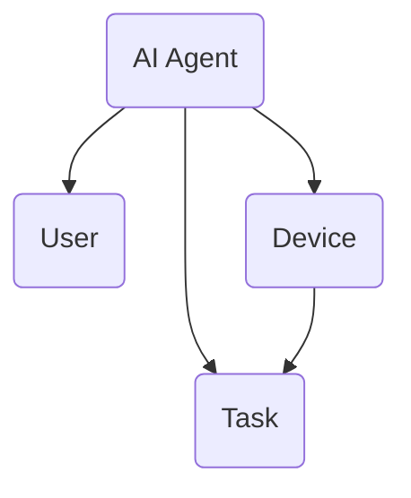
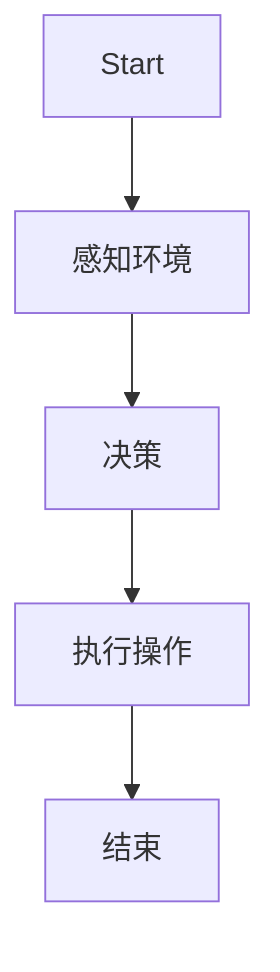
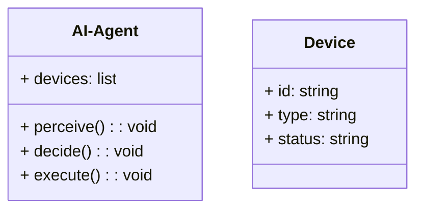
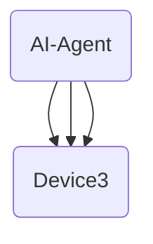
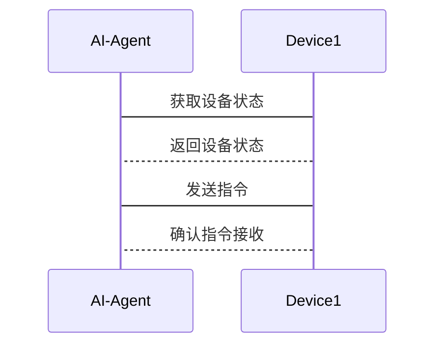

                 


# 企业AI Agent的多设备支持策略：PC到IoT的全覆盖

## 关键词：企业AI Agent，多设备支持，PC，IoT，全覆盖

## 摘要：  
随着企业数字化转型的深入，AI Agent（人工智能代理）在企业环境中的应用越来越广泛。为了满足不同设备的多样化需求，企业AI Agent需要支持从个人电脑到物联网设备的全场景覆盖。本文将详细探讨企业AI Agent的多设备支持策略，从背景介绍、核心概念、算法原理到系统架构设计、项目实战及最佳实践，为企业在多设备环境下部署和优化AI Agent提供全面指导。

---

## 第一部分：背景介绍

### 第1章：企业AI Agent的背景与问题背景

#### 1.1 问题背景  
在企业环境中，AI Agent作为一种智能代理，能够帮助用户完成多种任务，如信息检索、流程自动化、数据分析等。然而，随着企业设备种类的多样化（从PC到IoT设备），AI Agent需要能够在多种设备上无缝运行，并在不同设备之间协同工作。  

- **设备多样性**：企业环境中可能包含PC、手机、平板、智能手表、传感器等多种设备，每种设备的计算能力和资源有限，AI Agent需要适应不同设备的特性。  
- **任务协同**：AI Agent需要在不同设备之间协同完成复杂任务，例如通过PC进行数据分析，通过IoT设备执行具体操作。  
- **用户体验**：用户希望AI Agent能够在所有设备上提供一致的用户体验，同时根据设备特点优化交互方式。  

#### 1.2 问题描述  
AI Agent在多设备环境下的支持面临以下挑战：  
- **设备资源限制**：部分设备（如IoT传感器）计算能力有限，AI Agent需要在资源受限的环境中高效运行。  
- **设备间通信**：不同设备之间需要高效通信，确保任务协同执行。  
- **安全性与隐私**：跨设备的协同需要考虑数据传输的安全性和隐私保护。  

#### 1.3 问题解决  
为了解决上述问题，企业AI Agent需要具备以下能力：  
- **设备适配**：根据不同设备的特性，动态调整AI Agent的行为和功能。  
- **跨设备通信**：通过轻量级协议实现设备间的高效通信和数据同步。  
- **安全与隐私保护**：采用加密通信和权限管理，确保数据安全。  

#### 1.4 边界与外延  
- **边界**：AI Agent仅负责设备间的任务协同和数据处理，不直接干预设备的底层硬件操作。  
- **外延**：AI Agent可以与企业现有的系统（如ERP、CRM）集成，扩展其功能。  

#### 1.5 核心要素与组成  
企业AI Agent的多设备支持策略主要包括以下核心要素：  
- **设备识别与分类**：识别设备类型并分类，以便动态调整AI Agent的行为。  
- **任务分配与协同**：根据设备能力和任务需求，动态分配任务并实现设备间的协同。  
- **数据同步与通信**：确保设备间数据的实时同步和高效通信。  

---

## 第二部分：核心概念与联系

### 第2章：AI Agent的核心概念与原理

#### 2.1 核心概念原理  
AI Agent是一种能够感知环境并自主决策的智能实体，具备以下核心功能：  
- **感知环境**：通过传感器或其他数据源获取环境信息。  
- **决策与推理**：基于感知的信息，通过算法进行决策和推理。  
- **执行操作**：根据决策结果执行具体操作。  

#### 2.2 属性特征对比  
以下是设备类型与支持能力的对比表：  

| 设备类型 | CPU能力 | 内存 | 存储 | 交互方式 |  
|----------|----------|------|------|----------|  
| PC       | 强大     | 充足 | 充足 | GUI/命令行 |  
| 手机     | 中等     | 有限 | 有限 | GUI/语音 |  
| IoT传感器| 低       | 极低 | 极低 | 数据流 |  

#### 2.3 ER实体关系图  
以下是AI Agent的实体关系图：  



---

## 第三部分：算法原理讲解

### 第3章：AI Agent的算法原理

#### 3.1 算法原理  
AI Agent的核心算法包括感知、决策和执行三个部分：  
- **感知**：通过传感器或数据源获取环境信息。  
- **决策**：基于感知信息，使用算法（如贝叶斯网络、马尔可夫决策过程）进行推理和决策。  
- **执行**：根据决策结果，调用设备API或执行操作。  

#### 3.2 算法流程图  
以下是AI Agent的算法流程图：  



#### 3.3 算法实现  
以下是AI Agent的Python实现示例：  

```python
class AI-Agent:
    def __init__(self, devices):
        self.devices = devices

    def perceive(self):
        # 获取环境信息
        pass

    def decide(self):
        # 基于感知信息进行决策
        pass

    def execute(self):
        # 执行决策操作
        pass

    def run(self):
        while True:
            self.perceive()
            self.decide()
            self.execute()
```

#### 3.4 数学公式  
以下是AI Agent决策过程中的数学模型：  

$$ P(A|B) = \frac{P(B|A)P(A)}{P(B)} $$  

其中，$P(A|B)$ 表示在B条件下A发生的概率，用于贝叶斯决策。  

---

## 第四部分：系统分析与架构设计方案

### 第4章：系统分析与架构设计

#### 4.1 系统分析  
AI Agent的多设备支持系统需要解决以下问题：  
- **设备间的通信与协同**  
- **资源受限设备的优化支持**  
- **数据的安全与隐私保护**  

#### 4.2 系统功能设计  
以下是系统功能的领域模型：  



#### 4.3 系统架构设计  
以下是系统架构图：  



#### 4.4 系统接口设计  
以下是AI Agent与设备的交互序列图：  



---

## 第五部分：项目实战

### 第5章：企业AI Agent的多设备支持实战

#### 5.1 环境安装  
以下是项目环境安装步骤：  
1. 安装Python和依赖库（如TensorFlow、Flask）。  
2. 配置设备（PC、手机、IoT传感器）。  
3. 安装设备间通信协议（如MQTT）。  

#### 5.2 核心实现源代码  
以下是AI Agent的核心代码：  

```python
import mqtt

class AI-Agent:
    def __init__(self, devices):
        self.devices = devices
        self.mqtt_client = mqtt.Client()

    def perceive(self):
        # 获取设备状态
        for device in self.devices:
            self.mqtt_client.publish(f"device/{device.id}/status", device.status)

    def decide(self):
        # 基于设备状态进行决策
        pass

    def execute(self):
        # 执行决策操作
        pass

    def run(self):
        self.mqtt_client.connect("localhost", 1883)
        self.mqtt_client.subscribe("agent指令")
        self.mqtt_client.on_message = self.handle_message
        self.mqtt_client.loop_forever()

    def handle_message(self, client, userdata, msg):
        # 处理指令
        pass
```

#### 5.3 代码解读与分析  
- **设备感知**：AI Agent通过MQTT协议获取设备状态，并动态调整行为。  
- **决策逻辑**：根据设备状态和任务需求，AI Agent进行决策并调用设备API。  
- **执行操作**：AI Agent根据决策结果，通过设备API执行具体操作。  

#### 5.4 案例分析  
以下是AI Agent在多设备环境中的实际案例：  
1. **PC端**：AI Agent通过PC进行数据分析，生成决策指令。  
2. **手机端**：AI Agent通过手机执行通知提醒。  
3. **IoT传感器**：AI Agent通过传感器获取环境数据，并根据数据调整设备状态。  

#### 5.5 项目小结  
通过以上实战，我们可以看到AI Agent在多设备环境中的强大能力。企业可以通过类似的方式，实现不同设备间的协同与优化。

---

## 第六部分：最佳实践

### 第6章：企业AI Agent多设备支持的最佳实践

#### 6.1 小结  
- **设备适配**：根据不同设备的特点，动态调整AI Agent的行为。  
- **通信协议选择**：选择适合设备间通信的协议（如MQTT）。  
- **安全性与隐私**：采用加密通信和权限管理，确保数据安全。  

#### 6.2 注意事项  
- **资源优化**：针对资源受限设备，优化AI Agent的计算能力。  
- **设备兼容性**：确保AI Agent能够在不同设备上运行。  
- **用户体验**：提供一致的用户体验，同时根据设备特点优化交互方式。  

#### 6.3 拓展阅读  
- **多设备协同的算法优化**  
- **AI Agent在企业中的应用案例**  
- **设备间通信协议的选择与实现**  

---

## 第七部分：未来展望

### 第7章：企业AI Agent多设备支持的未来展望

#### 7.1 技术发展趋势  
- **边缘计算**：AI Agent将更多地运行在边缘设备上，减少对云端的依赖。  
- **设备智能化**：设备将更加智能化，AI Agent将具备更强的自主决策能力。  
- **跨平台支持**：AI Agent将支持更多种类的设备和平台。  

#### 7.2 研究方向  
- **多设备协同的算法优化**  
- **设备间通信的安全性提升**  
- **AI Agent的可扩展性研究**  

---

## 作者：AI天才研究院/AI Genius Institute & 禅与计算机程序设计艺术 /Zen And The Art of Computer Programming

---

通过以上内容，我们详细探讨了企业AI Agent的多设备支持策略，从背景介绍到项目实战，为企业在多设备环境下部署和优化AI Agent提供了全面指导。

