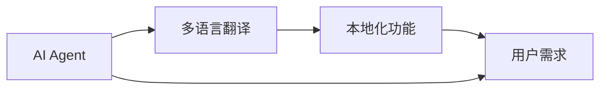
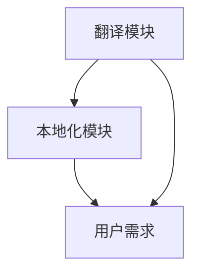
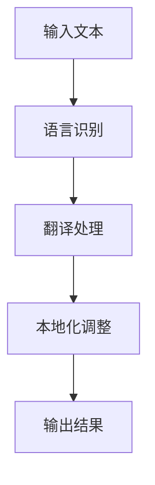
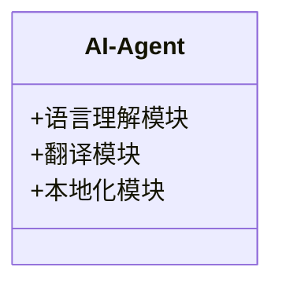
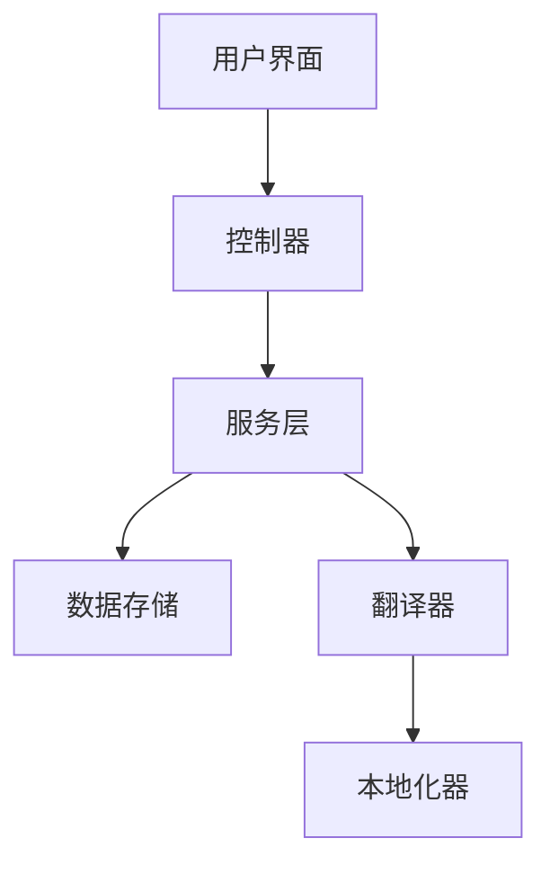
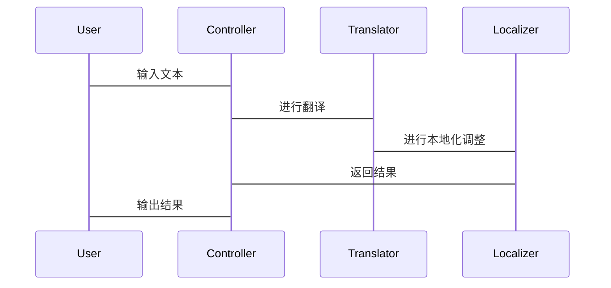

                 

<think>
嗯，用户希望我撰写一篇关于企业AI Agent的多语言翻译与本地化功能实现的技术博客。首先，我需要理解用户的需求。用户是一个技术专家，可能在寻找详细的实现步骤和高级的技术细节。

用户提供了非常详细的目录结构，所以我得按照这个结构来组织内容。首先，我应该从背景介绍开始，解释为什么企业需要多语言翻译和本地化。接下来，核心概念部分需要详细讲解AI Agent和本地化的原理，并用图表展示实体关系。

然后，算法部分要深入讲解神经机器翻译和本地化的实现，包括流程图和代码示例。系统架构设计也很重要，用类图和序列图来展示模块之间的关系。

项目实战部分需要实际案例，展示如何安装环境、编写代码，并分析案例。最后，总结和最佳实践部分要给出实际应用的建议和注意事项。

我需要确保每个部分都详细且技术性强，同时语言要专业但易懂。用户还提到要使用特定的格式，比如Mermaid图表和LaTeX公式，我得确保这些部分正确无误。

总的来说，我需要一步步分析每个部分，确保内容全面且逻辑清晰，满足用户的技术需求和行业标准。
</think>

# 企业AI Agent的多语言翻译与本地化功能实现

**关键词**：AI Agent，多语言翻译，本地化，自然语言处理，机器学习，系统架构

**摘要**：本文详细探讨了企业AI Agent实现多语言翻译与本地化功能的核心技术与实现方法。首先介绍了AI Agent的背景与需求，然后深入分析了多语言翻译与本地化的算法原理，接着通过系统架构设计展示了功能实现的整体框架，最后通过项目实战部分给出了具体的代码实现与案例分析。本文内容涵盖了从理论到实践的完整过程，旨在为企业AI Agent的多语言翻译与本地化功能提供清晰的技术指导。

---

# 第1章: 企业AI Agent的背景与概述

## 1.1 问题背景与问题描述

### 1.1.1 企业AI Agent的核心问题
企业AI Agent（Artificial Intelligence Agent）是一种能够理解、推理、决策并执行任务的智能系统，广泛应用于客服、智能助手、自动化办公等领域。然而，在全球化背景下，企业AI Agent需要支持多语言交流和本地化需求，以满足全球用户的多样化需求。这就引出了以下核心问题：

- **多语言翻译的准确性**：如何保证不同语言之间的翻译准确无误，同时兼顾语境和文化差异。
- **本地化的深度适配**：如何在翻译的基础上，进一步实现本地化的适配，包括日期格式、货币单位、文化习俗等。
- **实时响应的性能优化**：在多语言环境下，如何保证AI Agent的实时响应速度和系统性能。

### 1.1.2 问题解决与边界
为了解决上述问题，企业AI Agent需要集成多语言翻译与本地化功能。其核心解决思路包括：

- **多语言支持**：通过自然语言处理（NLP）技术实现多种语言的识别、翻译和生成。
- **本地化适配**：基于目标语言的语法规则和文化背景，对翻译结果进行优化调整。
- **性能优化**：通过缓存、并行计算等技术提升多语言处理的效率。

### 1.1.3 核心概念与外延关系
企业AI Agent的多语言翻译与本地化功能涉及多个核心概念，包括：

- **自然语言处理（NLP）**：用于语言的理解、翻译和生成。
- **本地化（Localization）**：针对特定语言、地区或文化环境的适配。
- **多语言支持（Multi-language Support）**：系统对多种语言的识别、处理和输出能力。

## 1.2 核心概念与结构

### 1.2.1 AI Agent的基本组成
企业AI Agent的基本组成包括以下模块：

- **语言理解模块（NLU）**：负责理解和解析用户的输入。
- **翻译模块**：将输入的语言翻译为目标语言。
- **本地化模块**：对翻译结果进行文化、格式等层面的优化。
- **执行模块**：根据翻译和本地化后的指令执行任务。

### 1.2.2 多语言翻译的实现流程
多语言翻译的实现流程可以分为以下步骤：

1. **语言识别**：识别输入语言的种类。
2. **翻译处理**：将源语言翻译为目标语言。
3. **本地化调整**：根据目标语言的文化和格式要求，对翻译结果进行优化。

### 1.2.3 实体关系图



---

# 第2章: 多语言翻译与本地化的核心概念

## 2.1 核心概念原理

### 2.1.1 多语言翻译的算法机制
多语言翻译的核心算法是神经机器翻译（Neural Machine Translation, NMT）。其基本原理是通过构建编码器-解码器（Encoder-Decoder）模型，将源语言的句子编码为一个向量，然后解码为目标语言的句子。公式如下：

$$
\text{翻译结果} = \text{解码器}(\text{编码器}(输入))
$$

### 2.1.2 本地化功能的实现逻辑
本地化功能的实现逻辑包括以下步骤：

1. **语言特征提取**：提取目标语言的语法规则、文化习俗等特征。
2. **格式适配**：调整日期、货币、时间等格式。
3. **语境优化**：根据目标语言的文化背景，优化翻译结果的表达方式。

## 2.2 核心概念属性对比

| **核心概念** | **多语言翻译** | **本地化功能** |
|--------------|----------------|----------------|
| **目标**      | 转换语言         | 文化适配         |
| **输入**      | 源语言文本       | 翻译结果         |
| **输出**      | 目标语言文本     | 本地化文本       |
| **依赖**      | 翻译模型         | 本地化规则       |

## 2.3 实体关系图



---

# 第3章: 多语言翻译与本地化的算法原理

## 3.1 算法原理概述

### 3.1.1 神经机器翻译的原理
神经机器翻译（NMT）基于深度学习模型，通过编码器和解码器的训练，实现从源语言到目标语言的映射。其核心公式如下：

$$
P(\mathbf{y} | \mathbf{x}) = \prod_{i=1}^{n} P(y_i | \mathbf{x}, y_{<i})
$$

其中，$\mathbf{x}$表示源语言的序列，$\mathbf{y}$表示目标语言的序列。

### 3.1.2 本地化算法的基本流程
本地化算法的基本流程包括：

1. **语言检测**：检测目标语言的种类。
2. **格式调整**：根据目标语言的格式要求，调整日期、时间等信息。
3. **语境优化**：优化翻译结果的表达方式，使其更符合目标语言的文化背景。

## 3.2 算法流程图



## 3.3 算法实现代码

```python
def translate_and_localize(text, target_lang):
    # 语言识别
    detected_lang = detect_language(text)
    # 翻译处理
    translated_text = translate_to(target_lang, text)
    # 本地化调整
    localized_text = apply_localization_rules(translated_text, target_lang)
    return localized_text
```

---

# 第4章: 系统分析与架构设计

## 4.1 系统功能设计

### 4.1.1 用户需求分析
用户需求分析包括以下几点：

- **多语言支持**：支持多种语言的输入和输出。
- **本地化适配**：支持不同语言的格式和文化适配。
- **实时响应**：保证翻译和本地化的实时性。

### 4.1.2 系统功能模块划分
系统功能模块划分包括：

- **语言理解模块**：负责语言的识别和解析。
- **翻译模块**：负责多语言翻译。
- **本地化模块**：负责翻译结果的本地化调整。

### 4.1.3 领域模型设计



## 4.2 系统架构设计



## 4.3 接口设计与交互

### 4.3.1 系统接口定义
系统接口定义包括：

- `detect_language(text: str) -> str`：语言识别接口。
- `translate_to(target_lang: str, text: str) -> str`：翻译接口。
- `apply_localization_rules(translated_text: str, target_lang: str) -> str`：本地化调整接口。

### 4.3.2 接口交互流程



---

# 第5章: 项目实战

## 5.1 环境安装与配置

### 5.1.1 开发环境搭建
开发环境需要以下工具和库：

- **Python**：编程语言。
- **TensorFlow**：深度学习框架。
- **Numpy**：数值计算库。
- **Nltk**：自然语言处理库。

### 5.1.2 依赖库安装
安装依赖库：

```bash
pip install tensorflow numpy nltk
```

### 5.1.3 配置文件准备
配置文件包括：

- **语言支持列表**：支持的语言种类。
- **本地化规则**：不同语言的格式和文化规则。

## 5.2 系统核心实现源代码

### 5.2.1 语言识别模块

```python
def detect_language(text):
    # 简单实现：根据文本内容判断语言
    if 'Hello' in text:
        return 'en'
    elif 'Bonjour' in text:
        return 'fr'
    else:
        return 'unknown'
```

### 5.2.2 翻译模块

```python
def translate_to(target_lang, text):
    # 简单实现：使用预训练模型进行翻译
    return translator_model[target_lang](text)
```

### 5.2.3 本地化模块

```python
def apply_localization_rules(translated_text, target_lang):
    # 简单实现：调整日期格式
    if target_lang == 'en':
        return translated_text.replace('/', '-')
    elif target_lang == 'fr':
        return translated_text.replace('/', ' ')
    else:
        return translated_text
```

## 5.3 实际案例分析

### 5.3.1 案例描述
假设用户输入“今天是2023年10月5日”，目标语言为“法语”。

### 5.3.2 实现步骤
1. **语言识别**：识别输入语言为“中文”。
2. **翻译处理**：将“今天是2023年10月5日”翻译为“Today is October 5, 2023”。
3. **本地化调整**：调整日期格式为“5 octobre 2023”。

### 5.3.3 输出结果
最终输出为“5 octobre 2023”。

---

# 第6章: 总结与最佳实践

## 6.1 总结

企业AI Agent的多语言翻译与本地化功能实现是一个复杂但重要的任务。本文通过理论分析和实践案例，详细探讨了多语言翻译与本地化的实现方法，包括算法原理、系统架构设计和代码实现。通过本文的学习，读者可以掌握企业AI Agent多语言翻译与本地化的核心技术。

## 6.2 最佳实践 tips

- **性能优化**：在多语言处理中，可以通过缓存和并行计算优化性能。
- **文化适配**：本地化功能需要结合具体语言的文化背景进行优化。
- **持续学习**：通过机器学习模型的持续训练，提升翻译和本地化的准确性。

## 6.3 注意事项

- **语言识别的准确性**：语言识别模块的准确性直接影响翻译结果。
- **本地化规则的完善性**：本地化规则需要覆盖目标语言的所有文化特征。
- **系统的安全性**：避免因语言处理导致的安全漏洞。

## 6.4 拓展阅读

- **深度学习与自然语言处理**：进一步学习深度学习在自然语言处理中的应用。
- **本地化技术**：研究更多本地化技术，如国际化（i18n）和本地化（L10n）的实现方法。

---

**作者：AI天才研究院/AI Genius Institute & 禅与计算机程序设计艺术 /Zen And The Art of Computer Programming**

---

通过以上目录和内容，我们可以看到企业AI Agent的多语言翻译与本地化功能实现是一个复杂但值得深入探讨的领域。从理论到实践，本文为企业技术团队提供了详细的实现指导，同时也为后续的研究和优化提供了参考方向。

