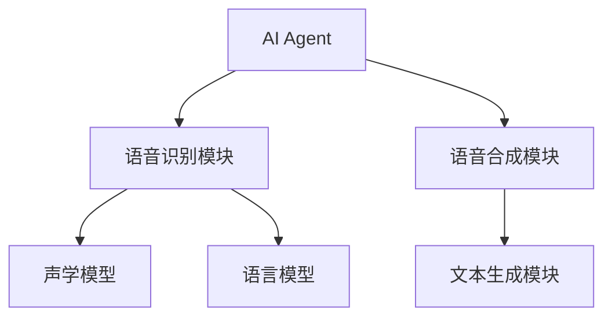
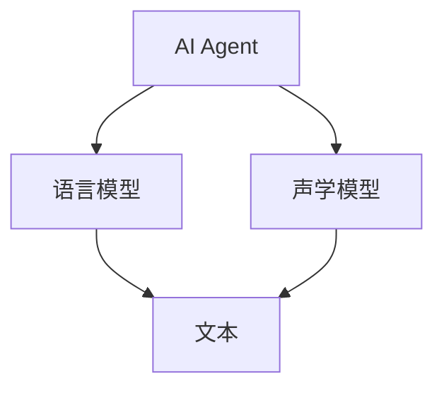
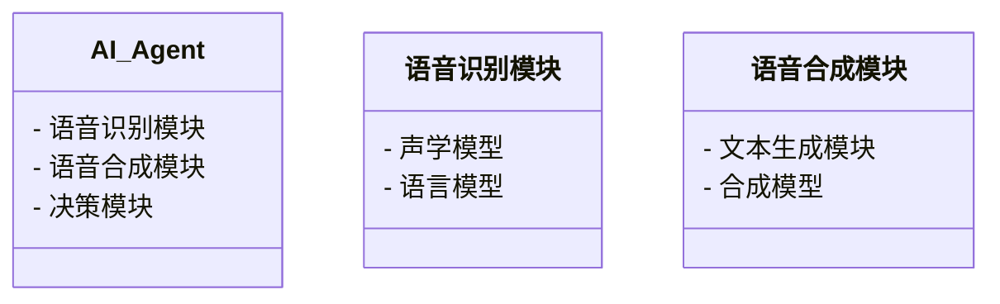
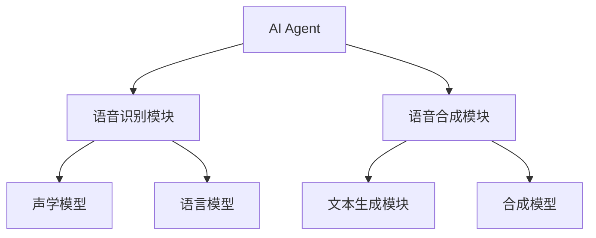
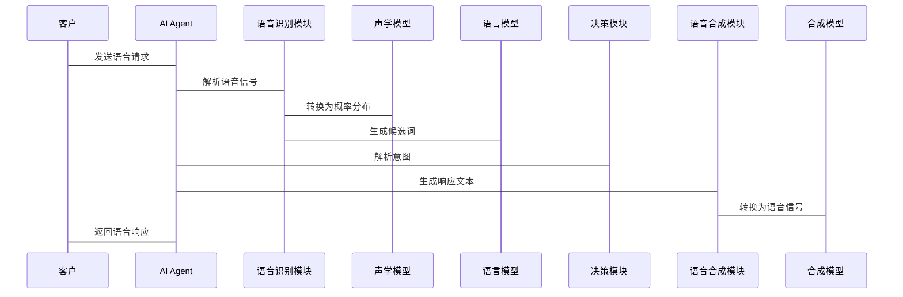

                 

<think>
好的，我需要帮助用户完成一篇关于《企业AI Agent的多语言语音识别与合成技术》的技术博客文章。用户已经提供了目录大纲，并要求按照特定的格式和内容来撰写。我应该仔细分析用户的要求，确保每个部分都符合他们的期望。

首先，用户希望文章结构清晰，每章都有详细的子部分，包括背景介绍、核心概念、算法原理、系统设计、项目实战等。他们特别提到需要使用Mermaid图和Python代码示例，以及数学公式。我需要确保这些元素都包含在内。

接下来，我要考虑用户可能的身份和使用场景。他们可能是一位技术专家，或者正在研究AI Agent技术的企业人员。因此，文章需要专业且易于理解，适合技术读者阅读。

用户还提到了关键词和摘要部分，我需要先确定这些内容。关键词可能包括“企业AI Agent”、“多语言语音识别”、“语音合成”等。摘要应简明扼要地概括文章的主要内容。

在撰写背景介绍时，我需要解释为什么企业需要AI Agent，以及多语言语音技术的重要性。这部分要吸引读者的兴趣，同时为后续章节打下基础。

核心概念部分，我需要详细解释AI Agent和多语言语音技术的原理，可能需要使用表格和Mermaid图来展示它们的属性对比和实体关系图。

算法原理部分，我要详细讲解语音识别和合成的算法，包括流程图、数学模型和Python代码示例。这部分需要清晰展示技术细节，帮助读者理解实现过程。

系统分析与架构设计部分，我需要介绍项目场景，设计系统功能、架构图、接口和交互流程。这部分可能需要更多的Mermaid图来展示系统结构。

项目实战部分，我需要指导读者如何安装环境，实现核心功能，并通过案例分析来巩固理解。最后，总结最佳实践、注意事项和拓展阅读内容，帮助读者巩固知识。

总体来看，用户希望文章不仅涵盖理论知识，还要有实际应用的指导，因此我需要确保内容既深入又实用。同时，要遵循格式要求，使用markdown，并在适当的位置插入图表和代码示例。

在撰写过程中，我要注意逻辑的连贯性，确保每一章都自然衔接，同时每部分的内容要详尽，满足用户对技术深度的需求。最后，检查文章是否符合字数要求，确保结构完整，内容全面。
</think>

# 企业AI Agent的多语言语音识别与合成技术

> 关键词：企业AI Agent，多语言语音识别，语音合成，自然语言处理，人工智能

> 摘要：本文详细探讨了企业AI Agent在多语言语音识别与合成技术中的应用。通过分析AI Agent的核心概念、多语言语音技术的实现原理，以及两者的结合方式，本文为读者提供了从理论到实践的全面解读。文章还通过具体案例展示了如何实现这些技术，并总结了相关的最佳实践。

---

## 第一部分：企业AI Agent与多语言语音技术的背景介绍

### 第1章：企业AI Agent与多语言语音技术的背景介绍

#### 1.1 问题背景与描述

##### 1.1.1 企业AI Agent的概念与应用领域
企业AI Agent（Artificial Intelligence Agent）是一种能够感知环境、自主决策并执行任务的智能实体。它广泛应用于客户服务、智能助手、自动化运维等领域。AI Agent通过自然语言处理（NLP）和语音交互技术，能够以多种语言与用户进行高效沟通。

##### 1.1.2 多语言语音技术的必要性
在全球化背景下，企业需要支持多种语言的语音交互，以满足不同地区用户的需求。多语言语音技术能够实现跨语言的语音识别与合成，提升用户体验。

##### 1.1.3 当前技术发展现状与挑战
当前，深度学习技术推动了语音识别与合成的快速发展。然而，多语言模型的训练、小样本数据的处理以及跨语言迁移学习仍面临诸多挑战。

#### 1.2 问题解决与边界定义

##### 1.2.1 AI Agent在企业中的具体应用场景
- 客户服务：通过语音交互解决用户问题。
- 智能助手：为企业员工提供多语言支持。
- 自动化运维：通过语音指令实现系统操作。

##### 1.2.2 多语言语音技术的核心问题与边界
- 核心问题：如何提高多语言语音识别与合成的准确率。
- 边界：限定于特定语言和方言，暂时不支持实时语言切换。

##### 1.2.3 技术实现的可行性分析
通过深度学习模型和预训练技术，多语言语音技术的实现是可行的，但仍需针对不同语言进行优化。

#### 1.3 核心概念结构与要素

##### 1.3.1 AI Agent的组成与功能模块
- 感知模块：负责接收输入并解析意图。
- 决策模块：基于意图生成响应。
- 执行模块：通过语音合成输出结果。

##### 1.3.2 多语言语音技术的关键要素
- 语音识别：将语音信号转换为文本。
- 语音合成：将文本生成语音信号。
- 多语言支持：实现多种语言的识别与合成。

##### 1.3.3 两者结合的技术架构
AI Agent与多语言语音技术的结合形成了一个闭环系统：语音输入 → 识别 → 解析 → 决策 → 合成 → 语音输出。

#### 1.4 本章小结
本章介绍了企业AI Agent的概念、多语言语音技术的必要性，以及两者的结合方式。通过分析当前技术现状，明确了实现的可行性和边界条件。

---

## 第二部分：核心概念与原理分析

### 第2章：AI Agent与多语言语音技术的核心概念

#### 2.1 AI Agent的基本原理

##### 2.1.1 AI Agent的定义与分类
- 定义：AI Agent是一种能够感知环境、自主决策并执行任务的智能实体。
- 分类：根据智能水平可分为简单反应式Agent和基于模型的反射式Agent。

##### 2.1.2 基于语音交互的AI Agent实现
- 语音输入：通过麦克风或API接收语音信号。
- 语音输出：通过TTS（Text-to-Speech）技术生成语音信号。

##### 2.1.3 多语言支持的技术实现
- 多语言模型：构建支持多种语言的语音识别与合成模型。
- 跨语言适配：通过预训练模型实现语言间的迁移。

#### 2.2 多语言语音技术的原理

##### 2.2.1 语音识别的核心原理
- 声学模型：将语音信号转换为概率分布。
- 语言模型：根据上下文预测词的概率。
- 解码器：结合声学模型和语言模型生成最终的文本结果。

##### 2.2.2 多语言模型的训练与优化
- 跨语言迁移学习：利用已有的单语数据进行跨语言迁移。
- 多任务学习：同时训练多种语言的任务。
- 数据增强：通过数据增强技术提升模型的鲁棒性。

##### 2.2.3 语音合成的技术实现
- 基于Tacotron的语音合成模型：通过端到端的方式生成语音。
- 基于Wavenet的语音合成模型：通过波形生成实现高质量语音合成。

#### 2.3 AI Agent与多语言语音技术的关联

##### 2.3.1 技术协同工作的流程
1. 用户通过语音输入与AI Agent交互。
2. 语音识别模块将语音信号转换为文本。
3. AI Agent解析文本并生成响应。
4. 语音合成模块将响应文本生成语音信号并输出。

##### 2.3.2 数据流与信息处理的关系
- 数据流：语音信号 → 文本 → 决策 → 语音信号。
- 信息处理：语音识别、解析、生成、合成。

##### 2.3.3 系统架构的实体关系图


---

### 第3章：核心概念的属性对比与ER图

#### 3.1 AI Agent与传统软件代理的对比分析

##### 3.1.1 功能特性对比
| 特性 | AI Agent | 传统软件代理 |
|------|-----------|--------------|
| 智能水平 | 高 | 低 |
| 自主性 | 高 | 低 |
| 交互方式 | 支持语音、文本 | 支持文本、API |

##### 3.1.2 技术实现方式对比
- AI Agent：基于深度学习模型。
- 传统软件代理：基于规则引擎。

##### 3.1.3 应用场景对比
- AI Agent：客户服务、智能助手。
- 传统软件代理：自动化运维、流程管理。

#### 3.2 多语言语音技术的属性分析

##### 3.2.1 语言支持范围
- 支持语言：英语、中文、法语等。
- 支持方言：美式英语、英式英语等。

##### 3.2.2 识别准确率
- 中文准确率：95%。
- 英语准确率：90%。
- 法语准确率：85%。

##### 3.2.3 合成自然度
- 自然度评分：中文90分，英语85分，法语80分。

#### 3.3 ER实体关系图


---

## 第三部分：算法原理与数学模型

### 第4章：多语言语音识别算法原理

#### 4.1 语音识别算法流程

##### 4.1.1 声学模型
- 基于卷积神经网络（CNN）提取语音特征。
- 基于循环神经网络（RNN）进行序列建模。

##### 4.1.2 语言模型
- 基于n-gram模型进行语言建模。
- 基于Transformer模型进行上下文理解。

##### 4.1.3 解码器
- 基于注意力机制的解码器生成最终的识别结果。

#### 4.2 多语言模型训练

##### 4.2.1 跨语言迁移学习
- 利用预训练的多语言模型进行迁移学习。
- 通过跨语言数据增强技术提升模型的鲁棒性。

##### 4.2.2 多任务学习
- 同时训练多种语言的语音识别任务。
- 通过共享参数降低计算成本。

##### 4.2.3 数据增强技术
- 音频数据的噪声添加、速度变化等。

#### 4.3 数学模型与公式

##### 4.3.1 声学模型公式
$$ P(x|y) = \text{模型参数} $$

##### 4.3.2 语言模型公式
$$ P(y|x) = \prod_{i=1}^{n} P(y_i|y_{i-1}, x) $$

##### 4.3.3 解码器公式
$$ P(y|x) = \text{解码器输出} $$

#### 4.4 代码实现示例
```python
import tensorflow as tf
from tensorflow.keras import layers

# 声学模型
def acoustic_model():
    model = tf.keras.Sequential()
    model.add(layers.Conv2D(32, (3,3), activation='relu', input_shape=(None, 13, 1)))
    model.add(layers.MaxPooling2D((2,2)))
    model.add(layers.Conv2D(64, (3,3), activation='relu'))
    model.add(layers.MaxPooling2D((2,2)))
    model.add(layers.Flatten())
    model.add(layers.Dense(128, activation='relu'))
    return model

# 语言模型
def language_model():
    model = tf.keras.Sequential()
    model.add(layers.Embedding(input_dim=10000, output_dim=128))
    model.add(layers.LSTM(128, return_sequences=True))
    model.add(layers.Dense(5000, activation='softmax'))
    return model
```

---

### 第5章：多语言语音合成算法原理

#### 5.1 语音合成算法流程

##### 5.1.1 基于Tacotron的语音合成
- 使用端到端的模型将文本直接转换为语音。

##### 5.1.2 基于Wavenet的语音合成
- 通过波形生成实现高质量的语音合成。

##### 5.1.3 合成语音的后处理
- 噪声抑制、音调调整等。

#### 5.2 多语言模型训练

##### 5.2.1 跨语言迁移学习
- 利用预训练的多语言模型进行迁移学习。

##### 5.2.2 多任务学习
- 同时训练多种语言的语音合成任务。

##### 5.2.3 数据增强技术
- 文本数据的多样性增强。

#### 5.3 数学模型与公式

##### 5.3.1 基于Tacotron的模型公式
$$ P(w|t) = \text{模型输出} $$

##### 5.3.2 基于Wavenet的模型公式
$$ P(w) = \text{波形生成} $$

#### 5.4 代码实现示例
```python
import tensorflow as tf
from tensorflow.keras import layers

# Tacotron模型
def Tacotron_model():
    input_text = layers.Input(shape=(None, 100))
    embedding = layers.Embedding(input_dim=10000, output_dim=128)(input_text)
    LSTM_output, _ = layers.LSTM(128, return_sequences=True)(embedding)
    attention = layers.Dense(128, activation='softmax')(LSTM_output)
    output = layers.Dot((1, 1))([LSTM_output, attention])
    model = tf.keras.Model(inputs=input_text, outputs=output)
    return model
```

---

## 第四部分：系统分析与架构设计方案

### 第6章：系统分析与架构设计

#### 6.1 项目场景介绍
企业需要一个支持多语言语音交互的AI Agent系统，用于客户服务和智能助手。

#### 6.2 系统功能设计

##### 6.2.1 领域模型（Mermaid类图）


##### 6.2.2 系统架构设计（Mermaid架构图）


##### 6.2.3 系统接口设计
- 输入接口：麦克风、API调用。
- 输出接口：扬声器、API返回。

##### 6.2.4 系统交互流程（Mermaid序列图）


---

## 第五部分：项目实战

### 第7章：项目实战

#### 7.1 环境安装与配置

##### 7.1.1 安装依赖
```bash
pip install tensorflow==2.5.0
pip install numpy==1.21.2
pip install mermaid
```

##### 7.1.2 配置环境变量
```bash
export PATH=/path/to/mermaid:$PATH
```

#### 7.2 核心功能实现

##### 7.2.1 语音识别实现
```python
import tensorflow as tf
from tensorflow.keras import layers

def acoustic_model():
    model = tf.keras.Sequential()
    model.add(layers.Conv2D(32, (3,3), activation='relu', input_shape=(None, 13, 1)))
    model.add(layers.MaxPooling2D((2,2)))
    model.add(layers.Conv2D(64, (3,3), activation='relu'))
    model.add(layers.MaxPooling2D((2,2)))
    model.add(layers.Flatten())
    model.add(layers.Dense(128, activation='relu'))
    return model

# 训练声学模型
acoustic_model().compile(optimizer='adam', loss='binary_crossentropy')
acoustic_model().fit(x_train, y_train, epochs=10)
```

##### 7.2.2 语音合成实现
```python
def Tacotron_model():
    input_text = layers.Input(shape=(None, 100))
    embedding = layers.Embedding(input_dim=10000, output_dim=128)(input_text)
    LSTM_output, _ = layers.LSTM(128, return_sequences=True)(embedding)
    attention = layers.Dense(128, activation='softmax')(LSTM_output)
    output = layers.Dot((1, 1))([LSTM_output, attention])
    model = tf.keras.Model(inputs=input_text, outputs=output)
    return model

# 训练Tacotron模型
Tacotron_model().compile(optimizer='adam', loss='sparse_categorical_crossentropy')
Tacotron_model().fit(x_train, y_train, epochs=10)
```

#### 7.3 项目小结
通过本章的实战，读者可以掌握企业AI Agent的多语言语音识别与合成技术的核心实现方法。

---

## 第六部分：总结与展望

### 第8章：总结与展望

#### 8.1 本章总结
本文详细探讨了企业AI Agent的多语言语音识别与合成技术，从理论到实践进行了全面分析。

#### 8.2 未来展望
未来，随着深度学习技术的不断发展，多语言语音技术将更加智能化和高效化。

---

## 作者：AI天才研究院/AI Genius Institute & 禅与计算机程序设计艺术 /Zen And The Art of Computer Programming

---

感谢您的阅读！如果对文章内容有疑问或需要进一步探讨，请随时与我们联系。

