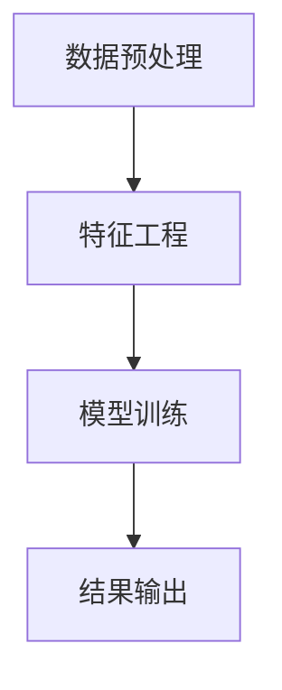
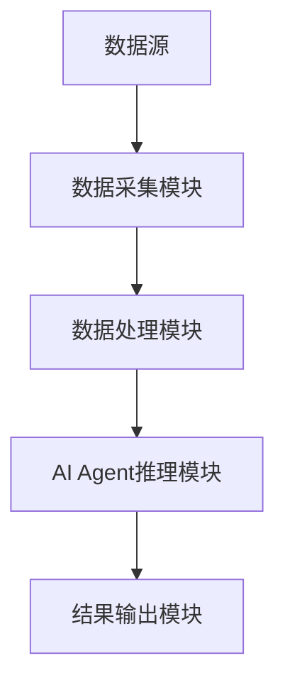
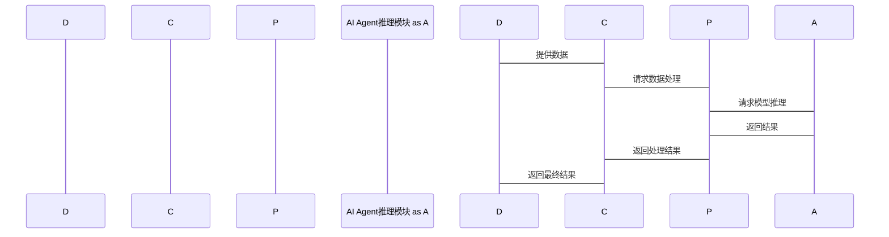

                 


# 《企业AI Agent的大数据处理框架》

## 关键词：企业AI Agent，大数据处理，数据预处理，特征工程，模型训练，系统架构

## 摘要：  
本文将探讨企业AI Agent在大数据处理中的应用框架。通过分析AI Agent的核心概念、大数据处理框架的原理，以及两者的结合方式，本文旨在为企业提供一套高效的大数据处理解决方案。文章将从背景介绍、核心概念、算法原理、系统设计、项目实战等多个维度展开，深入剖析企业AI Agent在大数据处理中的关键技术与实践。

---

## 第1章 企业AI Agent的背景与问题背景

### 1.1 问题背景与问题描述  
企业在数字化转型过程中，面临着海量数据的处理挑战。这些数据来自多种渠道，包括结构化数据（如数据库中的表格数据）和非结构化数据（如文本、图像、视频等）。传统的数据处理方式效率低下，难以应对实时性和复杂性要求。  

AI Agent作为一种智能代理，能够自动化地处理数据，优化数据流，并提供智能化的决策支持。然而，如何将AI Agent与大数据处理框架结合，仍然是企业面临的技术难题。  

### 1.2 问题解决与边界外延  
AI Agent通过智能化的数据处理流程，能够显著提高企业的数据处理效率。本文将重点探讨以下问题：  
1. AI Agent如何与大数据处理框架交互？  
2. 如何设计高效的算法流程？  
3. 如何确保系统的可扩展性和可靠性？  

### 1.3 核心概念与结构  
- **AI Agent**：一种能够感知环境并采取行动以实现目标的智能实体。  
- **大数据处理框架**：包括数据采集、存储、处理、分析和可视化的工具集合。  
- **核心要素**：数据源、数据处理逻辑、AI Agent的智能决策模块、结果输出模块。  

---

## 第2章 核心概念原理与对比分析

### 2.1 AI Agent与大数据处理框架的核心原理  
- **AI Agent**：通过机器学习模型进行数据理解、特征提取和决策推理。  
- **大数据处理框架**：利用分布式计算（如MapReduce）和流处理技术（如Kafka）进行高效数据处理。  

### 2.2 核心概念的属性特征对比  

| 特性          | AI Agent                          | 大数据处理框架                     |
|---------------|-----------------------------------|------------------------------------|
| 处理方式       | 智能化、自动化                    | 批处理或流处理                     |
| 数据源         | 结构化与非结构化数据             | 多源异构数据                       |
| 可扩展性       | 强                                  | 强                                  |
| 响应时间       | 实时或近实时                    | 批量处理较慢                      |
| 智能性         | 高                                 | 低或无                             |

### 2.3 ER实体关系图架构  
```mermaid
er
actor(AI Agent, "与数据交互的主体")
actor(大数据处理框架, "处理数据的系统")
relationship(使用, "AI Agent使用大数据处理框架进行数据处理")
```

---

## 第3章 算法原理与流程图

### 3.1 算法原理  
- **数据预处理**：清洗数据、处理缺失值、标准化等。  
- **特征工程**：提取特征、降维（如PCA）、特征组合。  
- **模型训练**：使用机器学习算法（如随机森林、神经网络）进行模型训练。  

### 3.2 算法流程图  


### 3.3 代码实现  
```python
import pandas as pd
from sklearn.impute import SimpleImputer
from sklearn.preprocessing import StandardScaler
from sklearn.ensemble import RandomForestClassifier

# 数据预处理
def preprocess(data):
    # 处理缺失值
    imputer = SimpleImputer(strategy='mean')
    processed_data = imputer.fit_transform(data)
    return processed_data

# 特征工程
def feature_engineering(data):
    scaler = StandardScaler()
    features = scaler.fit_transform(data)
    return features

# 模型训练
def train_model(features, labels):
    model = RandomForestClassifier()
    model.fit(features, labels)
    return model

# 示例数据
data = pd.DataFrame({
    'feature1': [1, 2, 3, 4],
    'feature2': [5, 6, 7, 8],
    'label': [0, 1, 0, 1]
})

processed_data = preprocess(data[['feature1', 'feature2']])
features = feature_engineering(processed_data)
model = train_model(features, data['label'])
```

---

## 第4章 系统分析与架构设计

### 4.1 问题场景介绍  
企业需要处理来自多个部门的异构数据，包括销售、客户、物流等信息。AI Agent需要实时监控数据流，并根据预设规则进行决策。  

### 4.2 系统功能设计  
- **数据采集**：从数据库、API等来源获取数据。  
- **数据处理**：清洗、转换、增强数据。  
- **模型推理**：基于AI Agent的模型进行预测或分类。  
- **结果输出**：将结果反馈给系统或用户。  

### 4.3 系统架构设计  


### 4.4 接口设计  
- 数据采集模块接口：`GET /api/data`  
- 数据处理模块接口：`POST /api/process`  
- AI Agent推理模块接口：`POST /api/predict`  

### 4.5 交互流程图  


---

## 第5章 项目实战

### 5.1 环境安装  
- 安装Python、Jupyter Notebook、Scikit-learn、Pandas、Mermaid工具。  

### 5.2 核心代码实现  
```python
import mermaid

# 定义流程图
flowchart TD
    A[数据预处理] --> B[特征工程]
    B --> C[模型训练]
    C --> D[结果输出]

# 定义类图
classDiagram
    class AI-Agent {
        +data: 数据
        +model: 模型
        -predict(): 预测
    }
    class 大数据处理框架 {
        +data_source: 数据源
        +process(): 处理
        -output(): 输出
    }
    AI-Agent --> 大数据处理框架: 使用
```

### 5.3 代码解读与分析  
- 数据预处理模块：清洗数据，处理缺失值。  
- 特征工程模块：标准化特征，提取关键特征。  
- 模型训练模块：使用随机森林进行分类，输出预测结果。  

### 5.4 案例分析与详细讲解  
假设企业需要预测客户购买行为，AI Agent可以从客户数据库中提取数据，经过预处理和特征工程后，训练分类模型，并将结果反馈给销售部门。  

---

## 第6章 最佳实践、小结、注意事项、拓展阅读

### 6.1 最佳实践  
- 定期更新模型，避免过时。  
- 使用分布式计算框架（如Spark）提高处理效率。  
- 优化特征工程，减少计算开销。  

### 6.2 小结  
本文详细介绍了企业AI Agent在大数据处理中的应用框架，涵盖了核心概念、算法原理、系统设计和项目实战。通过理论与实践的结合，为企业提供了一套高效的大数据处理解决方案。  

### 6.3 注意事项  
- 数据安全：确保数据处理过程中的隐私保护。  
- 系统稳定性：设计容错机制，避免单点故障。  
- 性能优化：合理选择算法和工具，提高处理效率。  

### 6.4 拓展阅读  
- 《机器学习实战》  
- 《分布式系统设计的艺术》  
- 《大数据处理与分析》  

---

## 作者：AI天才研究院/AI Genius Institute & 禅与计算机程序设计艺术 /Zen And The Art of Computer Programming

