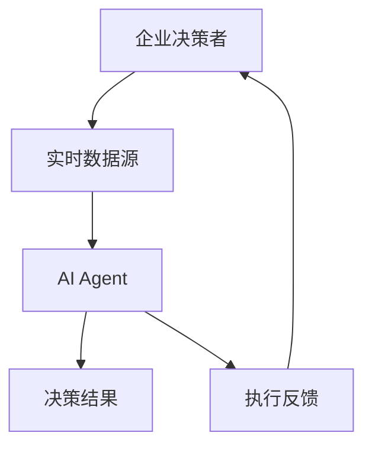
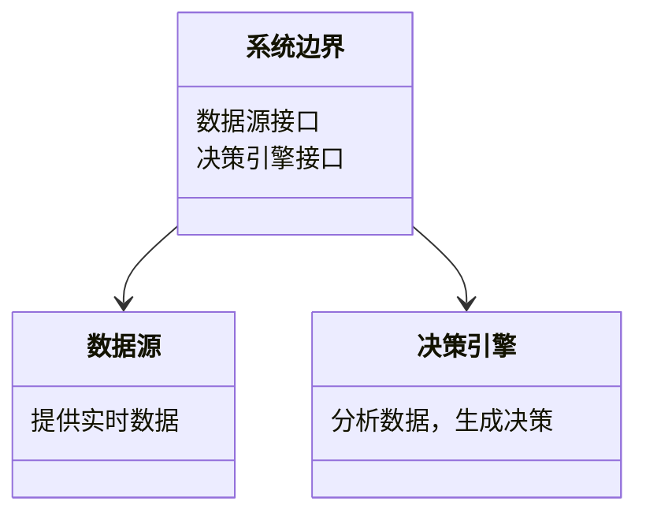
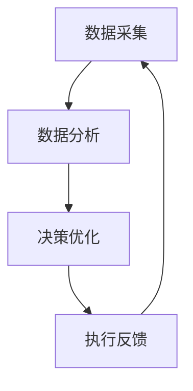
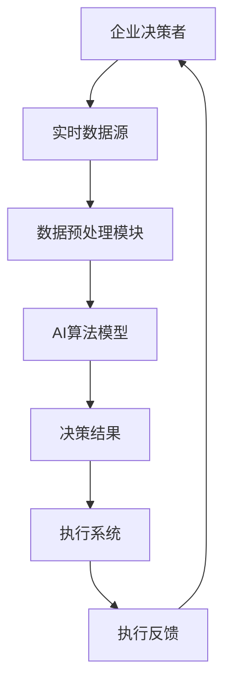

                 


```

# 企业AI Agent的实时决策支持系统

> 关键词：企业AI Agent，实时决策支持系统，决策智能，人工智能算法，企业智能化

> 摘要：本文将详细探讨企业AI Agent在实时决策支持系统中的应用，涵盖背景介绍、核心概念、算法原理、系统架构以及项目实战等部分，为读者提供从理论到实践的全面解析。

---

# 第一部分：企业AI Agent与实时决策支持系统概述

## 第1章：问题背景与解决方案

### 1.1 问题背景
#### 1.1.1 企业决策支持的现状与挑战
企业面临的决策问题日益复杂，传统决策支持系统（DSS）存在响应速度慢、数据处理能力有限等问题。随着市场竞争的加剧，企业需要更高效、实时的决策支持手段。

#### 1.1.2 AI Agent在企业决策中的作用
AI Agent（人工智能代理）具备自主决策、实时响应和自我优化的能力，能够显著提升企业的决策效率和准确性。

#### 1.1.3 实时决策支持系统的核心价值
实时决策支持系统（RTDSS）通过实时数据分析和AI算法，为企业提供快速、精准的决策支持，帮助企业捕捉市场机会和规避风险。

### 1.2 问题描述
#### 1.2.1 传统决策支持系统的局限性
传统DSS通常依赖静态数据，无法实时处理动态变化的业务场景，导致决策滞后。

#### 1.2.2 AI Agent与RTDSS的结合需求
企业需要一种能够实时感知环境变化、动态调整决策策略的系统，以应对复杂的商业环境。

#### 1.2.3 企业AI Agent的决策支持需求
企业在决策过程中需要AI Agent具备以下能力：实时数据处理、动态决策优化、多目标协调优化。

### 1.3 问题解决
#### 1.3.1 AI Agent在实时决策中的优势
AI Agent能够通过机器学习和自然语言处理技术，实时分析大量数据，提供智能化的决策支持。

#### 1.3.2 实时决策支持系统的实现路径
通过构建实时数据流处理系统、强化学习算法优化决策模型，以及与企业现有系统的集成，实现RTDSS的落地。

#### 1.3.3 企业AI Agent的决策支持框架
包括实时数据采集、智能分析、决策优化和执行反馈四大模块。

### 1.4 概念结构与核心要素
#### 1.4.1 实时决策支持系统的构成要素
- 数据源：实时数据采集模块
- 分析引擎：AI算法模型
- 决策引擎：优化算法模块
- 执行反馈：闭环优化模块

#### 1.4.2 企业AI Agent的核心功能
- 实时感知与数据处理
- 智能决策与优化
- 自我学习与进化

#### 1.4.3 系统边界与外延
系统边界：企业内部业务数据和外部市场数据的实时采集与处理。
外延：与企业现有的ERP、CRM等系统的集成。

---

## 第2章：核心概念与联系

### 2.1 核心概念原理
#### 2.1.1 AI Agent的基本原理
AI Agent通过感知环境、目标设定、推理规划和执行反馈，实现自主决策。

#### 2.1.2 实时决策支持系统的算法原理
基于强化学习、监督学习等算法，实现动态决策优化。

#### 2.1.3 企业AI Agent的决策机制
通过多目标优化和博弈论模型，实现企业内外部利益的协调。

### 2.2 核心概念对比分析
#### 2.2.1 AI Agent与传统决策系统的对比
| 特性 | AI Agent | 传统DSS |
|------|-----------|----------|
| 数据处理 | 实时、动态 | 静态、离线 |
| 决策方式 | 自主、智能 | 人工辅助 |
| 响应速度 | 实时 | 延时 |

#### 2.2.2 实时决策支持系统的特征分析
- 数据实时性：支持秒级数据处理
- 决策动态性：适应环境变化
- 系统集成性：与企业现有系统无缝对接

#### 2.2.3 企业AI Agent的属性特征对比
| 属性 | 强化学习 | 监督学习 |
|------|----------|----------|
| 数据需求 | 需要环境反馈 | 需要标注数据 |
| 决策方式 | 基于策略优化 | 基于规则分类 |

### 2.3 实体关系图
#### 2.3.1 ER实体关系图
```mermaid
erd
    系统边界
    实体1：企业决策者
    实体2：实时数据源
    实体3：AI Agent
    实体4：决策结果
    关系：
        企业决策者 -> 数据源：触发数据采集
        数据源 -> AI Agent：提供实时数据
        AI Agent -> 决策结果：生成优化决策
```

#### 2.3.2 系统架构图


---

## 第3章：算法原理与实现

### 3.1 算法原理概述
#### 3.1.1 强化学习算法
通过定义状态、动作和奖励函数，训练AI Agent在动态环境中做出最优决策。

#### 3.1.2 监督学习算法
基于历史数据训练分类器或回归模型，用于预测最优决策方案。

#### 3.1.3 实时决策算法
结合强化学习和监督学习，实现动态环境下的实时决策优化。

### 3.2 算法流程图
#### 3.2.1 强化学习算法流程图
```mermaid
graph TD
    Start --> Initialize agent
    Initialize agent --> Collect state
    Collect state --> Choose action
    Choose action --> Execute action
    Execute action --> Receive reward
    Receive reward --> Update Q-value
    Update Q-value --> Repeat until convergence
```

#### 3.2.2 监督学习算法流程图
```mermaid
graph TD
    Start --> Collect data
    Collect data --> Preprocess data
    Preprocess data --> Train model
    Train model --> Validate model
    Validate model --> Deploy model
```

### 3.3 算法实现
#### 3.3.1 Python源代码实现
```python
import numpy as np
import gym

env = gym.make('CartPole-v0')
env.seed(42)

# 强化学习算法实现（Q-Learning）
class QLearningAgent:
    def __init__(self, env):
        self.env = env
        self.gamma = 0.99
        self.epsilon = 0.5
        self.lr = 0.1
        self.q_table = np.zeros([env.observation_space.shape[0], env.action_space.n])

    def act(self, state):
        if np.random.random() < self.epsilon:
            return self.env.action_space.sample()
        return np.argmax(self.q_table[state])

    def learn(self, state, action, reward, next_state):
        target = reward + self.gamma * np.max(self.q_table[next_state])
        self.q_table[state][action] = self.q_table[state][action] + self.lr * (target - self.q_table[state][action])

agent = QLearningAgent(env)
for _ in range(1000):
    state = env.reset()
    done = False
    while not done:
        action = agent.act(state)
        next_state, reward, done, _ = env.step(action)
        agent.learn(state, action, reward, next_state)
        state = next_state
```

#### 3.3.2 算法原理的数学模型
$$ Q(s, a) = Q(s, a) + \alpha (r + \gamma Q(s', a') - Q(s, a)) $$

其中：
- $s$：当前状态
- $a$：当前动作
- $s'$：下一个状态
- $r$：奖励
- $\alpha$：学习率
- $\gamma$：折扣因子

---

## 第4章：系统分析与架构设计

### 4.1 问题场景介绍
#### 4.1.1 企业决策支持的典型场景
- 市场实时监测与响应
- 生产过程优化与控制
- 客户行为预测与服务优化

#### 4.1.2 实时决策支持系统的应用场景
- 供应链管理
- 财务风险管理
- 市场营销优化

#### 4.1.3 企业AI Agent的决策支持需求
- 多目标优化
- 动态环境适应
- 高效数据处理

### 4.2 系统功能设计
#### 4.2.1 领域模型类图


#### 4.2.2 系统功能模块划分
- 数据采集模块
- 数据分析模块
- 决策优化模块
- 执行反馈模块

#### 4.2.3 功能模块交互设计


### 4.3 系统架构设计
#### 4.3.1 系统架构图


#### 4.3.2 系统接口设计
- 数据接口：支持多种数据源的接入
- 决策接口：提供实时决策服务
- 反馈接口：接收执行结果并优化模型

#### 4.3.3 系统交互序列图


---

## 第5章：项目实战与优化

### 5.1 环境安装与配置
- 安装Python、TensorFlow、Keras等依赖库
- 配置开发环境（Jupyter Notebook、PyCharm等）

### 5.2 核心代码实现
#### 5.2.1 数据采集模块
```python
import requests
import json

def fetch_realtime_data():
    response = requests.get('https://api.example.com/data')
    return json.loads(response.text)
```

#### 5.2.2 数据分析模块
```python
import pandas as pd
from sklearn import preprocessing

def preprocess_data(data):
    df = pd.DataFrame(data)
    # 数据清洗与特征工程
    df = df.dropna()
    df = pd.get_dummies(df)
    return df
```

#### 5.2.3 决策优化模块
```python
import numpy as np
from sklearn.model import LinearSVC

def train_decision_model(data):
    X = data.drop('target', axis=1)
    y = data['target']
    model = LinearSVC()
    model.fit(X, y)
    return model
```

#### 5.2.4 执行反馈模块
```python
def feedback_optimizer(feedback):
    # 根据反馈调整模型参数
    pass
```

### 5.3 实际案例分析
#### 5.3.1 案例背景
- 某企业希望优化供应链管理，减少库存成本。

#### 5.3.2 数据分析与建模
- 使用强化学习算法优化库存策略，实现库存成本最小化。

#### 5.3.3 系统实现与测试
- 集成各功能模块，进行系统测试与优化。

### 5.4 项目小结
- 项目目标达成情况
- 系统性能优化建议
- 可能遇到的问题及解决方案

---

## 第6章：最佳实践与总结

### 6.1 最佳实践
- 数据质量管理：确保数据的实时性与准确性
- 模型优化：定期更新模型参数，适应业务变化
- 系统集成：与企业现有系统无缝对接

### 6.2 本章小结
- 企业AI Agent的实时决策支持系统的核心价值
- 实现过程中的关键点与注意事项
- 未来的发展趋势与研究方向

### 6.3 注意事项
- 数据隐私与安全
- 系统稳定性与容错性
- 模型解释性与可扩展性

### 6.4 拓展阅读
- 推荐相关书籍与论文
- 提供进一步学习的资源链接

---

# 作者：AI天才研究院 & 禅与计算机程序设计艺术
```

