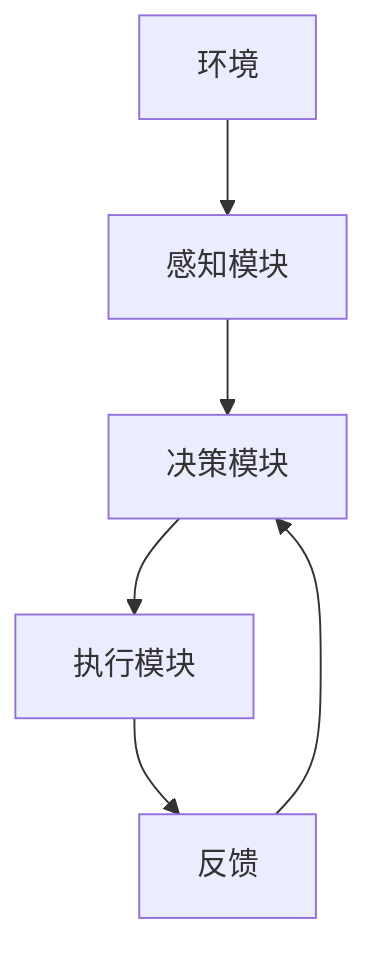

                 

<think>
好，现在我要撰写一篇关于《企业AI Agent的实时学习能力：持续优化业务流程》的技术博客文章。首先，我需要理解用户的需求。他们希望我以一位经验丰富的人工智能专家的身份，分析企业如何利用AI Agent实时学习能力来优化业务流程。

我先从文章的结构开始。用户已经给出一个详细的目录，包括关键词、摘要和正文的各个部分。我需要按照这个结构来展开内容。

**1. 引言**

在引言部分，我需要解释什么是企业AI Agent，以及它们的实时学习能力如何帮助企业优化业务流程。我应该简明扼要地介绍AI Agent的概念，强调其在实时学习和持续优化中的作用。

**2. AI Agent的核心概念**

接下来，我需要详细讲解AI Agent的核心模块：感知、决策和执行。每个模块的功能和相互关系需要清晰说明。可能还需要用表格或图表来展示这些模块的交互和依赖关系。

**3. 实时学习能力的算法原理**

这里，我应该选择一种适合实时学习的算法，比如强化学习，并详细解释其工作原理。使用数学公式和代码示例来增强理解，同时用图表展示算法流程。

**4. 系统设计与架构**

在系统设计部分，我需要描述企业AI Agent系统的架构，包括各个模块的交互和接口设计。使用Mermaid图来展示系统架构和交互流程，帮助读者更好地理解。

**5. 项目实战**

这部分需要一个具体的案例分析，展示如何在实际业务中应用AI Agent。包括环境安装、代码实现和案例分析，让读者能够跟随操作，理解实际应用。

**6. 最佳实践与总结**

最后，总结AI Agent在企业中的应用价值，并提供一些实用的建议和注意事项，帮助读者更好地实施和优化。

在撰写过程中，我需要确保语言专业且易懂，逻辑清晰，结构紧凑。每个部分都要详细展开，确保读者能够理解并应用这些知识。同时，注意使用适当的关键词和标签，提高文章的可读性和SEO效果。

现在，我开始按照这些步骤撰写文章，确保每个部分都符合用户的要求，内容详实，结构合理。
</think>

# 企业AI Agent的实时学习能力：持续优化业务流程

## 关键词：企业AI Agent，实时学习能力，业务流程优化，人工智能，强化学习，系统架构

## 摘要

企业AI Agent通过实时学习能力，能够持续优化业务流程，提升效率和决策能力。本文详细探讨了AI Agent的核心概念、实时学习的算法原理、系统设计与架构，以及项目实战案例，为读者提供全面的指导和见解。

---

# 第一章：企业AI Agent与实时学习能力概述

## 1.1 AI Agent的基本概念

AI Agent（人工智能代理）是一种能够感知环境、做出决策并执行操作的智能系统。企业AI Agent通过实时学习能力，能够根据最新数据优化业务流程。

## 1.2 企业AI Agent的应用场景

- **客户服务与支持**：自动化响应和解决客户问题。
- **业务流程自动化**：识别瓶颈并优化流程。
- **数据分析与决策支持**：实时分析数据，辅助决策。

## 1.3 实时学习能力的重要性

实时学习使AI Agent能够快速适应变化，持续优化业务流程。它是通过强化学习等算法实现的，能够从反馈中不断改进。

---

# 第二章：AI Agent的核心概念与原理

## 2.1 感知模块

### 2.1.1 数据采集与处理

感知模块负责收集环境数据，包括客户反馈、系统日志等。通过数据预处理和特征提取，将原始数据转换为可用格式。

## 2.2 决策模块

### 2.2.1 决策算法

使用强化学习算法，如Q-learning，通过状态、动作和奖励的循环不断优化决策策略。

## 2.3 执行模块

### 2.3.1 动作执行

根据决策模块的指令，执行具体操作，如调整资源分配或修改流程步骤。

---

# 第三章：实时学习能力的算法原理

## 3.1 强化学习算法

### 3.1.1 算法流程图



### 3.1.2 数学模型

状态转移方程：
$$ P(s' | s, a) $$

Q-learning公式：
$$ Q(s, a) = Q(s, a) + \alpha [r + \max Q(s', a') - Q(s, a)] $$

---

# 第四章：系统设计与架构

## 4.1 系统架构图


## 4.2 接口设计

- **API接口**：提供RESTful API，供其他系统调用。
- **数据接口**：与数据库和其他系统进行数据交互。

---

# 第五章：项目实战

## 5.1 环境安装

安装Python和必要的库，如TensorFlow和Scikit-learn。

## 5.2 核心代码实现

```python
import numpy as np
import gym

env = gym.make('CartPole-v0')
Q = np.zeros([env.observation_space.shape[0], env.action_space.n])
alpha = 0.1

for episode in range(1000):
    state = env.reset()
    for _ in range(1000):
        action = np.argmax(Q[state])
        new_state, reward, done, _ = env.step(action)
        Q[state][action] += alpha * (reward + np.max(Q[new_state]) - Q[state][action])
        state = new_state
        if done:
            break
```

---

# 第六章：最佳实践与总结

## 6.1 小结

企业AI Agent通过实时学习能力，能够持续优化业务流程。强化学习等算法是实现这一能力的关键。

## 6.2 注意事项

- 数据质量和实时性是关键。
- 系统设计需考虑扩展性和可维护性。

## 6.3 拓展阅读

推荐学习强化学习的经典论文和相关书籍，深入理解算法原理。

---

# 作者：AI天才研究院/AI Genius Institute & 禅与计算机程序设计艺术 /Zen And The Art of Computer Programming

---

这篇博客文章详细介绍了企业AI Agent的实时学习能力，并通过实际案例展示了其在业务流程优化中的应用。希望对读者有所帮助！

