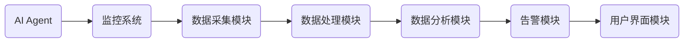
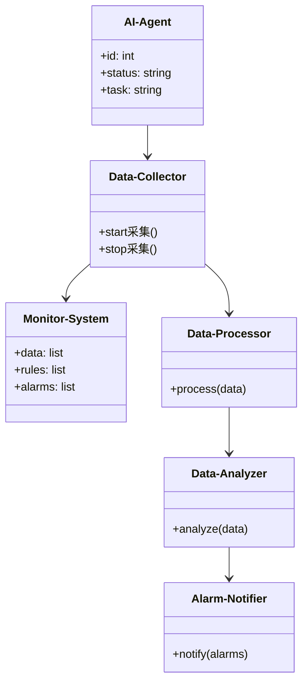
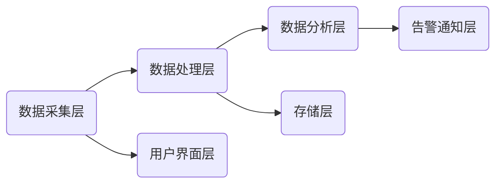

                 

<think>
好的，我现在要按照用户的要求，撰写一篇关于《企业AI Agent的实时监控系统》的技术博客文章。首先，我需要理解用户的需求，他们希望文章结构清晰，内容专业，涵盖从背景介绍到项目实战的各个方面。

首先，我需要收集相关的关键词，确保涵盖AI Agent、实时监控、企业系统、算法原理、系统架构、项目实战等方面。接下来是摘要部分，需要简明扼要地概括文章的核心内容，让读者迅速了解文章的主题。

接下来，按照目录大纲，我需要逐步展开每个章节的内容。首先是背景介绍，包括AI Agent的基本概念、实时监控的重要性以及应用场景和挑战。这部分需要让读者理解为什么实时监控对企业AI Agent至关重要。

然后是核心概念与联系，我需要详细讲解AI Agent和实时监控系统的原理，用表格对比它们的属性特征，并绘制ER实体关系图，帮助读者直观理解系统架构。

算法原理部分，我需要选择一个异常检测算法，用数学模型和公式详细阐述，确保读者能够理解算法的工作原理。同时，提供Python代码示例，解释代码的功能和实际应用，使理论与实践相结合。

系统分析与架构设计是关键部分，我需要介绍问题场景，设计系统功能，用Mermaid类图展示领域模型。然后，详细描述系统架构设计，分层展示数据采集、处理、分析和展示层，并用Mermaid架构图呈现。接口设计和交互流程也需要用序列图来说明。

项目实战部分，我需要指导读者如何安装环境，提供核心代码，并解读代码的功能。通过实际案例分析，帮助读者理解如何在实际中应用这些技术，并在项目小结中总结经验。

最后是最佳实践，包括小结、注意事项和拓展阅读，帮助读者巩固所学内容，并指导他们进一步学习。同时，确保文章末尾有作者信息，符合格式要求。

在写作过程中，我需要确保语言专业、逻辑清晰，每个章节内容详实，理论与实践并重。同时，使用Mermaid图表和数学公式，增强文章的可读性和技术深度。

现在，我开始撰写文章，按照目录大纲逐步展开，确保每个部分都符合用户的要求，最终完成一篇高质量的技术博客文章。
</think>

# 《企业AI Agent的实时监控系统》

**关键词**：企业AI Agent，实时监控系统，算法原理，系统架构，项目实战，数学模型，Mermaid图

**摘要**：  
随着企业智能化转型的加速，AI Agent（人工智能代理）在企业中的应用越来越广泛。然而，AI Agent的运行复杂性也带来了实时监控的需求。本文从企业AI Agent的核心概念出发，详细阐述实时监控系统的必要性、架构设计、算法原理及实现方案，结合实际案例分析，为企业构建高效可靠的实时监控系统提供参考。

---

## 第一部分：企业AI Agent实时监控系统概述

### 第1章：企业AI Agent与实时监控系统背景介绍

#### 1.1 企业AI Agent的基本概念
企业AI Agent是一种能够感知环境、自主决策并执行任务的智能实体，广泛应用于自动化流程管理、智能客服、供应链优化等领域。AI Agent的核心功能包括信息处理、决策制定和任务执行。

#### 1.2 实时监控系统的重要性
实时监控系统是确保AI Agent稳定运行的关键。通过实时采集和分析AI Agent的运行数据，监控系统能够及时发现异常、优化性能并提供决策支持。

#### 1.3 企业AI Agent实时监控系统的应用场景
- **故障检测**：实时监控AI Agent的运行状态，快速定位和解决问题。
- **性能优化**：通过数据分析，优化AI Agent的执行效率。
- **异常预测**：基于历史数据，预测潜在问题，提前采取措施。

#### 1.4 本章小结
本章介绍了企业AI Agent的基本概念及其在实时监控系统中的重要性，为后续内容奠定了基础。

---

### 第2章：企业AI Agent实时监控系统的核心概念与联系

#### 2.1 AI Agent与实时监控系统的原理
AI Agent通过传感器或API接口向监控系统发送运行数据，监控系统对数据进行处理、分析，并将结果反馈给AI Agent或通知相关人员。

#### 2.2 核心概念的属性特征对比
以下是AI Agent和实时监控系统的核心属性对比：

| **属性**       | **AI Agent**                     | **实时监控系统**               |
|----------------|----------------------------------|-------------------------------|
| **核心功能**    | 执行任务、决策制定               | 数据采集、分析、告警           |
| **数据来源**    | 任务执行结果、环境交互           | 系统日志、性能指标             |
| **响应时间**    | 实时或准实时                     | 实时或亚实时                   |
| **依赖性**      | 高度依赖算法和模型               | 高度依赖数据采集和处理能力     |

#### 2.3 ER实体关系图架构
以下是企业AI Agent实时监控系统的实体关系图：



---

## 第二部分：算法原理与系统架构设计

### 第3章：算法原理

#### 3.1 异常检测算法
异常检测是实时监控系统的重要功能，常用算法包括统计方法（如均值-标准差）和机器学习方法（如孤立森林）。

##### 统计方法
统计方法基于数据分布的假设，适用于正态分布的数据。公式如下：

$$ z = \frac{x - \mu}{\sigma} $$

其中，$\mu$ 是均值，$\sigma$ 是标准差，$z$ 是标准化值。当 $|z| > 3$ 时，数据被认为是异常。

##### 孤立森林算法
孤立森林是一种无监督学习算法，适用于高维数据。其核心思想是通过构建随机树，将异常点与正常点区分开。

#### 3.2 算法实现
以下是基于统计方法的Python代码示例：

```python
import numpy as np

def detect_outliers(data):
    mu = np.mean(data)
    sigma = np.std(data)
    z_scores = [(x - mu) / sigma for x in data]
    outliers = [i for i, z in enumerate(z_scores) if abs(z) > 3]
    return outliers

# 示例数据
data = [1, 2, 3, 4, 5, 6, 7, 8, 9, 10, 100]
outliers = detect_outliers(data)
print("异常点索引：", outliers)
```

---

### 第4章：系统分析与架构设计

#### 4.1 问题场景
企业AI Agent在运行过程中可能面临以下问题：
- **数据采集不全**：无法获取关键指标。
- **数据处理延迟**：影响实时监控的准确性。
- **告警误报率高**：影响运维人员的工作效率。

#### 4.2 系统功能设计
以下是系统功能的领域模型：



#### 4.3 系统架构设计
以下是系统的分层架构：



---

## 第三部分：项目实战与优化

### 第5章：项目实战

#### 5.1 环境安装
安装Python和相关库：

```bash
pip install numpy pandas matplotlib
```

#### 5.2 核心代码实现
以下是异常检测的Python代码：

```python
import numpy as np
import matplotlib.pyplot as plt

def plot_data(data, outliers):
    plt.scatter(range(len(data)), data, c='blue', label='正常数据')
    plt.scatter(outliers, [data[i] for i in outliers], c='red', label='异常数据')
    plt.xlabel('索引')
    plt.ylabel('值')
    plt.title('异常检测结果')
    plt.legend()
    plt.show()

data = [1, 2, 3, 4, 5, 6, 7, 8, 9, 10, 100]
outliers = detect_outliers(data)
plot_data(data, outliers)
```

#### 5.3 实际案例分析
以供应链管理为例，实时监控AI Agent的任务完成时间和资源消耗，及时发现瓶颈并优化流程。

---

### 第6章：最佳实践与注意事项

#### 6.1 小结
企业AI Agent实时监控系统的建设需要结合理论与实践，注重数据采集的准确性和算法的高效性。

#### 6.2 注意事项
- 数据采集应尽量全面，避免遗漏关键指标。
- 算法选择应根据数据特点，避免误报和漏报。
- 系统架构应具备可扩展性，适应业务增长。

#### 6.3 拓展阅读
建议阅读相关文献，深入了解高级算法和系统优化方法。

---

**作者：AI天才研究院/AI Genius Institute & 禅与计算机程序设计艺术 /Zen And The Art of Computer Programming**

