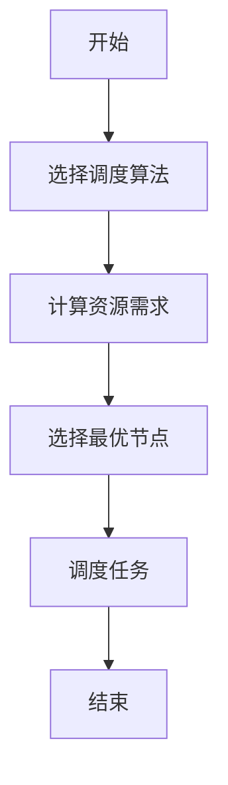
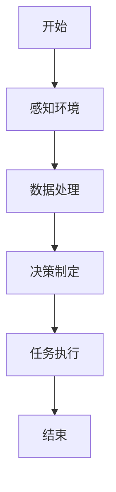
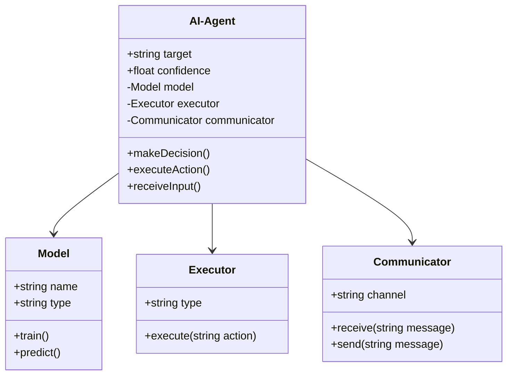
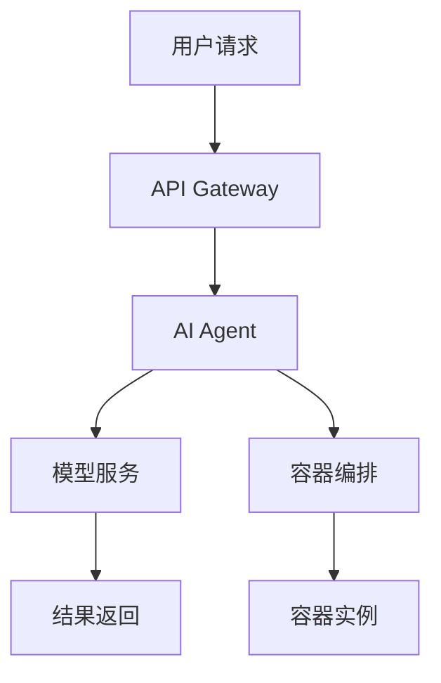
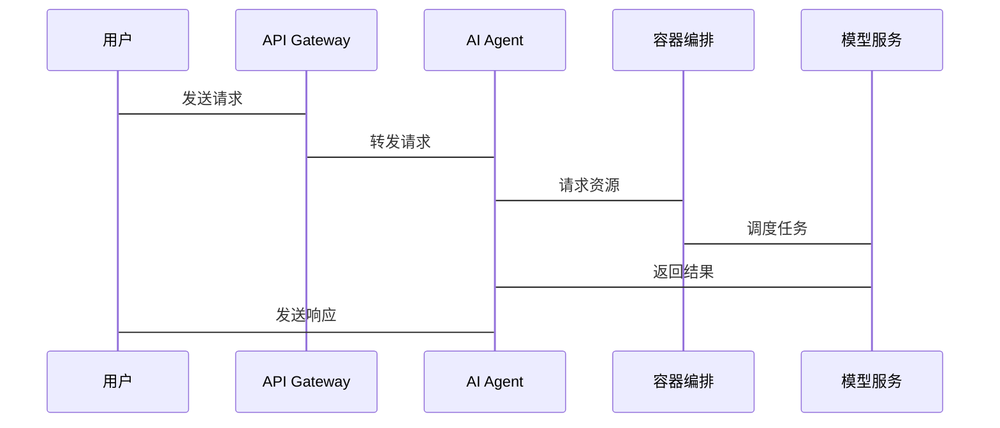

                 

<think>
好的，我现在需要根据用户的指示，为他们撰写一篇名为《企业AI Agent的容器编排与管理策略》的技术博客文章。首先，我会按照用户提供的目录大纲逐步展开每一部分的内容。让我先仔细阅读用户的需求，确保理解所有要求。

用户希望文章结构清晰，逻辑严谨，内容详实。他们特别强调了每个章节需要详细展开，包括背景介绍、核心概念、算法原理、系统架构、项目实战、最佳实践等部分，并要求使用技术术语和专业语言。此外，文章需要包含数学公式、图表（如Mermaid图）和代码示例，这些都是关键要素。

首先，我会从摘要开始，简要概述文章的核心内容和主题。接下来，按照目录大纲依次撰写每一部分的内容，确保每章每节都有足够的细节和深度。例如，在第1章中，我需要解释AI Agent和容器编排的基本概念，以及它们在企业中的应用背景。在第2章，要详细探讨核心概念与联系，并使用ER实体关系图来展示关系。技术原理部分需要结合数学公式和算法流程图，展示AI Agent的运行机制。系统架构部分则需要通过Mermaid图展示类图和架构设计。项目实战部分则需要提供具体的实现代码和案例分析。最后，在最佳实践部分，总结经验和未来趋势。

在撰写过程中，我需要确保使用正确的Markdown格式，包含数学公式、代码块和图表。同时，语言要专业且易懂，逻辑清晰。完成文章后，我会在末尾加上作者信息，确保文章完整。

现在，我将按照目录大纲逐步展开每一部分，确保覆盖所有用户的要求，同时保持文章的连贯性和深度。
</think>

# 《企业AI Agent的容器编排与管理策略》

---

## 关键词：

- 企业AI Agent
- 容器编排
- Kubernetes
- 容器化
- 管理策略

---

## 摘要：

随着人工智能技术的快速发展，企业AI Agent的应用日益广泛。本文深入探讨了企业AI Agent的容器编排与管理策略，从基本概念到技术原理，再到系统架构和项目实战，结合实际案例分析，详细阐述了AI Agent与容器编排技术的协同工作原理，并提出了优化建议和未来趋势展望。

---

# 第1章: 企业AI Agent的背景与基础

## 1.1 AI Agent的基本概念

### 1.1.1 AI Agent的定义与核心特征

AI Agent（人工智能代理）是指能够感知环境、自主决策并执行任务的智能实体。其核心特征包括：

1. **自主性**：无需外部干预，自主完成任务。
2. **反应性**：能够实时感知环境变化并做出响应。
3. **主动性**：主动采取行动以实现目标。
4. **智能性**：具备问题解决和学习能力。

### 1.1.2 企业AI Agent的应用场景

企业AI Agent广泛应用于客服、推荐系统、流程自动化等领域。例如，在电商领域，AI Agent可以作为智能客服，通过自然语言处理技术为用户提供实时支持。

### 1.1.3 企业AI Agent的边界与外延

AI Agent的边界在于其功能范围，外延则涉及与外部系统的交互。例如，AI Agent可以调用后端服务，但不直接管理这些服务的运行环境。

## 1.2 容器编排与管理的基本概念

### 1.2.1 容器化技术的核心原理

容器化通过将应用程序及其依赖打包为轻量级容器，确保在不同环境中一致运行。容器运行时负责资源分配和隔离，容器编排则负责调度和管理。

### 1.2.2 容器编排的定义与特点

容器编排是指通过工具（如Kubernetes）对容器化服务进行自动部署、扩展和管理。其特点包括自动化、高可用性和弹性伸缩。

### 1.2.3 容器编排与企业AI Agent的关系

AI Agent的运行环境需要容器编排技术来实现弹性扩展和资源管理。容器编排确保AI Agent在高负载情况下仍能稳定运行。

## 1.3 企业AI Agent容器编排的背景与意义

### 1.3.1 企业AI Agent容器编排的需求背景

企业AI Agent需要在动态环境下高效运行，容器编排提供了灵活的资源管理能力。例如，电商平台在促销期间需要快速扩展AI客服容器。

### 1.3.2 容器编排在AI Agent管理中的作用

容器编排通过自动化部署和负载均衡，确保AI Agent在高并发场景下的稳定性和性能。

### 1.3.3 企业AI Agent容器编排的未来趋势

随着AI技术的演进，容器编排将更加智能化，与AI Agent的协同优化将成为主流。

---

# 第2章: 企业AI Agent的核心概念与联系

## 2.1 AI Agent的核心概念

### 2.1.1 AI Agent的组成要素

AI Agent由感知模块、决策模块和执行模块组成。感知模块负责数据输入，决策模块进行逻辑推理，执行模块完成任务。

### 2.1.2 AI Agent的执行流程

1. **感知环境**：通过传感器或API获取输入数据。
2. **处理数据**：使用机器学习模型进行分析。
3. **制定决策**：基于分析结果做出行动选择。
4. **执行任务**：调用外部服务或触发动作。

### 2.1.3 AI Agent的交互方式

AI Agent可以通过API、消息队列或事件驱动的方式与其他系统交互。例如，通过Kafka进行异步通信。

## 2.2 容器编排的核心概念

### 2.2.1 容器编排的主要机制

容器编排通过编排器（如Kubernetes的API Server）接收用户指令，生成Pod spec并调度到节点上。

### 2.2.2 容器编排的调度策略

调度策略包括资源利用率最大化、负载均衡和故障恢复。例如，Kubernetes的NodeAffinity和PodAffinity规则。

### 2.2.3 容器编排的资源管理

资源管理涉及CPU、内存和存储的分配与监控。容器编排通过Horizontal Pod Autoscaler实现自动扩缩容。

## 2.3 AI Agent与容器编排的关系

### 2.3.1 AI Agent对容器编排的需求

AI Agent需要容器编排来实现弹性伸缩和高可用性。例如，电商促销期间快速扩展客服容器。

### 2.3.2 容器编排对AI Agent的支持

容器编排通过提供稳定的运行环境，确保AI Agent在高负载下的性能和可靠性。

### 2.3.3 两者的协同工作原理

AI Agent作为服务运行在容器中，容器编排负责调度和管理这些容器，确保任务高效执行。

## 2.4 核心概念对比与ER实体关系图

### 2.4.1 核心概念对比表格

| 概念       | 定义                                                                 | 属性           | 关系               |
|------------|----------------------------------------------------------------------|----------------|-------------------|
| AI Agent   | 能够感知环境、自主决策并执行任务的智能实体                     | 智能性、自主性、反应性 | 需要容器编排支持运行环境 |
| 容器编排    | 对容器化服务进行自动部署、扩展和管理的工具                     | 自动化、高可用性 | 支持AI Agent的弹性伸缩 |

### 2.4.2 ER实体关系图（Mermaid）

```mermaid
er
actor(AI Agent) -[需要]-> service(容器编排服务)
actor(AI Agent) -[提供]-> service(智能决策服务)
service(容器编排服务) -[管理]-> container(容器实例)
```

---

# 第3章: 企业AI Agent的容器编排技术原理

## 3.1 容器编排技术的核心算法

### 3.1.1 容器编排的调度算法

容器编排的调度算法包括随机调度、轮询调度和最短作业优先调度。例如，Kubernetes使用基于资源需求的调度算法。

### 3.1.2 调度算法的数学模型

调度算法的数学模型可以用以下公式表示：

$$ \text{调度决策} = \arg\min_{i} (R_i - A_i) $$

其中，$R_i$ 是任务的剩余时间，$A_i$ 是已分配的时间。

### 3.1.3 算法流程图（Mermaid）



## 3.2 AI Agent的运行机制

### 3.2.1 AI Agent的运行流程

AI Agent的运行流程包括感知环境、数据处理、决策制定和任务执行。

### 3.2.2 AI Agent的数学模型

AI Agent的决策过程可以用以下公式表示：

$$ \text{决策} = \arg\max_{j} \sum_{i=1}^{n} w_i x_i $$

其中，$w_i$ 是特征权重，$x_i$ 是输入特征。

### 3.2.3 AI Agent的运行流程图（Mermaid）



---

# 第4章: 企业AI Agent的系统架构设计

## 4.1 系统功能设计

### 4.1.1 领域模型（Mermaid类图）



### 4.1.2 系统架构设计（Mermaid架构图）



### 4.1.3 系统交互设计（Mermaid序列图）



---

# 第5章: 企业AI Agent的项目实战

## 5.1 项目介绍

本项目实现一个基于Kubernetes的企业AI Agent，用于电商客服系统。

## 5.2 核心实现代码

### 5.2.1 容器编排配置（Kubernetes YAML）

```yaml
apiVersion: apps/v1
kind: Deployment
metadata:
  name: ai-agent-deployment
spec:
  replicas: 3
  selector:
    matchLabels:
      app: ai-agent
  template:
    metadata:
      labels:
        app: ai-agent
    spec:
      containers:
      - name: ai-agent
        image: ai-agent:v1
        resources:
          requests:
            cpu: 200m
            memory: 512Mi
```

### 5.2.2 AI Agent实现代码（Python）

```python
class AI_Agent:
    def __init__(self, model, executor, communicator):
        self.model = model
        self.executor = executor
        self.communicator = communicator

    def make_decision(self, input_data):
        prediction = self.model.predict(input_data)
        return prediction

    def execute_action(self, action):
        self.executor.execute(action)

    def receive_input(self):
        return self.communicator.receive()
```

## 5.3 案例分析与实现解读

通过部署AI Agent到Kubernetes集群，实现弹性扩展和高可用性。在促销期间，AI Agent能够自动扩展容器数量，处理大量用户请求。

---

# 第6章: 企业AI Agent的管理策略与优化

## 6.1 管理策略

### 6.1.1 资源分配策略

根据AI Agent的负载情况动态分配资源，确保性能和成本的平衡。

### 6.1.2 容错机制

通过容器自愈和负载均衡，确保AI Agent在故障时快速恢复。

## 6.2 优化建议

### 6.2.1 智能调度优化

结合AI Agent的特性，优化调度算法，提高资源利用率。

### 6.2.2 高可用性优化

通过容器副本和滚动更新，确保AI Agent的高可用性。

## 6.3 注意事项

在实际应用中，需关注容器资源配额、网络延迟和模型更新频率，避免性能瓶颈。

---

# 第7章: 总结与展望

## 7.1 核心知识点回顾

本文详细探讨了企业AI Agent的容器编排与管理策略，涵盖了技术原理、系统架构和项目实战。

## 7.2 本文的核心思想总结

通过结合容器编排技术，企业可以高效管理AI Agent，提升系统的性能和可靠性。

## 7.3 对未来的展望

随着AI技术的发展，容器编排与AI Agent的协同优化将成为研究重点，推动企业智能化转型。

---

# 作者信息

作者：AI天才研究院/AI Genius Institute & 禅与计算机程序设计艺术 /Zen And The Art of Computer Programming

---

以上是《企业AI Agent的容器编排与管理策略》的技术博客文章，希望对您有所帮助！

