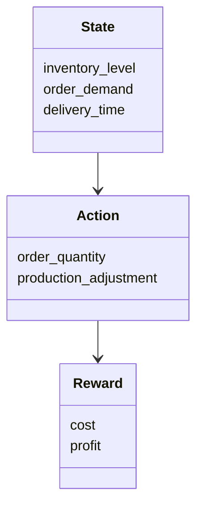

                 


# 企业AI Agent的强化学习在供应链优化中的端到端应用

> 关键词：AI Agent, 强化学习, 供应链优化, 端到端应用, 深度强化学习, DQN算法

> 摘要：本文详细探讨了企业AI Agent在供应链优化中的强化学习应用。从基本概念到算法原理，从系统设计到实战案例，全面解析强化学习在供应链优化中的端到端应用。通过案例分析和代码实现，深入阐述了如何利用强化学习提升供应链效率和决策能力。

---

## 第一部分: AI Agent与强化学习基础

### 第1章: AI Agent的基本概念

#### 1.1 AI Agent的定义与特点
AI Agent（智能体）是指在计算机系统中能够感知环境并采取行动以实现目标的实体。其特点包括自主性、反应性、目标导向性和社交能力。AI Agent在企业供应链中的应用，可以通过自动化决策提高效率。

#### 1.2 强化学习的基本概念
强化学习是一种机器学习范式，通过智能体与环境交互，基于奖励机制优化决策策略。强化学习的核心是通过试错（Trial and Error）找到最优策略。

#### 1.3 企业AI Agent的应用场景
供应链优化是AI Agent的重要应用场景，包括库存管理、订单调度、物流路径优化等。强化学习在这些场景中表现出色，能够处理动态环境和复杂决策问题。

---

### 第2章: 强化学习的核心原理

#### 2.1 强化学习的数学模型
强化学习的核心是马尔可夫决策过程（MDP）。MDP由五元组 $(S, A, P, R, \gamma)$ 组成：
- $S$：状态空间
- $A$：动作空间
- $P$：状态转移概率
- $R$：奖励函数
- $\gamma$：折扣因子

#### 2.2 Q-learning算法
Q-learning是一种经典的强化学习算法，适用于离线环境。其更新规则为：
$$ Q(s, a) = Q(s, a) + \alpha (r + \gamma \max Q(s', a') - Q(s, a)) $$
其中，$\alpha$是学习率。

#### 2.3 深度强化学习（DQN）
DQN（Deep Q-Network）将Q-learning与深度神经网络结合，适用于高维状态空间。其网络结构包括编码器、策略网络和值函数网络。

---

## 第二部分: 供应链优化的强化学习建模

### 第3章: 供应链优化问题建模

#### 3.1 供应链优化的核心问题
供应链优化包括库存管理、生产调度、物流路径优化等多个方面。这些问题通常具有动态性、不确定性，适合强化学习解决。

#### 3.2 强化学习在供应链优化中的建模方法
- 状态空间：包括库存水平、订单需求、物流成本等。
- 动作空间：包括下单、调整生产量、选择物流路径等。
- 奖励函数：通常设计为成本最小化或利润最大化。

#### 3.3 端到端应用的系统架构
端到端应用包括数据采集、状态处理、动作选择、奖励计算等模块。系统架构设计需要考虑实时性、可扩展性和容错性。

---

## 第三部分: 系统分析与架构设计

### 第4章: 供应链优化系统的系统分析

#### 4.1 供应链优化场景分析
以库存管理为例，系统需要实时感知库存水平、需求预测和供应商交货时间。动作包括调整订单量和安全库存。

#### 4.2 系统功能设计
- 状态处理模块：负责接收库存、订单和物流数据。
- 动作选择模块：基于强化学习算法选择最优动作。
- 奖励计算模块：根据实际效果计算奖励并更新策略。

#### 4.3 领域模型设计
使用mermaid类图描述领域模型：


---

## 第四部分: 项目实战

### 第5章: 环境安装与代码实现

#### 5.1 环境安装
安装TensorFlow和Keras：
```bash
pip install tensorflow keras
```

#### 5.2 核心代码实现
以下是一个简单的DQN实现：
```python
import tensorflow as tf
from tensorflow.keras import layers

class DQN:
    def __init__(self, state_dim, action_dim):
        self.state_dim = state_dim
        self.action_dim = action_dim
        self.model = self.build_model()

    def build_model(self):
        model = tf.keras.Sequential([
            layers.Dense(64, activation='relu', input_shape=(self.state_dim,)),
            layers.Dense(32, activation='relu'),
            layers.Dense(self.action_dim, activation='linear')
        ])
        return model

    def get_action(self, state, epsilon=0.1):
        if np.random.random() < epsilon:
            return np.random.randint(self.action_dim)
        q_values = self.model.predict(state)
        return np.argmax(q_values[0])

    def update_model(self, states, actions, rewards, next_states):
        q_values = self.model.predict(states)
        next_q_values = self.model.predict(next_states)
        target = rewards + gamma * np.max(next_q_values, axis=1)
        q_values[np.arange(len(actions)), actions] = target
        self.model.fit(states, q_values, epochs=1, verbose=0)
```

#### 5.3 代码应用解读
- `get_action`方法：基于策略选择动作。
- `update_model`方法：更新神经网络权重，实现强化学习。

---

## 第五部分: 总结与展望

### 第6章: 总结与展望

#### 6.1 项目总结
本文详细讲解了企业AI Agent在供应链优化中的强化学习应用，从理论到实践，展示了如何通过强化学习提升供应链效率。

#### 6.2 未来展望
未来，强化学习在供应链优化中的应用将更加广泛。随着算法的改进和硬件的发展，强化学习将在实时决策和多智能体协作中发挥更大作用。

---

## 作者信息

作者：AI天才研究院/AI Genius Institute & 禅与计算机程序设计艺术 /Zen And The Art of Computer Programming

