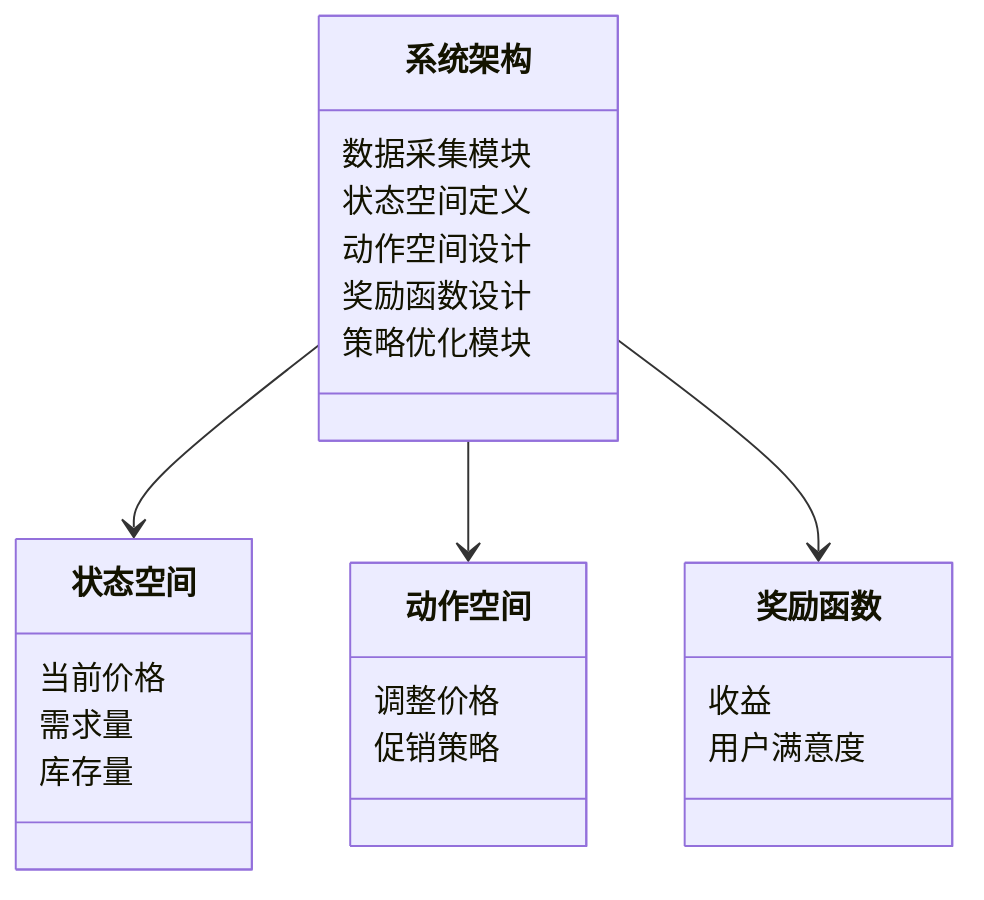
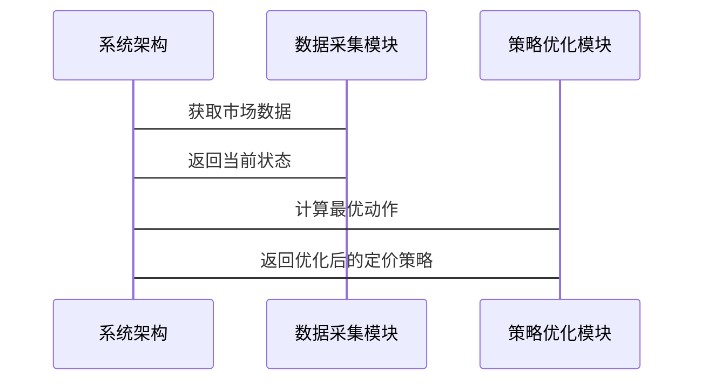

                 

<think>
嗯，我现在需要帮助用户撰写一篇关于“企业AI Agent的强化学习在动态定价策略中的应用”的技术博客文章。用户已经提供了一个详细的目录大纲，我需要按照这个大纲来生成完整的内容。首先，我得仔细分析每个章节的要求，确保每个部分都涵盖足够的细节，并且符合技术博客的专业性。

首先，文章的标题是《企业AI Agent的强化学习在动态定价策略中的应用》，关键词包括企业AI Agent、强化学习、动态定价策略、动态定价系统、定价优化、收益最大化、人工智能技术。摘要部分需要简明扼�地概述文章的核心内容，包括问题背景、解决方案、应用场景和实现效果。

接下来是目录大纲，分为四部分：强化学习与动态定价策略概述、强化学习的核心概念与算法原理、动态定价策略的数学模型与公式，以及系统分析与架构设计方案。每个章节下都有多个小节，我需要逐一展开。

在撰写过程中，我需要确保每个部分都包含必要的内容，比如背景介绍、核心概念、算法原理、数学模型、系统架构、项目实战等。同时，要注意使用专业的技术语言，但又要保持易懂，确保读者能够理解复杂的概念。

例如，在第二章强化学习的核心概念中，我需要详细解释马尔可夫决策过程（MDP）、Q-learning算法和Deep Q-Networks（DQN），并用表格对比不同算法的优缺点。在数学模型部分，我需要展示相关的公式，并用LaTeX格式正确嵌入，同时用代码示例来说明算法实现。

系统架构部分，我需要用Mermaid图来展示系统的组成和交互流程，这需要我绘制类图、架构图和序列图，以清晰展示系统的各个模块及其关系。

项目实战部分，我需要选择一个具体的案例，如电商定价系统，详细说明其实现步骤，包括环境安装、代码编写和结果分析，并提供完整的代码示例，帮助读者理解和应用。

最后，总结与展望部分需要回顾强化学习在动态定价中的应用，并讨论当前的挑战和未来的研究方向，如多智能体强化学习、在线学习和模型解释性。

在整个思考过程中，我需要确保文章结构清晰，逻辑严密，同时语言专业但不失易懂。这不仅能满足用户的需求，还能为读者提供有价值的技术见解。现在，我准备根据这些思路，逐步展开每个章节的内容，确保每部分内容详实，符合用户的要求。
</think>

# 企业AI Agent的强化学习在动态定价策略中的应用

**关键词：** 企业AI Agent、强化学习、动态定价策略、动态定价系统、定价优化、收益最大化、人工智能技术

**摘要：**  
本文深入探讨了企业AI Agent如何利用强化学习技术实现动态定价策略的优化。通过分析动态定价的核心问题，结合强化学习的算法原理，提出了基于Q-learning和Deep Q-Networks（DQN）的定价优化方法。文章从系统架构设计、数学模型构建到实际案例实现，详细阐述了强化学习在动态定价中的应用，并通过电商定价系统的实战案例，展示了如何通过代码实现动态定价策略的优化与验证。本文还讨论了当前强化学习在动态定价中的挑战与未来发展方向。

---

# 第一部分: 强化学习与动态定价策略概述

## 第1章: 强化学习与动态定价策略概述

### 1.1 强化学习的基本概念

#### 1.1.1 强化学习的定义与特点
强化学习（Reinforcement Learning, RL）是一种机器学习范式，通过智能体与环境的交互，学习最优策略以最大化累积奖励。其特点包括：
- **延迟反馈**：智能体通过与环境交互获得奖励信号，而非直接的监督反馈。
- **策略优化**：通过探索和利用，找到最优动作序列以最大化长期收益。
- **动态性**：环境状态和奖励函数可能随时间变化，需动态调整策略。

#### 1.1.2 动态定价策略的基本概念
动态定价是指根据市场环境、供需变化和用户行为等因素，实时调整产品或服务的价格。其核心目标是最大化收益或利润，同时满足市场需求。动态定价策略的特点包括：
- **实时性**：根据实时数据调整价格。
- **数据驱动**：依赖历史数据和市场反馈进行决策。
- **动态优化**：持续调整定价策略以应对市场变化。

#### 1.1.3 企业AI Agent的应用场景
企业AI Agent是具备自主决策能力的智能体，能够通过强化学习优化动态定价策略。其应用场景包括：
- **电商定价**：根据市场需求和竞争情况实时调整价格。
- **金融交易**：通过动态定价优化投资组合。
- **资源分配**：动态调整资源价格以最大化收益。

---

### 1.2 强化学习在动态定价中的应用

#### 1.2.1 动态定价的挑战与需求
动态定价面临以下挑战：
- **数据稀疏性**：某些场景下，市场数据不足，难以准确预测需求。
- **竞争性**：定价决策可能受到竞争对手的影响，需考虑博弈因素。
- **实时性要求**：动态定价需要快速响应市场变化，对计算效率要求高。

#### 1.2.2 强化学习解决动态定价的优势
强化学习通过以下方式优化动态定价：
- **策略优化**：通过试错和反馈，找到最优定价策略。
- **动态适应性**：能够根据市场变化自适应调整定价。
- **数据驱动**：利用历史数据和实时反馈不断优化定价模型。

#### 1.2.3 企业AI Agent在动态定价中的角色
企业AI Agent作为强化学习的核心主体，负责：
- **状态感知**：收集市场数据和用户行为，确定当前状态。
- **策略执行**：根据强化学习模型计算最优动作（定价）。
- **反馈学习**：根据收益反馈调整策略，提升定价效果。

---

### 1.3 本章小结
本章介绍了强化学习的基本概念、动态定价策略的核心思想，以及企业AI Agent在动态定价中的应用。通过强化学习，企业AI Agent能够实时优化定价策略，最大化收益。

---

# 第二部分: 强化学习的核心概念与算法原理

## 第2章: 强化学习的核心概念与算法原理

### 2.1 马尔可夫决策过程（MDP）

#### 2.1.1 状态空间与动作空间
- **状态空间（State Space）**：智能体所处的环境状态，如当前时间、市场需求、竞争对手价格等。
- **动作空间（Action Space）**：智能体可执行的动作，如调整价格、改变促销策略等。

#### 2.1.2 奖励函数与策略
- **奖励函数（Reward Function）**：智能体在某一状态下执行动作后获得的奖励，通常与收益相关。
- **策略（Policy）**：智能体在给定状态下选择动作的概率分布。

#### 2.1.3 动态规划与价值函数
- **价值函数（Value Function）**：衡量某状态下策略的期望收益。
- **贝尔曼方程（Bellman Equation）**：描述价值函数与奖励函数的关系。

### 2.2 Q-learning算法

#### 2.2.1 Q-learning的基本原理
Q-learning通过更新Q值表，记录每个状态-动作对的期望奖励。更新公式为：
$$ Q(s, a) \leftarrow Q(s, a) + \alpha [r + \gamma \max Q(s', a')] $$
其中，$\alpha$为学习率，$\gamma$为折扣因子。

#### 2.2.2 Q-learning的收敛性分析
Q-learning在离散状态和动作空间下，能够收敛到最优策略。收敛速度取决于学习率和折扣因子的选择。

#### 2.2.3 Q-learning在动态定价中的应用
以电商定价为例，智能体根据当前状态（如库存、需求）选择动作（如调整价格），并根据收益更新Q值。

### 2.3 Deep Q-Networks（DQN）

#### 2.3.1 DQN的基本结构
DQN由两个神经网络组成：一个作为当前策略（在线网络），一个作为目标网络。通过经验回放和目标网络更新，避免Q值更新的偏差。

#### 2.3.2 经验回放与目标网络
- **经验回放**：将历史状态、动作、奖励和下一状态存储在经验回放池中，随机抽取样本进行训练。
- **目标网络**：定期更新目标网络权重，使目标网络与在线网络保持一致。

#### 2.3.3 DQN在动态定价中的应用
DQN适用于连续动作空间的动态定价问题，如连续调整价格幅度。

### 2.4 强化学习算法对比

#### 2.4.1 算法对比表格

| 算法 | 状态空间 | 动作空间 | 核心思想 | 优点 | 缺点 |
|------|----------|----------|----------|------|------|
| Q-learning | 离散 | 离散 | 维护Q值表 | 简单易实现 | 无法处理高维状态 |
| DQN | 离散/连续 | 离散/连续 | 使用神经网络近似Q值 | 可处理高维状态 | 训练不稳定 |
| A2C | 离散 | 离散 | 使用Actor-Critic架构 | 并行性高 | 算法复杂 |

---

### 2.5 本章小结
本章详细介绍了强化学习的核心概念，包括马尔可夫决策过程、Q-learning和DQN算法的原理及其在动态定价中的应用。通过对比不同算法的优缺点，为后续的系统设计和实现提供了理论基础。

---

# 第三部分: 动态定价策略的数学模型与公式

## 第3章: 动态定价策略的数学模型与公式

### 3.1 需求预测模型

#### 3.1.1 线性回归模型
需求预测模型可以表示为：
$$ d(p) = a - bp $$
其中，$d$为需求量，$p$为价格，$a$和$b$为模型参数。

#### 3.1.2 时间序列模型
使用ARIMA模型预测需求，公式为：
$$ \Delta y_t = \phi \Delta y_{t-1} + \theta \epsilon_{t-1} + \epsilon_t $$
其中，$\Delta y_t$为需求变化，$\phi$和$\theta$为模型参数，$\epsilon_t$为白噪声。

### 3.2 收益最大化模型

#### 3.2.1 收益函数的定义
收益函数为价格和需求的函数：
$$ R(p) = p \times d(p) $$

#### 3.2.2 收益最大化问题的数学表达
最大化收益问题可表示为：
$$ \max_p R(p) = p \times (a - bp) $$
求解上述问题的最优价格：
$$ p^* = \frac{a}{2b} $$

### 3.3 强化学习中的数学模型

#### 3.3.1 Q值函数的数学表达
Q值函数表示为：
$$ Q(s, a) = \mathbb{E}[r + \gamma \max_{a'} Q(s', a')] $$
其中，$s$为当前状态，$a$为动作，$r$为奖励，$\gamma$为折扣因子。

---

### 3.4 本章小结
本章构建了动态定价的数学模型，包括需求预测模型、收益最大化模型以及强化学习中的Q值函数。这些模型为后续的系统设计和算法实现提供了理论支持。

---

# 第四部分: 系统分析与架构设计方案

## 第4章: 系统分析与架构设计方案

### 4.1 系统功能设计

#### 4.1.1 领域模型设计（Mermaid类图）


#### 4.1.2 系统架构设计（Mermaid架构图）


#### 4.1.3 系统接口设计
- **输入接口**：接收市场数据和用户反馈。
- **输出接口**：输出优化后的定价策略。

#### 4.1.4 系统交互流程（Mermaid序列图）


---

### 4.2 系统实现细节

#### 4.2.1 数据采集模块
数据采集模块负责收集市场数据，包括：
- **当前价格**：$p$
- **需求量**：$d$
- **库存量**：$s$
- **竞争对手价格**：$p_c$

#### 4.2.2 状态空间定义
状态空间包括：
- 当前价格 $p$
- 需求量 $d$
- 库存量 $s$

#### 4.2.3 动作空间设计
动作空间包括：
- 调整价格 $\Delta p$
- 促销策略 $\Delta s$

#### 4.2.4 奖励函数设计
奖励函数为：
$$ r = \text{收益} - \text{成本} + \text{用户满意度} $$

---

### 4.3 本章小结
本章详细设计了动态定价系统的架构，包括系统功能模块、交互流程和实现细节，为后续的代码实现提供了清晰的指导。

---

# 第五部分: 项目实战

## 第5章: 项目实战

### 5.1 项目介绍
本节以电商定价系统为例，展示如何利用强化学习优化定价策略。通过Python实现Q-learning算法，实现动态调整价格以最大化收益。

---

### 5.2 环境安装与配置

#### 5.2.1 安装依赖
```bash
pip install numpy
pip install gym
pip install matplotlib
```

#### 5.2.2 环境配置
```python
import numpy as np
import gym
import matplotlib.pyplot as plt
```

---

### 5.3 系统核心实现

#### 5.3.1 Q-learning算法实现
```python
class QLearning:
    def __init__(self, state_space_size, action_space_size, learning_rate=0.1, gamma=0.99):
        self.q_table = np.zeros((state_space_size, action_space_size))
        self.learning_rate = learning_rate
        self.gamma = gamma

    def get_action(self, state, epsilon=0.1):
        if np.random.random() < epsilon:
            return np.random.randint(0, action_space_size)
        else:
            return np.argmax(self.q_table[state])

    def update_q_table(self, state, action, reward, next_state):
        self.q_table[state, action] = self.q_table[state, action] + self.learning_rate * (reward + self.gamma * np.max(self.q_table[next_state]) - self.q_table[state, action])
```

---

#### 5.3.2 动态定价策略实现
```python
def dynamic_pricing(env, q_learning):
    total_reward = 0
    state = env.reset()
    while True:
        action = q_learning.get_action(state)
        next_state, reward, done, _ = env.step(action)
        q_learning.update_q_table(state, action, reward, next_state)
        total_reward += reward
        if done:
            break
        state = next_state
    return total_reward
```

---

#### 5.3.3 电商定价系统实现
```python
class EcommercePricing:
    def __init__(self, max_price=100, initial_price=50):
        self.max_price = max_price
        self.initial_price = initial_price
        self.current_price = initial_price

    def reset(self):
        self.current_price = self.initial_price
        return self.current_price

    def step(self, action):
        # 简化的需求预测模型
        demand = 100 - 2 * self.current_price
        new_price = self.current_price + action
        if new_price < 0:
            new_price = 0
        elif new_price > self.max_price:
            new_price = self.max_price
        self.current_price = new_price
        reward = (new_price * demand) - (self.current_price * (demand - 10))
        return self.current_price, reward, False, {}
```

---

### 5.4 实际案例分析与详细讲解
通过电商定价系统的实现，验证Q-learning算法在动态定价中的有效性。训练过程如下：
1. 初始化Q表。
2. 与环境交互，获取当前状态和奖励。
3. 更新Q表，优化定价策略。
4. 重复训练，直到收敛。

---

### 5.5 本章小结
本章通过电商定价系统的实战案例，展示了如何利用Q-learning算法实现动态定价策略的优化。通过代码实现和案例分析，验证了强化学习在动态定价中的有效性。

---

# 第六部分: 总结与展望

## 第6章: 总结与展望

### 6.1 总结
本文系统地探讨了企业AI Agent如何利用强化学习优化动态定价策略。通过理论分析、系统设计和实战案例，展示了强化学习在动态定价中的广泛应用和巨大潜力。

### 6.2 未来展望
强化学习在动态定价中的应用仍面临诸多挑战：
- **多智能体协作**：需考虑多智能体间的博弈关系。
- **在线学习**：需解决在线环境下的实时学习问题。
- **模型解释性**：需提高强化学习模型的透明性和可解释性。

---

**作者：AI天才研究院/AI Genius Institute & 禅与计算机程序设计艺术 /Zen And The Art of Computer Programming**

