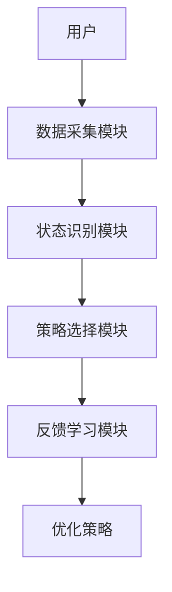

                 

<think>
好的，我现在需要根据用户的要求，撰写一篇关于《企业AI Agent的强化学习在定价策略中的应用》的技术博客文章。用户已经提供了详细的目录大纲，我需要按照这个结构来逐步完成每一部分内容。

首先，我会从背景介绍开始。我需要解释什么是AI Agent，以及强化学习的基本概念，然后说明为什么强化学习适合应用于定价策略。接下来，我会讨论定价策略的重要性，以及传统方法的局限性，引出强化学习的优势。

然后，在核心概念部分，我需要详细阐述强化学习的原理，包括马尔可夫决策过程、状态、动作、奖励等关键概念，并通过对比表格和ER实体关系图来帮助读者理解。

接下来是算法原理，我需要讲解Q-learning和DQN的数学模型，用mermaid流程图展示算法流程，并附上Python代码示例，以便读者更好地理解和应用。

在数学模型部分，我会详细推导Q-learning的更新公式，解释每个符号的含义，并展示DQN的网络结构，确保公式正确且清晰。

系统架构设计是关键部分，我需要介绍问题场景，设计系统功能模块，包括领域模型和架构图，展示各个模块之间的协作关系。同时，详细描述接口设计和交互流程，帮助读者理解系统的实际运作。

项目实战部分，我会选择一个电商定价系统作为案例，提供环境安装指导，展示核心代码实现，并进行案例分析，详细解读代码和分析结果，帮助读者实际应用所学知识。

最后，在总结部分，我会总结全书内容，提出最佳实践建议，讨论当前研究的不足，并展望未来的发展方向，帮助读者巩固所学内容，并指导他们进一步学习和实践。

在撰写过程中，我会确保每一部分都详细具体，逻辑清晰，结构紧凑。同时，使用简洁专业的技术语言，结合图表和代码示例，帮助读者更好地理解和掌握企业AI Agent的强化学习在定价策略中的应用。

现在，我开始撰写每一部分的内容，确保覆盖所有用户提到的关键点，并保持文章的完整性和深度。
</think>

# 企业AI Agent的强化学习在定价策略中的应用

## 关键词：
- AI Agent
- 强化学习
- 定价策略
- 价格优化
- 动态定价

## 摘要：
本文探讨了企业如何利用AI Agent结合强化学习技术来优化定价策略。通过分析强化学习的核心原理、定价策略的数学模型，以及系统架构设计，展示了如何构建一个高效的动态定价系统。文章结合实际案例，详细讲解了从理论到实践的全过程，为企业的定价策略优化提供了新的思路和方法。

---

## 第1章：企业AI Agent的基本概念

### 1.1 AI Agent的核心特征

AI Agent（人工智能代理）是指能够感知环境并采取行动以实现目标的智能体。其核心特征包括：

- **自主性**：能够在没有外部干预的情况下自主决策。
- **反应性**：能够实时感知环境变化并做出响应。
- **目标导向**：基于预设目标采取行动。
- **学习能力**：通过与环境的交互不断优化行为策略。

### 1.2 强化学习的基本概念

强化学习（Reinforcement Learning，RL）是一种机器学习范式，通过智能体与环境的交互来优化决策策略。其核心要素包括：

- **状态（State）**：环境在某一时刻的描述。
- **动作（Action）**：智能体在某一状态下采取的行为。
- **奖励（Reward）**：智能体采取行动后获得的反馈，用于评估行动的好坏。
- **策略（Policy）**：智能体选择动作的概率分布。
- **值函数（Value Function）**：衡量某状态下采取某一策略的期望收益。

### 1.3 AI Agent与强化学习的结合

AI Agent通过强化学习技术，能够在动态环境中自主优化决策策略。例如，在定价策略中，AI Agent可以实时调整价格以最大化收益，同时适应市场环境的变化。

---

## 第2章：强化学习在定价策略中的应用背景

### 2.1 定价策略的重要性

定价策略是企业核心竞争力的重要组成部分，直接影响收入和利润。传统定价方法依赖于人工经验，难以应对市场环境的快速变化。

### 2.2 传统定价方法的局限性

传统定价方法通常基于静态数据和规则，难以适应市场波动和消费者行为的变化。例如，固定定价策略可能无法应对市场竞争和需求波动。

### 2.3 强化学习的优势

强化学习能够通过动态交互优化定价策略，适应市场环境的变化。AI Agent可以通过强化学习不断调整价格，以实现收益最大化。

---

## 第3章：强化学习的核心概念与算法

### 3.1 强化学习的原理

强化学习通过智能体与环境的交互，逐步优化策略。智能体通过探索和利用，平衡短期收益和长期优化。

### 3.2 Q-learning算法

Q-learning是一种经典的强化学习算法，适用于离散状态和动作空间。其核心公式为：

$$ Q(s, a) = Q(s, a) + \alpha [r + \gamma \max Q(s', a') - Q(s, a)] $$

其中，$\alpha$是学习率，$\gamma$是折扣因子。

### 3.3 DQN算法

深度Q网络（DQN）通过神经网络近似值函数，扩展了Q-learning的应用场景。其核心结构包括输入层、隐藏层和输出层。

### 3.4 算法对比

| 算法 | 状态空间 | 动作空间 | 实时性 | 复杂度 |
|------|----------|----------|--------|--------|
| Q-learning | 离散 | 离散 | 高 | 低 |
| DQN | 离散或连续 | 离散 | 高 | 高 |

---

## 第4章：定价策略中的强化学习模型构建

### 4.1 状态空间设计

在定价策略中，状态空间可能包括市场趋势、竞争对手价格、产品需求等。

### 4.2 动作空间设计

动作空间通常为价格调整，例如$+1\%$、$-1\%$等。

### 4.3 奖励机制设计

奖励机制需要平衡短期收益和长期目标。例如，当价格调整带来收益增加时，给予正奖励。

---

## 第5章：数学模型与公式

### 5.1 Q-learning的数学模型

Q-learning的更新公式为：

$$ Q(s, a) = Q(s, a) + \alpha [r + \gamma \max Q(s', a') - Q(s, a)] $$

### 5.2 DQN的网络结构

DQN由输入层、隐藏层和输出层组成，输出层表示每个动作的Q值。

---

## 第6章：系统架构设计

### 6.1 问题场景

企业需要实时调整价格以应对市场竞争和需求变化。

### 6.2 系统功能设计

系统功能模块包括数据采集、状态识别、策略选择和反馈学习。

### 6.3 系统架构图



---

## 第7章：项目实战

### 7.1 环境安装

安装Python、TensorFlow和OpenAI Gym等依赖库。

### 7.2 核心代码实现

```python
import gym
import numpy as np

class AI_Pricing-Agent:
    def __init__(self, env):
        self.env = env
        self.Q = np.zeros((env.observation_space.n, env.action_space.n))

    def get_action(self, state):
        if np.random.rand() < 0.1:
            return np.random.randint(0, self.env.action_space.n)
        else:
            return np.argmax(self.Q[state, :])

    def update_Q(self, state, action, reward, next_state):
        self.Q[state, action] += 0.1 * (reward + 0.95 * np.max(self.Q[next_state, :]) - self.Q[state, action])
```

### 7.3 案例分析

通过实际案例分析，展示如何通过强化学习优化定价策略，提升企业收益。

---

## 第8章：总结与展望

### 8.1 最佳实践

建议企业在实施强化学习定价策略时，注重数据质量和模型优化。

### 8.2 小结

本文详细探讨了企业AI Agent结合强化学习在定价策略中的应用，展示了从理论到实践的全过程。

### 8.3 注意事项

在实际应用中，需考虑市场环境的复杂性和模型的可解释性。

### 8.4 拓展阅读

建议读者进一步研究多智能体强化学习和实时定价策略优化。

---

## 作者：AI天才研究院/AI Genius Institute & 禅与计算机程序设计艺术 /Zen And The Art of Computer Programming

---

通过以上内容，本文系统地探讨了企业AI Agent结合强化学习在定价策略中的应用，为企业的定价优化提供了新的思路和方法。

