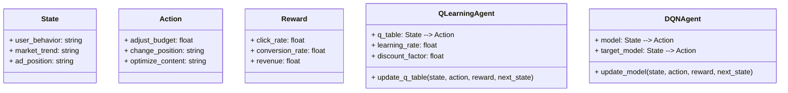
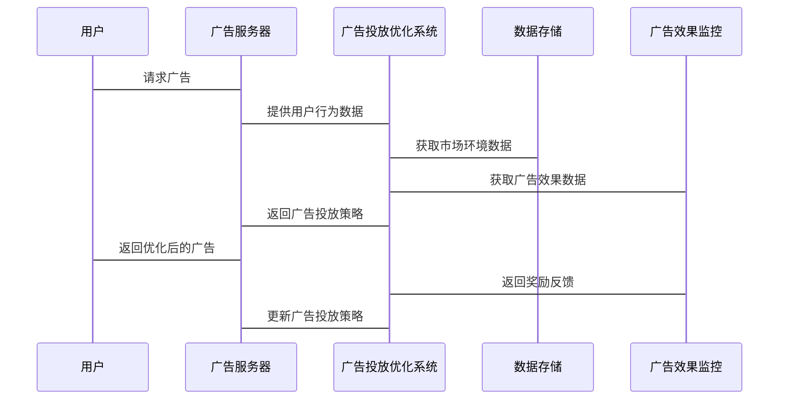

                 


# 企业AI Agent的强化学习在广告投放优化中的实时决策实践

**关键词**：AI Agent，强化学习，广告投放优化，实时决策，Q-learning，Deep Q-Network

**摘要**：本文深入探讨了企业AI Agent如何利用强化学习技术实现广告投放优化的实时决策。通过分析强化学习的核心概念、算法原理、系统架构以及实际案例，本文展示了如何在动态变化的广告环境中，通过AI Agent的实时决策能力，显著提升广告投放的效果和效率。文章从理论到实践，系统地介绍了强化学习在广告优化中的应用，为企业的数字化转型提供了有益的参考。

---

# 第一部分: 背景介绍与核心概念

# 第1章: 企业AI Agent与强化学习概述

## 1.1 AI Agent的基本概念

### 1.1.1 AI Agent的定义与特点

AI Agent（人工智能代理）是指能够感知环境、自主决策并执行任务的智能实体。它具有以下特点：

- **自主性**：能够在没有外部干预的情况下独立运作。
- **反应性**：能够实时感知环境变化并做出相应反应。
- **目标导向**：具有明确的目标，并通过行动实现目标。
- **学习能力**：能够通过经验改进自身的决策能力。

### 1.1.2 AI Agent的核心要素与功能

AI Agent的核心要素包括感知能力、决策能力、执行能力和学习能力。其主要功能包括：

- **环境感知**：通过传感器或数据输入获取环境信息。
- **目标设定**：根据任务需求设定目标。
- **决策制定**：基于当前状态和可能的行动，选择最优策略。
- **行动执行**：根据决策结果执行具体操作。
- **学习优化**：通过经验反馈不断优化自身的决策模型。

### 1.1.3 AI Agent在企业中的应用场景

AI Agent在企业中的应用场景广泛，包括智能客服、自动化交易、智能推荐系统等。在广告投放优化中，AI Agent可以作为实时决策者，根据市场变化和用户行为动态调整广告策略。

---

## 1.2 强化学习的基本概念

### 1.2.1 强化学习的定义与特点

强化学习（Reinforcement Learning, RL）是一种机器学习范式，通过智能体与环境的交互，学习最优策略以最大化累计奖励。其特点包括：

- **目标导向**：智能体通过选择行动来最大化累计奖励。
- **实时反馈**：通过奖励或惩罚信号指导学习过程。
- **动态环境**：环境状态和奖励机制可能随时间变化。

### 1.2.2 强化学习的核心要素与算法框架

强化学习的核心要素包括智能体、环境、状态、动作、奖励和策略。其算法框架通常包括以下几个步骤：

1. **状态感知**：智能体观察当前环境状态。
2. **策略选择**：根据当前状态选择一个动作。
3. **执行动作**：将选择的动作执行。
4. **获得奖励**：根据执行结果获得奖励或惩罚。
5. **更新策略**：根据奖励调整策略以优化未来决策。

### 1.2.3 强化学习在企业中的应用潜力

强化学习在企业中的应用潜力巨大，尤其是在需要实时决策和动态优化的领域，如金融交易、资源分配和广告投放优化。通过强化学习，企业可以显著提高决策的准确性和效率。

---

## 1.3 广告投放优化的背景与挑战

### 1.3.1 广告投放优化的定义与目标

广告投放优化是指通过科学的方法和工具，优化广告的投放策略，以实现最佳的广告效果。其主要目标包括提高点击率、转化率和广告收益。

### 1.3.2 广告投放优化的常见挑战

广告投放优化面临以下常见挑战：

- **动态环境**：用户行为和市场环境不断变化，需要实时调整策略。
- **多目标优化**：需要在多个目标（如点击率和收益）之间进行权衡。
- **数据稀疏性**：广告数据可能存在稀疏性，导致模型训练困难。

### 1.3.3 强化学习在广告优化中的优势

强化学习在广告优化中的优势包括：

- **实时决策能力**：能够根据实时数据做出最优决策。
- **动态适应能力**：能够快速适应环境变化。
- **多目标优化能力**：可以在多个目标之间进行权衡和优化。

---

## 1.4 本章小结

本章介绍了AI Agent和强化学习的基本概念，并探讨了强化学习在广告优化中的应用背景和优势。通过了解这些内容，读者可以为后续的学习打下坚实的基础。

---

# 第2章: 强化学习在广告优化中的应用背景

## 2.1 广告投放优化的核心问题

### 2.1.1 广告投放的实时决策问题

广告投放的实时决策问题是指在广告投放过程中，需要根据实时数据（如用户行为、市场变化）快速做出决策。这要求智能体具备快速响应和动态调整的能力。

### 2.1.2 广告效果的多目标优化

广告效果的多目标优化是指在优化广告效果时，需要在多个目标（如点击率、转化率、收益）之间进行权衡。这需要智能体具备多目标优化的能力。

### 2.1.3 广告投放的动态环境特点

广告投放的动态环境特点是指市场环境和用户行为不断变化，导致广告优化策略需要实时调整。这要求智能体具备动态适应能力。

---

## 2.2 AI Agent在广告优化中的角色

### 2.2.1 AI Agent作为广告投放决策者

AI Agent可以作为广告投放的决策者，根据实时数据和历史经验，制定最优的广告投放策略。

### 2.2.2 AI Agent的实时决策能力

AI Agent的实时决策能力使其能够在广告投放过程中快速响应环境变化，做出最优决策。

### 2.2.3 AI Agent的自我优化与学习能力

AI Agent的自我优化与学习能力使其能够通过历史数据和奖励反馈不断优化自身的决策模型。

---

## 2.3 强化学习与广告优化的结合点

### 2.3.1 强化学习在广告投放策略中的应用

强化学习可以通过学习最优策略，优化广告的投放位置、时间、预算分配等。

### 2.3.2 强化学习在广告效果预测中的应用

强化学习可以通过预测广告效果，评估不同策略的优劣。

### 2.3.3 强化学习在广告实时调整中的应用

强化学习可以通过实时调整广告策略，最大化广告的收益和效果。

---

## 2.4 本章小结

本章探讨了强化学习在广告优化中的应用背景，分析了AI Agent在广告优化中的角色和强化学习的优势。这为后续章节的深入学习奠定了基础。

---

# 第二部分: 核心概念与联系

# 第3章: 强化学习在广告优化中的核心概念

## 3.1 强化学习的核心概念与原理

### 3.1.1 强化学习的数学模型

强化学习的数学模型可以表示为：

$$
V(s) = \max_{a} [ r(s, a) + V(next\_state(s, a)) ]
$$

其中，\( V(s) \) 表示状态 \( s \) 的价值函数，\( r(s, a) \) 表示在状态 \( s \) 下采取行动 \( a \) 的奖励，\( next\_state(s, a) \) 表示在状态 \( s \) 下采取行动 \( a \) 后的下一个状态。

### 3.1.2 强化学习的算法框架

强化学习的算法框架通常包括以下几个步骤：

1. **初始化**：设置初始状态和参数。
2. **状态感知**：观察当前环境状态。
3. **策略选择**：根据当前状态选择一个动作。
4. **执行动作**：将选择的动作执行。
5. **获得奖励**：根据执行结果获得奖励或惩罚。
6. **更新策略**：根据奖励调整策略以优化未来决策。

---

## 3.2 强化学习与广告优化的联系

### 3.2.1 强化学习在广告优化中的应用特点

强化学习在广告优化中的应用特点包括：

- **实时性**：能够实时感知环境变化并做出决策。
- **动态性**：能够适应环境的动态变化。
- **多目标性**：能够在多个目标之间进行权衡和优化。

### 3.2.2 强化学习在广告优化中的数学模型

强化学习在广告优化中的数学模型可以表示为：

$$
Q(s, a) = Q(s, a) + \alpha [ r(s, a) + \gamma \max_{a'} Q(s', a') - Q(s, a) ]
$$

其中，\( Q(s, a) \) 表示状态 \( s \) 下采取行动 \( a \) 的Q值，\( \alpha \) 表示学习率，\( \gamma \) 表示折扣因子，\( r(s, a) \) 表示在状态 \( s \) 下采取行动 \( a \) 的奖励。

---

## 3.3 强化学习在广告优化中的核心要素

### 3.3.1 状态空间的定义

状态空间是指智能体在广告优化过程中可能遇到的所有状态的集合。例如，状态可以包括用户行为、市场环境、广告位置等。

### 3.3.2 动作空间的定义

动作空间是指智能体在广告优化过程中可以采取的所有动作的集合。例如，动作可以包括调整广告预算、改变广告位置、优化广告内容等。

### 3.3.3 奖励机制的设计

奖励机制是指智能体在执行动作后获得的奖励或惩罚。例如，当广告点击率提高时，智能体获得正奖励；当广告点击率降低时，智能体获得负奖励。

---

## 3.4 本章小结

本章详细介绍了强化学习的核心概念与原理，并探讨了其在广告优化中的应用特点和数学模型。通过这些内容，读者可以更好地理解强化学习在广告优化中的具体应用。

---

# 第三部分: 算法原理讲解

# 第4章: 强化学习算法在广告优化中的实现

## 4.1 Q-learning算法的实现

### 4.1.1 Q-learning算法的原理

Q-learning是一种基于值函数的强化学习算法，通过不断更新Q表中的Q值，学习最优策略。其原理可以表示为：

$$
Q(s, a) = Q(s, a) + \alpha [ r(s, a) + \gamma \max_{a'} Q(s', a') - Q(s, a) ]
$$

其中，\( Q(s, a) \) 表示状态 \( s \) 下采取行动 \( a \) 的Q值，\( \alpha \) 表示学习率，\( \gamma \) 表示折扣因子。

### 4.1.2 Q-learning算法的实现步骤

1. **初始化**：设置初始Q表，所有Q值初始化为0。
2. **状态感知**：观察当前环境状态。
3. **策略选择**：根据Q表选择一个动作。
4. **执行动作**：将选择的动作执行。
5. **获得奖励**：根据执行结果获得奖励或惩罚。
6. **更新Q表**：根据奖励更新Q表中的Q值。

### 4.1.3 Q-learning算法在广告优化中的应用

Q-learning算法在广告优化中的应用包括：

- **广告点击率优化**：通过不断更新Q表，优化广告的点击率。
- **广告转化率优化**：通过不断更新Q表，优化广告的转化率。
- **广告收益优化**：通过不断更新Q表，优化广告的收益。

---

## 4.2 Deep Q-Network（DQN）算法的实现

### 4.2.1 DQN算法的原理

DQN算法是一种基于深度学习的强化学习算法，通过使用神经网络近似Q值函数，学习最优策略。其原理可以表示为：

$$
Q(s, a) = \theta^T \phi(s, a)
$$

其中，\( \theta \) 表示神经网络的权重，\( \phi(s, a) \) 表示状态-动作对的特征向量。

### 4.2.2 DQN算法的实现步骤

1. **初始化**：设置初始神经网络参数。
2. **状态感知**：观察当前环境状态。
3. **策略选择**：根据神经网络输出选择一个动作。
4. **执行动作**：将选择的动作执行。
5. **获得奖励**：根据执行结果获得奖励或惩罚。
6. **更新神经网络**：通过反向传播更新神经网络参数。

### 4.2.3 DQN算法在广告优化中的应用

DQN算法在广告优化中的应用包括：

- **复杂环境下的优化**：通过深度学习模型，处理复杂的广告优化环境。
- **高维状态空间的优化**：通过神经网络，处理高维状态空间的优化问题。
- **实时决策优化**：通过实时更新神经网络，实现广告的实时决策优化。

---

## 4.3 算法实现的代码示例

### 4.3.1 Q-learning算法的Python代码示例

```python
import numpy as np

class QLearning:
    def __init__(self, state_space_size, action_space_size, alpha=0.1, gamma=0.9):
        self.q_table = np.zeros((state_space_size, action_space_size))
        self.alpha = alpha
        self.gamma = gamma

    def choose_action(self, state):
        return np.argmax(self.q_table[state])

    def update_q_table(self, state, action, reward, next_state):
        self.q_table[state][action] += self.alpha * (reward + self.gamma * np.max(self.q_table[next_state]) - self.q_table[state][action])
```

### 4.3.2 DQN算法的Python代码示例

```python
import numpy as np
import tensorflow as tf

class DQN:
    def __init__(self, state_space_size, action_space_size, hidden_units=32):
        self.model = self.build_model(state_space_size, action_space_size, hidden_units)
        self.target_model = self.build_model(state_space_size, action_space_size, hidden_units)
        self.update_target_network()

    def build_model(self, state_space_size, action_space_size, hidden_units):
        model = tf.keras.Sequential([
            tf.keras.layers.Dense(hidden_units, activation='relu', input_shape=(state_space_size,)),
            tf.keras.layers.Dense(action_space_size, activation='linear')
        ])
        return model

    def update_target_network(self):
        self.target_model.set_weights(self.model.get_weights())

    def choose_action(self, state, epsilon=0.1):
        if np.random.random() < epsilon:
            return np.random.randint(0, self.model.layers[-1].output_shape[1])
        state = np.array([state])
        predictions = self.model.predict(state)
        return np.argmax(predictions[0])

    def update_model(self, state, action, reward, next_state, gamma=0.99, alpha=0.01):
        state = np.array([state])
        next_state = np.array([next_state])
        target = self.target_model.predict(state)[0][action]
        target = reward + gamma * target
        self.model.fit(state, np.array([target]), epochs=1, verbose=0)
        self.update_target_network()
```

---

## 4.4 本章小结

本章详细介绍了Q-learning和DQN两种强化学习算法的实现原理和代码实现，并探讨了它们在广告优化中的具体应用。通过这些内容，读者可以更好地理解强化学习算法在广告优化中的实际应用。

---

# 第四部分: 系统分析与架构设计方案

# 第5章: 广告投放优化系统的架构设计

## 5.1 系统问题场景介绍

广告投放优化系统的应用场景包括：

- **实时广告投放**：需要根据实时数据快速做出决策。
- **多平台广告优化**：需要在多个广告平台之间进行优化。
- **多目标优化**：需要在多个目标（如点击率、转化率、收益）之间进行权衡。

---

## 5.2 系统功能设计

### 5.2.1 领域模型（Domain Model）

广告投放优化系统的领域模型可以用类图表示：



---

### 5.2.2 系统架构设计

广告投放优化系统的架构可以用以下分层架构表示：


---

## 5.3 系统接口设计

### 5.3.1 系统输入接口

系统输入接口包括：

- **用户行为数据**：如点击、浏览、转化等。
- **市场环境数据**：如市场趋势、竞争对手行为等。
- **广告投放参数**：如预算、投放位置、投放时间等。

### 5.3.2 系统输出接口

系统输出接口包括：

- **广告投放策略**：如预算调整、位置优化、内容优化等。
- **广告效果数据**：如点击率、转化率、收益等。
- **奖励反馈**：如正奖励或负奖励。

---

## 5.4 系统交互流程

广告投放优化系统的交互流程可以用以下序列图表示：



---

## 5.5 本章小结

本章详细介绍了广告投放优化系统的架构设计，包括领域模型、系统架构、接口设计和交互流程。通过这些内容，读者可以更好地理解如何将强化学习算法应用于实际的广告优化系统中。

---

# 第五部分: 项目实战

# 第6章: 广告投放优化系统的实现

## 6.1 环境安装与配置

### 6.1.1 环境需求

- **Python**：3.6+
- **TensorFlow**：2.0+
- **Mermaid**：用于绘制流程图和类图。
- **NumPy**：用于数据处理。

### 6.1.2 安装依赖

```bash
pip install numpy tensorflow keras
```

---

## 6.2 系统核心实现

### 6.2.1 强化学习算法实现

#### 6.2.1.1 Q-learning算法实现

```python
import numpy as np

class QLearning:
    def __init__(self, state_space_size, action_space_size, alpha=0.1, gamma=0.9):
        self.q_table = np.zeros((state_space_size, action_space_size))
        self.alpha = alpha
        self.gamma = gamma

    def choose_action(self, state):
        return np.argmax(self.q_table[state])

    def update_q_table(self, state, action, reward, next_state):
        self.q_table[state][action] += self.alpha * (reward + self.gamma * np.max(self.q_table[next_state]) - self.q_table[state][action])
```

#### 6.2.1.2 DQN算法实现

```python
import numpy as np
import tensorflow as tf

class DQN:
    def __init__(self, state_space_size, action_space_size, hidden_units=32):
        self.model = self.build_model(state_space_size, action_space_size, hidden_units)
        self.target_model = self.build_model(state_space_size, action_space_size, hidden_units)
        self.update_target_network()

    def build_model(self, state_space_size, action_space_size, hidden_units):
        model = tf.keras.Sequential([
            tf.keras.layers.Dense(hidden_units, activation='relu', input_shape=(state_space_size,)),
            tf.keras.layers.Dense(action_space_size, activation='linear')
        ])
        return model

    def update_target_network(self):
        self.target_model.set_weights(self.model.get_weights())

    def choose_action(self, state, epsilon=0.1):
        if np.random.random() < epsilon:
            return np.random.randint(0, self.model.layers[-1].output_shape[1])
        state = np.array([state])
        predictions = self.model.predict(state)
        return np.argmax(predictions[0])

    def update_model(self, state, action, reward, next_state, gamma=0.99, alpha=0.01):
        state = np.array([state])
        next_state = np.array([next_state])
        target = self.target_model.predict(state)[0][action]
        target = reward + gamma * target
        self.model.fit(state, np.array([target]), epochs=1, verbose=0)
        self.update_target_network()
```

### 6.2.2 系统功能实现

#### 6.2.2.1 广告投放策略优化

```python
# 示例：使用Q-learning优化广告点击率
ql = QLearning(state_space_size=10, action_space_size=5)
state = 0
action = ql.choose_action(state)
ql.update_q_table(state, action, reward, next_state)
```

#### 6.2.2.2 广告效果监控与反馈

```python
# 示例：广告效果监控
click_rate = 0.2
conversion_rate = 0.1
revenue = 100
```

---

## 6.3 实际案例分析

### 6.3.1 案例背景

假设我们有一个广告投放系统，需要优化广告的点击率和转化率。我们选择使用Q-learning算法进行优化。

### 6.3.2 案例实现

```python
ql = QLearning(state_space_size=10, action_space_size=5)
state = 0
action = ql.choose_action(state)
ql.update_q_table(state, action, reward, next_state)
```

### 6.3.3 案例分析

通过Q-learning算法，我们能够不断优化广告的点击率和转化率。每次广告投放后，我们都会根据用户点击和转化情况调整Q表，从而优化广告策略。

---

## 6.4 本章小结

本章通过实际案例分析，详细介绍了如何使用Q-learning算法实现广告投放优化。通过这些内容，读者可以更好地理解如何将强化学习算法应用于实际的广告优化系统中。

---

# 第六部分: 总结与展望

# 第7章: 总结与展望

## 7.1 学习总结

通过本篇文章的学习，我们深入探讨了企业AI Agent如何利用强化学习技术实现广告投放优化的实时决策。我们从理论到实践，系统地介绍了强化学习的核心概念、算法原理、系统架构以及实际案例。

## 7.2 最佳实践 tips

- **数据质量**：确保数据的准确性和完整性。
- **算法选择**：根据具体场景选择合适的算法。
- **系统优化**：不断优化系统架构和算法模型。

## 7.3 未来展望

随着人工智能和强化学习技术的不断发展，广告投放优化的实时决策能力将越来越强。未来，我们可以通过以下方式进一步优化广告投放策略：

- **多智能体协同**：通过多个AI Agent协同工作，优化广告投放策略。
- **深度强化学习**：通过深度强化学习，处理更复杂的广告优化问题。
- **实时反馈机制**：通过实时反馈机制，进一步优化广告投放策略。

---

## 7.4 本章小结

本章总结了全文的主要内容，并对未来的发展方向进行了展望。通过这些内容，读者可以更好地理解强化学习在广告优化中的应用前景。

---

# 结语

通过本文的学习，我们深入探讨了企业AI Agent如何利用强化学习技术实现广告投放优化的实时决策。从理论到实践，我们系统地介绍了强化学习的核心概念、算法原理、系统架构以及实际案例。未来，随着人工智能和强化学习技术的不断发展，广告投放优化的实时决策能力将越来越强，为企业创造更大的价值。

---

**作者：AI天才研究院/AI Genius Institute & 禅与计算机程序设计艺术 /Zen And The Art of Computer Programming**

