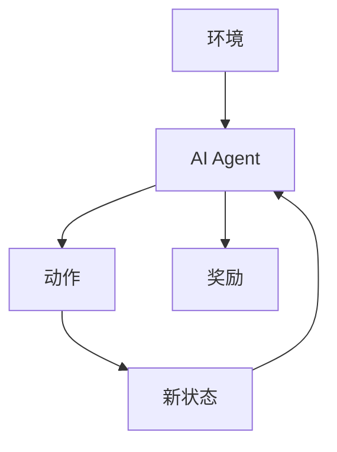
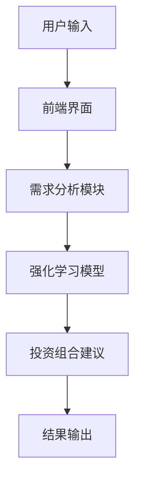
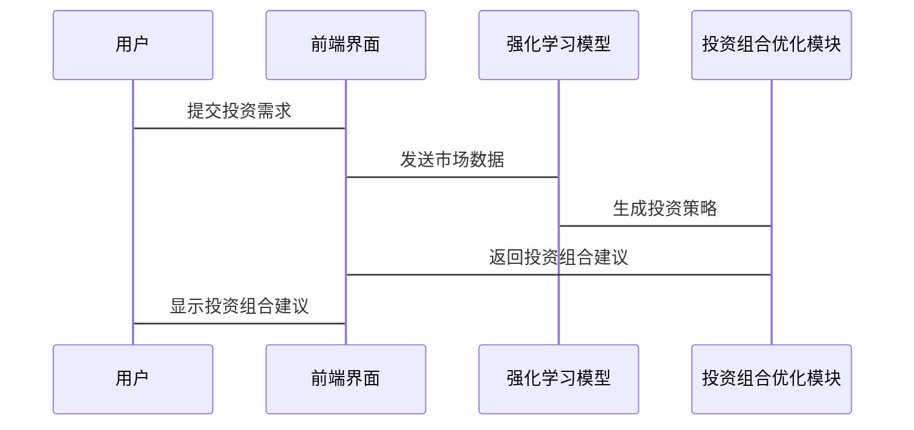

                 


# 企业AI Agent的强化学习在智能投资组合管理中的应用

## 关键词：
- AI Agent
- 强化学习
- 投资组合管理
- 企业智能
- 金融建模

## 摘要：
本文探讨了企业AI Agent如何通过强化学习技术优化投资组合管理。从AI Agent和强化学习的基本概念出发，深入分析了强化学习在金融投资中的应用价值。通过详细讲解强化学习算法的原理与实现，结合投资组合管理的数学模型，构建了一个基于强化学习的企业AI Agent系统。文章最后通过一个实战案例，展示了如何将理论应用于实际投资组合管理中，并对未来的研究方向进行了展望。

---

# 第1章: 企业AI Agent与强化学习概述

## 1.1 AI Agent的基本概念

### 1.1.1 AI Agent的定义与特点
AI Agent（人工智能代理）是指能够感知环境并采取行动以实现目标的智能实体。与传统软件不同，AI Agent具有以下特点：
- **自主性**：能够在没有外部干预的情况下自主决策。
- **反应性**：能够根据环境反馈实时调整行为。
- **目标导向**：所有行动都以实现特定目标为导向。
- **学习能力**：能够通过经验改进自身性能。

### 1.1.2 强化学习的基本概念
强化学习（Reinforcement Learning, RL）是一种机器学习范式，其中智能体通过与环境交互来学习如何采取最优行动以最大化累积奖励。其核心是通过试错机制优化决策策略。

### 1.1.3 AI Agent与强化学习的关系
AI Agent为强化学习提供了一个实现载体，而强化学习则赋予AI Agent自主决策和优化的能力。两者结合可以实现动态复杂环境下的智能决策。

## 1.2 强化学习的核心原理

### 1.2.1 强化学习的基本框架
强化学习的基本框架包括以下三个核心要素：
1. **状态（State）**：环境在某一时刻的描述。
2. **动作（Action）**：智能体在某一状态下采取的行为。
3. **奖励（Reward）**：智能体采取动作后获得的反馈，用于指导后续决策。

### 1.2.2 状态、动作与奖励的定义
- **状态**：在投资组合管理中，状态可以是市场行情、资产价格等。
- **动作**：可以是买入、卖出或持有某种资产。
- **奖励**：可以是投资组合的收益或风险指标。

### 1.2.3 策略与价值函数的原理
- **策略（Policy）**：描述智能体在给定状态下采取动作的概率分布。
- **价值函数（Value Function）**：衡量某状态下采取特定行动的长期收益。

## 1.3 企业AI Agent的应用场景

### 1.3.1 金融领域的AI Agent应用
- 自动化交易
- 风险管理
- 资产配置

### 1.3.2 投资组合管理中的AI Agent
- 动态资产分配
- 风险控制
- 投资决策优化

### 1.3.3 强化学习在投资组合管理中的优势
- 能够处理非线性关系
- 适合动态环境
- 可以优化多目标函数

---

# 第2章: 强化学习算法原理

## 2.1 强化学习的核心算法

### 2.1.1 Q-Learning算法
Q-Learning是一种经典的强化学习算法，适用于离散状态和动作空间。其更新公式为：
$$ Q(s, a) = Q(s, a) + \alpha [r + \gamma \max Q(s', a') - Q(s, a)] $$
其中：
- $\alpha$ 是学习率
- $\gamma$ 是折扣因子

### 2.1.2 Deep Q-Networks (DQN)算法
DQN通过深度神经网络近似Q值函数，扩展了Q-Learning的应用场景。其损失函数为：
$$ \text{损失函数} = \mathbb{E}[ (r + \gamma Q(s', a') - Q(s, a))^2 ] $$

### 2.1.3 Policy Gradient方法
Policy Gradient直接优化策略，适用于连续动作空间。其目标函数为：
$$ \mathcal{L} = -\mathbb{E}[ \log \pi(a|s) Q(s, a) ] $$

## 2.2 算法流程图


## 2.3 数学模型与公式

### 2.3.1 Q-Learning的数学模型
$$ Q(s, a) = Q(s, a) + \alpha [r + \gamma \max Q(s', a') - Q(s, a)] $$

### 2.3.2 DQN的数学模型
$$ \text{损失函数} = \mathbb{E}[ (r + \gamma Q(s', a') - Q(s, a))^2 ] $$

---

# 第3章: 投资组合管理中的强化学习应用

## 3.1 投资组合管理的基本概念

### 3.1.1 投资组合管理的定义
投资组合管理是指通过科学的方法构建和调整投资组合，以实现收益最大化和风险最小化的过程。

### 3.1.2 马科维茨投资组合理论
马科维茨理论提出了有效投资组合的概念，即在给定风险下收益最高或给定收益下风险最小的投资组合。

### 3.1.3 风险与收益的平衡
投资组合管理的核心是在收益与风险之间找到最佳平衡点。

## 3.2 强化学习在投资组合管理中的应用

### 3.2.1 基于强化学习的投资策略
- 动态资产分配
- 风险控制
- 多目标优化

### 3.2.2 动态资产分配的强化学习模型
通过强化学习模型实时调整资产配置，以适应市场变化。

### 3.2.3 多目标优化的强化学习框架
在强化学习框架下同时优化收益、风险和流动性等多个目标。

---

# 第4章: 企业AI Agent的系统设计

## 4.1 系统架构设计

### 4.1.1 系统架构图


### 4.1.2 功能模块设计
- 数据采集模块
- 强化学习模块
- 投资组合优化模块

### 4.1.3 系统接口设计
- 输入接口：接收市场数据和用户需求
- 输出接口：提供投资组合建议
- 数据接口：与数据源进行交互

## 4.2 系统功能设计

### 4.2.1 数据采集模块
负责收集市场数据、用户需求等输入信息。

### 4.2.2 强化学习模块
实现强化学习算法，训练投资策略。

### 4.2.3 投资组合优化模块
根据强化学习结果生成最优投资组合。

## 4.3 系统交互设计

### 4.3.1 系统交互图


---

# 第5章: 项目实战与实现

## 5.1 环境搭建

### 5.1.1 安装Python与相关库
```bash
pip install numpy matplotlib tensorflow
```

### 5.1.2 安装深度学习框架
```bash
pip install keras
```

## 5.2 核心实现源代码

### 5.2.1 强化学习模型实现
```python
import numpy as np
import keras

class DQNModel:
    def __init__(self, state_space, action_space):
        self.model = self.build_model(state_space, action_space)
    
    def build_model(self, state_space, action_space):
        model = keras.Sequential()
        model.add(keras.layers.Dense(32, activation='relu', input_dim=state_space))
        model.add(keras.layers.Dense(32, activation='relu'))
        model.add(keras.layers.Dense(action_space, activation='linear'))
        model.compile(optimizer='adam', loss='mse')
        return model
```

### 5.2.2 投资组合管理实现
```python
import numpy as np

def invest

