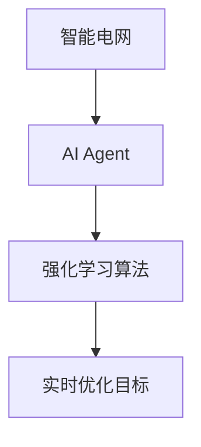
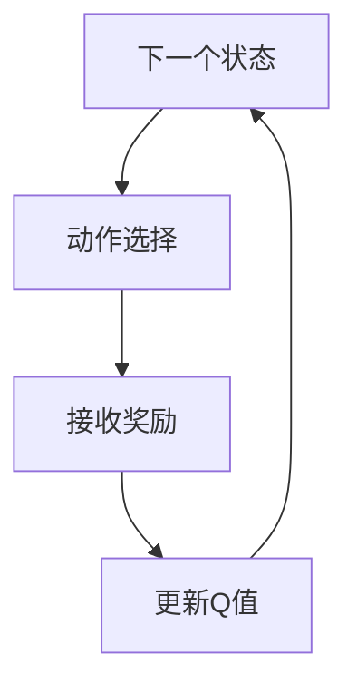
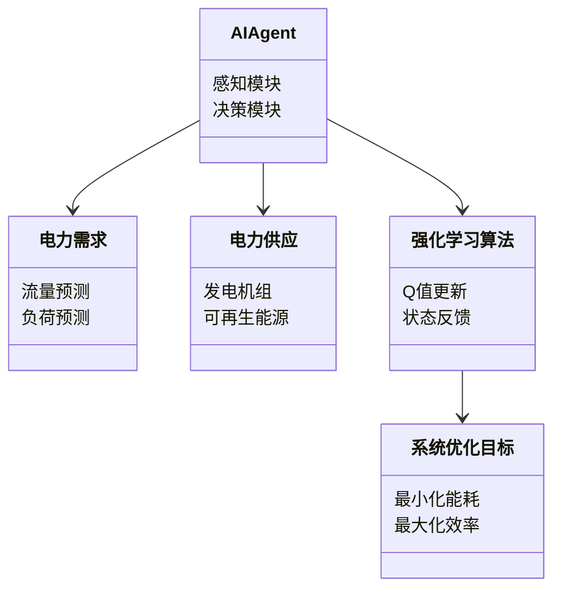
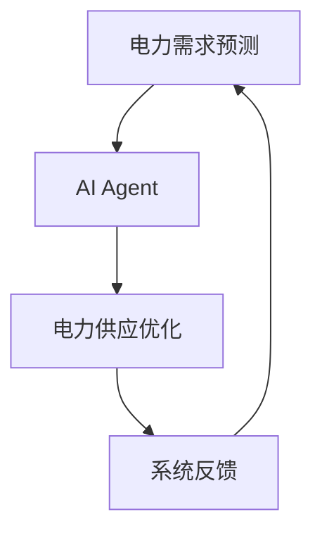
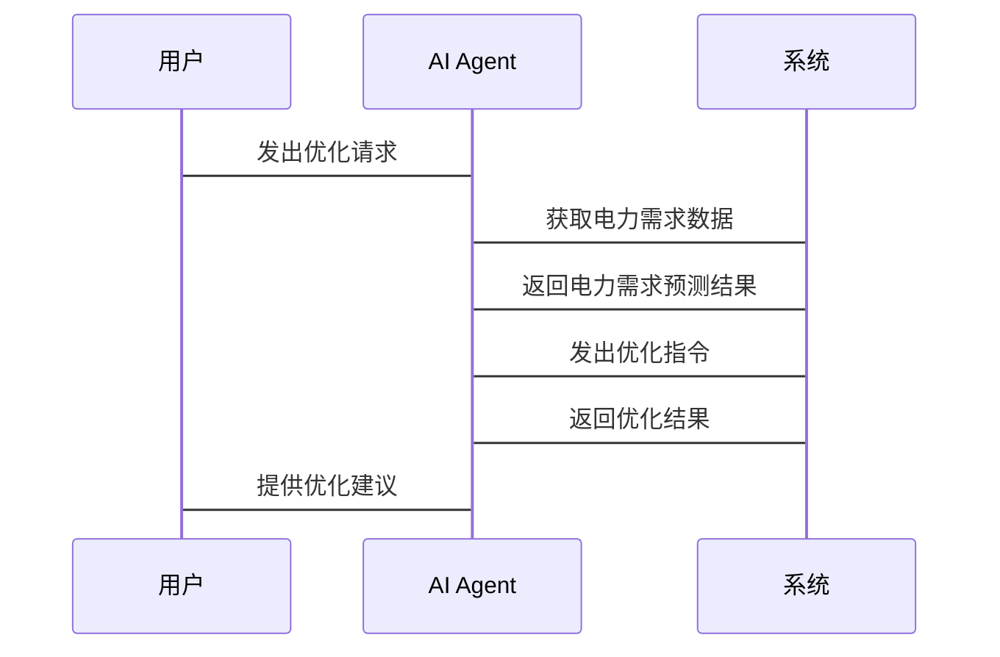

                 


# 企业AI Agent的强化学习在智能电网管理中的实时优化

## 关键词：AI Agent，强化学习，智能电网，实时优化，系统架构

## 摘要：本文探讨了企业AI Agent如何通过强化学习技术实现智能电网管理的实时优化。文章从问题背景、核心概念、算法原理、系统架构、项目实战等多个方面进行了深入分析，结合实际案例，详细讲解了强化学习在智能电网中的应用，并提出了系统设计和优化建议。

---

# 第1章: 企业AI Agent与强化学习概述

## 1.1 问题背景与描述

### 1.1.1 智能电网管理的挑战
智能电网是电力系统的重要组成部分，其管理目标是实现电力的高效分配、优化调度和实时控制。然而，智能电网的复杂性使其在实际运行中面临诸多挑战，如电力供需的实时波动、设备状态的动态变化以及多目标优化的复杂性。

### 1.1.2 企业AI Agent的核心问题
企业AI Agent（Artificial Intelligence Agent）是一种能够感知环境、自主决策并采取行动的智能体。在智能电网管理中，AI Agent需要解决的核心问题是实时优化电力分配、预测电力需求以及处理突发情况。

### 1.1.3 强化学习在实时优化中的应用
强化学习（Reinforcement Learning）是一种通过试错机制来优化决策的机器学习方法。其核心在于通过与环境的交互，学习最优策略以实现目标。强化学习在实时优化中的应用使得AI Agent能够在动态环境中做出最优决策。

## 1.2 问题解决与边界

### 1.2.1 AI Agent在智能电网中的解决方案
AI Agent通过感知环境、分析数据并采取行动，能够有效解决智能电网中的复杂优化问题。例如，AI Agent可以实时调整电力分配策略，以应对电力需求的变化。

### 1.2.2 问题的边界与外延
智能电网管理中的AI Agent应用需要明确问题的边界，例如，是否考虑天气因素、用户行为以及其他外部干扰。这些边界决定了AI Agent的决策范围和优化目标。

### 1.2.3 核心概念与组成要素
智能电网管理中的AI Agent系统由感知模块、决策模块和执行模块组成。感知模块负责收集环境数据，决策模块基于强化学习算法进行决策，执行模块负责执行决策并反馈结果。

## 1.3 本章小结
本章介绍了智能电网管理中的挑战、AI Agent的核心问题以及强化学习的应用价值。通过明确问题边界和系统组成，为后续章节的深入分析奠定了基础。

---

# 第2章: AI Agent与强化学习的核心概念

## 2.1 核心概念原理

### 2.1.1 AI Agent的基本原理
AI Agent通过感知环境、分析数据并采取行动来实现目标。其核心在于自主决策和动态适应能力。

### 2.1.2 强化学习的基本原理
强化学习通过试错机制，学习最优策略以实现目标。其核心在于状态、动作和奖励的定义与优化。

## 2.2 核心概念属性特征对比

| 比较维度 | AI Agent | 强化学习 |
|----------|-----------|----------|
| 决策方式 | 基于规则或模型 | 基于试错和奖励 |
| 适应性 | 高度动态 | 动态调整 |
| 应用场景 | 多领域优化 | 实时优化 |

## 2.3 ER实体关系图


## 2.4 本章小结
本章通过对比分析AI Agent和强化学习的核心概念，明确了其在智能电网管理中的应用价值，并通过ER实体关系图展示了系统各部分的关联性。

---

# 第3章: 强化学习算法原理

## 3.1 算法原理讲解

### 3.1.1 Q-learning算法
Q-learning是一种经典的强化学习算法，通过更新Q值表来学习最优策略。其核心公式为：
$$ Q(s, a) = Q(s, a) + \alpha (r + \gamma \max Q(s', a') - Q(s, a)) $$

### 3.1.2 Deep Q-learning算法
Deep Q-learning通过神经网络近似Q值函数，解决了传统Q-learning的高维状态问题。其核心公式为：
$$ y = r + \gamma \max Q(s', a') $$
$$ \text{损失函数} = \frac{1}{2}(y - Q(s, a))^2 $$

## 3.2 算法流程图


## 3.3 算法数学模型
### 3.3.1 Q-learning公式
$$ Q(s, a) = Q(s, a) + \alpha (r + \gamma \max Q(s', a') - Q(s, a)) $$
### 3.3.2 Deep Q-learning公式
$$ y = r + \gamma \max Q(s', a') $$
$$ \text{损失函数} = \frac{1}{2}(y - Q(s, a))^2 $$

## 3.4 本章小结
本章详细讲解了Q-learning和Deep Q-learning算法的原理和数学模型，并通过流程图展示了算法的执行步骤。

---

# 第4章: 智能电网管理系统的分析与架构设计

## 4.1 系统分析

### 4.1.1 问题场景介绍
智能电网管理中的典型问题包括电力供需不平衡、设备状态监测和多目标优化。AI Agent通过强化学习算法可以实时优化电力分配，降低能耗并提高系统效率。

### 4.1.2 项目介绍
本项目旨在设计一个基于AI Agent的智能电网管理系统，通过强化学习算法实现电力分配的实时优化。

## 4.2 系统功能设计

### 4.2.1 领域模型设计


### 4.2.2 系统架构设计


### 4.2.3 系统接口设计
系统接口包括电力需求预测接口、AI Agent控制接口和系统反馈接口。这些接口通过RESTful API进行通信。

### 4.2.4 系统交互流程


## 4.3 本章小结
本章通过系统分析和架构设计，明确了智能电网管理系统的功能模块和交互流程，并通过图表展示了系统的整体架构。

---

# 第5章: 项目实战

## 5.1 环境安装

### 5.1.1 安装Python环境
建议使用Anaconda或Miniconda作为Python环境管理工具。

### 5.1.2 安装必要的库
安装以下Python库：
- `numpy`
- `pandas`
- `tensorflow`
- `keras`
- `matplotlib`

## 5.2 系统核心实现源代码

### 5.2.1 强化学习算法实现
```python
import numpy as np

class DeepQNetwork:
    def __init__(self, state_size, action_size, learning_rate=0.01):
        self.state_size = state_size
        self.action_size = action_size
        self.learning_rate = learning_rate
        self.model = self.build_model()

    def build_model(self):
        import tensorflow as tf
        model = tf.keras.Sequential([
            tf.keras.layers.Dense(24, activation='relu', input_dim=self.state_size),
            tf.keras.layers.Dense(24, activation='relu'),
            tf.keras.layers.Dense(self.action_size, activation='linear')
        ])
        model.compile(optimizer=tf.keras.optimizers.Adam(self.learning_rate),
                      loss='mean_squared_error')
        return model

    def get_action(self, state):
        state = np.array([state])
        predictions = self.model.predict(state)
        return np.argmax(predictions[0])

    def train(self, state, target):
        state = np.array([state])
        target = np.array([target])
        self.model.fit(state, target, epochs=1, verbose=0)
```

### 5.2.2 系统优化模块实现
```python
class GridManager:
    def __init__(self, state_size, action_size):
        self.agent = DeepQNetwork(state_size, action_size)
        self.gamma = 0.99
        self.epsilon = 0.1

    def get_action(self, state):
        if np.random.random() < self.epsilon:
            return np.random.randint(0, self.agent.action_size)
        else:
            return self.agent.get_action(state)

    def update(self, state, action, reward, next_state):
        target = reward + self.gamma * np.max(self.agent.model.predict(np.array([next_state]))[0])
        target_vec = np.zeros((1, self.agent.action_size))
        target_vec[0][action] = target
        self.agent.train(state, target_vec)
```

## 5.3 实际案例分析与解读
以某地区电力供需不平衡问题为例，AI Agent通过强化学习算法优化电力分配策略，实现了电力供需的实时平衡。

## 5.4 项目小结
本章通过实际项目案例，展示了强化学习算法在智能电网管理中的应用，并提供了系统实现的详细代码。

---

# 第6章: 最佳实践与小结

## 6.1 本章小结
本文通过系统分析和项目实战，详细讲解了企业AI Agent的强化学习在智能电网管理中的实时优化应用。通过理论与实践的结合，展示了强化学习算法在智能电网管理中的巨大潜力。

## 6.2 注意事项
- 系统设计时需考虑多目标优化问题
- 强化学习算法的训练需要大量的数据和计算资源
- 系统优化目标需与实际业务需求相结合

## 6.3 拓展阅读
建议读者进一步学习强化学习的高级算法，如Policy Gradient和Actor-Critic方法，并探索其在智能电网管理中的应用。

---

# 作者：AI天才研究院/AI Genius Institute & 禅与计算机程序设计艺术 /Zen And The Art of Computer Programming

---

# 本文由【AI程序设计】（微信公众号：AI程序设计）创作，转载请注明出处！

