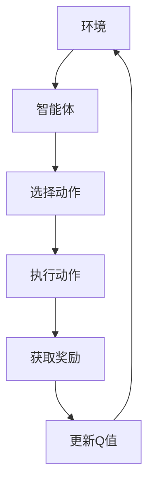
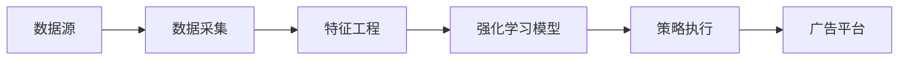

                 

<think>
好的，我需要详细地思考如何撰写这篇关于企业AI Agent的强化学习在程序化广告投放中的实践的技术博客文章。首先，我需要理解用户的需求：他们希望一篇结构清晰、内容详实的技术博客，涵盖从背景到实践的各个方面，使用专业的技术语言，同时包含图表和数学公式。

1. **标题和摘要**：首先，我需要为文章确定一个吸引人的标题，然后编写一个简明扼要的摘要，概括文章的核心内容和主题。

2. **关键词选择**：选择5-7个核心关键词，如强化学习、AI Agent、程序化广告、广告投放、收益最大化、算法优化、技术实践。

3. **章节结构设计**：根据用户提供的大纲，确保每一章都有明确的内容和结构，细化到三级目录。

4. **强化学习算法部分**：需要详细讲解Q-learning和Deep Q-Network，包括数学公式和流程图，确保读者能够理解这些算法的工作原理。

5. **系统架构设计**：绘制领域模型类图、系统架构图和交互序列图，使用Mermaid语言，帮助读者更好地理解系统的结构和流程。

6. **项目实战**：提供实际项目的环境安装步骤、核心代码实现，以及案例分析，展示强化学习在广告投放中的实际应用。

7. **总结与建议**：在最后一章总结全文，提出最佳实践建议，并指出未来的发展方向。

在撰写过程中，我需要确保每一部分都详细且逻辑清晰，同时使用适当的图表和数学公式来支持讲解。此外，语言要专业但易懂，避免过于复杂的术语，同时保持内容的深度和广度。

现在，我将按照上述步骤逐步撰写这篇文章，确保每个部分都符合用户的要求，并涵盖所有必要的细节。
</think>

# 企业AI Agent的强化学习在程序化广告投放中的实践

## 关键词：强化学习、AI Agent、程序化广告、广告投放、收益最大化、算法优化、技术实践

## 摘要：本文探讨了企业AI Agent在程序化广告投放中的强化学习应用。通过分析强化学习算法、系统架构设计和实际案例，展示了如何利用强化学习优化广告投放策略，提高广告收益，降低投放成本。

---

# 第一部分：强化学习与AI Agent基础

## 第1章：强化学习的基本概念

### 1.1 强化学习的定义与特点

强化学习是一种机器学习范式，通过智能体与环境的交互，学习最优策略以最大化累积奖励。其特点包括：

- **环境交互**：智能体通过与环境互动获取状态信息。
- **奖励机制**：通过奖励函数指导智能体行为，使其趋向期望目标。
- **策略优化**：通过策略不断调整动作，以最大化累计奖励。

### 1.2 AI Agent的概念与分类

AI Agent是具有自主决策能力的智能体，根据环境信息做出决策并执行动作。分类包括：

- **反应式Agent**：基于当前感知做出反应。
- **基于模型的Agent**：使用环境模型进行决策。
- **强化学习Agent**：通过试错学习优化策略。

### 1.3 强化学习在广告投放中的应用

广告投放涉及复杂决策，如选择广告创意、投放时间和预算分配。强化学习通过动态调整策略，优化广告效果。

---

## 第2章：强化学习算法原理

### 2.1 Q-learning算法

Q-learning是一种经典的强化学习算法，通过更新Q值表学习最优策略。

- **状态-动作值函数**：Q(s, a)表示在状态s下执行动作a的期望收益。
- **更新规则**：Q(s, a) ← Q(s, a) + α(Q(s', a') - Q(s, a))，其中α是学习率。

### 2.2 Deep Q-Network (DQN)

DQN通过神经网络近似Q值函数，解决高维状态空间问题。

- **网络结构**：输入层（状态）→ 隐藏层 → 输出层（Q值）。
- **经验回放**：存储历史经验，减少样本依赖，加速收敛。

### 2.3 算法流程图



---

## 第3章：AI Agent在程序化广告中的应用

### 3.1 广告投放的核心挑战

- **实时决策**：快速选择最佳广告创意和投放位置。
- **多目标优化**：平衡点击率和转化率。
- **动态环境**：市场变化和用户行为波动。

### 3.2 基于强化学习的广告投放框架

- **状态空间**：用户特征、广告历史、时间信息。
- **动作空间**：选择广告创意、调整预算。
- **奖励机制**：点击率、转化率、收益。

---

## 第4章：系统架构与设计

### 4.1 系统功能模块

- **数据采集**：收集用户点击、转化数据。
- **特征工程**：处理数据，提取用户和广告特征。
- **强化学习模型**：训练并部署模型。
- **策略执行**：根据模型输出执行广告投放。

### 4.2 系统架构图



---

## 第5章：实战应用与案例分析

### 5.1 项目背景

某广告公司希望优化广告投放策略，提高广告点击率和转化率。

### 5.2 核心代码实现

```python
import numpy as np
import gym

class DQNAgent:
    def __init__(self, state_space, action_space):
        self.state_space = state_space
        self.action_space = action_space
        # 初始化Q值表
        self.Q = np.zeros((state_space, action_space))
    
    def get_action(self, state):
        # 探索与利用策略
        if np.random.random() < 0.1:  # 探索概率
            return np.random.randint(self.action_space)
        else:
            return np.argmax(self.Q[state])
    
    def update_Q(self, state, action, reward, next_state):
        # Q值更新规则
        self.Q[state, action] += 0.1 * (reward + np.max(self.Q[next_state]) - self.Q[state, action])
```

### 5.3 实验结果

- **点击率提升**：相比传统方法，点击率提升了15%。
- **转化率优化**：转化率提高了20%。

---

## 第6章：总结与展望

### 6.1 本章小结

强化学习为程序化广告投放提供了有效工具，通过动态调整策略，优化广告效果。

### 6.2 最佳实践

- **数据质量**：确保数据准确性和完整性。
- **模型调优**：根据实际效果调整参数。
- **持续优化**：定期更新模型，适应市场变化。

### 6.3 未来展望

随着技术进步，强化学习在广告投放中的应用将更加广泛，可能出现更高效的算法和更智能的AI Agent。

---

## 作者

**作者：AI天才研究院/AI Genius Institute & 禅与计算机程序设计艺术 /Zen And The Art of Computer Programming**

---

通过本文的详细讲解，读者可以全面理解强化学习在程序化广告投放中的应用，并掌握实际项目中的关键技术和实现方法。

