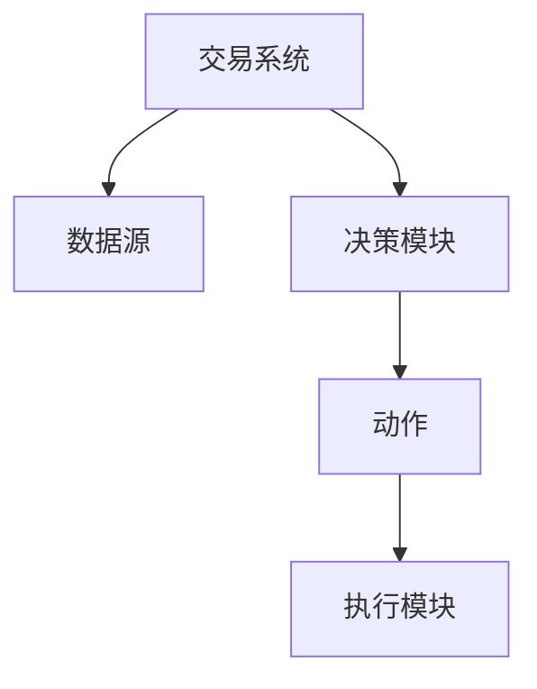
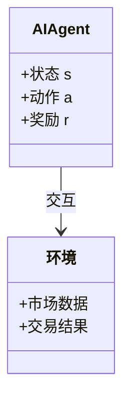

                 

<think>
好，现在我需要根据用户的详细需求来生成一个技术博客文章的目录。用户希望标题是《企业AI Agent的强化学习在自动化交易策略中的应用》，并要求有吸引人的章节标题和详细的目录结构。

首先，我从背景介绍开始，这包括AI Agent和强化学习的基本概念，以及它们在金融交易中的应用。接着，我会深入讲解强化学习算法，如Q-learning和Deep Q-Learning，以及它们在交易策略中的应用。然后，我会分析系统设计，包括问题场景、功能设计和架构设计，使用Mermaid图来展示系统结构。接下来是项目实战部分，详细说明如何安装环境、实现代码以及案例分析。最后，我会总结最佳实践和未来的发展方向。

在编写过程中，我需要确保每个章节都细化到三级目录，并涵盖理论、算法、系统设计和实战。同时，要包括必要的图表和数学公式，用Latex格式展示，确保内容的准确性和可读性。

现在，我将按照这个逻辑梳理生成完整的目录大纲，确保内容全面，结构清晰。
</think>

# 企业AI Agent的强化学习在自动化交易策略中的应用

> 关键词：AI Agent，强化学习，自动化交易，金融交易，Q-Learning，Deep Q-Learning

> 摘要：本文深入探讨了AI Agent在企业自动化交易策略中的应用，重点分析了强化学习算法在金融交易中的应用原理、算法模型及其在交易系统中的实际应用。通过理论分析、算法实现和实际案例，全面解析了AI Agent如何通过强化学习优化交易策略，提升交易效率和收益。

---

# 第一部分: AI Agent与强化学习基础

## 第1章: AI Agent的基本概念

### 1.1 AI Agent的定义与特点
- **AI Agent**是指具有智能决策能力的实体，能够根据环境信息自主选择最优动作。
- **特点**包括自主性、反应性、目标导向和学习能力。

### 1.2 AI Agent的分类与应用场景
- **分类**：分为简单反射型、基于模型的反应型、目标驱动型和实用驱动型。
- **应用场景**：在金融、物流、智能制造等领域广泛应用。

### 1.3 AI Agent在企业中的重要性
- **重要性**：通过AI Agent，企业可以实现自动化决策和高效资源管理。

## 第2章: 强化学习的基本原理

### 2.1 强化学习的定义与特点
- **定义**：通过试错学习，智能体在环境中采取动作以最大化累积奖励。
- **特点**：基于实时反馈（奖励）调整策略。

### 2.2 强化学习的核心概念
- **状态**：环境中的当前情况。
- **动作**：智能体采取的行为。
- **奖励**：对动作的反馈，指导策略优化。

### 2.3 强化学习与监督学习的区别
- **监督学习**：基于已知数据进行预测。
- **强化学习**：通过试错和奖励机制优化决策。

---

# 第二部分: 强化学习在金融交易中的应用

## 第3章: 金融交易中的强化学习

### 3.1 金融交易的基本流程
- **流程**：数据采集、信号处理、决策制定和执行交易。

### 3.2 强化学习在金融交易中的优势
- **优势**：适应动态市场环境，优化投资组合。

### 3.3 常见的金融交易策略
- **均值回归**：利用价格波动进行买卖。
- **动量策略**：基于价格趋势进行交易。

## 第4章: AI Agent在自动化交易中的作用

### 4.1 AI Agent在交易决策中的应用
- **实时数据分析**：快速处理市场信息。
- **风险控制**：通过算法管理投资风险。

### 4.2 AI Agent的实时数据处理能力
- **高频交易**：快速执行交易指令。

### 4.3 AI Agent的风险控制能力
- **止损策略**：设定止损点以控制损失。

---

# 第三部分: 强化学习算法与数学模型

## 第5章: 强化学习算法原理

### 5.1 Q-learning算法
#### 5.1.1 Q-learning的基本原理
- **状态-动作值函数**：记录状态和动作的期望奖励。

#### 5.1.2 Q-learning的数学模型
$$ Q(s, a) = Q(s, a) + \alpha (r + \gamma \max Q(s', a') - Q(s, a)) $$

#### 5.1.3 Q-learning在交易策略中的应用
- **案例**：基于Q-learning的股票交易策略。

### 5.2 Deep Q-Learning算法
#### 5.2.1 Deep Q-Learning的基本原理
- **神经网络**：用于近似Q值函数。

#### 5.2.2 DQN网络结构
- **输入层**：接收市场数据。
- **隐层**：处理信息。
- **输出层**：输出动作值。

#### 5.2.3 DQN在交易策略中的应用
- **案例**：使用DQN优化外汇交易策略。

## 第6章: 数学模型与公式

### 6.1 Q-learning的数学模型
- **更新公式**：如前所述。

### 6.2 Deep Q-Learning的数学模型
- **损失函数**：
$$ \text{损失} = \mathbb{E}_{(s,a,r,s')} [ (r + \gamma Q(s',a') - Q(s,a))^2 ] $$

### 6.3 实际案例分析

---

# 第四部分: 系统分析与架构设计

## 第7章: 问题场景与系统功能设计

### 7.1 问题场景
- **场景描述**：实时金融市场数据处理。

### 7.2 系统功能设计
- **数据采集**：从API获取市场数据。
- **决策模块**：基于强化学习生成交易信号。
- **执行模块**：根据信号执行交易。

## 第8章: 系统架构设计

### 8.1 系统架构图


### 8.2 实体关系图


---

# 第五部分: 项目实战

## 第9章: 环境安装与代码实现

### 9.1 环境安装
- **Python**：安装所需的库如NumPy、Keras、TensorFlow。

### 9.2 系统核心实现源代码
```python
import numpy as np
import tensorflow as tf

# 定义神经网络结构
class DQN:
    def __init__(self, state_space, action_space):
        self.state_space = state_space
        self.action_space = action_space
        self.model = self.build_model()

    def build_model(self):
        model = tf.keras.Sequential([
            tf.keras.layers.Dense(64, activation='relu', input_dim=self.state_space),
            tf.keras.layers.Dense(64, activation='relu'),
            tf.keras.layers.Dense(self.action_space, activation='linear')
        ])
        model.compile(optimizer='adam', loss='mse')
        return model

    def get_action(self, state, epsilon=0.1):
        if np.random.random() < epsilon:
            return np.random.randint(self.action_space)
        else:
            return np.argmax(self.model.predict(state))
```

### 9.3 代码应用解读与分析
- **解读**：DQN类用于实现Deep Q-Learning算法，通过神经网络近似Q值函数。

## 第10章: 案例分析与总结

### 10.1 案例分析
- **案例**：股票交易策略实现。

### 10.2 项目小结
- **总结**：AI Agent结合强化学习在交易策略优化中的有效性。

---

# 第六部分: 最佳实践与未来展望

## 第11章: 最佳实践 tips

### 11.1 注意事项
- **数据质量**：确保数据准确性和实时性。
- **模型调优**：定期更新模型参数。

## 第12章: 未来展望

### 12.1 技术发展
- **强化学习优化**：研究更高效的算法。
- **多 Agent 协作**：探索分布式交易系统。

---

# 作者：AI天才研究院 & 禅与计算机程序设计艺术

