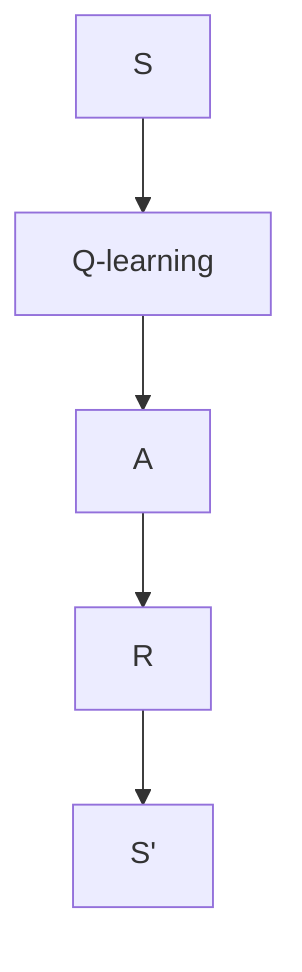
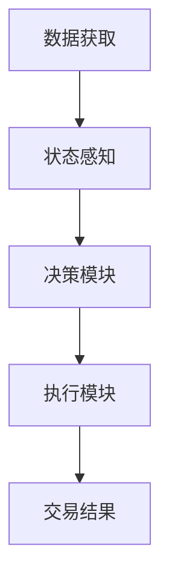
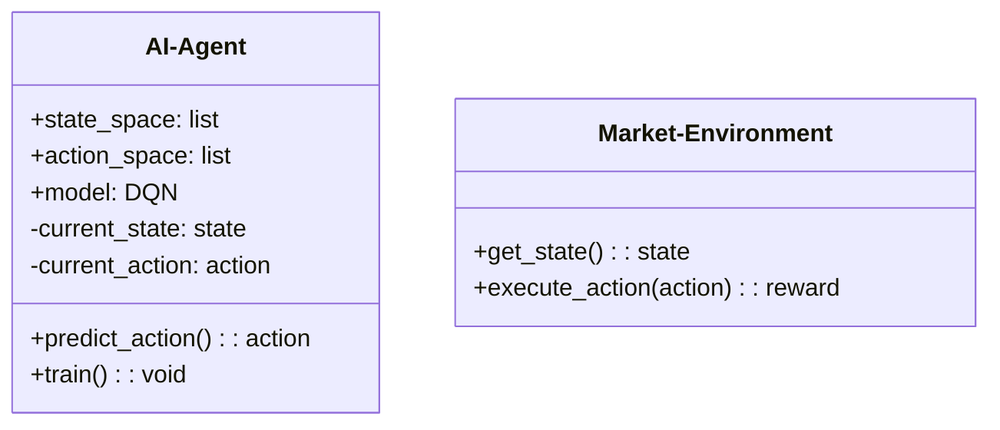

                 


# 企业AI Agent的强化学习在金融交易中的应用

## 关键词：企业AI Agent、强化学习、金融交易、算法原理、系统架构

## 摘要：本文详细探讨了企业AI Agent如何利用强化学习技术在金融交易中实现智能化决策。通过分析强化学习的基本原理、AI Agent的核心功能以及它们在金融交易中的具体应用，本文为企业提供了从理论到实践的全面指导，帮助读者理解如何在复杂金融市场中构建高效的AI驱动交易系统。

---

# 企业AI Agent的强化学习在金融交易中的应用

## 第1章: 强化学习与AI Agent概述

### 1.1 强化学习的基本概念

#### 1.1.1 强化学习的定义与特点
强化学习是一种机器学习范式，通过智能体与环境的交互，学习如何做出最优决策以最大化累积奖励。其特点是基于试错机制、在线学习和长期规划。

#### 1.1.2 强化学习的核心要素：状态、动作、奖励
- **状态（State）**：智能体所处环境的当前情况，例如市场数据、账户余额等。
- **动作（Action）**：智能体基于当前状态做出的决策，例如买入、卖出或持有。
- **奖励（Reward）**：智能体在特定状态下采取某个动作后获得的反馈，用于指导学习过程。

#### 1.1.3 强化学习与监督学习的区别
| 方面 | 监督学习 | 强化学习 |
|------|----------|----------|
| 数据来源 | 标签化数据 | 环境反馈 |
| 目标 | 最小化预测误差 | 最大化累积奖励 |
| 交互方式 | 非实时 | 实时交互 |

### 1.2 AI Agent的基本概念

#### 1.2.1 AI Agent的定义与分类
- **定义**：AI Agent是一种能够感知环境、自主决策并执行任务的智能实体。
- **分类**：
  - **简单反射型**：基于预定义规则做出反应。
  - **基于模型型**：利用环境模型进行决策。
  - **目标驱动型**：根据目标优化自身行为。
  - **实用驱动型**：通过效用函数优化决策。

#### 1.2.2 AI Agent的核心功能：感知与决策
- **感知**：通过传感器或数据接口获取环境信息。
- **决策**：基于感知信息，选择最优动作。

#### 1.2.3 AI Agent在企业中的应用潜力
- 自动化操作
- 智能监控
- 数据分析与决策支持

### 1.3 强化学习与AI Agent的结合

#### 1.3.1 强化学习在AI Agent中的作用
- 提供决策优化的数学框架
- 实现自主学习与适应

#### 1.3.2 AI Agent如何实现强化学习目标
- 通过环境反馈不断优化策略
- 利用强化学习算法实现高效决策

#### 1.3.3 强化学习与AI Agent的协同优化
- 结合强化学习的试错机制与AI Agent的自主决策能力，实现复杂环境下的高效任务执行。

---

## 第2章: 金融交易中的强化学习应用

### 2.1 金融交易的复杂性与挑战

#### 2.1.1 金融市场的不确定性
- 市场波动性
- 不可预测的事件（如突发事件）

#### 2.1.2 金融交易中的决策问题
- 多目标优化：收益最大化与风险最小化之间的平衡
- 动态变化：市场环境的实时变化要求决策快速调整

#### 2.1.3 强化学习在金融交易中的优势
- 自适应性：能够根据市场变化调整策略
- 高效性：通过强化学习算法快速找到最优解

### 2.2 强化学习在金融交易中的核心任务

#### 2.2.1 股票交易策略优化
- 利用强化学习优化买卖时机，最大化投资收益。

#### 2.2.2 风险控制与收益最大化
- 通过强化学习实现风险与收益的平衡。

#### 2.2.3 市场情绪分析与交易决策
- 利用自然语言处理和强化学习分析市场情绪，辅助交易决策。

### 2.3 AI Agent在金融交易中的具体应用

#### 2.3.1 自动化交易系统
- 系统自动监控市场并执行交易指令。

#### 2.3.2 智能投资组合管理
- 根据市场变化动态调整投资组合。

#### 2.3.3 实时市场监控与预警
- 实时跟踪市场动态，及时发出风险预警。

---

## 第3章: 强化学习算法原理与数学模型

### 3.1 强化学习的基本算法

#### 3.1.1 Q-learning算法
- **原理**：通过Q表记录状态-动作对的期望奖励，逐步更新Q值以逼近最优策略。
- **流程图**：


#### 3.1.2 Deep Q-Network (DQN) 算法
- **原理**：使用深度神经网络近似Q值函数，解决高维状态空间问题。
- **代码示例**：
```python
import numpy as np
import tensorflow as tf

class DQN:
    def __init__(self, state_space, action_space):
        self.state_space = state_space
        self.action_space = action_space
        self.model = self.build_model()

    def build_model(self):
        model = tf.keras.Sequential([
            tf.keras.layers.Dense(64, activation='relu', input_dim=self.state_space),
            tf.keras.layers.Dense(self.action_space, activation='linear')
        ])
        return model

    def get_action(self, state):
        state = np.array([state])
        prediction = self.model.predict(state)
        return np.argmax(prediction[0])
```

#### 3.1.3 Policy Gradient方法
- **原理**：直接优化策略，通过梯度下降调整参数，使策略更优。

### 3.2 强化学习的数学模型

#### 3.2.1 价值函数（Value Function）
$$ V(s) = \max_a Q(s,a) $$

#### 3.2.2 策略函数（Policy Function）
$$ \pi(a|s) = \arg\max_a Q(s,a) $$

#### 3.2.3 奖励机制设计
- **奖励函数的定义**：根据交易结果设计奖励，例如收益增加给予正奖励，亏损扩大给予负奖励。
- **奖励机制对AI Agent行为的影响**：合理的奖励机制能够引导智能体做出更优决策。

---

## 第4章: AI Agent的系统架构与设计

### 4.1 AI Agent的系统架构

#### 4.1.1 系统架构设计
- **数据获取模块**：实时获取市场数据和交易历史。
- **状态感知模块**：分析当前市场状态，生成决策输入。
- **决策模块**：基于强化学习算法生成交易指令。
- **执行模块**：将决策指令转化为实际交易操作。

#### 4.1.2 系统架构图


### 4.2 金融交易场景下的系统设计

#### 4.2.1 问题场景介绍
- 某量化交易公司希望利用AI Agent优化股票交易策略。

#### 4.2.2 系统功能设计
- 数据预处理：清洗和特征提取。
- 状态空间定义：市场指标、交易信号等。
- 动作空间定义：买入、卖出、持有。

#### 4.2.3 系统架构设计


---

## 第5章: 项目实战与案例分析

### 5.1 项目实战

#### 5.1.1 环境安装
- 安装Python和相关库（如TensorFlow、Keras）。

#### 5.1.2 系统核心实现
- 数据获取与预处理：
```python
import pandas as pd

data = pd.read_csv('stock_data.csv')
data = data.dropna()
```

- 状态与动作空间定义：
```python
state_space = 5  # 例如，过去5天的收盘价
action_space = 3  # 买入、卖出、持有
```

- 强化学习模型训练：
```python
agent = DQN(state_space, action_space)
for episode in range(1000):
    state = env.get_state()
    action = agent.get_action(state)
    reward = env.execute_action(action)
    # 更新模型
    agent.train()
```

#### 5.1.3 实际案例分析
- **案例背景**：假设某股票价格波动剧烈，AI Agent需要在价格高点卖出，低点买入。

- **模型表现**：
  - 训练初期，AI Agent由于经验不足，可能频繁买卖，导致交易成本较高。
  - 随着训练深入，AI Agent逐渐掌握价格波动规律，实现收益最大化。

### 5.2 案例分析

#### 5.2.1 交易策略优化
- 通过强化学习优化买卖时机，显著提升投资收益。

#### 5.2.2 风险控制
- AI Agent通过学习能够有效识别高风险区域，及时止损。

#### 5.2.3 模型调优
- 调整奖励机制和网络结构，提升模型在复杂市场中的适应能力。

---

## 第6章: 最佳实践与总结

### 6.1 最佳实践

#### 6.1.1 系统设计中的注意事项
- 确保数据质量和实时性。
- 设计合理的奖励机制，避免策略过拟合。

#### 6.1.2 强化学习模型调优技巧
- 选择合适的算法和超参数。
- 使用经验回放机制提高学习效率。

### 6.2 小结

#### 6.2.1 本文总结
- 强化学习为AI Agent在金融交易中的应用提供了强大的理论基础。
- 通过合理的系统设计和算法优化，AI Agent能够在复杂金融市场中实现高效决策。

#### 6.2.2 未来展望
- 更多领域中的应用探索。
- 强化学习与生成对抗网络（GAN）的结合。

---

## 作者：AI天才研究院 & 禅与计算机程序设计艺术

---

以上是完整的技术博客文章内容，涵盖了从基础理论到实际应用的各个方面，旨在为企业和技术人员提供清晰的指导和实用的案例分析。

