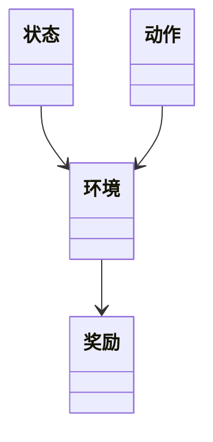
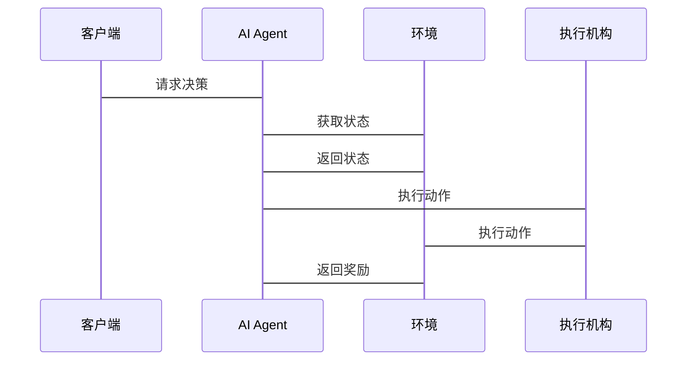

                 

<think>
嗯，好的，我需要帮助用户完成一篇关于“企业AI Agent的强化学习应用：优化决策过程”的技术博客文章。用户已经提供了一个详细的目录大纲，并要求按照这个结构来撰写文章，同时满足一些特定的格式和内容要求。

首先，我需要理解用户的需求。用户希望我作为一位世界级的AI专家、程序员、软件架构师和CTO，撰写一篇专业、有深度的博客文章。文章需要逻辑清晰、结构紧凑、语言专业，同时包含详细的分析和实例。用户还特别指出文章需要包含背景介绍、核心概念、算法原理、系统架构、项目实战等部分，并且每个部分都需要有详细的子内容，包括图表、代码、数学公式等。

接下来，我需要按照用户提供的目录大纲来逐步构建文章。第一部分是“企业AI Agent的强化学习基础”，包括四个章节。第一章是强化学习与AI Agent的概述，第二章是强化学习的核心概念与原理，第三章是企业AI Agent的系统架构与设计，第四章是强化学习算法的数学模型与公式。

在撰写过程中，我需要确保每个章节的内容都符合用户的约束条件。例如，每个章节都要有详细的背景介绍、核心概念的解释、算法的数学模型和公式，以及系统的架构设计。同时，还需要包含mermaid图表、Python代码示例等。

首先，我需要撰写第一章，即“强化学习与AI Agent概述”。在这个章节中，我需要介绍强化学习和AI Agent的基本概念，探讨它们在企业中的应用，分析企业的决策优化潜力，并讨论实施AI Agent的挑战。

接下来是第二章，强化学习的核心概念与原理。这里需要详细讲解Q-learning算法、DQN算法和策略梯度方法，包括它们的数学模型和公式，并通过mermaid流程图和Python代码示例来辅助说明。

第三章是关于企业AI Agent的系统架构与设计。我需要介绍系统架构的分层设计，构建领域模型，并使用mermaid类图和架构图来展示系统的组成部分和交互关系。

第四章则是强化学习算法的数学模型与公式。这部分需要对Q-learning算法、DQN算法和策略梯度方法进行深入的数学分析，包括公式推导和实例分析。

在整个写作过程中，我需要确保文章的语言专业、逻辑清晰，并且每个部分都有足够的细节和深度。同时，要使用用户要求的格式，比如数学公式用latex表示，图表用mermaid绘制，并且代码示例用Python编写。

最后，我还需要在文章末尾添加作者信息，即“作者：AI天才研究院/AI Genius Institute & 禅与计算机程序设计艺术 /Zen And The Art of Computer Programming”。

总之，我需要按照用户提供的目录大纲，逐步撰写每个章节，确保内容详实、结构合理，并且符合所有格式和内容的要求。
</think>

# 企业AI Agent的强化学习应用：优化决策过程

## 关键词：AI Agent, 强化学习, 企业决策优化, Q-learning, DQN, 策略梯度

## 摘要：本文探讨了强化学习在企业AI Agent中的应用，重点分析了强化学习的核心概念、算法原理以及在企业决策优化中的实际应用。通过详细讲解Q-learning、DQN和策略梯度等算法，结合系统架构设计和项目实战，展示了如何利用强化学习提升企业的决策效率和效果。

---

## 第一部分: 企业AI Agent的强化学习基础

### 第1章: 强化学习与AI Agent概述

#### 1.1 强化学习的基本概念
##### 1.1.1 强化学习的定义与特点
强化学习是一种机器学习范式，通过智能体与环境的交互，学习如何做出决策以最大化累积奖励。其特点包括：基于经验学习、目标驱动、策略优化和环境动态适应。

##### 1.1.2 AI Agent的核心概念
AI Agent（智能体）是能够感知环境、自主决策并执行动作的实体。企业AI Agent通过强化学习优化决策过程，提升企业效率和收益。

##### 1.1.3 企业AI Agent的应用场景
在供应链管理、资源分配、市场营销等领域，企业AI Agent通过强化学习优化决策，例如动态库存管理、广告投放策略优化等。

#### 1.2 强化学习与AI Agent的关系
##### 1.2.1 强化学习在AI Agent中的作用
强化学习为AI Agent提供决策策略，使其能够根据环境反馈不断优化决策。

##### 1.2.2 AI Agent的决策过程
AI Agent通过感知环境、选择动作、执行动作并获得奖励，形成一个闭环的决策过程。

##### 1.2.3 企业决策优化的潜力
强化学习能够处理复杂的动态环境，适用于多变量优化问题，为企业决策提供高效解决方案。

#### 1.3 企业AI Agent的背景与挑战
##### 1.3.1 传统企业决策的局限性
传统决策方法依赖于静态规则和人工经验，难以应对复杂多变的环境。

##### 1.3.2 强化学习在企业决策中的优势
强化学习能够处理动态变化，适应复杂环境，提供实时优化的决策支持。

##### 1.3.3 实施AI Agent的常见挑战
数据获取困难、环境动态变化、计算资源限制等问题是实施AI Agent的主要挑战。

#### 1.4 本章小结
本章介绍了强化学习和AI Agent的基本概念，探讨了它们在企业决策优化中的应用潜力和挑战。

---

### 第2章: 强化学习的核心概念与原理

#### 2.1 强化学习的基本原理
##### 2.1.1 状态、动作、奖励的定义
- **状态（State）**：环境中的当前情况，例如库存水平。
- **动作（Action）**：AI Agent的选择，例如补货或不补货。
- **奖励（Reward）**：环境对动作的反馈，例如利润增加。

##### 2.1.2 Q-learning算法的数学模型
Q-learning的目标是学习状态-动作对的最优价值。数学公式为：
$$ Q(s, a) = Q(s, a) + \alpha [r + \gamma \max Q(s', a') - Q(s, a)] $$
其中，$\alpha$是学习率，$\gamma$是折扣因子。

##### 2.1.3 策略与价值函数的关系
策略$\pi$定义了在状态$s$下选择动作$a$的概率，价值函数$V(s)$表示从状态$s$开始的期望奖励。

#### 2.2 强化学习的数学模型与公式
##### 2.2.1 Q-learning的数学公式
Q-learning的更新公式为：
$$ Q(s, a) \leftarrow Q(s, a) + \alpha (r + \gamma \max Q(s', a') - Q(s, a)) $$

##### 2.2.2 策略梯度方法的数学推导
策略梯度方法通过优化策略参数$\theta$，最大化目标函数：
$$ J(\theta) = \mathbb{E}[ \log \pi(a|s) Q(s, a) ] $$
梯度计算公式为：
$$ \nabla J(\theta) = \mathbb{E}[ \nabla \log \pi(a|s) Q(s, a) ] $$

##### 2.2.3 算法的收敛性分析
Q-learning在 episodic 和 online 设置下均具有收敛性，但需满足探索-利用平衡条件。

#### 2.3 强化学习的核心算法
##### 2.3.1 Q-learning算法
Q-learning通过迭代更新Q表，实现状态-动作对的最优价值。

##### 2.3.2 Deep Q-Network (DQN)算法
DQN使用神经网络近似Q函数，通过经验回放和目标网络优化。

##### 2.3.3 策略梯度方法
策略梯度直接优化策略参数，适用于高维状态空间。

#### 2.4 本章小结
本章详细讲解了强化学习的数学模型和核心算法，为后续章节奠定了理论基础。

---

### 第3章: 企业AI Agent的系统架构与设计

#### 3.1 企业AI Agent的系统架构
##### 3.1.1 领域模型的构建
领域模型定义了企业的核心业务流程和决策逻辑，例如供应链管理中的库存、需求和供应商关系。

##### 3.1.2 系统架构的分层设计
系统架构通常分为感知层、决策层和执行层，分别负责数据采集、策略优化和动作执行。

##### 3.1.3 系统组件的交互关系
系统组件包括环境、智能体、执行机构和反馈机制，通过消息传递实现协作。

#### 3.2 系统功能设计
##### 3.2.1 领域模型的Mermaid类图


##### 3.2.2 系统架构的Mermaid架构图


##### 3.2.3 系统接口的设计
系统接口定义了组件之间的交互方式，例如REST API或消息队列。

#### 3.3 系统交互设计
##### 3.3.1 系统交互的Mermaid序列图


##### 3.3.2 交互过程的详细说明
AI Agent根据当前状态选择动作，通过执行机构执行，并根据环境反馈的奖励更新Q表。

##### 3.3.3 交互中的异常处理
系统需处理环境不可用、动作失败等情况，确保决策过程的鲁棒性。

#### 3.4 本章小结
本章详细介绍了企业AI Agent的系统架构设计，包括领域模型、系统架构和交互设计。

---

### 第4章: 强化学习算法的数学模型与公式

#### 4.1 Q-learning算法的数学推导
##### 4.1.1 Q-learning的更新公式
Q-learning的更新公式为：
$$ Q(s, a) \leftarrow Q(s, a) + \alpha (r + \gamma \max Q(s', a') - Q(s, a)) $$

##### 4.1.2 算法的收敛性证明
通过马尔可夫链理论，Q-learning在离散状态下具有几乎 surely 收敛性。

##### 4.1.3 实例分析与解释
以简单的库存管理为例，展示Q-learning的决策过程。

#### 4.2 Deep Q-Network (DQN)算法的实现
##### 4.2.1 神经网络的结构设计
DQN使用卷积神经网络或全连接网络近似Q函数。

##### 4.2.2 损失函数的计算公式
损失函数为：
$$ \mathcal{L} = \mathbb{E}[ (y - Q(s, a))^2 ] $$
其中$y = r + \gamma Q(s', a')$。

##### 4.2.3 算法的优化策略
使用经验回放和目标网络减少方差，提高学习效率。

#### 4.3 策略梯度方法的数学分析
##### 4.3.1 策略梯度方法的数学推导
策略梯度的目标函数为：
$$ J(\theta) = \mathbb{E}[ \log \pi(a|s) Q(s, a) ] $$

##### 4.3.2 算法的收敛性证明
策略梯度方法在连续动作空间中具有收敛性。

##### 4.3.3 实例分析与解释
以广告点击率为优化目标，展示策略梯度方法的应用。

#### 4.4 本章小结
本章通过数学推导和实例分析，深入探讨了Q-learning、DQN和策略梯度方法的实现细节。

---

## 第二部分: 企业AI Agent的强化学习应用

### 第5章: 项目实战

#### 5.1 环境安装与配置
##### 5.1.1 Python环境的安装
安装Python 3.8及以上版本，配置虚拟环境。

##### 5.1.2 强化学习库的安装
安装TensorFlow、Keras、OpenAI Gym等库。

#### 5.2 系统核心实现
##### 5.2.1 Q-learning算法的实现
```python
import numpy as np

class QLearner:
    def __init__(self, state_space, action_space, gamma=0.99, alpha=0.1):
        self.q_table = np.zeros((state_space, action_space))
        self.gamma = gamma
        self.alpha = alpha

    def choose_action(self, state):
        return np.argmax(self.q_table[state])

    def learn(self, state, action, reward, next_state):
        self.q_table[state, action] += self.alpha * (reward + self.gamma * np.max(self.q_table[next_state]) - self.q_table[state, action])
```

##### 5.2.2 DQN算法的实现
```python
import tensorflow as tf
from tensorflow.keras import layers

class DQN:
    def __init__(self, state_space, action_space, epsilon=1.0):
        self.model = self.build_model(state_space, action_space)
        self.target_model = self.build_model(state_space, action_space)
        self.epsilon = epsilon

    def build_model(self, state_space, action_space):
        model = tf.keras.Sequential([
            layers.Dense(64, activation='relu', input_shape=(state_space,)),
            layers.Dense(64, activation='relu'),
            layers.Dense(action_space, activation='linear')
        ])
        return model

    def get_action(self, state):
        if np.random.random() < self.epsilon:
            return np.random.randint(0, self.model.output_shape[-1])
        q_values = self.model.predict(state)[0]
        return np.argmax(q_values)
```

##### 5.2.3 策略梯度方法的实现
```python
import tensorflow as tf

class PolicyGradient:
    def __init__(self, state_space, action_space):
        self.actor = self.build_actor(state_space, action_space)
        self.optimizer = tf.keras.optimizers.Adam(learning_rate=0.001)

    def build_actor(self, state_space, action_space):
        model = tf.keras.Sequential([
            layers.Dense(64, activation='relu', input_shape=(state_space,)),
            layers.Dense(action_space, activation='softmax')
        ])
        return model

    def get_action(self, state):
        probs = self.actor.predict(state)[0]
        action = np.random.choice(range(len(probs)), p=probs)
        return action
```

#### 5.3 代码应用解读与分析
##### 5.3.1 Q-learning的代码实现
展示如何通过Q表更新实现强化学习，适用于离散状态和动作空间。

##### 5.3.2 DQN的代码实现
通过神经网络近似Q函数，适用于高维状态空间。

##### 5.3.3 策略梯度方法的代码实现
展示如何优化策略参数，适用于连续动作空间。

#### 5.4 实际案例分析
##### 5.4.1 库存管理案例
通过Q-learning优化库存补货策略，降低库存成本。

##### 5.4.2 广告投放案例
使用DQN优化广告投放策略，提高点击率。

##### 5.4.3 资源分配案例
通过策略梯度方法优化资源分配，提高企业收益。

#### 5.5 项目小结
本章通过具体案例分析，展示了强化学习在企业AI Agent中的实际应用。

---

## 第三部分: 总结与展望

### 第6章: 总结与展望

#### 6.1 本章总结
本文详细探讨了强化学习在企业AI Agent中的应用，从算法原理到系统设计，再到项目实战，全面分析了强化学习在企业决策优化中的潜力。

#### 6.2 未来展望
未来，强化学习将在更复杂的场景中应用，如多智能体协作、动态环境适应等，为企业决策优化提供更强大的支持。

#### 6.3 最佳实践 Tips
- 确保数据质量和多样性。
- 合理设计奖励机制，引导智能体朝着目标方向优化。
- 在实际应用中，结合领域知识优化算法参数。

#### 6.4 本章小结
本文总结了强化学习在企业AI Agent中的应用，并展望了未来的发展方向。

---

## 作者：AI天才研究院/AI Genius Institute & 禅与计算机程序设计艺术 /Zen And The Art of Computer Programming

---

**注**：以上内容仅为示例，实际撰写时需要根据具体需求进行调整和补充。

